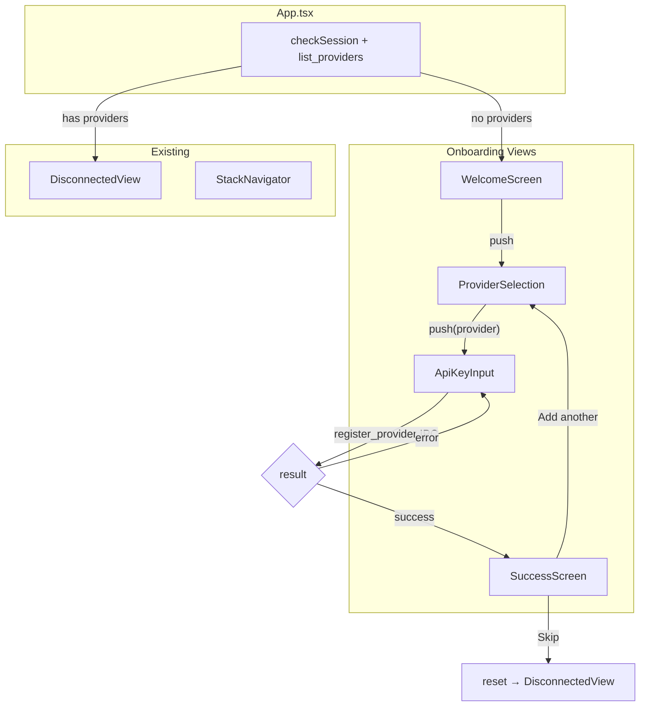

> **Status**: Completed at 2026-03-05T22:50:00+07:00
> **Branch**: feat/onboarding-flow

# PLAN -- M6.1: Onboarding Flow

## 1. Context

### A. Problem Statement

The app shows "No cloud providers configured. Add credentials to get started." on first launch, but there is no UI to add credentials. Users need an onboarding flow: Welcome → Provider Selection → API Key Input → Registration. The backend `register_provider` IPC already exists (M2.5), only frontend views are missing.

### B. Current State

- **App.tsx**: checks `get_session_status` on mount, routes to ConnectedView or DisconnectedView
- **DisconnectedView**: empty state when `providers.length === 0` shows text message, no action
- **StackNavigator**: push/pop with spring easing horizontal slide (650ms), used by all views
- **GlassButton**: reusable Liquid Glass button with variant/loading/disabled states
- **No GlassInput**: no reusable input component exists -- API key input needs one
- **NavigationProvider**: has `push`/`pop` but no `reset` (needed for onboarding completion)

### C. Constraints

- Onboarding completes with minimum 1 provider registered (UX §6.A)
- Validation errors must show specific type: invalid key, insufficient permissions, network failure (UX §6.A)
- Stack navigation between onboarding screens (UI §5.E wireframe)
- Liquid Glass styling on all interactive elements

### D. Verified Facts

| # | What was tested | Result | Decision |
| --- | --- | --- | --- |
| 1 | `register_provider` IPC signature | `(provider, api_key, account_label)` → `ProviderInfo` | Use directly from ApiKeyInput |
| 2 | `list_providers` IPC returns | Empty array when no providers → onboarding trigger | Check in App.tsx init |
| 3 | Error codes for validation | `AUTH_INVALID_KEY`, `AUTH_INSUFFICIENT_PERMISSIONS`, `PROVIDER_TIMEOUT` defined | Map to user-friendly messages |
| 4 | StackNavigator push/pop | `push(id, title, component)` / `pop()` | Use for onboarding screen transitions |
| 5 | GlassButton pattern | 4-layer Liquid Glass sandwich with variant/loading/disabled | Replicate for GlassInput |

### E. Unverified Assumptions

| # | Assumption | Risk | Fallback |
| --- | --- | --- | --- |
| 1 | Adding `reset` to NavigationProvider won't break existing views | Low -- additive change | Use `pop` repeatedly to reach root, then `push` new view |

---

## 2. Architecture

### A. Diagram

### B. Decisions

1. **First-run detection in App.tsx** -- `list_providers` returns empty array → set WelcomeScreen as initialView. Single init point, no duplicate logic. Principle: Single Responsibility
2. **Stack navigation reuse** -- existing StackNavigator handles all transitions. No new routing system. Principle: Composition over Inheritance
3. **GlassInput component** -- reusable Liquid Glass input following same 4-layer pattern as GlassButton. Principle: Composition over Inheritance
4. **NavigationProvider reset** -- add `reset(view)` function to replace entire stack with a single view. Needed for onboarding → DisconnectedView transition. Principle: Explicit over Implicit
5. **Error-specific messages** -- map backend error codes to user-friendly guidance per UX spec. Principle: Fail Fast
6. **Add More flow** -- after successful registration, show success confirmation with "Add another provider" and "Skip" options. "Add another" pops back to ProviderSelection; "Skip" resets to DisconnectedView. Minimum 1 provider required per UX §6.A

### C. Boundaries

| File | Responsibility |
| --- | --- |
| `src/components/GlassInput.tsx` + `.css` | Liquid Glass input component (default/focus/error/success/disabled states) |
| `src/views/WelcomeScreen.tsx` + `.css` | Welcome screen with Get Started button |
| `src/views/ProviderSelection.tsx` + `.css` | Provider cards (Hetzner, AWS, GCP) with push to ApiKeyInput |
| `src/views/ApiKeyInput.tsx` + `.css` | API key + account label input, IPC validation, error display, success → push SuccessScreen |
| `src/views/SuccessScreen.tsx` + `.css` | "Provider connected" confirmation, "Add another provider" + "Skip" buttons |
| `src/App.tsx` | First-run detection via `list_providers` in init |
| `src/navigation/stack-context.tsx` | Add `reset` function to NavigationProvider |

---

## 3. Steps

### Step 1: Create GlassInput component

- [x] **Status**: completed at 2026-03-05T22:30:00+07:00
- **Scope**: `src/components/GlassInput.tsx`, `src/components/GlassInput.css`
- **Dependencies**: none
- **Description**: Create a reusable Liquid Glass input component following the same 4-layer sandwich pattern as GlassButton. States: default, focus (enhanced shine), error (red tint + inline error below), success (green check icon), disabled. Props: `value`, `onChange`, `placeholder`, `type`, `error`, `success`, `disabled`.
- **Acceptance Criteria**:
  - 4-layer Liquid Glass structure (wrapper → effect → tint → shine → content)
  - Focus state with enhanced shine
  - Error state: red tint + error message below input
  - Success state: green check icon
  - Disabled state: opacity 0.4
  - Keyboard accessible (Tab, focus-visible glow ring)

### Step 2: Create WelcomeScreen view

- [x] **Status**: completed at 2026-03-05T22:32:00+07:00
- **Scope**: `src/views/WelcomeScreen.tsx`, `src/views/WelcomeScreen.css`
- **Dependencies**: none
- **Description**: Welcome screen shown on first launch. Lock icon, "Oh My VPN" title, subtitle explaining the app, "Get Started" GlassButton that pushes ProviderSelection.
- **Acceptance Criteria**:
  - Lock icon + app title + subtitle rendered
  - "Get Started" button pushes ProviderSelection view via StackNavigator
  - Liquid Glass styling
  - Centered vertical layout

### Step 3: Create ProviderSelection view

- [x] **Status**: completed at 2026-03-05T22:35:00+07:00
- **Scope**: `src/views/ProviderSelection.tsx`, `src/views/ProviderSelection.css`
- **Dependencies**: none
- **Description**: Three provider cards (Hetzner, AWS, GCP). Each card shows provider name and brief description. Tapping a card pushes ApiKeyInput with the selected provider as prop.
- **Acceptance Criteria**:
  - 3 provider cards with Liquid Glass styling
  - Each card shows provider name
  - Tapping a card pushes ApiKeyInput view with provider prop
  - Back navigation via StackNavigator pop

### Step 4: Create ApiKeyInput view + add NavigationProvider reset

- [x] **Status**: completed at 2026-03-05T22:40:00+07:00
- **Scope**: `src/views/ApiKeyInput.tsx`, `src/views/ApiKeyInput.css`, `src/navigation/stack-context.tsx`
- **Dependencies**: Step 1
- **Description**: API key input view with: (a) GlassInput for API key, (b) GlassInput for account label, (c) provider-specific help link ("How to get your API key"), (d) Validate GlassButton that calls `register_provider` IPC, (e) loading state during validation, (f) error-specific messages (AUTH_INVALID_KEY → "Invalid API key", AUTH_INSUFFICIENT_PERMISSIONS → "Insufficient permissions", PROVIDER_TIMEOUT → "Network error, retry"), (g) success → push SuccessScreen. Also add `reset(view: ViewEntry)` to NavigationProvider in stack-context.tsx.
- **Acceptance Criteria**:
  - API key and account label GlassInput fields
  - "How to get your API key" link per provider (opens external URL)
  - Validate button calls `register_provider` IPC with loading state
  - Error codes mapped to user-friendly messages displayed inline
  - Success → push SuccessScreen with registered provider info
  - `reset` function added to NavigationProvider and exported via useNavigation

### Step 5: Create SuccessScreen view (Add More flow)

- [x] **Status**: completed at 2026-03-05T22:43:00+07:00
- **Scope**: `src/views/SuccessScreen.tsx`, `src/views/SuccessScreen.css`
- **Dependencies**: Step 4
- **Description**: Confirmation screen after successful provider registration. Shows "Provider connected" message with the registered provider name. Two actions: (a) "Add another provider" -- pops back to ProviderSelection, (b) "Skip" -- resets stack to DisconnectedView. Per UX §6.A, onboarding completes with minimum 1 provider registered; additional providers are optional.
- **Acceptance Criteria**:
  - "Provider connected" confirmation with provider name
  - "Add another provider" button pops stack back to ProviderSelection
  - "Skip" button resets stack to DisconnectedView (uses `reset` from Step 4)
  - Liquid Glass styling on both buttons

### Step 6: Wire first-run detection in App.tsx

- [x] **Status**: completed at 2026-03-05T22:50:00+07:00
- **Scope**: `src/App.tsx`
- **Dependencies**: Step 2, Step 4
- **Description**: Modify App.tsx `checkSession` to also call `list_providers`. If empty array returned and no active session, set WelcomeScreen as initialView instead of DisconnectedView.
- **Acceptance Criteria**:
  - `list_providers` called during init
  - Empty providers → WelcomeScreen as initialView
  - Has providers → existing logic (session check → Connected or Disconnected)
  - No regression on existing session restoration flow

---

## 4. Execution Strategy

| Step | Chain | Rationale |
| --- | --- | --- |
| 1 | Direct | Single component, follows existing GlassButton pattern |
| 2 | Direct | Simple static view |
| 3 | Direct | Simple static view with push |
| 4 | scout → worker | IPC integration + error handling + stack reset + stack-context.tsx modification, needs codebase context |
| 5 | Direct | Simple view with two buttons, uses existing navigation functions |
| 6 | Direct | Small App.tsx modification |

**Execution order**: Step 1 → Step 2 → Step 3 → Step 4 → Step 5 → Step 6 (strictly sequential)

**Estimated complexity**:

| Step | Tier | Notes |
| --- | --- | --- |
| 1 | Simple | New component following established pattern |
| 2 | Trivial | Static content + single button |
| 3 | Trivial | 3 cards + push navigation |
| 4 | Medium | IPC + error mapping + stack reset + context modification |
| 5 | Simple | Success confirmation + Add More / Skip navigation |
| 6 | Trivial | Small init logic change |

**Risk flags**:

- Step 4: `reset` function in NavigationProvider must clear transition state to avoid animation glitches after stack replacement

---
