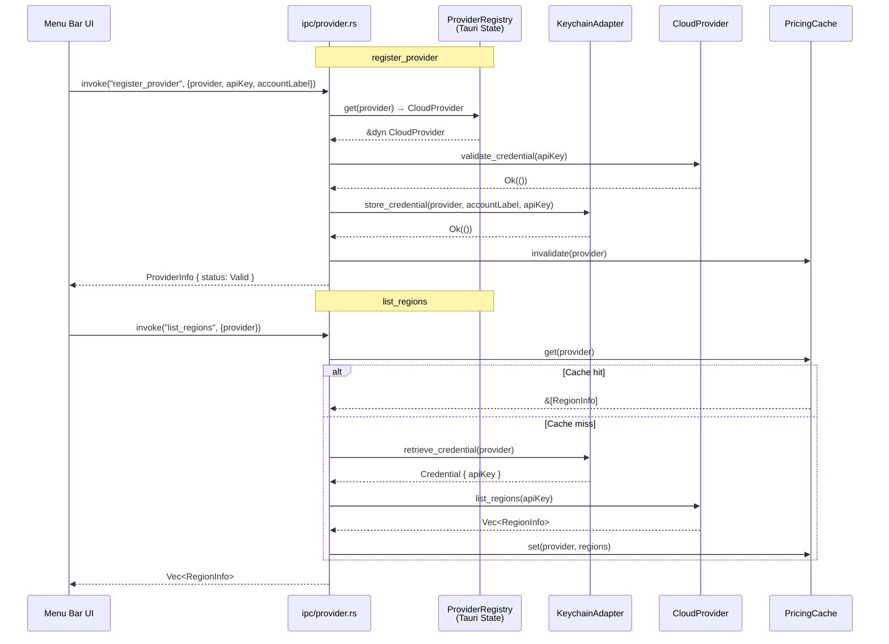

> **Status**: Completed at 2026-03-05T00:55:00+07:00
> **Branch**: feat/provider-ipc-commands

# Provider Manager IPC Commands

## 1. Context

### A. Problem Statement

M2.1--M2.4에서 `CloudProvider` trait, `ProviderRegistry`, `PricingCache`, 그리고 3개 provider (Hetzner, AWS, GCP) 구현이 완료되었다. 그러나 이들은 아직 Tauri IPC를 통해 프론트엔드에 노출되지 않는다. `ipc/provider.rs`에 4개의 stub 핸들러가 `NOT_IMPLEMENTED` 에러를 반환하는 상태다.

M2.5는 이 stub들을 실제 구현으로 교체하고, Tauri State로 `ProviderRegistry`를 관리하며, capabilities를 업데이트하는 작업이다.

### B. Current State

- `ipc/provider.rs` -- 4개 stub: `register_provider`, `remove_provider`, `list_providers`, `list_regions` (모두 `NOT_IMPLEMENTED` 반환)
- `ipc/mod.rs` -- 이미 4개 함수를 re-export하고 `lib.rs`의 `invoke_handler`에 등록됨
- `lib.rs` -- `tauri::Builder`에 모든 IPC 핸들러 등록 완료. 그러나 **Tauri State (`manage()`)는 아직 미설정**
- `ProviderRegistry` -- `HashMap<Provider, Box<dyn CloudProvider>>`로 provider instance 관리 + `PricingCache` 내장
- `KeychainAdapter` -- stateless struct, static method로 Keychain CRUD
- `error.rs` -- `AppError`, `ProviderError`, `KeychainError` → `AppError` 변환 모두 구현 완료
- `types.rs` -- `Provider`, `ProviderInfo`, `ProviderStatus`, `RegionInfo` 모두 정의됨
- `capabilities/default.json` -- `core:default`, `opener:default`만 있음. Tauri v2 custom command는 별도 capabilities 없이 호출 가능

### C. Constraints

- IPC 커맨드에서 `ProviderRegistry`에 접근하려면 `tauri::State<Mutex<ProviderRegistry>>` 패턴 필요
- `CloudProvider` trait의 모든 메서드는 `api_key` 파라미터를 받음 -- Keychain에서 매번 조회
- `remove_provider`에서 active session check 필요하나, `SessionTracker`는 아직 stub (M4.1) -- 현재는 TODO 주석으로 표기
- Tauri v2 custom commands는 `#[tauri::command]` + `invoke_handler` 등록만으로 호출 가능 -- plugin 기반 permission과 다름. Milestone M2.5 scope에 `tauri.conf.json` capabilities update가 포함되어 있으나, custom command는 별도 capability 선언 불필요하므로 skip

### D. Verified Facts

1. **프로젝트 컴파일 확인**: `cargo check` 성공 (0.24s)
2. **Tauri State 패턴**: `app.manage(state)` in setup → 핸들러에서 `state: tauri::State<'_, T>` 파라미터로 접근
3. **ProviderRegistry API**: `register()`, `get()`, `remove()`, `list()`, `cache()`, `cache_mut()` 메서드 존재
4. **KeychainAdapter API**: `store_credential()`, `retrieve_credential()`, `delete_credential()`, `list_credentials()` -- 모두 `Result` 반환
5. **CloudProvider::validate_credential()**: `api_key: &str` → `Result<(), ProviderError>`
6. **CloudProvider::list_regions()**: `api_key: &str` → `Result<Vec<RegionInfo>, ProviderError>`
7. **Error 변환 체인**: `ProviderError → AppError`, `KeychainError → AppError` 모두 `From` impl 완료
8. **Provider implementations**: `HetznerProvider::new()`, `AwsProvider::new()`, `GcpProvider::new()` 존재

### E. Unverified Assumptions

None -- 모든 기술적 가정이 코드베이스 확인으로 검증됨.

---

## 2. Architecture

### A. Diagram

### B. Decisions

1. **Tauri State로 `ProviderRegistry` 관리** -- `app.manage(tokio::sync::Mutex<ProviderRegistry>)`로 설정. IPC 핸들러에서 `State<'_, tokio::sync::Mutex<ProviderRegistry>>`로 접근. tokio Mutex 사용 이유: `CloudProvider` 메서드가 async이므로 lock을 await 사이에 유지해야 함. (Principle: Explicit over Implicit)
2. **3개 provider를 app startup 시 registry에 등록** -- `ProviderRegistry`에 `HetznerProvider`, `AwsProvider`, `GcpProvider` trait object를 미리 등록. Keychain에 credential이 없어도 trait object는 존재. (Principle: Fail Fast)
3. **`list_providers`는 Keychain 기준** -- `KeychainAdapter::list_credentials()`로 등록된 provider 목록 조회. status는 `Valid` (등록 시 이미 validate 통과). (API Design §4.B)
4. **Input validation을 IPC boundary에서 수행** -- api_key 빈 문자열 → `VALIDATION_EMPTY_API_KEY`. (Principle: Fail Fast)
5. **`list_regions` stale fallback** -- cache miss + API failure 시 stale cache 반환. stale cache도 없으면 에러. (API Design §4.B `list_regions` behavior)

### C. Boundaries

| File | Responsibility |
| --- | --- |
| `lib.rs` | ProviderRegistry 초기화 + 3개 provider 등록 + `app.manage()` |
| `ipc/provider.rs` | IPC 핸들러 4개 -- validation, state 접근, domain 호출, 에러 변환 |

---

## 3. Steps

### Step 1: ProviderRegistry Tauri State 설정

- [x] **Status**: completed at 2026-03-05T00:52:00+07:00
- **Scope**: `src-tauri/src/lib.rs`
- **Dependencies**: none
- **Description**: `ProviderRegistry`를 생성하고 3개 provider (Hetzner, AWS, GCP) 인스턴스를 등록한 후, `app.manage(tokio::sync::Mutex<ProviderRegistry>)`로 Tauri State에 설정한다.
- **Acceptance Criteria**:
  - `lib.rs`의 `setup()` 클로저 안에서 `ProviderRegistry::new()` 호출
  - `registry.register(Provider::Hetzner, Box::new(HetznerProvider::new()))` 등 3개
  - `app.manage(tokio::sync::Mutex::new(registry))`
  - `provider_manager` 모듈의 `#[allow(unused)]` 제거
  - `cargo check` 통과

### Step 2: 4개 IPC 핸들러 구현

- [x] **Status**: completed at 2026-03-05T00:53:00+07:00
- **Scope**: `src-tauri/src/ipc/provider.rs`
- **Dependencies**: Step 1
- **Description**: 4개 stub을 실제 구현으로 교체. Tauri State에서 `ProviderRegistry` 접근, KeychainAdapter 호출, validation 수행.
- **Acceptance Criteria**:
  - `register_provider`: validate input (api_key + account_label empty check) → `registry.get(provider)` → `validate_credential(api_key)` → `KeychainAdapter::store_credential()` → `registry.cache_mut().invalidate()` → return `ProviderInfo { status: Valid }`
  - `remove_provider`: TODO session active check (return `CONFLICT_PROVIDER_IN_USE` when SessionTracker is implemented in M4) → `KeychainAdapter::delete_credential()` → `registry.cache_mut().invalidate()` → `Ok(())`
  - `list_providers`: `KeychainAdapter::list_credentials()` → map to `Vec<ProviderInfo>` with status `Valid`
  - `list_regions`: cache hit → return clone. cache miss → `KeychainAdapter::retrieve_credential()` → `CloudProvider::list_regions()` → sort by hourly_cost → cache set → return. API failure + stale cache → return stale
  - 반환 타입을 `serde_json::Value`에서 concrete type으로 변경: `ProviderInfo`, `Vec<ProviderInfo>`, `Vec<RegionInfo>`
  - Error codes match API Design §6.C: `VALIDATION_EMPTY_API_KEY` (empty api_key or account_label), `NOT_FOUND_PROVIDER` (unregistered provider), `AUTH_INVALID_KEY` / `AUTH_INSUFFICIENT_PERMISSIONS` (validation failure), `CONFLICT_PROVIDER_IN_USE` (TODO -- M4 dependency), `KEYCHAIN_*` (Keychain errors via From impl), `PROVIDER_*` (SDK errors via From impl)
  - `cargo check` 통과

### Step 3: 컴파일 검증 및 정리

- [x] **Status**: completed at 2026-03-05T00:55:00+07:00
- **Scope**: `src-tauri/src/lib.rs`, `src-tauri/src/ipc/provider.rs`
- **Dependencies**: Step 2
- **Description**: `cargo check` + `cargo clippy` 실행. unused import/allow 정리.
- **Acceptance Criteria**:
  - `cargo check` 성공
  - `cargo clippy` warning 최소화
  - 불필요한 `#[allow(unused)]` 제거

---

## 4. Execution Strategy

| Step | Chain | Rationale |
| --- | --- | --- |
| 1 | Direct | 단일 파일, state 설정만 추가 |
| 2 | Direct | 단일 파일, stub → 구현 교체. 모든 context가 PLAN.md에 완비 |
| 3 | Direct | 검증 + 정리 |

**Execution order**: Step 1 → Step 2 → Step 3 (순차)

**Single-file constraint note**: Step 1과 Step 3이 `lib.rs`를 공유하지만, Step 1은 초기화 추가, Step 3은 정리만이므로 Sequential Direct.

**Estimated complexity**: Simple (2 파일 수정, 명확한 API 계약)

**Risk flags**: None
