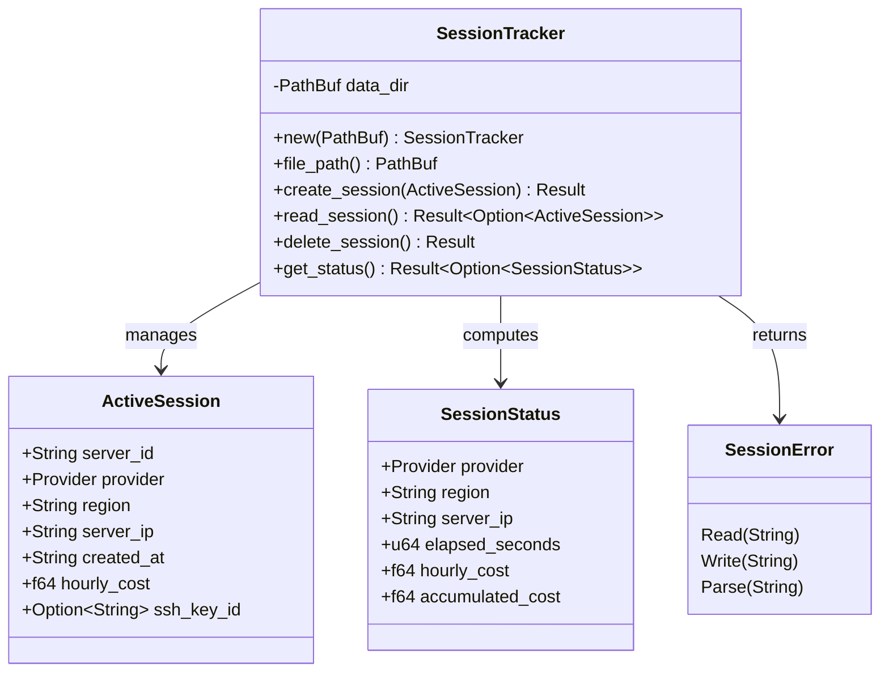

> **Status**: Completed at 2026-03-05T12:30:00+07:00
> **Branch**: feat/session-tracker

# PLAN -- M4.1 Session Tracker

## 1. Context

### A. Problem Statement

M4 (Server Lifecycle + Session Tracker) requires a Session Tracker module to persist active VPN session state. This module enables:

- Orphaned server detection on app launch (NFR-REL-1)
- Session status display in the UI (FR-SS-1, FR-SS-2)
- Crash recovery -- session file survives app crashes (NFR-REL-4)

### B. Current State

- `session_tracker.rs` exists as an empty stub (4-line doc comment only)
- `lib.rs` already registers `mod session_tracker` with `#[allow(unused)]`
- `PreferencesStore` in `preferences_store.rs` provides a proven pattern: `PathBuf`-based constructor, atomic write (tmp + rename), serde JSON serialization
- `types.rs` defines `Provider` enum (reused by ActiveSession)
- `error.rs` has error code constants `NOT_FOUND_SESSION` and `CONFLICT_SESSION_ACTIVE` but no `SessionError` enum
- IPC stubs in `ipc/session.rs` and `ipc/server.rs` return `NOT_IMPLEMENTED`

### C. Constraints

- No `chrono` crate in current dependencies -- required for ISO 8601 datetime parsing and elapsed time calculation
- ActiveSession is a singleton file (only one VPN session at a time)
- Atomic writes mandatory (write tmp + rename) to prevent partial state on crash
- `server_ip` field needed in ActiveSession (not in data model schema but required by `SessionStatus` return type)

### D. Input Sources

- Data model §4.B: ActiveSession schema, §5.B: access patterns
- API design §4.A: `SessionStatus` type definition, §4.D: `get_session_status` command
- Architecture containers.md §3.E: Session Tracker module description

### E. Verified Facts

| What was tested | Result | Decision |
| --- | --- | --- |
| `cargo check` in `src-tauri/` | Compiles with 36 warnings, 0 errors | Codebase is healthy, safe to add module |
| `cargo add chrono --features serde --dry-run` | Resolves chrono v0.4.44 successfully | chrono is compatible with current dependency tree |
| PreferencesStore pattern review | Atomic write (tmp + rename), PathBuf constructor, serde JSON -- well-tested | Follow same pattern for SessionTracker |
| `error.rs` review | `NOT_FOUND_SESSION`, `CONFLICT_SESSION_ACTIVE` constants exist, no `SessionError` enum | Add `SessionError` enum + `From<SessionError> for AppError` |
| Data model `ActiveSession` schema | Fields: serverId, provider, region, createdAt, hourlyCost, sshKeyId | Add `server_ip` field (needed by SessionStatus) |

### F. Unverified Assumptions

None -- all technical assumptions verified in Session 1.

## 2. Architecture

### A. Diagram

### B. Decisions

| Decision | Alternatives Considered | Rationale |
| --- | --- | --- |
| Follow PreferencesStore pattern | Custom file manager, SQLite | Explicit over Implicit (§3.B #1) -- reuse proven codebase pattern |
| Add `chrono` crate | `std::time::SystemTime` + manual formatting | ISO 8601 parsing/formatting without chrono is error-prone and verbose |
| `server_ip` in ActiveSession | Compute from provider API on read | Fail Fast (§3.B #5) -- store at creation time, avoid API call on status read |
| `SessionError` with 3 variants (Read/Write/Parse) | Reuse PreferencesError, single generic error | Single Responsibility (§3.B #3) -- separate error domain per module |
| `get_status()` returns `Option<SessionStatus>` | Separate `has_session()` + `get_status()` | Composition (§3.B #4) -- one call covers both check and retrieval |

### C. Boundaries

| File | Responsibility |
| --- | --- |
| `session_tracker.rs` | ActiveSession struct, SessionStatus struct, SessionError enum, SessionTracker impl with all 4 methods, unit tests |
| `error.rs` | `From<SessionError> for AppError` conversion |
| `Cargo.toml` | `chrono` dependency |

## 3. Steps

### Step 1: Add chrono dependency

- [x] **Status**: completed
- **Scope**: `src-tauri/Cargo.toml`
- **Dependencies**: none
- **Description**: Add `chrono` crate with `serde` feature for ISO 8601 datetime handling.
- **Acceptance Criteria**:
  - `chrono = { version = "0.4", features = ["serde"] }` added to `[dependencies]`
  - `cargo check` passes

### Step 2: Implement SessionTracker module

- [x] **Status**: completed
- **Scope**: `src-tauri/src/session_tracker.rs`
- **Dependencies**: Step 1
- **Description**: Implement the full SessionTracker module following PreferencesStore patterns. Includes:
  - `ActiveSession` struct (serde, camelCase JSON)
  - `SessionStatus` struct (serde, camelCase JSON)
  - `SessionError` enum with Display impl
  - `SessionTracker` struct with `new(PathBuf)`, `file_path()`, `create_session()`, `read_session()`, `delete_session()`, `get_status()`
  - Atomic writes (write tmp + rename)
  - `get_status()` live-calculates `elapsed_seconds` and `accumulated_cost` from `created_at`
  - Unit tests: create/read/delete round-trip, missing file returns None, atomic write no tmp leftover, get_status live calculation, delete nonexistent file is Ok
- **Acceptance Criteria**:
  - `create_session(session)` writes `active-session.json` atomically
  - `read_session()` returns `Ok(Some(session))` when file exists, `Ok(None)` when missing
  - `delete_session()` removes file, returns `Ok(())` even if file missing
  - `get_status()` returns `Ok(Some(SessionStatus))` with live-calculated elapsed/cost, `Ok(None)` when no session
  - All fields use `#[serde(rename_all = "camelCase")]`
  - File path is `{data_dir}/active-session.json`
  - Temp file path is `{data_dir}/.active-session.tmp.json`
  - Unit tests pass via `cargo test`

### Step 3: Add SessionError to AppError conversion

- [x] **Status**: completed
- **Scope**: `src-tauri/src/error.rs`
- **Dependencies**: Step 2
- **Description**: Add `use crate::session_tracker::SessionError` import and `From<SessionError> for AppError` impl. Map all variants to `INTERNAL_UNEXPECTED` error code (same pattern as PreferencesError).
- **Acceptance Criteria**:
  - `From<SessionError> for AppError` implemented
  - All 3 SessionError variants map to appropriate error codes
  - `cargo check` passes with no new errors

### Step 4: Verify build and tests

- [x] **Status**: completed
- **Scope**: project-wide verification
- **Dependencies**: Step 1, Step 2, Step 3
- **Description**: Run `cargo check` and `cargo test` to verify everything compiles and all tests pass.
- **Acceptance Criteria**:
  - `cargo check` passes (0 errors)
  - `cargo test` passes (all session_tracker tests green)
  - No regressions in existing tests

## 4. Execution Strategy

| Step | Chain | Rationale |
| --- | --- | --- |
| 1 | Direct | Single-line Cargo.toml edit, trivial |
| 2 | scout → worker | Main implementation -- needs PreferencesStore pattern as context reference |
| 3 | Direct | Small edit to error.rs, depends on Step 2's SessionError definition |
| 4 | Direct | Run cargo check + cargo test commands |

**Execution order**: `Step 1 → Step 2 → Step 3 → Step 4` (sequential)

**Complexity estimates**:

| Step | Tier | Estimated Tokens |
| --- | --- | --- |
| 1 | Trivial | < 5K |
| 2 | Medium | 20--40K |
| 3 | Trivial | < 5K |
| 4 | Trivial | < 5K |

**Risk flags**: None -- all patterns verified, no external API calls, no uncertain dependencies.

---
