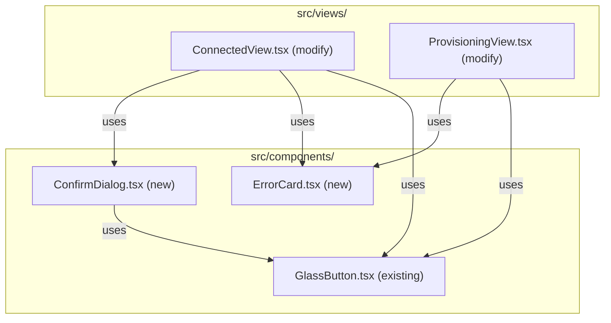

> **Status**: Completed at 2026-03-05T19:55:00+07:00
> **Branch**: feat/confirm-dialog-error-display

# PLAN -- M5.5: Destruction Confirm Dialog + Error Display

## 1. Context

### A. Problem Statement

ConnectedView's disconnect button currently invokes `disconnect` IPC directly without confirmation. The UI design (§4.F) and cross-cutting concepts (§8.A) require an explicit confirmation dialog before the destructive disconnect-and-destroy flow. Additionally, disconnect errors are displayed as a plain `<p>` tag -- they should use the same Liquid Glass error card pattern already established in ProvisioningView.

### B. Current State

- **ConnectedView**: disconnect button → `invoke("disconnect")` → pop on success. Errors shown via `<p className="connected-view__error">`.
- **ProvisioningView**: has an inline error card (Liquid Glass 4-layer sandwich, Cancel/Retry) but it is hardcoded inside the component -- not reusable.
- **GlassButton**: fully implemented with all variants (`success|error|neutral|warning|info`), loading, disabled, focus ring.
- **Design tokens**: `--z-overlay: 300`, `--z-modal: 400`, `--blur-overlay: 8px`, `--color-error-tint`, `--color-separator` all exist.
- **App.tsx Esc handler**: global `Esc` key hides the popover window. ConfirmDialog must stop propagation when open so Esc closes the dialog first, not the popover.

### C. Constraints

- Popover is 320px fixed width -- dialog is absolute-positioned inside, not a Portal.
- ConfirmDialog must be reusable for M6.4 (Quit-while-connected).
- ErrorCard must replace ProvisioningView's inline error card to prevent duplication.
- Reduced motion: all animations → `fadeIn 200ms` via token overrides (already handled by tokens.css).

### D. Verified Facts

| # | What was tested | Result | Decision |
| --- | --- | --- | --- |
| 1 | ProvisioningView error card structure | Uses Liquid Glass 4-layer with `provisioning-error-card` CSS class, Cancel/Retry GlassButtons | Extract into reusable ErrorCard |
| 2 | GlassButton variant support | All 5 variants implemented with tint, text color, dark mode, focus ring | Reuse for dialog buttons |
| 3 | Design tokens for overlay/modal | `--z-overlay: 300`, `--z-modal: 400`, `--blur-overlay: 8px` exist | Use tokens, no hardcoded values |
| 4 | Global Esc handler in App.tsx | `document.addEventListener("keydown", ...)` hides window on Esc | ConfirmDialog must `stopPropagation` on Esc to close dialog first |
| 5 | ConnectedView disconnect flow | Direct `invoke("disconnect")` on button click, error as `<p>` text | Wrap with ConfirmDialog, replace error with ErrorCard |

### E. Unverified Assumptions

None. All patterns verified from existing codebase.

---

## 2. Architecture

### A. Diagram



### B. Decisions

1. **ConfirmDialog as generic modal** -- Props: `open`, `title`, `message`, `confirmLabel`, `confirmVariant`, `onConfirm`, `onCancel`. Reusable for M6.4.
   - *Principle 4 (Composition)*: small composable unit, not dialog-per-use-case.
2. **ErrorCard extracted from ProvisioningView** -- Props: `message`, `variant` (`error|warning`, default `error`), `children` (ReactNode action slot).
   - *Principle 3 (Single Responsibility)*: one component for error display. Variant controls tint color -- `error` for provisioning/generic failures, `warning` for persistent destruction failure with console URL.
3. **Overlay = absolute inside popover** -- Not a React Portal.
   - *Principle 1 (Explicit over Implicit)*: no hidden DOM teleportation in a 320px popover.
4. **Esc key handling** -- ConfirmDialog captures Esc via `onKeyDown` with `stopPropagation` to prevent popover hide.
   - *Principle 5 (Fail Fast)*: keyboard behavior is explicit, not inherited by accident.

### C. Boundaries

| Component | Responsibility | Props |
| --- | --- | --- |
| `ConfirmDialog` | Blur overlay + glass dialog card + Cancel/Confirm buttons + keyboard trap | `open`, `title`, `message`, `confirmLabel`, `confirmVariant`, `onConfirm`, `onCancel` |
| `ErrorCard` | Liquid Glass error/warning card + message + action slot | `message`, `variant` (`error \| warning`), `children` (action buttons) |
| `ConnectedView` | Wire ConfirmDialog before disconnect, ErrorCard for disconnect errors | `initialSession` (unchanged) |

---

## 3. Steps

### Step 1: Create ConfirmDialog Component

- [x] **Status**: completed at 2026-03-05T19:52:00+07:00
- **Scope**: `src/components/ConfirmDialog.tsx`, `src/components/ConfirmDialog.css`
- **Dependencies**: none
- **Description**: Create a reusable modal confirmation dialog with blur overlay, Liquid Glass card, Cancel + Confirm buttons. Handle Esc key (close dialog, stopPropagation), Enter key (confirm), focus trap, and reduced motion. Render only when `open` is true.
- **Acceptance Criteria**:
  - Blur overlay (`backdrop-filter: blur(8px)`) at `z-index: var(--z-overlay)`
  - Dialog card at `z-index: var(--z-modal)` with Liquid Glass 4-layer sandwich
  - Cancel (neutral GlassButton) + Confirm (configurable variant GlassButton)
  - Esc closes dialog via `stopPropagation` (does not hide popover)
  - Enter triggers confirm action
  - `aria-modal="true"`, `role="alertdialog"`, `aria-labelledby`, `aria-describedby`
  - Overlay click triggers cancel (click outside to dismiss)
  - Fade-in animation: `fadeIn var(--duration-fast) var(--easing-smooth)`
  - Dark mode: tint and text colors via existing tokens
  - Reduced motion: handled by tokens.css duration overrides

### Step 2: Create ErrorCard Component + Refactor ProvisioningView

- [x] **Status**: completed at 2026-03-05T19:53:00+07:00
- **Scope**: `src/components/ErrorCard.tsx`, `src/components/ErrorCard.css`, `src/views/ProvisioningView.tsx`, `src/views/ProvisioningView.css`
- **Dependencies**: none (parallel-safe with Step 1, but executed sequentially)
- **Description**: Extract the inline error card from ProvisioningView into a standalone ErrorCard component. Replace ProvisioningView's hardcoded error card markup with ErrorCard. ErrorCard uses Liquid Glass 4-layer sandwich with error tint and accepts children as action slot.
- **Acceptance Criteria**:
  - ErrorCard renders Liquid Glass 4-layer with variant-based tint (`--color-error-tint` or `--color-warning-tint`)
  - Props: `message: string`, `variant: "error" | "warning"` (default `"error"`), `children: ReactNode` (action buttons slot)
  - ProvisioningView uses `<ErrorCard message={errorMessage}>` with Cancel/Retry GlassButtons as children
  - ProvisioningView behavior unchanged after refactor (visual regression: none)
  - CSS classes moved from `ProvisioningView.css` to `ErrorCard.css`
  - Dark mode: error text color via existing dark mode tokens

### Step 3: Integrate into ConnectedView

- [x] **Status**: completed at 2026-03-05T19:55:00+07:00
- **Scope**: `src/views/ConnectedView.tsx`, `src/views/ConnectedView.css`
- **Dependencies**: Step 1, Step 2
- **Description**: Wire ConfirmDialog into ConnectedView's disconnect flow: disconnect button → show ConfirmDialog → on confirm → invoke disconnect IPC. Replace the plain `<p>` error display with ErrorCard + Retry button.
- **Acceptance Criteria**:
  - Disconnect button shows ConfirmDialog with title "Disconnect", message "Server will be destroyed. Continue?", confirmLabel "Destroy", confirmVariant "error"
  - Cancel returns to connected view (dialog closes)
  - Confirm triggers `invoke("disconnect")` with loading state on Destroy button
  - On disconnect error (generic): ErrorCard with `error` variant, error message + Retry button
  - On disconnect error (persistent destruction failure -- `PROVIDER_DESTRUCTION_FAILED`): ErrorCard with `warning` variant, error message + provider console URL from `AppError.details` + manual deletion guide text (no retry -- session preserved for later attempt)
  - Retry (generic error) re-opens ConfirmDialog (or re-invokes disconnect -- user choice to confirm again)
  - Remove old `<p className="connected-view__error">` markup
  - Remove unused `connected-view__error` CSS rule

---

## 4. Execution Strategy

| Step | Chain | Rationale |
| --- | --- | --- |
| 1 | Direct | Single new component + CSS, clear pattern from existing GlassButton/ProvisioningView |
| 2 | Direct | Extract + refactor within 2 files, mechanical change |
| 3 | Direct | Wire existing components into ConnectedView, 1 file modify |

### A. Execution Order

```plain
Step 1 ─┐
Step 2 ─┘→ Step 3 (depends on both)
```

Sequential execution: Step 1 → Step 2 → Step 3.

### B. Estimated Complexity

| Step | Tier | Notes |
| --- | --- | --- |
| 1 | Simple | ~150 lines TSX + ~80 lines CSS |
| 2 | Simple | Extract + replace, ~100 lines TSX + ~40 lines CSS, mechanical refactor |
| 3 | Simple | ~30 lines changed in ConnectedView |

### C. Risk Flags

- **ProvisioningView regression** (Step 2): extracting inline error card could break styling. Mitigate by keeping identical CSS class names in ErrorCard.css.

---
