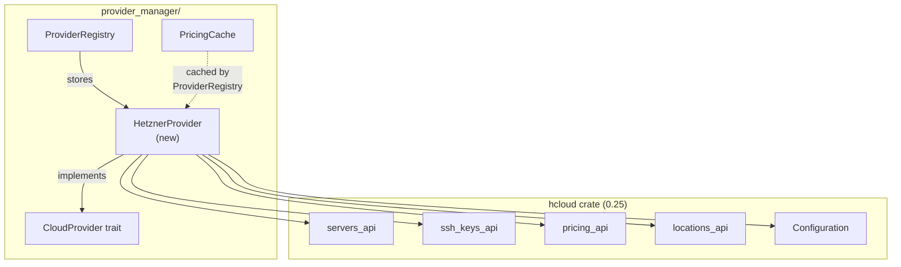

> **Status**: Completed at 2026-03-04T22:35:00+07:00
> **Branch**: feat/hetzner-provider

---
task: "Hetzner Provider -- CloudProvider trait implementation"
milestone: "M2"
module: "M2.2"
created_at: "2026-03-04T22:30:00+07:00"
status: "completed"
branch: "feat/hetzner-provider"
---

# M2.2: Hetzner Provider

## 1. Context

### A. Problem Statement

Implement the `CloudProvider` trait for Hetzner Cloud using the `hcloud` crate (v0.25). This is the first concrete provider implementation -- it validates the trait interface design and establishes patterns for AWS (M2.3) and GCP (M2.4).

### B. Current State

- `CloudProvider` trait defined in `src-tauri/src/provider_manager/cloud_provider.rs` with 7 async methods
- `ProviderRegistry` and `PricingCache` implemented in M2.1
- `ProviderError` enum with `From<ProviderError> for AppError` conversion in `src-tauri/src/error.rs`
- Shared types (`RegionInfo`, `ServerInfo`, `ServerStatus`, `Provider`) in `src-tauri/src/types.rs`
- `Cargo.toml` does NOT yet include `hcloud` or `tokio` -- must be added
- No provider implementation exists yet

### C. Constraints

- `hcloud` crate is OpenAPI-generated -- all API calls require `&configuration::Configuration` + params struct pattern
- Hetzner API uses bearer token auth via `configuration.bearer_access_token`
- Server IDs are `i64` in hcloud but `String` in our trait -- conversion required
- Pricing values are `String` (e.g., `"0.0048000000000000"`) -- must parse to `f64`
- `list_server_types` default pagination returns only 25 results -- must set `per_page: 50`

### D. Input Sources

- Milestone: `docs/milestone/2026-03-04-1726-milestone.md` -- M2.2
- API design: `docs/api-design/2026-03-04-1726-api-design.md` -- §4.F (CloudProvider trait)
- ADR-0002: Use Rust SDK for Cloud Providers
- ADR-0005: Use Provider Pricing API
- Cross-cutting: `docs/architecture/cross-cutting-concepts.md` -- §6.B (cloud-init provider variation)

### E. Verified Facts

| # | What was tested | Result | Decision |
| --- | --- | --- | --- |
| 1 | Invalid API key → `list_servers` | `401 Unauthorized`, `code: "unauthorized"` | Use `list_servers` for `validate_credential` -- 401 maps to `AuthInvalidKey` |
| 2 | Invalid API key → `get_server` | Same 401 format | Error mapping is consistent across endpoints |
| 3 | `list_locations` response | 6 locations: `fsn1`, `nbg1`, `hel1`, `ash`, `hil`, `sin` with city/country/description | Join with pricing data for `RegionInfo.display_name` |
| 4 | CX22 pricing per location | CX22 available in EU only (`fsn1`, `nbg1`, `hel1`) -- not in US/SG | Cannot hardcode server type -- must dynamically select cheapest per location |
| 5 | Cheapest server type per location | EU: `cx23` (0.0048 EUR/hr), US: `cpx11` (0.0072), SG: `cpx12` (0.0096) | `list_regions` must find cheapest shared type per location from pricing API |
| 6 | SSH key create/delete round-trip | create returns `i64` id (e.g., `108532637`), delete by id works | `i64.to_string()` for trait, `parse::<i64>()` back for API calls |
| 7 | `CreateServerRequest` fields | `image` (String), `name` (String), `server_type` (String), `location` (Option), `ssh_keys` (Option<Vec<String>>), `user_data` (Option) | All fields available for server provisioning with cloud-init |
| 8 | Server IP location | `server.public_net.ipv4.ip` (String) | Direct mapping to `ServerInfo.public_ip` |
| 9 | Server status enum | `Initializing`, `Running`, `Deleting`, `Off`, `Starting`, `Stopping`, `Unknown` | Map `Initializing`/`Starting` → `Provisioning`, `Running` → `Running`, `Deleting` → `Deleting` |
| 10 | Pricing `price_hourly.gross` format | String `"0.0048000000000000"` | `parse::<f64>()` with fallback to `f64::MAX` for unparseable |
| 11 | `per_page` pagination | Default returns 25 server types -- CX22/CX23 cut off on `list_server_types` | Not applicable -- implementation uses `pricing_api::list_prices` which returns all types without pagination |
| 12 | hcloud `Configuration` | `bearer_access_token: Option<String>`, `client: reqwest::Client` | Create new `Configuration` per call with api_key from Keychain |

### F. Unverified Assumptions

None -- all assumptions verified via spike code.

---

## 2. Architecture

### A. Diagram



### B. Decisions

1. **Configuration per-call** -- create a new `hcloud::Configuration` with `bearer_access_token` on each method call. Keys come from Keychain per-call, never cached in the provider struct. (Principle: Explicit over Implicit)

2. **Dynamic cheapest server type** -- `list_regions` queries `pricing_api::list_prices` and finds the cheapest shared server type per location, rather than hardcoding `cx22`. This handles location-specific availability and future price changes. (Principle: Fail Fast -- no stale assumptions)

3. **Error mapping helper** -- centralized `map_hcloud_error` function converts `hcloud::apis::Error` to `ProviderError` by inspecting HTTP status codes and response body. (Principle: Single Responsibility)

4. **Region-to-server-type cache** -- `HetznerProvider` holds an internal `RwLock<HashMap<String, String>>` mapping region code → cheapest server type name. Populated when `list_regions` is called. `create_server` reads from this cache to resolve the server type for a given region; if cache miss, calls pricing API inline. This avoids re-querying pricing on every server creation while keeping the trait signature unchanged (`create_server` has no `server_type` parameter). (Principle: Explicit over Implicit)

5. **Polling until Running** -- the `CloudProvider::create_server` trait doc specifies "Returns server info once the server is running." Hetzner's API returns immediately with `Initializing` status. `HetznerProvider::create_server` must poll via `get_server` until status reaches `Running` (with timeout and exponential backoff). This fulfills the trait contract and ensures the IP is reachable and cloud-init has completed before Server Lifecycle proceeds to tunnel setup. (Principle: Fail Fast)

### C. Boundaries

| File | Responsibility |
| --- | --- |
| `src-tauri/src/provider_manager/hetzner.rs` | `HetznerProvider` struct + all 7 trait methods + error mapping helper |
| `src-tauri/src/provider_manager/mod.rs` | Add `mod hetzner; pub use hetzner::HetznerProvider;` |
| `src-tauri/Cargo.toml` | Add `hcloud`, `tokio` dependencies |

### D. Trade-offs

| Choice | Alternative | Why chosen |
| --- | --- | --- |
| Dynamic cheapest type | Hardcode CX22 | CX22 is EU-only -- US/SG would have zero regions |
| `list_servers` for validation | Dedicated auth endpoint | Hetzner has no auth-check endpoint; `list_servers` is cheapest call |
| Gross price (incl. VAT) | Net price | End users see what they actually pay |
| `per_page: 50` | Paginate all pages | Hetzner has ~25 server types -- single page suffices |

---

## 3. Steps

### Step 1: Add dependencies and scaffold HetznerProvider

- [x] **Status**: completed at 2026-03-04T22:30:00+07:00
- **Scope**: `src-tauri/Cargo.toml`, `src-tauri/src/provider_manager/hetzner.rs`, `src-tauri/src/provider_manager/mod.rs`
- **Dependencies**: none
- **Description**: Add `hcloud = "0.25"` and `tokio = { version = "1", features = ["full"] }` to Cargo.toml. Create `hetzner.rs` with `HetznerProvider` struct holding `region_server_types: RwLock<HashMap<String, String>>` for region → cheapest server type caching. Add `make_configuration` helper that builds `hcloud::apis::configuration::Configuration` from an api_key, and `map_hcloud_error` helper that converts `hcloud::apis::Error<T>` to `ProviderError`. Register the module in `mod.rs`. Run `cargo check` to verify.
- **Acceptance Criteria**:
  - `hcloud` and `tokio` in Cargo.toml dependencies
  - `HetznerProvider` struct with `region_server_types: RwLock<HashMap<String, String>>` field
  - `HetznerProvider::new()` constructor initializing empty cache
  - `make_configuration(api_key: &str) -> Configuration` helper
  - `map_hcloud_error` maps: 401 → `AuthInvalidKey`, 403 → `AuthInsufficientPermissions`, 429 → `RateLimited`, 5xx → `ServerError`, timeout → `Timeout`, other → `Other`
  - `mod.rs` exports `HetznerProvider`
  - `cargo check` passes

### Step 2: Implement validate_credential

- [x] **Status**: completed at 2026-03-04T22:30:00+07:00
- **Scope**: `src-tauri/src/provider_manager/hetzner.rs`
- **Dependencies**: Step 1
- **Description**: Implement `validate_credential` by calling `servers_api::list_servers` with default params. Success (any status code 2xx) → `Ok(())`. Error → map via `map_hcloud_error`.
- **Acceptance Criteria**:
  - Valid key returns `Ok(())`
  - Invalid key returns `Err(ProviderError::AuthInvalidKey(_))`
  - Network error returns appropriate `ProviderError` variant

### Step 3: Implement list_regions

- [x] **Status**: completed at 2026-03-04T22:30:00+07:00
- **Scope**: `src-tauri/src/provider_manager/hetzner.rs`
- **Dependencies**: Step 1
- **Description**: Implement `list_regions` by:
  1. Call `pricing_api::list_prices` to get all server type prices per location
  2. Call `locations_api::list_locations` to get display names
  3. For each location, find the cheapest server type (by `price_hourly.gross` parsed to `f64`)
  4. Join with location data to build `display_name` as `"{city}, {country}"` (e.g., `"Falkenstein, DE"`)
  5. **Populate `self.region_server_types` cache** with region → cheapest server type name mapping
  6. Return `Vec<RegionInfo>` sorted by `hourly_cost` ascending
- **Acceptance Criteria**:
  - Returns all 6 Hetzner locations with correct cheapest type per location
  - `hourly_cost` parsed from `price_hourly.gross` String to `f64`
  - `display_name` format: `"{city}, {country}"`
  - Results sorted by `hourly_cost` ascending
  - `region_server_types` cache populated after call
  - API errors mapped via `map_hcloud_error`

### Step 4: Implement create_ssh_key and delete_ssh_key

- [x] **Status**: completed at 2026-03-04T22:30:00+07:00
- **Scope**: `src-tauri/src/provider_manager/hetzner.rs`
- **Dependencies**: Step 1
- **Description**: Implement SSH key CRUD:
  - `create_ssh_key`: build `CreateSshKeyRequest` with `name` = label, `public_key` = public_key. Return `ssh_key.id.to_string()`.
  - `delete_ssh_key`: parse `key_id` to `i64`, call `ssh_keys_api::delete_ssh_key`.
- **Acceptance Criteria**:
  - `create_ssh_key` returns provider-side key ID as `String`
  - `delete_ssh_key` accepts `String` key_id, parses to `i64`, deletes
  - Invalid key_id format returns `ProviderError::Other`
  - API errors mapped via `map_hcloud_error`

### Step 5: Implement create_server, destroy_server, get_server

- [x] **Status**: completed at 2026-03-04T22:30:00+07:00
- **Scope**: `src-tauri/src/provider_manager/hetzner.rs`
- **Dependencies**: Step 1, Step 3 (needs to know cheapest server type per region)
- **Description**: Implement server lifecycle:
  - `create_server(api_key, region, ssh_key_id, cloud_init)`:
    - Resolve `server_type` from `self.region_server_types` cache (populated by `list_regions`). On cache miss, call pricing API inline to populate.
    - Build `CreateServerRequest` with `image: "ubuntu-24.04"`, `name: "oh-my-vpn-{timestamp}"`, `server_type`, `location: region`, `ssh_keys: [ssh_key_id]`, `user_data: cloud_init`, `start_after_create: true`
    - After Hetzner API returns (server in `Initializing` state), **poll via `get_server` until status reaches `Running`** -- with exponential backoff (3s initial, 2x multiplier, 15s cap), max 120s timeout (NFR-PERF-1). On timeout → `ProviderError::ProvisioningFailed`.
    - Extract `server.id.to_string()`, `server.public_net.ipv4.ip` from the Running server
    - Return `ServerInfo` with `status: Running`
  - `destroy_server(api_key, server_id)`: parse to `i64`, call `delete_server`
  - `get_server(api_key, server_id)`: parse to `i64`, call `get_server`. 404/not-found → `Ok(None)`, found → `Ok(Some(ServerInfo))`
- **Acceptance Criteria**:
  - `create_server` resolves `server_type` from `region_server_types` cache; falls back to pricing API on cache miss
  - `create_server` polls until server reaches `Running` status (max 120s, 5s interval)
  - On polling timeout → `ProviderError::ProvisioningFailed`
  - Server name follows `oh-my-vpn-{unix_timestamp}` pattern
  - Image hardcoded to `ubuntu-24.04`
  - `destroy_server` converts `String` → `i64` and calls delete
  - `get_server` returns `None` for non-existent server, `Some(ServerInfo)` for existing
  - Status mapping: `Initializing`/`Starting` → `Provisioning`, `Running` → `Running`, `Deleting` → `Deleting`
  - All API errors mapped via `map_hcloud_error`

### Step 6: Tests

- [x] **Status**: completed at 2026-03-04T22:30:00+07:00
- **Scope**: `src-tauri/src/provider_manager/hetzner.rs` (inline `#[cfg(test)]` module)
- **Dependencies**: Step 2, Step 3, Step 4, Step 5
- **Description**: Write unit tests and integration tests:
  - **Unit tests** (no API key needed):
    - `map_hcloud_error` produces correct `ProviderError` variants
    - Pricing parsing: gross string → f64 conversion
    - Server ID string ↔ i64 conversion
    - Status mapping correctness
  - **Integration tests** (gated by `HETZNER_API_KEY` env var, `#[ignore]`):
    - `validate_credential` with valid key → Ok
    - `validate_credential` with invalid key → AuthInvalidKey
    - `list_regions` returns non-empty Vec sorted by cost
    - SSH key create/delete round-trip
    - (Server create/destroy is expensive -- defer to M4 end-to-end test)
- **Acceptance Criteria**:
  - All unit tests pass with `cargo test`
  - Integration tests pass with `HETZNER_API_KEY=... cargo test -- --ignored`
  - No compilation warnings
  - `cargo clippy` clean

---

## 4. Execution Strategy

| Step | Chain | Complexity | Rationale |
| --- | --- | --- | --- |
| 1 | Direct | Trivial | Cargo.toml + scaffold boilerplate |
| 2 | scout → worker | Simple | Error mapping needs crate source reference |
| 3 | scout → worker | Medium | Pricing join logic -- most complex method |
| 4 | Direct | Trivial | Simple CRUD wrapping |
| 5 | scout → worker | Medium | Server lifecycle + dynamic type resolution |
| 6 | scout → worker → reviewer | Medium | Test quality needs review |

### A. Execution Order

```plain
Step 1 → Step 2 ─┐
          Step 3 ─┤ (parallel after Step 1)
          Step 4 ─┘
              └──→ Step 5 → Step 6
```

Steps 2, 3, 4 can run in parallel after Step 1 since they modify independent sections of the same file. Step 5 depends on Step 3 (pricing logic for server type resolution). Step 6 depends on all previous steps.

### B. Risk Flags

- **Step 3**: Pricing parsing is the most complex logic -- if the pricing API structure changes or has edge cases (missing locations, zero prices), the parsing may fail. Mitigation: defensive parsing with `unwrap_or(f64::MAX)`.
- **Step 5**: `create_server` polling loop -- server may take 30--90s to reach Running. Timeout must respect NFR-PERF-1 (120s total for full connect flow). If Hetzner API is slow, polling may exhaust the budget before tunnel setup. Mitigation: 120s max for polling, Server Lifecycle owns the overall timeout.
