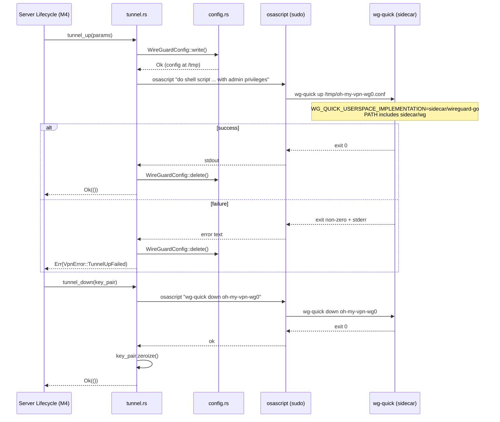

> **Status**: Completed at 2026-03-05T12:12:00+07:00
> **Branch**: feat/vpn-tunnel-sidecar

# PLAN -- M3.3: wg-quick Subprocess + Sidecar Bundling

## 1. Context

### A. Problem Statement

The VPN Manager needs to establish and tear down WireGuard tunnels by executing `wg-quick` as a subprocess with root privileges. The `wireguard-go`, `wg`, and `wg-quick` binaries must be bundled inside the Tauri app so users do not need to install WireGuard separately. ADR-0001 chose this approach; ADR-0003 confirmed no Network Extension is needed.

### B. Current State

M3.1 (keys.rs) and M3.2 (config.rs) are complete:

- `WireGuardKeyPair` -- generate Curve25519 key pairs with zeroize
- `WireGuardConfig` -- write INI config to `/tmp/oh-my-vpn-wg0.conf` with permission 600, delete after use

The `vpn_manager/mod.rs` exposes `pub mod config; pub mod keys;` -- `tunnel` module does not exist yet.

`VpnError` in `error.rs` has config-related variants only (`ConfigWriteFailed`, `ConfigDeleteFailed`, `ConfigPermissionFailed`). Tunnel execution variants are missing.

No sidecar binaries or `bundle.externalBin` config exists in the project.

### C. Constraints

- macOS only (aarch64-apple-darwin target)
- sudo required for wg-quick (utun device creation) -- via `osascript` authorization dialog
- wg-quick is a bash script (#!/usr/bin/env bash) -- needs `wg` and `wireguard-go` on PATH or via env var
- Config file must be deleted in both success and failure paths (NFR-SEC-6)
- No `tauri-plugin-shell` needed -- Rust backend uses `std::process::Command` directly

### D. Input Sources

- ADR-0001: wireguard-go + wg-quick decision
- ADR-0003: no Network Extension for MVP
- Cross-cutting concepts §10: system permissions, sudo via osascript
- Milestone M3.3 acceptance criteria

### E. Verified Facts

| # | What was tested | Result | Decision |
| --- | --- | --- | --- |
| 1 | `osascript` sudo pattern | `do shell script "echo hello" with administrator privileges` returned `hello_from_sudo` | Use osascript for privilege escalation |
| 2 | `wg-quick` invocation via osascript | Ran successfully, printed usage text | osascript can invoke wg-quick with admin privileges |
| 3 | `WG_QUICK_USERSPACE_IMPLEMENTATION` env var | wg-quick line 127: `cmd "${WG_QUICK_USERSPACE_IMPLEMENTATION:-wireguard-go}" utun` | Set this env var to sidecar path for wireguard-go discovery |
| 4 | `wg` discovery | wg-quick calls `wg` via PATH (`wg show`, `wg addconf`, etc.) | Set PATH to include sidecar directory |
| 5 | macOS `/bin/bash` 3.2 compatibility | `extglob` and `pipefail` work on bash 3.2 | wg-quick compatible with macOS default bash |
| 6 | System tools availability | `networksetup` at `/usr/sbin/`, `route` at `/sbin/`, `ifconfig` at `/sbin/` | All wg-quick dependencies present on macOS |
| 7 | Binary sizes | wireguard-go 3.0MB, wg 103KB, wg-quick 16KB | Total ~3.1MB sidecar overhead acceptable |
| 8 | Target triple | `aarch64-apple-darwin` | Sidecar naming: `{name}-aarch64-apple-darwin` |

### F. Unverified Assumptions

| # | Assumption | Why not verified | Risk | Fallback |
| --- | --- | --- | --- | --- |
| 1 | Tauri `bundle.externalBin` bundles bash scripts (wg-quick) correctly | Cannot verify without full build + inspect .app bundle | Low -- Tauri copies files as-is, no compilation | Use `bundle.resources` instead and resolve path via `resource_dir()` |

## 2. Architecture

### A. Diagram



### B. Decisions

| Decision | Alternatives considered | Rationale | Principle |
| --- | --- | --- | --- |
| `std::process::Command` for subprocess | `tauri-plugin-shell` | All execution is Rust-side, no JS bridge needed. Avoids adding a plugin dependency | Explicit over Implicit |
| `tunnel_up` takes 4 params (server_ip, server_public_key, interface_address, dns) | 2 params per upstream sequence diagram | `WireGuardConfig` struct requires address and DNS fields. Upstream diagrams simplified the signature for readability. M4 (Server Lifecycle) must call with all 4 params | Explicit over Implicit |
| osascript for sudo | Direct `sudo` CLI, Network Extension | ADR-0001/0003 mandate. macOS authorization dialog is UX-friendly | Reversibility |
| Config delete in finally pattern | Delete only on success | NFR-SEC-6 requires deletion regardless of outcome. Private key must not persist on disk | Fail Fast |
| Bundle 3 sidecars (wireguard-go, wg, wg-quick) | Bundle only wireguard-go, expect system wg | wg-quick depends on both `wg` and `wireguard-go`. Users should not need to install WireGuard separately | Explicit over Implicit |
| `bundle.externalBin` for sidecar | `bundle.resources` | Tauri standard sidecar mechanism, places binaries in Contents/MacOS/ alongside main binary | Composition over Inheritance |

### C. Boundaries

| File | Responsibility |
| --- | --- |
| `src-tauri/src/vpn_manager/tunnel.rs` | Public API: `tunnel_up()`, `tunnel_down()`. Sidecar path resolution. osascript command construction and execution. Config delete guarantee |
| `src-tauri/src/vpn_manager/config.rs` | Unchanged -- config write/delete/to_ini |
| `src-tauri/src/vpn_manager/keys.rs` | Unchanged -- key generation/zeroize |
| `src-tauri/src/vpn_manager/mod.rs` | Add `pub mod tunnel;` |
| `src-tauri/src/error.rs` | Add `TunnelUpFailed`, `TunnelDownFailed`, `SidecarNotFound` to VpnError + AppError conversion |
| `src-tauri/binaries/` | 3 sidecar files with target triple suffix |
| `src-tauri/tauri.conf.json` | `bundle.externalBin` array |

## 3. Steps

### Step 1: Sidecar Binary Setup

- [x] **Status**: completed at 2026-03-05T12:03:00+07:00
- **Scope**: `src-tauri/binaries/` (3 files), `src-tauri/tauri.conf.json`
- **Dependencies**: none
- **Description**: Copy wireguard-go, wg, and wg-quick from Homebrew into `src-tauri/binaries/` with Tauri sidecar naming convention (`{name}-aarch64-apple-darwin`). Add `bundle.externalBin` to `tauri.conf.json`. Verify `cargo tauri dev` still compiles.
- **Acceptance Criteria**:
  - `src-tauri/binaries/wireguard-go-aarch64-apple-darwin` exists (3.0MB binary)
  - `src-tauri/binaries/wg-aarch64-apple-darwin` exists (103KB binary)
  - `src-tauri/binaries/wg-quick-aarch64-apple-darwin` exists (16KB bash script)
  - `tauri.conf.json` has `bundle.externalBin` listing all 3 sidecars
  - `cargo check` passes

### Step 2: VpnError Tunnel Variants + tunnel.rs Implementation

- [x] **Status**: completed at 2026-03-05T12:08:00+07:00
- **Scope**: `src-tauri/src/error.rs`, `src-tauri/src/vpn_manager/tunnel.rs` (new), `src-tauri/src/vpn_manager/mod.rs`
- **Dependencies**: Step 1
- **Description**: Add tunnel error variants to VpnError with AppError conversion. Implement `tunnel.rs` with `tunnel_up()` and `tunnel_down()` functions. Include sidecar path resolution (relative to current executable), osascript command construction, and config delete guarantee via finally pattern.
- **Acceptance Criteria**:
  - `VpnError::TunnelUpFailed(String)` -- wg-quick up failure with stderr message
  - `VpnError::TunnelDownFailed(String)` -- wg-quick down failure with stderr message
  - `VpnError::SidecarNotFound(String)` -- sidecar binary not found at expected path
  - All new VpnError variants convert to AppError with correct error codes
  - `tunnel_up(server_ip, server_public_key, interface_address, dns)` function:
    - Builds WireGuardConfig from parameters
    - Writes config via `WireGuardConfig::write()`
    - Resolves sidecar paths (wireguard-go, wg, wg-quick) relative to current exe
    - Constructs osascript command with `WG_QUICK_USERSPACE_IMPLEMENTATION` env and PATH
    - Executes via `std::process::Command`
    - Deletes config in both success and failure paths
    - Returns `Ok(())` on success, `Err(VpnError::TunnelUpFailed)` on failure
  - `tunnel_down(key_pair: &mut WireGuardKeyPair)` function:
    - Executes `wg-quick down oh-my-vpn-wg0` via osascript sudo
    - Zeroes WireGuard key pair from memory via `zeroize()` (NFR-SEC-2, ADR-0001)
    - Returns `Ok(())` on success, `Err(VpnError::TunnelDownFailed)` on failure
  - `vpn_manager/mod.rs` updated with `pub mod tunnel;`
  - `cargo check` passes

### Step 3: Unit Tests + Compilation Verification

- [x] **Status**: completed at 2026-03-05T12:10:00+07:00
- **Scope**: `src-tauri/src/vpn_manager/tunnel.rs` (`#[cfg(test)]` module)
- **Dependencies**: Step 2
- **Description**: Add unit tests for sidecar path resolution and osascript command string construction. Run `cargo check` and `cargo test` to verify compilation and non-sudo tests pass.
- **Acceptance Criteria**:
  - Unit test: `resolve_sidecar_path()` returns expected path structure
  - Unit test: osascript command string contains correct env vars, paths, and config path
  - Unit test: `tunnel_down` command string references correct interface name
  - `cargo check` passes with zero errors
  - `cargo test` passes (tunnel up/down are integration-test scope, not unit-tested)

### Step 4: Integration Test (sudo required)

- [x] **Status**: completed at 2026-03-05T12:12:00+07:00
- **Scope**: `src-tauri/src/vpn_manager/tunnel.rs` (`#[cfg(test)]` module, `#[ignore]` attribute)
- **Dependencies**: Step 2
- **Description**: Add an integration test that performs a real tunnel up/down cycle. This test requires sudo (macOS authorization dialog) and a running system, so it is marked `#[ignore]` and run manually via `cargo test -- --ignored`. It validates the full sidecar → osascript → wg-quick → utun flow.
- **Acceptance Criteria**:
  - Integration test: `tunnel_up` → verify utun interface exists (via `ifconfig`) → `tunnel_down` → verify interface removed
  - Test marked `#[ignore]` to skip in CI (requires sudo + network)
  - Test creates a loopback-only config (no real server needed -- peer endpoint can be localhost)
  - Key pair zeroed after tunnel_down verified

## 4. Execution Strategy

| Step | Chain | Rationale |
| --- | --- | --- |
| 1 | Direct | File copy + JSON config edit, trivial |
| 2 | scout → worker | Core implementation, needs existing pattern context from config.rs and error.rs |
| 3 | Direct | Unit test addition on top of Step 2 output, single file append |
| 4 | Direct | Integration test addition, single file append, requires manual run |

**Execution order:**

```plain
Step 1 → Step 2 → Step 3 → Step 4 (sequential -- each builds on previous)
```

**Estimated complexity:**

| Step | Tier | Estimated tokens |
| --- | --- | --- |
| 1 | Trivial | < 5K |
| 2 | Medium | 20--40K |
| 3 | Simple | 10--15K |
| 4 | Simple | 5--10K |

**Risk flags:**

- Step 1: Tauri bash script sidecar bundling (Unverified Assumption #1). If it fails, switch to `bundle.resources` path
- Step 2: osascript escaping -- shell command string must be properly escaped for AppleScript. Verify with test in Step 3
- Step 4: Integration test requires sudo prompt -- cannot run in CI, manual verification only

---
