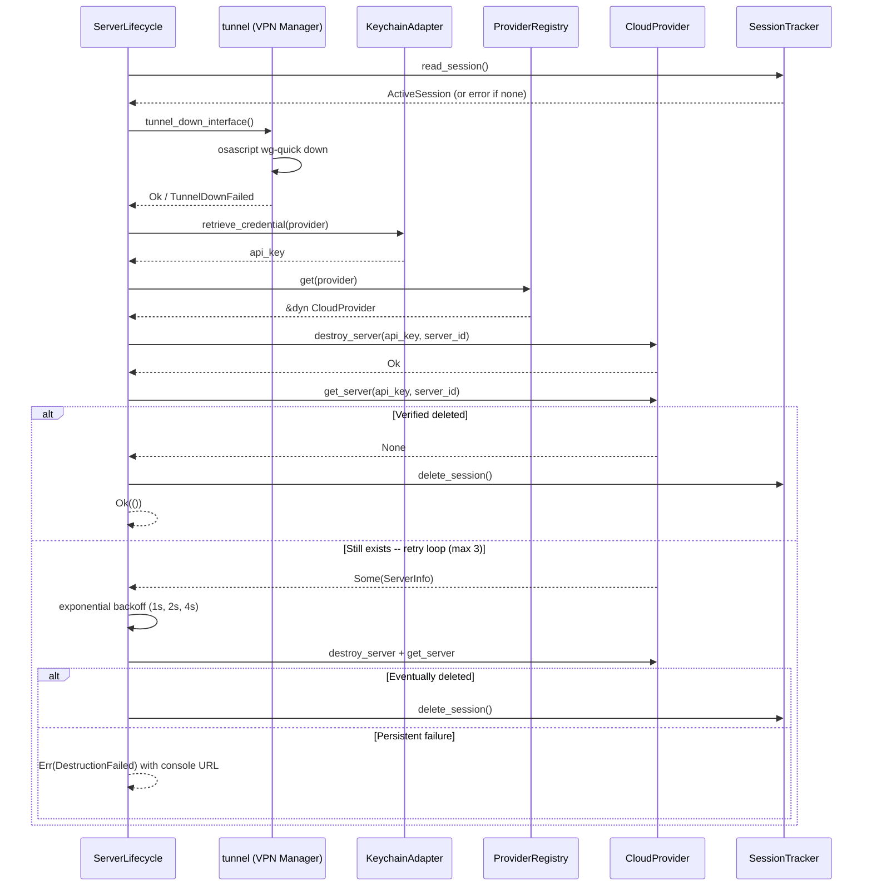

> **Status**: Completed at 2026-03-05T13:42:00+07:00
> **Branch**: feat/disconnect-flow

# PLAN -- M4.3: Server Lifecycle -- Disconnect Flow

## 1. Context

### A. Problem Statement

M4.2 (Connect Flow) is complete -- the app can provision servers and establish WireGuard tunnels. The disconnect flow is the complement: tear down the tunnel, destroy the server, verify deletion, and clear session state. Without this, users cannot cleanly end a VPN session and servers accumulate as orphans.

### B. Current State

- `ServerLifecycle` struct owns `SessionTracker` and `PreferencesStore` in `server_lifecycle/mod.rs`
- `connect()` is implemented in `server_lifecycle/connect.rs`
- `tunnel::tunnel_down(&mut WireGuardKeyPair)` exists but requires a key pair reference -- key pair is not persisted after connect
- `CloudProvider::destroy_server()` and `get_server()` exist on the trait
- `LifecycleError` enum has connect-related variants but lacks disconnect-specific ones
- `ProviderError::DestructionFailed` and error code `PROVIDER_DESTRUCTION_FAILED` already exist
- `ActiveSession` contains `server_id`, `provider`, `region` -- sufficient to identify what to destroy

### C. Constraints

- `wg-quick down` operates by interface name (`oh-my-vpn-wg0`), not by key pair -- key pair is only needed for zeroize
- Connect flow drops `WireGuardKeyPair` at function end -- no key material persists (correct security behavior)
- Disconnect must work without stored key material
- Session state must be preserved on persistent destruction failure (cross-cutting §8.C)
- Retry up to 3 times with exponential backoff (cross-cutting §2.A)

### D. Verified Facts

1. **`tunnel_down` signature**: requires `&mut WireGuardKeyPair` -- confirmed in `vpn_manager/tunnel.rs:163`. The function runs `wg-quick down oh-my-vpn-wg0` via osascript and then calls `key_pair.zeroize()`. The wg-quick command itself does not use the key pair
2. **`ActiveSession` fields**: `server_id`, `provider`, `region`, `server_ip`, `created_at`, `hourly_cost`, `ssh_key_id` -- confirmed in `session_tracker.rs:46-53`
3. **`ProviderRegistry` access**: connect flow uses `&tokio::sync::Mutex<ProviderRegistry>` -- disconnect will follow the same pattern
4. **Error codes**: `PROVIDER_DESTRUCTION_FAILED` exists in `error.rs:269`, `TUNNEL_TEARDOWN_FAILED` exists in `error.rs:273`, `NOT_FOUND_SESSION` exists in `error.rs:258`
5. **`KeychainAdapter::retrieve_credential`**: returns `Result<Option<ProviderCredential>>` -- confirmed in connect.rs usage

### E. Unverified Assumptions

None -- all technical assumptions verified via code inspection.

## 2. Architecture

### A. Diagram

### B. Decisions

| Decision | Rationale | Principle |
| --- | --- | --- |
| Add `tunnel_down_interface()` without key pair param | wg-quick operates by interface name; key pair is already zeroed after connect | Explicit over Implicit |
| Keep existing `tunnel_down(&mut WireGuardKeyPair)` | Used by connect cleanup where key pair is still in scope | Composition over Inheritance |
| Add `Provider::console_url()` to types.rs | Reusable by M4.4 orphan detection; single source of truth for console URLs | Single Responsibility |
| Preserve session on persistent failure | User can retry or manually delete; prevents data loss | Fail Fast (surface error clearly) |
| Add `NoActiveSession` + `DestructionFailed` to LifecycleError | Distinct error semantics for disconnect vs connect failures | Explicit over Implicit |

### C. Boundaries

| File | Responsibility |
| --- | --- |
| `types.rs` | `Provider::console_url()` method |
| `vpn_manager/tunnel.rs` | `tunnel_down_interface()` -- teardown without key pair |
| `server_lifecycle/mod.rs` | `pub mod disconnect;`, new error variants, From impls |
| `server_lifecycle/disconnect.rs` | `ServerLifecycle::disconnect()` implementation + tests |

## 3. Steps

### Step 1: Add utility functions

- [x] **Status**: completed at 2026-03-05T13:22:00+07:00
- **Scope**: `src-tauri/src/types.rs`, `src-tauri/src/vpn_manager/tunnel.rs`
- **Dependencies**: none
- **Description**: Add `Provider::console_url()` method returning the provider's cloud console URL for manual server management. Add `tunnel_down_interface()` function that tears down the WireGuard tunnel without requiring a key pair reference.
- **Acceptance Criteria**:
  - `Provider::console_url()` returns correct URLs: Hetzner (`https://console.hetzner.cloud`), AWS (`https://console.aws.amazon.com/ec2`), GCP (`https://console.cloud.google.com/compute`)
  - `tunnel_down_interface()` runs `wg-quick down oh-my-vpn-wg0` via osascript without key pair parameter
  - `tunnel_down_interface()` returns `Result<(), VpnError>` with `VpnError::TunnelDownFailed` on failure
  - Unit tests for `console_url()` (all 3 providers)
  - Unit test for `tunnel_down_interface` script builder (pure, no I/O)

### Step 2: Implement disconnect flow

- [x] **Status**: completed at 2026-03-05T13:30:00+07:00
- **Scope**: `src-tauri/src/server_lifecycle/mod.rs`, `src-tauri/src/server_lifecycle/disconnect.rs`
- **Dependencies**: Step 1
- **Description**: Add `NoActiveSession` and `DestructionFailed(String)` variants to `LifecycleError` with Display and From<LifecycleError> for AppError mappings. Add `pub mod disconnect;` to mod.rs. Implement `ServerLifecycle::disconnect()` method with the full flow: read session → tunnel down → retrieve API key → destroy server → verify deletion → retry up to 3 times with exponential backoff → delete session on success or return error with console URL on persistent failure.
- **Acceptance Criteria**:
  - `disconnect()` returns `Err(NoActiveSession)` when no session file exists
  - Tunnel teardown via `tunnel_down_interface()` -- continues to destroy even if tunnel teardown fails (tunnel may already be down)
  - Destruction verified via `get_server()` returning `None`
  - Retry loop: up to 3 retries with exponential backoff (1s, 2s, 4s) using `tokio::time::sleep`
  - On persistent failure: session preserved, error details include `console_url` via `serde_json::json!`
  - On success: `session_tracker.delete_session()` called
  - `NoActiveSession` maps to `NOT_FOUND_SESSION` AppError code
  - `DestructionFailed` maps to `PROVIDER_DESTRUCTION_FAILED` AppError code

### Step 3: Add unit tests for disconnect

- [x] **Status**: completed at 2026-03-05T13:40:00+07:00
- **Scope**: `src-tauri/src/server_lifecycle/disconnect.rs` (tests module)
- **Dependencies**: Step 2
- **Description**: Add unit tests using mock CloudProvider (reuse pattern from connect.rs tests). Test: no session returns error, successful disconnect flow, retry on transient failure, persistent failure preserves session, tunnel teardown failure continues to destroy server.
- **Acceptance Criteria**:
  - Test: `disconnect_no_session_returns_error` -- empty session tracker → `NoActiveSession`
  - Test: `disconnect_success_deletes_session` -- mock provider returns None on get_server → session deleted
  - Test: `disconnect_retries_on_verify_failure` -- mock get_server returns Some first, None on retry → success
  - Test: `disconnect_persistent_failure_preserves_session` -- mock get_server always returns Some → error returned, session file still exists
  - Test: `disconnect_continues_after_tunnel_failure` -- tunnel teardown fails but server destruction succeeds
  - All tests pass with `cargo test`

## 4. Execution Strategy

| Step | Chain | Rationale |
| --- | --- | --- |
| 1 | scout → worker | 2 independent utility additions, low risk, clear specs |
| 2 | scout → worker → reviewer | Core business logic with retry/backoff, error handling, session preservation -- needs review |
| 3 | scout → worker | Test additions following established MockProvider pattern from connect.rs |

**Execution order**: Step 1 → Step 2 → Step 3 (strictly sequential)

**Estimated complexity**:

- Step 1: Simple (~15K tokens)
- Step 2: Medium (~40K tokens)
- Step 3: Medium (~30K tokens)

**Risk flags**:

- Step 2: `disconnect()` shares `ServerLifecycle` impl block with `connect()` across files -- Rust allows this natively (`impl` blocks can span files), verified in existing connect.rs pattern
- Step 3: Tests cannot call `disconnect()` directly without Keychain mock -- test the retry/destroy logic via mock provider at the component level, same pattern as connect.rs cleanup tests

---
