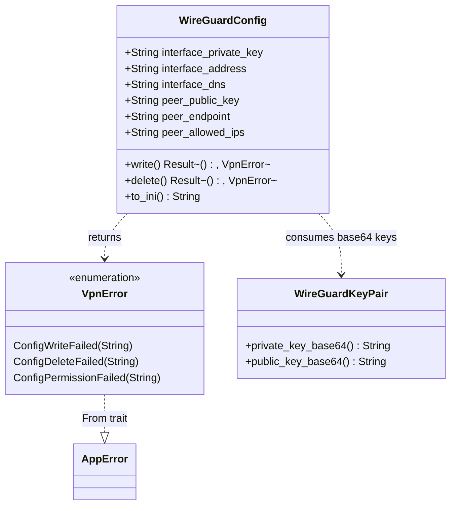

# WireGuard Config File Management

> **Status**: Completed at 2026-03-05T11:43:00+07:00
> **Branch**: feat/wireguard-config

## 1. Context

### A. Problem Statement

M3.2 implements WireGuard configuration file lifecycle -- write INI config with permission 600, populate DNS for leak prevention, and delete after use. This bridges M3.1 (key generation) and M3.3 (wg-quick subprocess execution).

### B. Current State

- `src-tauri/src/vpn_manager/mod.rs` -- exists, exports `pub mod keys` only
- `src-tauri/src/vpn_manager/keys.rs` -- M3.1 complete. `WireGuardKeyPair` with `private_key_base64()` / `public_key_base64()` methods
- `src-tauri/src/error.rs` -- has `AppError`, `ProviderError`, `KeychainError`, `PreferencesError`. No `VpnError` yet
- No `config.rs` exists yet

### C. Constraints

- Config file path: `/tmp/oh-my-vpn-wg0.conf` (data model §4.C)
- Permission must be `0o600` immediately after write (NFR-SEC-6)
- File deleted regardless of wg-quick success/failure (ADR-0001)
- Only one active session at a time -- single config file path is sufficient
- Standard WireGuard INI format: `[Interface]` + `[Peer]` sections

### D. Input Sources

- Data model §4.C -- WireGuardConfig schema (6 fields)
- ADR-0001 -- wireguard-go + wg-quick decision, sequence diagram
- Milestone document M3.2 -- acceptance criteria

### E. Verified Facts

| What was tested | Result | Decision |
| --- | --- | --- |
| `std::os::unix::fs::PermissionsExt::from_mode(0o600)` on `/tmp` | Permission correctly set to 600 | Use `fs::set_permissions` after `File::create` + write |
| WireGuard INI format write + read back | Content matches expected format | Use `write!` macro with format string |
| `fs::remove_file` + `Path::exists` check | File removed, exists returns false | Use for delete with existence verification |
| `WireGuardKeyPair` API in keys.rs | `private_key_base64()` and `public_key_base64()` available | Config builder takes base64 strings directly |
| `error.rs` structure | No `VpnError` enum exists yet | Must add `VpnError` + `From<VpnError> for AppError` |

### F. Unverified Assumptions

None. All technical elements verified via spike.

---

## 2. Architecture

### A. Diagram

### B. Decisions

1. **Flat struct, no builder** -- all 6 fields are required per data model. A builder adds complexity without value. (Principle: Explicit over Implicit)
2. **`write()` and `delete()` as methods on `WireGuardConfig`** -- config owns the data and knows the file path. Keeps responsibility cohesive. (Principle: Single Responsibility)
3. **Constant file path** -- `/tmp/oh-my-vpn-wg0.conf` as `const`. Data model specifies this path, and only one session is active at a time. (Principle: Explicit over Implicit)
4. **`delete()` is idempotent** -- if file does not exist, return `Ok(())`. Prevents double-delete errors in cleanup paths. (Principle: Fail Fast -- but graceful for idempotent operations)
5. **`VpnError` in `error.rs`** -- follows existing pattern (`ProviderError`, `KeychainError`). M3.3 will extend this enum with tunnel-related variants.

### C. Boundaries

| File | Responsibility |
| --- | --- |
| `config.rs` | `WireGuardConfig` struct, `write()`, `delete()`, `to_ini()`, unit tests |
| `error.rs` | `VpnError` enum + `From<VpnError> for AppError` |
| `vpn_manager/mod.rs` | `pub mod config` declaration |

---

## 3. Steps

### Step 1: Add VpnError to error.rs

- [x] **Status**: completed at 2026-03-05T11:40:00+07:00
- **Scope**: `src-tauri/src/error.rs`
- **Dependencies**: none
- **Description**: Add `VpnError` enum with `ConfigWriteFailed(String)`, `ConfigDeleteFailed(String)`, `ConfigPermissionFailed(String)` variants. Implement `From<VpnError> for AppError` using existing error codes `TUNNEL_SETUP_FAILED` (for write/permission) and `TUNNEL_TEARDOWN_FAILED` (for delete). Add `use crate::error::VpnError;` will be needed in config.rs.
- **Acceptance Criteria**:
  - `VpnError` enum defined with 3 variants
  - `From<VpnError> for AppError` maps to correct error codes
  - Existing code compiles without changes (`cargo check`)

### Step 2: Implement WireGuardConfig in config.rs

- [x] **Status**: completed at 2026-03-05T11:43:00+07:00
- **Scope**: `src-tauri/src/vpn_manager/config.rs`
- **Dependencies**: Step 1
- **Description**: Create the `WireGuardConfig` struct with 6 fields matching data model §4.C. Implement `to_ini()` to generate standard WireGuard INI format, `write()` to create the file at `CONFIG_PATH` with permission 600, and `delete()` to remove the file idempotently. Include unit tests for: INI format correctness, permission 600 verification, delete + verify gone, and idempotent delete.
- **Acceptance Criteria**:
  - `WireGuardConfig` struct with 6 fields (all `String`)
  - `const CONFIG_PATH: &str = "/tmp/oh-my-vpn-wg0.conf"`
  - `to_ini()` returns valid WireGuard INI with `[Interface]` and `[Peer]` sections
  - `write()` creates file, writes INI, sets permission `0o600`
  - `delete()` removes file, returns `Ok(())` if already missing
  - `DNS` field populated (FR-VC-5 leak prevention)
  - `AllowedIPs` set to `0.0.0.0/0, ::/0` in config
  - Unit test: write → verify permission 600 → read content → delete → verify gone
  - Unit test: delete non-existent file → `Ok(())`
  - `cargo test` passes

### Step 3: Register config module in mod.rs

- [x] **Status**: completed at 2026-03-05T11:43:00+07:00
- **Scope**: `src-tauri/src/vpn_manager/mod.rs`
- **Dependencies**: Step 2
- **Description**: Add `pub mod config;` to `vpn_manager/mod.rs`.
- **Acceptance Criteria**:
  - `pub mod config;` added
  - `cargo check` passes

---

## 4. Execution Strategy

| Step | Chain | Rationale |
| --- | --- | --- |
| 1 | Direct | Trivial -- add enum + From impl to existing file |
| 2 | scout → worker | Main implementation. Scout reads keys.rs patterns + error.rs, worker implements config.rs with tests |
| 3 | Direct | Single line addition |

**Execution order**: Sequential (1 → 2 → 3)

**Parallel opportunities**: None -- Step 2 depends on Step 1, Step 3 depends on Step 2.

**Complexity estimates**:

| Step | Tier | Estimated Tokens |
| --- | --- | --- |
| 1 | Trivial | < 5K |
| 2 | Simple | 10--20K |
| 3 | Trivial | < 5K |

**Risk flags**: None. All APIs verified, patterns established.

---
