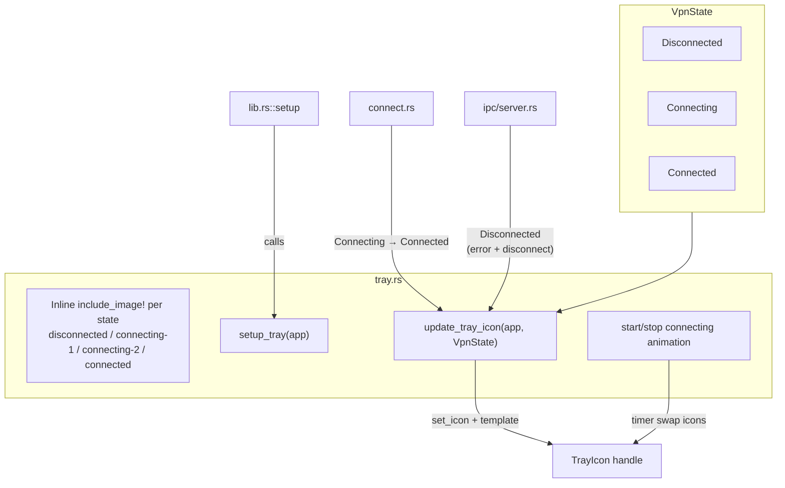

> **Status**: Completed at 2026-03-05T20:29:00+07:00
> **Branch**: feat/menu-bar-icon

---
task: "Menu Bar Icon -- 3 states with popover toggle and context menu placeholder"
milestone: "M5"
module: "M5.6"
created_at: "2026-03-05T20:01:00+07:00"
status: "completed"
branch: "feat/menu-bar-icon"
---

# PLAN -- M5.6: Menu Bar Icon

## 1. Context

### A. Problem Statement

The app currently uses the default 128x128 app icon as the tray icon and all tray logic is inlined in `lib.rs`. The tray icon must reflect 3 VPN states (disconnected, connecting, connected), and the `TrayIcon` handle must be accessible from backend modules to update dynamically during connect/disconnect flows.

### B. Current State

- **Tray setup**: inlined in `lib.rs` setup closure. `TrayIcon` stored as `_tray` (unused binding -- handle dropped at end of setup but Tauri keeps it alive internally via the builder)
- **Icon**: `app.default_window_icon()` -- the 128x128 app icon, not a proper menu bar icon
- **Left-click**: toggles popover visibility (working)
- **Right-click**: shows context menu with "Quit" item (working)
- **No icon state updates**: connect/disconnect flows do not touch the tray icon
- **Backend events**: `connect.rs` already emits `connect-progress` events via `app.emit()`

### C. Constraints

- macOS menu bar icons should be 22x22 points (44x44 pixels @2x) -- template images
- Template images: macOS auto-handles dark/light mode coloring
- No native animation API for tray icons -- must use timer-based icon swapping
- `TrayIcon` handle needs to be retrievable from `AppHandle` for state updates

### D. Verified Facts

| # | What was tested | Result | Decision |
| --- | --- | --- | --- |
| 1 | Tauri v2 `TrayIcon::set_icon(Option<Image>)` | Exists in tauri 2.10.3 | Use for dynamic icon updates |
| 2 | `TrayIcon::set_icon_as_template(bool)` | Exists, macOS only | Use for template icon rendering |
| 3 | `include_image!` macro | Compile-time PNG → RGBA embed, no feature flags needed | Use for icon constants |
| 4 | `TrayIconBuilder::new().id("main-tray")` | Can set custom ID for later retrieval via `app.tray_by_id()` | Use custom ID to retrieve handle |
| 5 | Tauri `image-png` feature | Required only for `Image::from_bytes()` / `Image::from_path()` at runtime | Not needed -- `include_image!` works without it |

### E. Unverified Assumptions

| # | Assumption | Risk | Fallback |
| --- | --- | --- | --- |
| 1 | `app.tray_by_id("main-tray")` returns the handle after setup | Low -- documented API | Store `TrayIcon` in Tauri managed state instead |
| 2 | Timer-based icon swap at 500ms creates smooth connecting animation | Low -- common macOS pattern | Adjust interval or use 2-frame vs 3-frame animation |

---

## 2. Architecture

### A. Diagram

### B. Decisions

1. **Template icons** -- macOS auto-handles dark/light mode. Single set of icons, no theme variants needed. Principle: Composition over Inheritance (reuse OS capability)
2. **Dedicated `tray.rs` module** -- extracts tray setup from `lib.rs`. Principle: Single Responsibility
3. **`include_image!` for icon embedding** -- compile-time, zero runtime cost, no feature flags. Principle: Fail Fast (missing icon = compile error)
4. **`tray_by_id()` for handle retrieval** -- avoids adding `TrayIcon` to managed state. Uses Tauri's built-in registry
5. **Timer-based connecting animation** -- 500ms interval swapping between 2 icon frames. Stopped when state transitions to Connected or Disconnected

### C. Boundaries

| File | Responsibility |
| --- | --- |
| `src-tauri/icons/tray/*.png` | Icon assets (22x22 template PNGs) |
| `src-tauri/src/tray.rs` | Tray setup, inline `include_image!` per state, state update function, animation timer |
| `src-tauri/src/lib.rs` | Calls `tray::setup_tray(app)` in setup closure |
| `src-tauri/src/server_lifecycle/connect.rs` | Calls tray update on state transitions (Connecting, Connected) |
| `src-tauri/src/ipc/server.rs` | Calls tray update on Disconnected (connect error path + disconnect success) |

---

## 3. Steps

### Step 1: Create tray icon PNG assets

- [x] **Status**: completed at 2026-03-05T20:18:30+07:00
- **Scope**: `src-tauri/icons/tray/disconnected.png`, `src-tauri/icons/tray/connecting-1.png`, `src-tauri/icons/tray/connecting-2.png`, `src-tauri/icons/tray/connected.png`
- **Dependencies**: none
- **Description**: Create 22x22 pixel template icon PNGs (black on transparent). Disconnected: shield outline. Connecting frame 1: shield with single dot. Connecting frame 2: shield with two dots. Connected: shield filled. These are macOS template images -- the system handles color inversion for dark mode.
- **Acceptance Criteria**:
  - 4 PNG files at 22x22 pixels in `src-tauri/icons/tray/`
  - Black foreground on transparent background (template icon convention)
  - Visually distinguishable at menu bar size

### Step 2: Extract tray module with icon state management

- [x] **Status**: completed at 2026-03-05T20:23:00+07:00
- **Scope**: `src-tauri/src/tray.rs`, `src-tauri/src/lib.rs`
- **Dependencies**: Step 1
- **Description**: Create `tray.rs` module with: (a) icon constants via `include_image!`, (b) `VpnState` enum, (c) `setup_tray(app)` function that builds the tray icon with custom ID and all event handlers (migrated from `lib.rs`), (d) `update_tray_icon(app_handle, state)` function that sets the correct icon and manages connecting animation timer. Update `lib.rs` to call `tray::setup_tray(app)`.
- **Acceptance Criteria**:
  - `tray.rs` compiles with all icon constants loaded via `include_image!`
  - `setup_tray(app)` creates tray with ID `"main-tray"`, left-click popover toggle, right-click context menu
  - `update_tray_icon(app_handle, VpnState)` sets correct icon per state
  - Connecting state starts a timer that swaps between 2 animation frames at 500ms
  - Connected/Disconnected state stops any running animation timer
  - `lib.rs` setup closure calls `tray::setup_tray(app)` instead of inline tray code
  - `cargo check` passes

### Step 3: Wire icon updates to connect/disconnect flows

- [x] **Status**: completed at 2026-03-05T20:27:30+07:00
- **Scope**: `src-tauri/src/server_lifecycle/connect.rs`, `src-tauri/src/ipc/server.rs`
- **Dependencies**: Step 2
- **Description**: Add `tray::update_tray_icon()` calls at state transition points: (a) connect flow start → `Connecting` (in connect.rs), (b) connect flow success → `Connected` (in connect.rs), (c) connect flow failure → `Disconnected` (in ipc/server.rs error path), (d) disconnect flow completion → `Disconnected` (in ipc/server.rs). Disconnected transitions placed at IPC layer because `ServerLifecycle::disconnect()` has no `AppHandle` parameter -- the IPC handler is the natural boundary where `AppHandle` is available.
- **Acceptance Criteria**:
  - Connect start sets tray icon to `Connecting` (animated)
  - Connect success sets tray icon to `Connected`
  - Connect failure (auto-cleanup) sets tray icon to `Disconnected`
  - Disconnect completion sets tray icon to `Disconnected`
  - No icon update on error paths that don't change VPN state
  - `cargo check` passes

### Step 4: Verify build and icon rendering

- [x] **Status**: completed at 2026-03-05T20:29:00+07:00
- **Scope**: Full project build verification
- **Dependencies**: Step 3
- **Description**: Run `cargo build` to verify compilation. Run `cargo clippy` for lint. Verify the tray module is properly integrated.
- **Acceptance Criteria**:
  - `cargo build` succeeds
  - `cargo clippy` passes with no warnings in `tray.rs`
  - `cargo test` passes (no regressions)

---

## 4. Execution Strategy

| Step | Chain | Rationale |
| --- | --- | --- |
| 1 | Direct | Asset creation -- programmatic PNG generation via script |
| 2 | scout → worker | Module extraction + new file creation, needs existing code context |
| 3 | scout → worker | Wiring into existing files, needs to understand current connect/disconnect flow |
| 4 | Direct | Build verification commands |

**Execution order**: Step 1 → Step 2 → Step 3 → Step 4 (strictly sequential)

**Estimated complexity**:

| Step | Tier | Notes |
| --- | --- | --- |
| 1 | Trivial | Script-generated PNG assets |
| 2 | Medium | New module + refactor `lib.rs` + animation timer logic |
| 3 | Simple | Add function calls at known locations |
| 4 | Trivial | Build commands |

**Risk flags**:

- Step 2: Animation timer management (start/stop) needs careful lifecycle handling to avoid leaks. The timer must be stored in a way that `update_tray_icon` can cancel it.

---
