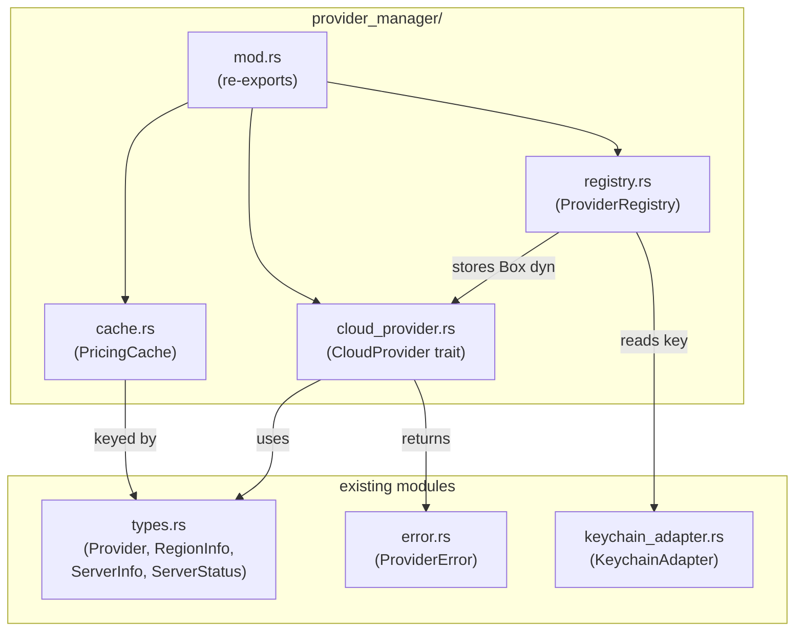

> **Status**: Completed at 2026-03-04T21:51:00+07:00
> **Branch**: feature/provider-manager-core

# M2.1: CloudProvider Trait + Provider Manager Core

## 1. Context

### A. Problem Statement

Provider Manager는 Hetzner, AWS, GCP 3개 클라우드 프로바이더를 단일 인터페이스로 추상화하는 핵심 모듈이다. M2.1은 이 모듈의 뼈대를 구축한다 -- CloudProvider trait 정의, ProviderRegistry (provider 인스턴스 관리), PricingCache (TTL 기반 가격 캐시), 공유 타입 정의.

### B. Current State

- `provider_manager.rs` -- doc comment만 존재 (빈 파일)
- `types.rs` -- `Provider` enum (Hetzner/Aws/Gcp) + serde + `service_name()` 이미 존재
- `error.rs` -- `ProviderError` enum + `From<ProviderError> for AppError` 이미 구현
- `keychain_adapter.rs` -- 완전 구현 (store/retrieve/delete/list)
- `ipc/provider.rs` -- 4개 IPC stub (NOT_IMPLEMENTED 반환)
- `Cargo.toml` -- `tokio`와 `async-trait` 미포함

### C. Constraints

- `provider_manager.rs` 단일 파일 → `provider_manager/` 디렉토리 모듈로 전환 필요
- `lib.rs`에서 `mod provider_manager`로 이미 참조 중 -- 모듈 전환 시 호환 유지
- M2.2~M2.4 (개별 provider 구현)에 의존하지 않아야 함 -- trait만 정의

### D. Input Sources

- API Design §4.F -- CloudProvider trait 정의 (7 async methods, ServerInfo, ServerStatus)
- API Design §4.A -- 공유 타입 (RegionInfo, ProviderInfo, ProviderStatus)
- Data Model §4.C -- PricingCache 스키마 (RegionPricing, TTL 3600s)
- Architecture containers.md §3.B -- Provider Manager 모듈 설명

### E. Verified Facts

| What | Result |
| --- | --- |
| `async-trait v0.1.89` 추가 가능 | `cargo add async-trait --dry-run` 성공 |
| `Provider` enum이 `Hash` derive | `HashMap<Provider, _>` 키로 사용 가능 확인 |
| `KeychainAdapter`는 stateless | `retrieve_credential(provider)` → `Option<Credential>` |
| `lib.rs`에서 `mod provider_manager` 선언 | 디렉토리 모듈 전환 시 `mod.rs` 생성으로 호환 |

### F. Unverified Assumptions

| Assumption | Risk | Fallback |
| --- | --- | --- |
| `tokio` time feature로 `Instant` 사용 | Low -- tokio는 Tauri의 표준 async runtime | `std::time::Instant` 사용 (tokio 불필요 시) |

---

## 2. Architecture

### A. Diagram



### B. Decisions

1. **Directory module** -- `provider_manager.rs` → `provider_manager/mod.rs` + 3 submodules. Single Responsibility 원칙.
2. **Shared types in `types.rs`** -- `RegionInfo`, `ServerInfo`, `ServerStatus`, `ProviderInfo`, `ProviderStatus`는 IPC layer에서도 사용. `types.rs`에 배치.
3. **`async-trait` crate** -- CloudProvider의 7개 async method 지원.
4. **`std::time::Instant` for TTL** -- PricingCache TTL 체크에 사용. tokio 의존 없이 std만으로 충분.
5. **`ProviderRegistry`는 `HashMap<Provider, Box<dyn CloudProvider>>`** -- Dependency Inversion. 구체 타입 모름.
6. **PricingCache stale fallback** -- API 실패 시 expired 데이터 반환 + warning flag.

### C. Boundaries

| File | Responsibility |
| --- | --- |
| `cloud_provider.rs` | Trait 정의만 (구현 없음) |
| `registry.rs` | Provider 등록/조회/제거, API key Keychain 연동 |
| `cache.rs` | In-memory 가격 캐시, TTL 검사, stale fallback |
| `types.rs` (기존) | 공유 타입 추가 |
| `error.rs` (기존) | 변경 없음 (ProviderError 이미 완비) |

---

## 3. Steps

### Step 1: Add dependencies and convert to directory module

- [x] **Status**: completed at 2026-03-04T21:47:00+07:00
- **Scope**: `src-tauri/Cargo.toml`, `src-tauri/src/provider_manager.rs` → `src-tauri/src/provider_manager/mod.rs`
- **Dependencies**: none
- **Description**: `async-trait` 크레이트를 Cargo.toml에 추가. `provider_manager.rs`를 삭제하고 `provider_manager/mod.rs`로 전환. `lib.rs`에서 `#[allow(unused)]` 유지.
- **Acceptance Criteria**:
  - `cargo check` 통과
  - `provider_manager/mod.rs` 존재, 기존 doc comment 유지
  - `async-trait` dependency 확인

### Step 2: Add shared types to `types.rs`

- [x] **Status**: completed at 2026-03-04T21:48:00+07:00
- **Scope**: `src-tauri/src/types.rs`
- **Dependencies**: Step 1
- **Description**: API Design §4.A의 `RegionInfo`, `ProviderInfo`, `ProviderStatus`와 §4.F의 `ServerInfo`, `ServerStatus`를 `types.rs`에 추가. 모두 `Serialize`, `Deserialize` derive. `ServerStatus`는 `Clone`, `PartialEq` 추가.
- **Acceptance Criteria**:
  - `RegionInfo` -- region, display_name, instance_type, hourly_cost 필드
  - `ServerInfo` -- server_id, public_ip, status 필드
  - `ServerStatus` enum -- Provisioning, Running, Deleting
  - `ProviderInfo` -- provider, status, account_label 필드
  - `ProviderStatus` enum -- Valid, Invalid, Unchecked
  - `cargo check` 통과

### Step 3: Define CloudProvider trait

- [x] **Status**: completed at 2026-03-04T21:49:00+07:00
- **Scope**: `src-tauri/src/provider_manager/cloud_provider.rs`, `src-tauri/src/provider_manager/mod.rs`
- **Dependencies**: Step 2
- **Description**: API Design §4.F의 CloudProvider async trait 정의. 7개 메서드 -- `validate_credential`, `list_regions`, `create_ssh_key`, `delete_ssh_key`, `create_server`, `destroy_server`, `get_server`. `Send + Sync` bound. `mod.rs`에서 re-export.
- **Acceptance Criteria**:
  - `#[async_trait]` 매크로 적용
  - 모든 메서드가 `&self`와 `api_key: &str` 파라미터 포함
  - 반환 타입이 `Result<T, ProviderError>`
  - `mod.rs`에서 `pub use cloud_provider::CloudProvider` 노출
  - `cargo check` 통과

### Step 4: Implement PricingCache

- [x] **Status**: completed at 2026-03-04T21:49:00+07:00
- **Scope**: `src-tauri/src/provider_manager/cache.rs`, `src-tauri/src/provider_manager/mod.rs`
- **Dependencies**: Step 2
- **Description**: Data Model §4.C의 PricingCache 구현. `HashMap<Provider, CacheEntry>` 구조. CacheEntry에 `regions: Vec<RegionInfo>`, `fetched_at: Instant`, `ttl: Duration` 포함. `get()` -- TTL 미만이면 Some, 초과면 None. `get_stale()` -- TTL 무관하게 반환. `set()` -- 캐시 갱신. `invalidate()` -- 특정 provider 캐시 삭제.
- **Acceptance Criteria**:
  - `PricingCache::new()` 생성, default TTL 3600초
  - `set(provider, regions)` -- 캐시 저장
  - `get(provider)` -- TTL 내 데이터 반환, 초과 시 None
  - `get_stale(provider)` -- TTL 무관 반환 (stale fallback용)
  - `invalidate(provider)` -- 특정 provider 삭제
  - 단위 테스트: set → get (fresh), TTL 만료 후 get → None, get_stale → Some
  - `cargo check` 및 `cargo test` 통과

### Step 5: Implement ProviderRegistry

- [x] **Status**: completed at 2026-03-04T21:50:00+07:00
- **Scope**: `src-tauri/src/provider_manager/registry.rs`, `src-tauri/src/provider_manager/mod.rs`
- **Dependencies**: Step 3, Step 4
- **Description**: `ProviderRegistry`는 `HashMap<Provider, Box<dyn CloudProvider>>`로 provider 인스턴스를 관리. `register(provider, impl)` -- 등록. `get(provider)` -- trait object 참조 반환. `remove(provider)` -- 제거. `list()` -- 등록된 provider 목록 반환. PricingCache를 내부에 소유. `mod.rs`에서 re-export.
- **Acceptance Criteria**:
  - `ProviderRegistry::new()` 생성
  - `register(provider, Box<dyn CloudProvider>)` -- provider 등록
  - `get(provider)` -- `Option<&dyn CloudProvider>` 반환
  - `remove(provider)` -- 제거 + PricingCache invalidate
  - `list()` -- `Vec<Provider>` 반환
  - `cache()` / `cache_mut()` -- PricingCache 접근
  - API key를 메모리에 캐싱하지 않음 -- 매 호출 시 KeychainAdapter에서 조회
  - `cargo check` 통과

### Step 6: Verify full compilation and run tests

- [x] **Status**: completed at 2026-03-04T21:51:00+07:00
- **Scope**: full project
- **Dependencies**: Step 5
- **Description**: `cargo check` + `cargo test` 전체 통과. `cargo clippy` 경고 0.
- **Acceptance Criteria**:
  - `cargo check` 통과
  - `cargo test` 통과 (PricingCache 단위 테스트 포함)
  - `cargo clippy` 경고 없음

---

## 4. Execution Strategy

| Step | Chain | Rationale |
| --- | --- | --- |
| 1 | Direct | Cargo.toml 수정 + 파일 이동, 단순 작업 |
| 2 | scout → worker | types.rs에 기존 패턴 참고하여 타입 추가 |
| 3 | scout → worker | API Design 스펙 기반 trait 정의 |
| 4 | scout → worker → reviewer | 캐시 로직 + 단위 테스트, 정확성 검증 필요 |
| 5 | scout → worker → reviewer | Registry 설계 + trait object 관리, 리뷰 필요 |
| 6 | Direct | 최종 검증만 |

### A. Execution Order

```plain
Step 1 → Step 2 → Step 3 ─┐
                   Step 4 ─┤ (parallel after Step 2)
                           └→ Step 5 → Step 6
```

### B. Estimated Complexity

| Step | Tier | Tokens |
| --- | --- | --- |
| 1 | Trivial | ~5K |
| 2 | Simple | ~10K |
| 3 | Simple | ~15K |
| 4 | Medium | ~25K |
| 5 | Medium | ~25K |
| 6 | Trivial | ~5K |

### C. Risk Flags

- **Step 4**: TTL 테스트에서 시간 의존성 -- `std::time::Instant`는 mock 불가. 짧은 TTL (1ms)로 테스트하거나 내부에 `is_expired` 로직을 분리하여 테스트 가능하게 설계.
- **Step 5**: `Box<dyn CloudProvider>`의 `Send + Sync` bound -- `async-trait`이 자동으로 처리하지만 컴파일 시 확인 필요.
