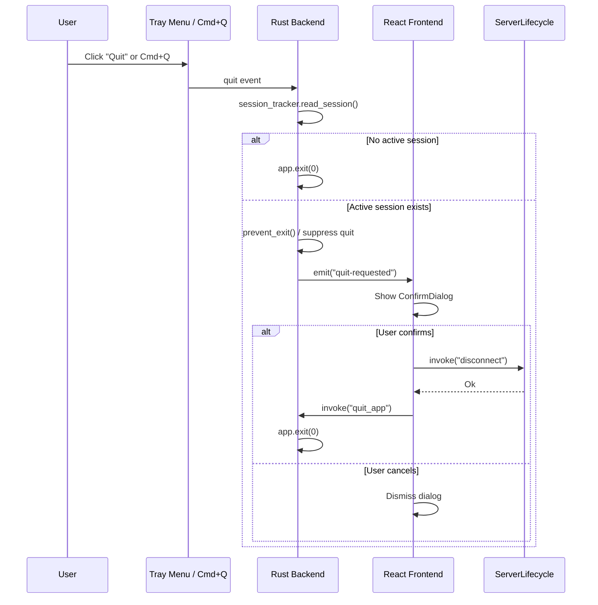

> **Status**: Completed at 2026-03-06T01:23:00+07:00
> **Branch**: feat/quit-while-connected
> **Steps completed**: 4/4

# PLAN -- M6.4: Quit-While-Connected Handler

## 1. Context

### A. Problem Statement

When the user quits the app (tray context menu "Quit" or Cmd+Q) while a VPN session is active, the app exits immediately without tearing down the WireGuard tunnel or destroying the cloud server. This creates orphaned servers (ongoing cost) and leaves the tunnel active without user awareness.

### B. Current State

- **`lib.rs`**: Uses `Builder::run()` which internally calls `build()?.run(|_, _| {})` -- no `RunEvent` handler exists
- **`tray.rs`**: Uses `PredefinedMenuItem::quit` which triggers immediate app termination
- **`ServerLifecycle::disconnect()`**: Complete disconnect flow already exists (tunnel down → destroy server → verify → cleanup)
- **`ConfirmDialog`**: Reusable React component exists from M5.5 with blur overlay, Cancel/Destroy buttons, keyboard support
- **`session_tracker.read_session()`**: Synchronous file I/O -- can check active session in sync context
- **`ConnectedView`**: Already uses ConfirmDialog for manual disconnect -- same UX pattern to reuse

### C. Constraints

- `RunEvent::ExitRequested` callback is synchronous -- cannot run async disconnect inside it
- Must cover both Cmd+Q (system shortcut via `RunEvent`) and tray Quit (menu event)
- Cross-cutting concepts §9 requires confirmation dialog before quit-while-connected

### D. Verified Facts

| # | What was tested | Result | Decision |
| --- | --- | --- | --- |
| 1 | Tauri 2 `RunEvent::ExitRequested` API | `ExitRequestApi::prevent_exit()` method confirmed in tauri 2.10.3 source | Use `build()` + `App::run()` pattern to intercept |
| 2 | `PredefinedMenuItem::quit` behavior | Triggers `RunEvent::ExitRequested` internally | Intercept via `RunEvent` handler for Cmd+Q coverage |
| 3 | Current `lib.rs` `Builder::run()` | Calls `self.build(context)?.run(\|_, _\| {})` -- empty handler | Must switch to explicit `build()` + `run()` |
| 4 | `session_tracker.read_session()` is sync | File I/O only, no async | Can call directly in `RunEvent` callback (sync context) |
| 5 | `AppHandle::state::<T>()` available in `run()` callback | `run()` receives `&AppHandle` as first argument | Can access `ServerLifecycle` state in `RunEvent` handler |

### E. Unverified Assumptions

| # | Assumption | Why not verified | Risk | Fallback |
| --- | --- | --- | --- | --- |
| 1 | `prevent_exit()` followed by later `app.exit(0)` works correctly | Requires runtime test | Low -- official Tauri API | Use `std::process::exit(0)` |

---

## 2. Architecture

### A. Diagram

### B. Decisions

| Decision | Alternatives considered | Rationale | Principle |
| --- | --- | --- | --- |
| Replace `PredefinedMenuItem::quit` with custom `MenuItem` | Keep predefined + intercept only via `RunEvent` | Custom MenuItem gives direct control in `on_menu_event`; `RunEvent::ExitRequested` covers Cmd+Q separately | Explicit over Implicit |
| Dual interception (tray menu + `RunEvent::ExitRequested`) | Single interception point | Cmd+Q triggers `RunEvent` not the tray menu event -- both paths must be covered | Fail Fast |
| Frontend shows dialog, backend checks session | Backend-only dialog (not possible in Tauri) | ConfirmDialog already exists as a React component; Tauri has no native confirm-before-quit API | Composition over Inheritance |
| Add `quit_app` IPC command | Use `@tauri-apps/api` `process.exit()` | IPC command ensures the exit goes through Tauri's managed lifecycle | Explicit over Implicit |

### C. Boundaries

| File | Responsibility |
| --- | --- |
| `src-tauri/src/ipc/app.rs` | New file -- `quit_app` IPC command |
| `src-tauri/src/ipc/mod.rs` | Add `pub mod app;` declaration |
| `src-tauri/src/lib.rs` | Switch to `build()` + `App::run()`, add `RunEvent::ExitRequested` handler, register `quit_app` |
| `src-tauri/src/tray.rs` | Replace `PredefinedMenuItem::quit` with custom `MenuItem`, emit "quit-requested" on active session |
| `src/App.tsx` | Listen for "quit-requested", show ConfirmDialog, orchestrate disconnect → quit |

### D. Trade-offs

| Option | Pros | Cons | Verdict |
| --- | --- | --- | --- |
| Backend-only quit interception | Simpler, no frontend involvement | No UI confirmation possible | Rejected -- violates cross-cutting §9 |
| Frontend-only (window close event) | Simple JS listener | Doesn't cover Cmd+Q or tray Quit | Rejected -- incomplete coverage |
| **Dual interception (backend + frontend dialog)** | Covers all quit paths, reuses ConfirmDialog | Two interception points to maintain | **Selected** -- complete coverage |

---

## 3. Steps

### Step 1: Add `quit_app` IPC command

- [x] **Status**: completed (2026-03-06T01:15:00+07:00)
- **Scope**: `src-tauri/src/ipc/app.rs` (new), `src-tauri/src/ipc/mod.rs`, `src-tauri/src/lib.rs` (invoke_handler registration)
- **Dependencies**: none
- **Description**: Create `quit_app` IPC command that calls `app_handle.exit(0)`. Register in `tauri::generate_handler!` macro. Add capability whitelist entry.
- **Acceptance Criteria**:
  - `quit_app` command exists in `ipc/app.rs` and calls `AppHandle::exit(0)`
  - Module declared in `ipc/mod.rs`
  - Registered in `generate_handler!` in `lib.rs`
  - `allow-quit-app` added to `src-tauri/capabilities/default.json` permissions array

### Step 2: Replace `PredefinedMenuItem::quit` with custom MenuItem and session-aware quit logic

- [x] **Status**: completed (2026-03-06T01:18:00+07:00)
- **Scope**: `src-tauri/src/tray.rs`
- **Dependencies**: Step 1
- **Description**: Replace `PredefinedMenuItem::quit(app, Some("Quit"))` with `MenuItem::with_id(app, "quit", "Quit", true, None::<&str>)`. In `on_menu_event`, handle `"quit"` by accessing `ServerLifecycle` state, calling `session_tracker.read_session()` -- if no session, `app.exit(0)`; if session active, show window and emit `"quit-requested"` event.
- **Acceptance Criteria**:
  - `PredefinedMenuItem::quit` replaced with custom `MenuItem`
  - Quit menu click checks for active session
  - No session → immediate `app.exit(0)`
  - Active session → window shown + `"quit-requested"` emitted to frontend

### Step 3: Add `RunEvent::ExitRequested` handler

- [x] **Status**: completed (2026-03-06T01:20:00+07:00)
- **Scope**: `src-tauri/src/lib.rs`
- **Dependencies**: Step 2
- **Description**: Switch from `Builder::run()` to `Builder::build()` + `App::run()`. In the `RunEvent::ExitRequested` handler, access `ServerLifecycle` state, check `session_tracker.read_session()` -- if active session exists, call `api.prevent_exit()`, show main window, emit `"quit-requested"`. If no session, let exit proceed normally.
- **Acceptance Criteria**:
  - `Builder` uses `build()` + `App::run()` instead of `Builder::run()`
  - `RunEvent::ExitRequested` checks for active session
  - Active session → `prevent_exit()` called, window shown, `"quit-requested"` emitted
  - No session → exit proceeds normally
  - Cmd+Q while connected triggers the confirmation flow

### Step 4: Frontend quit-requested listener and ConfirmDialog integration

- [x] **Status**: completed (2026-03-06T01:22:00+07:00)
- **Scope**: `src/App.tsx`
- **Dependencies**: Step 1, Step 2, Step 3
- **Description**: Add event listener for `"quit-requested"` in `App.tsx`. When received, show a ConfirmDialog (reuse existing component). On confirm: call `disconnect` IPC, then on success call `quit_app` IPC. On cancel: dismiss dialog. Handle disconnect errors with retry option.
- **Acceptance Criteria**:
  - `"quit-requested"` event triggers ConfirmDialog display
  - Confirm: `disconnect` IPC runs → success → `quit_app` IPC exits app
  - Cancel: dialog dismissed, session continues uninterrupted
  - Disconnect error: error shown with retry option
  - Dialog shows same text as ConnectedView disconnect: "Server will be destroyed. Continue?"

---

## 4. Execution Strategy

| Step | Chain | Rationale |
| --- | --- | --- |
| 1 | Direct | New file (~10 lines) + two small registration edits |
| 2 | Direct | Single file modification with clear requirements |
| 3 | Direct | Single file refactor, builds on step 2 pattern |
| 4 | Direct | Single file modification, reuses existing ConfirmDialog |

**Execution order**: Step 1 → Step 2 → Step 3 → Step 4 (sequential)

**Estimated complexity**:

| Step | Tier | Notes |
| --- | --- | --- |
| 1 | Trivial | New IPC command file + registration |
| 2 | Simple | Replace menu item + add session check logic |
| 3 | Simple | Refactor run() to build()+run(), add RunEvent handler |
| 4 | Simple | Add event listener + wire existing ConfirmDialog |

**Risk flags**:

- Step 3: `prevent_exit()` followed by later `app.exit(0)` -- unverified assumption #1 (low risk)

---
