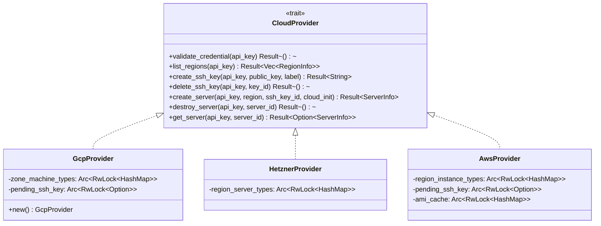

> **Status**: Completed at 2026-03-04T23:58:00+07:00
> **Branch**: feat/gcp-provider

# PLAN -- M2.4: GCP Provider

## 1. Context

### A. Problem Statement

Implement the GCP cloud provider module (`gcp.rs`) that fulfills the `CloudProvider` trait using the `google-cloud-compute-v1` Rust SDK. This is the third and final provider in M2, following the same trait interface already implemented by Hetzner (`hetzner.rs`) and AWS (`aws.rs`).

### B. Current State

- **CloudProvider trait**: 7 async methods defined in `src-tauri/src/provider_manager/cloud_provider.rs` -- `validate_credential`, `list_regions`, `create_ssh_key`, `delete_ssh_key`, `create_server`, `destroy_server`, `get_server`
- **Hetzner**: Fully implemented in `hetzner.rs` (~350 lines). Uses `hcloud` crate. Simple API -- bearer token auth, pricing from `/pricing` endpoint, region → cheapest server type cache
- **AWS**: Fully implemented in `aws.rs` (~600 lines). Uses `aws-sdk-ec2` + `aws-sdk-pricing`. Compound credentials format (`ACCESS_KEY:SECRET_KEY`), deferred SSH key import pattern, compound server_id (`region/instance_id/sg_id`), security group management
- **Registry**: `ProviderRegistry` in `registry.rs` stores `Box<dyn CloudProvider>` keyed by `Provider` enum (which already has `Provider::Gcp`)
- **Types**: `RegionInfo`, `ServerInfo`, `ServerStatus`, `Provider` defined in `types.rs`
- **Errors**: `ProviderError` enum in `error.rs` with all needed variants
- **mod.rs**: Currently exports `HetznerProvider`, `AwsProvider`, `PricingCache`, `CloudProvider`, `ProviderRegistry` -- needs `GcpProvider` added

### C. Constraints

- Must follow identical trait contract as Hetzner/AWS implementations
- GCP uses zone-scoped operations (not region-scoped like AWS)
- GCP SSH keys are managed via project/instance metadata (not key pairs like AWS/Hetzner)
- GCP firewall rules are network-level (similar to AWS security groups but different API)
- GCP Compute operations return Long Running Operations (LROs) -- the SDK handles polling internally
- Service Account JSON stored as single string in Keychain (similar to AWS compound credential pattern)

### D. Input Sources

- Milestone: `docs/milestone/2026-03-04-1726-milestone.md` §M2.4
- API Design: `docs/api-design/2026-03-04-1726-api-design.md` §4.F (CloudProvider trait)
- ADR-0002: `docs/adr/0002-use-rust-sdk-for-cloud-providers.md`
- ADR-0005: `docs/adr/0005-use-provider-pricing-api.md`
- Cross-cutting: `docs/architecture/cross-cutting-concepts.md` §6.B (cloud-init provider variation)

### E. Verified Facts

1. **Crate availability and compilation**
   - Tested: `cargo add google-cloud-compute-v1@2.2 google-cloud-auth@1.6` + `cargo check`
   - Result: Compiles cleanly with features `[firewalls, machine-types, zones, images, instances, projects]`
   - Decision: Use `google-cloud-compute-v1 = { version = "2.2", features = ["firewalls", "machine-types", "zones", "images"] }` (instances + projects are default features)

2. **Authentication from Service Account JSON**
   - Tested: docs.rs API for `google-cloud-auth::credentials::service_account::Builder`
   - Result: `Builder::new(serde_json::Value).build()` creates `Credentials` from JSON directly -- no temp file needed
   - Decision: Store full Service Account JSON string in Keychain, parse with `serde_json::from_str`, pass to `Builder::new()`

3. **Client initialization with credentials**
   - Tested: docs.rs API for `ClientBuilder::with_credentials()`
   - Result: Each client (Instances, Firewalls, MachineTypes, Zones) supports `.builder().with_credentials(creds).build().await`
   - Decision: Build separate clients per operation, passing credentials each time (no stored state)

4. **Available client types**
   - Tested: docs.rs module listing for `google_cloud_compute_v1::client`
   - Result: `Instances` (insert/delete/get/list), `Firewalls` (insert/delete), `MachineTypes` (list), `Zones` (list), `Projects` (get), `Images` (list)
   - Decision: Use `Instances` for server CRUD, `Firewalls` for firewall rules, `MachineTypes` for pricing, `Zones` for zone listing

5. **Instance operations are LROs**
   - Tested: docs.rs -- `Instances::insert()` returns an operation, not an instance directly
   - Result: The `google-cloud-lro` crate handles LRO polling automatically
   - Decision: Rely on SDK's built-in LRO polling; add manual polling as fallback for status verification

### F. Unverified Assumptions

1. **MachineTypes pricing via `guest_cpus` and zone listing**
   - Assumption: `MachineTypes::list()` per zone returns `guest_cpus` field that can determine e2-micro, and we can derive hourly cost from the response
   - Risk: **Medium** -- GCP pricing is complex; MachineTypes may not include hourly cost directly
   - Fallback: Use hardcoded e2-micro pricing per zone (GCP pricing rarely changes for e2-micro), or use Cloud Billing Catalog API (would need additional crate)

2. **Firewall rule creation API shape**
   - Assumption: `Firewalls::insert()` accepts a `Firewall` model with `allowed` rules specifying protocol/ports and `source_ranges` for CIDR
   - Risk: **Low** -- this is standard GCP Compute API, well-documented
   - Fallback: Use `gcloud` CLI invocation as last resort

3. **SSH key via instance metadata**
   - Assumption: SSH keys can be set via instance metadata field `ssh-keys` in the `Metadata` struct during `Instances::insert()`
   - Risk: **Low** -- this is the standard GCP approach for non-OS Login setups
   - Fallback: Use project-level metadata instead of instance-level

4. **Ubuntu image discovery**
   - Assumption: `Images::list()` with project `ubuntu-os-cloud` and filter for `ubuntu-2404` returns available images
   - Risk: **Low** -- canonical approach for GCP image discovery
   - Fallback: Hardcode the image family `ubuntu-2404-lts-amd64`

---

## 2. Architecture

### A. Diagram



### B. Decisions

1. **Deferred SSH key pattern** (same as AWS): `create_ssh_key` caches key material internally; actual metadata injection happens in `create_server` where the zone is known. Returns `pending/{label}` synthetic ID.
   - Rationale: The trait's `create_ssh_key` has no zone parameter, but GCP SSH keys are injected as instance metadata at creation time. (Principle: Composition over Inheritance -- reuse the same pattern AWS established)

2. **Compound server_id**: `{project_id}/{zone}/{instance_name}/{firewall_name}`
   - Rationale: GCP operations require project + zone + instance name. Firewall name needed for cleanup. Same pattern as AWS's `region/instance_id/sg_id`. (Principle: Explicit over Implicit)

3. **Compound key_id**: `pending/{label}` or `{project_id}/{zone}/{label}` (after injection)
   - Rationale: SSH keys are instance metadata in GCP -- "deletion" means the instance is destroyed. Pending keys clear internal cache.

4. **Credentials format**: Full Service Account JSON string stored in Keychain
   - Rationale: GCP Service Account JSON contains project_id, client_email, and private_key -- all needed for authentication. Stored as single string, parsed per call. (Principle: Fail Fast -- parse validates JSON structure)

5. **Zone-based regions**: List zones (not regions) as the selectable unit, since GCP pricing varies per zone
   - Rationale: GCP machine type availability and pricing are zone-specific. Displaying zones gives accurate pricing. Display format: `us-central1-a` → `Iowa, US (us-central1-a)`

6. **e2-micro as default instance type**: Hardcode `e2-micro` for MVP (cheapest general-purpose)
   - Rationale: Unlike Hetzner (which discovers cheapest via pricing API) or AWS (fixed t3.nano), GCP's cheapest varies less. e2-micro is free-tier eligible and available in all zones. Pricing can be fetched from MachineTypes API.

### C. Boundaries

| Scope | Responsibility |
| --- | --- |
| `src-tauri/src/provider_manager/gcp.rs` | All GCP CloudProvider implementation, helpers, unit tests, integration tests |
| `src-tauri/src/provider_manager/mod.rs` | Add `mod gcp;` and `pub use gcp::GcpProvider;` |
| `src-tauri/Cargo.toml` | Add `google-cloud-compute-v1` and `google-cloud-auth` dependencies |

### D. Trade-offs

- **MachineTypes API vs Cloud Billing API for pricing**: MachineTypes may not include direct hourly USD cost. Cloud Billing requires a separate crate. Decision: try MachineTypes first; if no pricing data, use hardcoded e2-micro prices as fallback (ADR-0005 prefers API but accepts cache/fallback).
- **Instance-level vs project-level SSH metadata**: Instance-level is cleaner (no side effects on other instances) but requires setting metadata at creation time. Decision: instance-level (aligns with ephemeral pattern in ADR-0004).

---

## 3. Steps

### Step 1: Add dependencies to Cargo.toml

- [x] **Status**: completed at 2026-03-04T23:22:00+07:00
- **Scope**: `src-tauri/Cargo.toml`
- **Dependencies**: none
- **Description**: Add `google-cloud-compute-v1` and `google-cloud-auth` crates with required features. Run `cargo check` to verify compilation.
- **Acceptance Criteria**:
  - `google-cloud-compute-v1 = { version = "2.2", features = ["firewalls", "machine-types", "zones", "images"] }` in Cargo.toml
  - `google-cloud-auth = "1.6"` in Cargo.toml
  - `cargo check` passes

### Step 2: Implement GcpProvider struct and helpers

- [x] **Status**: completed at 2026-03-04T23:25:00+07:00
- **Scope**: `src-tauri/src/provider_manager/gcp.rs`, `src-tauri/src/provider_manager/mod.rs`
- **Dependencies**: Step 1
- **Description**: Create `gcp.rs` with `GcpProvider` struct, credential parsing helper (Service Account JSON → `Credentials`), client builder helpers, error mapping (`google-cloud-gax` errors → `ProviderError`), zone display name mapper, compound ID parsers, and server status mapper. Register module in `mod.rs`.
- **Acceptance Criteria**:
  - `GcpProvider` struct with `zone_machine_types: Arc<RwLock<HashMap<String, String>>>` and `pending_ssh_key: Arc<RwLock<Option<PendingSshKey>>>`
  - `parse_gcp_credentials(api_key: &str) -> Result<(serde_json::Value, String), ProviderError>` -- parses JSON, extracts project_id
  - `build_credentials(sa_json: &serde_json::Value) -> Result<Credentials, ProviderError>` -- builds auth credentials
  - `map_gcp_error<T: Debug>(error: T) -> ProviderError` -- maps SDK errors to ProviderError
  - `parse_compound_server_id` / `parse_compound_key_id` helpers
  - `get_zone_display_name(zone: &str) -> String` -- human-readable zone names
  - `mod.rs` updated with `mod gcp;` and `pub use gcp::GcpProvider;`
  - `cargo check` passes

### Step 3: Implement validate_credential and list_regions

- [x] **Status**: completed at 2026-03-04T23:32:00+07:00
- **Scope**: `src-tauri/src/provider_manager/gcp.rs`
- **Dependencies**: Step 2
- **Description**: Implement `validate_credential` (call `Projects::get` or `Instances::list` to verify API key) and `list_regions` (list zones, query MachineTypes per zone for e2-micro pricing, populate zone_machine_types cache).
- **Acceptance Criteria**:
  - `validate_credential`: parses SA JSON, builds credentials, calls GCP API to verify access
  - `list_regions`: returns zones with e2-micro hourly cost, sorted ascending
  - Zone-to-machine-type cache populated during `list_regions`
  - Unit tests for credential parsing and zone display names

### Step 4: Implement SSH key management (create_ssh_key, delete_ssh_key)

- [x] **Status**: completed at 2026-03-04T23:35:00+07:00
- **Scope**: `src-tauri/src/provider_manager/gcp.rs`
- **Dependencies**: Step 2
- **Description**: Implement deferred SSH key pattern -- `create_ssh_key` caches key material (same as AWS pattern), `delete_ssh_key` clears cache for pending keys.
- **Acceptance Criteria**:
  - `create_ssh_key` returns `pending/{label}` and caches public key material
  - `delete_ssh_key` with `pending/` prefix clears internal cache without API call
  - Unit tests verify pending key cache behavior

### Step 5: Implement create_server

- [x] **Status**: completed at 2026-03-04T23:48:00+07:00
- **Scope**: `src-tauri/src/provider_manager/gcp.rs`
- **Dependencies**: Step 3, Step 4
- **Description**: Implement full server provisioning flow: parse SA JSON → build credentials → create firewall rule (WireGuard UDP 51820) → resolve Ubuntu image → insert instance with startup-script metadata and SSH key metadata → poll until RUNNING → return ServerInfo with compound ID.
- **Acceptance Criteria**:
  - Creates firewall rule allowing UDP 51820 from 0.0.0.0/0
  - Resolves latest Ubuntu 24.04 image from `ubuntu-os-cloud` project
  - Instance created with e2-micro type, startup-script metadata (cloud_init), SSH key in metadata
  - Polls instance until RUNNING status (max 120s)
  - Returns `ServerInfo` with compound ID `{project_id}/{zone}/{instance_name}/{firewall_name}`
  - Cleanup on failure: delete firewall if created, delete instance if created
  - Instance named `oh-my-vpn-{timestamp}`, firewall named `oh-my-vpn-{timestamp}`

### Step 6: Implement destroy_server and get_server

- [x] **Status**: completed at 2026-03-04T23:53:00+07:00
- **Scope**: `src-tauri/src/provider_manager/gcp.rs`
- **Dependencies**: Step 2
- **Description**: Implement `destroy_server` (delete instance + delete firewall rule) and `get_server` (check instance existence and status).
- **Acceptance Criteria**:
  - `destroy_server`: deletes instance, then deletes firewall rule (best-effort with retries)
  - `get_server`: returns `Some(ServerInfo)` if instance exists, `None` if not found (TERMINATED treated as None)
  - Compound server_id parsed correctly for all operations

### Step 7: Integration tests and final verification

- [x] **Status**: completed at 2026-03-04T23:58:00+07:00
- **Scope**: `src-tauri/src/provider_manager/gcp.rs`
- **Dependencies**: Step 5, Step 6
- **Description**: Add `#[ignore]` integration tests gated by `GCP_TEST_CREDENTIALS` env var. Run `cargo check`, `cargo test` (unit tests only), `cargo clippy`.
- **Acceptance Criteria**:
  - Integration tests: `test_validate_credential_valid`, `test_validate_credential_invalid`, `test_list_regions`, `test_server_create_destroy`
  - All unit tests pass with `cargo test`
  - `cargo clippy` passes with no warnings
  - `cargo check` passes

---

## 4. Execution Strategy

| Step | Chain | Rationale |
| --- | --- | --- |
| 1 | Direct | Single config file change |
| 2 | scout → worker | Scaffolding needs codebase context for consistent patterns |
| 3 | scout → worker | SDK API research needed + implementation |
| 4 | Direct | Small, follows established AWS pattern exactly |
| 5 | scout → worker → reviewer | Most complex step -- server provisioning with cleanup logic |
| 6 | scout → worker | Moderate complexity, follows existing patterns |
| 7 | Direct | Test writing + verification commands |

### A. Execution Order

```plain
Step 1 → Step 2 → Step 3 → Step 4 → Step 5 → Step 6 → Step 7
```

All sequential -- single file constraint (`gcp.rs`) makes parallel execution impractical. Steps 3 and 4 could theoretically be parallel but share the same file.

### B. Estimated Complexity

| Step | Tier | Est. Lines |
| --- | --- | --- |
| 1 | Trivial | ~3 |
| 2 | Medium | ~120 |
| 3 | Medium | ~100 |
| 4 | Simple | ~40 |
| 5 | Complex | ~200 |
| 6 | Medium | ~80 |
| 7 | Simple | ~100 |

Total: ~640 lines in `gcp.rs` (comparable to AWS's ~600 lines)

### C. Risk Flags

- **Step 3 (list_regions)**: GCP pricing from MachineTypes API may not include hourly cost directly. May need fallback to hardcoded prices or Cloud Billing API.
- **Step 5 (create_server)**: LRO handling for instance creation -- SDK should handle this but may need manual polling. Metadata format for SSH keys and startup-script needs exact field names.

### D. Single-File Constraint

Steps 2--7 all modify `gcp.rs`. Resolution: **Sequential Direct** -- steps have distinct acceptance criteria and build incrementally. Each step appends to the file without conflicting with previous steps.
