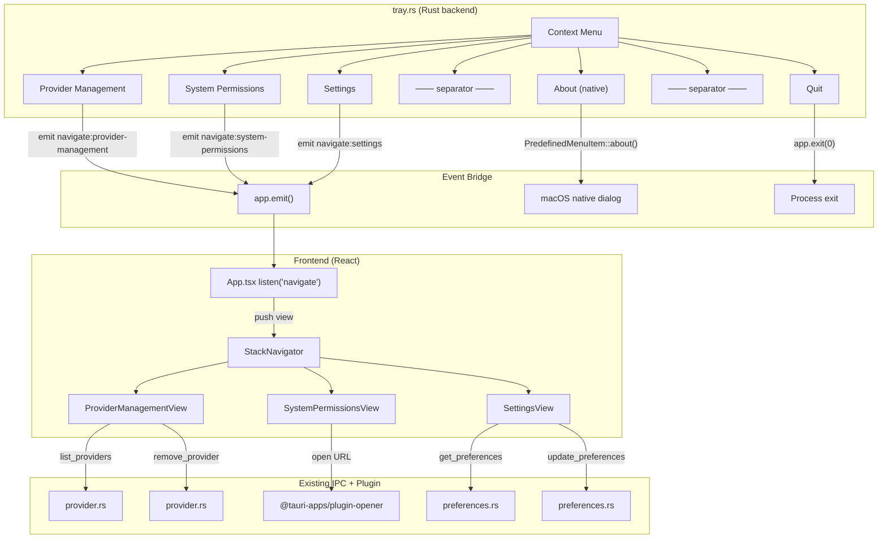

> **Status**: Completed at 2026-03-06T00:34:00+07:00
> **Branch**: feat/context-menu-settings
> **Steps completed**: 5/5

# PLAN: M6.3 -- Context Menu + Settings View

## 1. Context

### A. Problem Statement

M6.3 adds the right-click context menu to the system tray and two new popover views (Provider Management, Settings). Currently the tray only has a single "Quit" menu item. The UX design specifies 5 context menu entries: Provider Management, System Permissions, Settings, About, and Quit. Provider Management and Settings open within the popover via stack navigation. About uses macOS native dialog. System Permissions opens macOS System Settings.

### B. Current State

- **Tray module** (`src-tauri/src/tray.rs`): Functional with left-click popover toggle and right-click showing a single "Quit" `MenuItem`. Uses `on_menu_event` to handle quit. VPN state icon animation (disconnected/connecting/connected) works.
- **Frontend navigation**: `NavigationProvider` with `push`/`pop`/`reset` in `stack-context.tsx`. `StackNavigator` renders views with CSS push/pop transitions. All existing views (Disconnected, Connected, Provisioning, Onboarding) use this pattern.
- **Preferences IPC** (M6.2 -- completed): `get_preferences` and `update_preferences` commands functional. `UserPreferences` has `notifications_enabled: bool` and `keyboard_shortcut: Option<String>`.
- **Provider IPC** (M2.5 -- completed): `list_providers`, `register_provider`, `remove_provider` commands functional.
- **Event system**: Frontend uses `listen()` from `@tauri-apps/api/event` (see `ProvisioningView.tsx`). Backend can emit events via `app.emit()` (Tauri `Emitter` trait).
- **Existing components**: `GlassButton`, `GlassInput`, `ConfirmDialog`, `ProviderSelector`, `RegionList` -- all Liquid Glass styled.

### C. Constraints

- Context menu is a native Tauri system tray menu -- not a popover view (UX Design §2.B)
- No separate windows -- everything resolves within the menu bar popover (UX Design §2.B)
- System Permissions is informational only -- shows sudo status, no programmatic permission management (Cross-cutting §10)
- macOS only (Tauri desktop, no mobile)

### D. Verified Facts

| # | What was tested | Result | Decision |
| --- | --- | --- | --- |
| 1 | Tauri v2 menu API types available | `MenuItem`, `PredefinedMenuItem` (separator, about, quit), `Menu`, `Submenu` all available in tauri 2.10.3 | Use `PredefinedMenuItem::about()` for About, `PredefinedMenuItem::separator()` for separators |
| 2 | `AboutMetadata` struct fields | Has `name`, `version`, `website`, `website_label`, `copyright`, `credits` | Populate with app name, version from Cargo.toml, GitHub URL |
| 3 | `app.emit()` pattern for backend → frontend events | `Emitter` trait on `AppHandle` provides `emit(event, payload)`. Frontend `listen()` from `@tauri-apps/api/event` | Menu clicks emit `"navigate"` event with view ID payload, frontend listens and pushes view |
| 4 | `cargo check` passes | Compiles with 20 warnings (unused code), no errors | Safe to extend tray.rs |
| 5 | Existing IPC commands for preferences and providers | `get_preferences`, `update_preferences`, `list_providers`, `remove_provider` all registered in `invoke_handler` | Frontend views can call these directly -- no new IPC needed |

### E. Unverified Assumptions

| # | Assumption | Why not verified | Risk | Fallback |
| --- | --- | --- | --- | --- |
| 1 | `app.emit("navigate", payload)` reaches frontend `listen("navigate")` when popover is hidden | Would require running the full app to test | Low -- Tauri events are app-level, not window-visibility-gated | If events are dropped when hidden, show popover first via `webview_window.show()` before emit |
| 2 | `PredefinedMenuItem::about()` renders macOS native About dialog with custom metadata | Not spike-tested at runtime | Low -- documented Tauri API, widely used | Fall back to custom About view in popover |

---

## 2. Architecture

### A. Diagram

### B. Decisions

| Decision | Alternatives considered | Rationale | Principle |
| --- | --- | --- | --- |
| Native context menu via Tauri `Menu` | Custom React context menu overlay | UX Design §2.B mandates native right-click menu. Native menus integrate with macOS accessibility | Explicit over Implicit |
| `app.emit("navigate")` bridge pattern | Direct IPC command to set navigation state | Decouples tray module from frontend routing. Frontend owns navigation logic | Single Responsibility |
| `PredefinedMenuItem::about()` | Custom About popover view | macOS native About dialog shows version, copyright, website link with zero custom UI code | Composition over Inheritance |
| System Permissions as popover view (status + navigate) | Direct System Settings URL open | UX Design §7.C and Cross-cutting §10 both require status display + navigation. A popover view fulfills both | Explicit over Implicit |
| Show + focus popover before emitting navigate event | Emit event regardless of visibility | Ensures user sees the view. Mitigates Assumption #1 | Fail Fast |

### C. Boundaries

| File | Responsibility |
| --- | --- |
| `src-tauri/src/tray.rs` | Build 5-item context menu, handle menu events (emit navigate for 3 views, native about, exit), show popover on navigate items |
| `src/views/ProviderManagementView.tsx` + `.css` | List registered providers with status badge, remove button with confirm dialog, "Add Provider" navigation to onboarding |
| `src/views/SystemPermissionsView.tsx` + `.css` | Display sudo permission status (informational), button to open macOS System Settings via plugin-opener |
| `src/views/SettingsView.tsx` + `.css` | Notification toggle switch, keyboard shortcut input, read/write via preferences IPC |
| `src/App.tsx` | Listen for `"navigate"` event, push matching view onto navigation stack (3 views) |

### D. Trade-offs

| Option | Pros | Cons | Verdict |
| --- | --- | --- | --- |
| All views in popover (current) | Consistent UX, single interaction surface | Popover may feel crowded with settings | **Selected** -- UX Design mandates no separate windows |
| Separate settings window | More space for complex settings | Breaks "no separate windows" rule | Rejected -- violates UX principle |

---

## 3. Steps

### Step 1: Tray Context Menu

- [x] **Status**: completed (2026-03-06T00:14:00+07:00)
- **Scope**: `src-tauri/src/tray.rs`
- **Dependencies**: none
- **Description**: Extend the tray context menu from a single "Quit" item to the full 5-item menu: Provider Management, System Permissions, Settings, About (native), Quit. Add separators between logical groups. Handle menu events: emit `"navigate"` events for Provider Management and Settings (with popover show + focus), open macOS System Settings URL for System Permissions via `tauri-plugin-opener`, use `PredefinedMenuItem::about()` with populated `AboutMetadata`, and `app.exit(0)` for Quit.
- **Acceptance Criteria**:
  - Right-click shows: Provider Management, System Permissions, Settings, separator, About, separator, Quit
  - "Provider Management" click: shows popover + emits `navigate` event with `"provider-management"` payload
  - "System Permissions" click: shows popover + emits `navigate` event with `"system-permissions"` payload
  - "Settings" click: shows popover + emits `navigate` event with `"settings"` payload
  - "About" click: shows native macOS About dialog with app name, version, GitHub URL
  - "Quit" click: exits the app
  - Left-click popover toggle still works unchanged

### Step 2: Provider Management View

- [x] **Status**: completed (2026-03-06T00:19:00+07:00)
- **Scope**: `src/views/ProviderManagementView.tsx`, `src/views/ProviderManagementView.css`
- **Dependencies**: none
- **Description**: Create a new popover view showing all registered providers with their status. Each provider row displays the provider name, account label, and validation status badge. A remove button per row triggers a `ConfirmDialog` before calling `remove_provider` IPC. An "Add Provider" button at the bottom navigates to the `ProviderSelection` onboarding view. Uses existing `GlassButton` and `ConfirmDialog` components.
- **Acceptance Criteria**:
  - Fetches provider list via `list_providers` IPC on mount
  - Each row shows: provider icon/name, account label, status badge (valid/invalid)
  - Remove button per row opens `ConfirmDialog` with provider name
  - On confirm: calls `remove_provider` IPC, refreshes list
  - "Add Provider" button pushes `ProviderSelection` view onto stack
  - Empty state message when no providers registered
  - Error state with retry on IPC failure
  - Liquid Glass styling consistent with existing views

### Step 3: Settings View

- [x] **Status**: completed (2026-03-06T00:25:00+07:00)
- **Scope**: `src/views/SettingsView.tsx`, `src/views/SettingsView.css`
- **Dependencies**: none
- **Description**: Create a settings view with notification toggle and keyboard shortcut configuration. Loads current preferences via `get_preferences` IPC on mount. Changes are persisted immediately via `update_preferences` IPC (no save button -- toggle and input blur trigger save). Uses existing `GlassButton` and `GlassInput` components.
- **Acceptance Criteria**:
  - Loads preferences via `get_preferences` on mount
  - Notification toggle: styled switch that calls `update_preferences` on toggle
  - Keyboard shortcut: text input showing current shortcut, updates on blur via `update_preferences`
  - Loading state while fetching preferences
  - Error state with retry on IPC failure
  - Inline feedback on save success/failure
  - Liquid Glass styling consistent with existing views

### Step 4: System Permissions View

- [x] **Status**: completed (2026-03-06T00:30:00+07:00)
- **Scope**: `src/views/SystemPermissionsView.tsx`, `src/views/SystemPermissionsView.css`
- **Dependencies**: none
- **Description**: Create a popover view showing the current sudo permission status (informational) and a button to open macOS System Settings. The view explains that Oh My VPN requires sudo for wg-quick tunnel creation (ADR-0001, ADR-0003) and that the osascript sudo dialog appears on each tunnel up. The "Open System Settings" button uses `@tauri-apps/plugin-opener` to open `x-apple.systempreferences:com.apple.preference.security?Privacy`. Status display is informational only -- no programmatic permission detection (cross-cutting §10).
- **Acceptance Criteria**:
  - Displays informational text about sudo requirement for wg-quick
  - Shows permission status section (informational -- explains osascript sudo prompt behavior)
  - "Open System Settings" button opens macOS Privacy & Security via `@tauri-apps/plugin-opener`
  - Liquid Glass styling consistent with existing views
  - Accessible: all text readable, button keyboard-navigable

### Step 5: Navigation Event Listener

- [x] **Status**: completed (2026-03-06T00:33:00+07:00)
- **Scope**: `src/App.tsx`
- **Dependencies**: Step 1, Step 2, Step 3, Step 4
- **Description**: Add a `listen("navigate")` event handler in `App.tsx` that receives view ID payloads from the tray context menu and pushes the corresponding view onto the navigation stack. Maps `"provider-management"` to `ProviderManagementView`, `"system-permissions"` to `SystemPermissionsView`, and `"settings"` to `SettingsView`. The handler calls `push()` from `useNavigation()` to integrate with the existing stack navigation system.
- **Acceptance Criteria**:
  - Listens for `"navigate"` event from Tauri backend
  - `"provider-management"` payload pushes `ProviderManagementView`
  - `"system-permissions"` payload pushes `SystemPermissionsView`
  - `"settings"` payload pushes `SettingsView`
  - Unknown payloads are silently ignored
  - Event listener cleaned up on unmount
  - Works regardless of current view state (disconnected, connected, provisioning)

---

## 4. Execution Strategy

| Step | Chain | Rationale |
| --- | --- | --- |
| 1 | scout → worker | Single Rust file modification, needs Tauri v2 menu API context |
| 2 | scout → worker | New React component, follows established view patterns |
| 3 | scout → worker | New React component with IPC integration |
| 4 | scout → worker | New React component, plugin-opener integration |
| 5 | Direct | Small App.tsx modification, imports and event listener |

**Execution order**: Step 1 → Step 2 → Step 3 → Step 4 → Step 5 (sequential)

**Estimated complexity**:

| Step | Tier | Notes |
| --- | --- | --- |
| 1 | Simple | Extend existing tray setup with menu items and event handlers |
| 2 | Simple | New view following established patterns (DisconnectedView reference) |
| 3 | Simple | New view with toggle and input, IPC calls follow existing patterns |
| 4 | Simple | New informational view with plugin-opener button |
| 5 | Trivial | Add event listener and import statements for 3 views |

**Risk flags**:

- Step 1: Assumption #1 (popover visibility on emit) -- mitigated by showing popover before emit in tray.rs
- Step 1: Assumption #2 (PredefinedMenuItem::about behavior) -- low risk, documented API
- Step 4: `x-apple.systempreferences:` URL scheme availability on macOS 13+ -- standard but not spike-tested

**Milestone scope corrections** (apply during Session 2 postflight):

- M6.3 scope path: `src/components/SettingsView.tsx` → `src/views/SettingsView.tsx`
- M6.3 scope addition: `src/views/ProviderManagementView.tsx`, `src/views/SystemPermissionsView.tsx`

---
