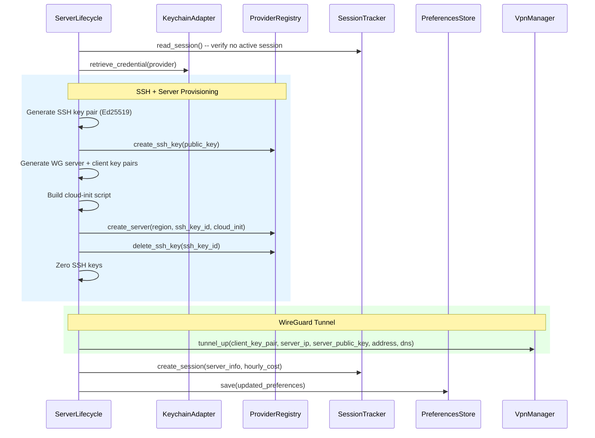

> **Status**: Completed at 2026-03-05T13:22:00+07:00
> **Branch**: feat/server-lifecycle-connect

# PLAN.md -- M4.2: Server Lifecycle -- Connect Flow

## 1. Context

### A. Problem Statement

Implement the 11-step connect flow that orchestrates Provider Manager, VPN Manager, Session Tracker, and Preferences Store to provision a cloud server with WireGuard and establish a VPN tunnel. This is the core user action -- "click Connect, get VPN."

### B. Current State

- `server_lifecycle.rs` exists as an empty stub (doc comments only)
- `ipc/server.rs::connect` returns `NOT_IMPLEMENTED`
- All dependencies are implemented: ProviderRegistry (M2), VPN Manager tunnel_up/tunnel_down (M3), SessionTracker (M4.1), PreferencesStore (M1.3), KeychainAdapter (M1.2)
- `ed25519-dalek` and `ssh-key` crates are NOT in Cargo.toml yet -- needed for SSH key generation

### C. Constraints

- `tunnel_up` currently generates WireGuard key pair internally -- must be refactored to accept pre-generated key pair (cloud-init needs client public key before provisioning)
- Server Lifecycle generates BOTH WG key pairs (client + server) so cloud-init can embed server private key and client public key
- Auto-cleanup required on any failure mid-connect (FR-SL-4)
- All provider API calls require API key from Keychain -- never cached in memory

### D. Verified Facts

| # | Fact | Evidence |
| --- | --- | --- |
| 1 | `ssh-key` 0.6 + `ed25519-dalek` 2.2 compile together and produce valid OpenSSH public keys | `/tmp/ssh-key-test` cargo run success |
| 2 | `CloudProvider` trait has `create_ssh_key(api_key, public_key, label) -> String` (returns key_id) | `cloud_provider.rs` source |
| 3 | `CloudProvider::create_server(api_key, region, ssh_key_id, cloud_init) -> ServerInfo` | `cloud_provider.rs` source |
| 4 | `tunnel_up(server_ip, server_public_key, interface_address, dns)` generates key pair internally | `tunnel.rs` line 105 |
| 5 | `SessionTracker::create_session(session: &ActiveSession)` writes atomic JSON | `session_tracker.rs` source |
| 6 | `PreferencesStore::save(preferences)` writes atomic JSON | `preferences_store.rs` source |
| 7 | `ProviderRegistry` managed as `Mutex<ProviderRegistry>` in Tauri state | `lib.rs` source |
| 8 | All 3 providers accept `cloud_init` string in create_server (Hetzner=user_data, AWS=user_data base64, GCP=startup-script metadata) | Provider source files |
| 9 | `ActiveSession` has optional `ssh_key_id` field for crash cleanup | `session_tracker.rs` source |

### E. Unverified Assumptions

| # | Assumption | Risk | Fallback |
| --- | --- | --- | --- |
| 1 | cloud-init with embedded WG server private key + client public key will configure WireGuard correctly on Ubuntu 24.04 | Low -- standard pattern used in production VPN services | Test with real Hetzner server in integration test |

## 2. Architecture

### A. Diagram



### B. Decisions

| Decision | Choice | Rationale |
| --- | --- | --- |
| SSH key crates | `ed25519-dalek` 2.2 + `ssh-key` 0.6 | Project stack specifies these; verified compatible |
| WG key pair ownership | Server Lifecycle generates both client + server pairs | cloud-init needs client public key; tunnel needs server public key |
| tunnel_up refactor | Accept `&WireGuardKeyPair` parameter | Key pair must exist before provisioning for cloud-init injection |
| Auto-cleanup pattern | Cleanup struct tracks created resources, runs compensating actions on failure | Fail Fast principle -- partial state is worse than no state |
| cloud-init builder | Dedicated `cloud_init.rs` module, provider-agnostic | Single script template works for all 3 providers (Single Responsibility) |
| Module structure | Directory module: `mod.rs`, `connect.rs`, `ssh_keys.rs`, `cloud_init.rs` | Boundary-based decomposition per concern |

### C. Boundaries

| File | Responsibility |
| --- | --- |
| `server_lifecycle/mod.rs` | ServerLifecycle struct, LifecycleError enum, re-exports |
| `server_lifecycle/connect.rs` | 11-step connect orchestration + ConnectCleanup |
| `server_lifecycle/ssh_keys.rs` | Ed25519 key pair generation, OpenSSH public key format |
| `server_lifecycle/cloud_init.rs` | WireGuard cloud-init script template builder |
| `vpn_manager/tunnel.rs` | Refactored tunnel_up accepting pre-generated key pair |
| `ipc/server.rs` | IPC connect command wired to ServerLifecycle |

## 3. Steps

### Step 1: Add SSH Key Dependencies

- [x] **Status**: completed at 2026-03-05T13:00:00+07:00
- **Scope**: `src-tauri/Cargo.toml`
- **Dependencies**: none
- **Description**: Add `ed25519-dalek` 2.2 (with `rand_core` feature) and `ssh-key` 0.6 (with `ed25519`, `rand_core` features) to Cargo.toml. Run `cargo check` to verify compilation.
- **Acceptance Criteria**:
  - `ed25519-dalek` and `ssh-key` added to `[dependencies]`
  - `cargo check` passes with no errors

### Step 2: Convert server_lifecycle to Directory Module

- [x] **Status**: completed at 2026-03-05T13:00:00+07:00
- **Scope**: `src-tauri/src/server_lifecycle.rs` → `src-tauri/src/server_lifecycle/mod.rs`, `src-tauri/src/error.rs`, `src-tauri/src/lib.rs`
- **Dependencies**: none
- **Description**: Move `server_lifecycle.rs` to `server_lifecycle/mod.rs`. Add `LifecycleError` enum with variants for each failure mode. Add `From<LifecycleError> for AppError` conversion in `error.rs`. Define `ServerLifecycle` struct holding `SessionTracker` and `PreferencesStore`. Re-export public types.
- **Acceptance Criteria**:
  - `server_lifecycle/mod.rs` exists with `ServerLifecycle` struct and `LifecycleError` enum
  - `From<LifecycleError> for AppError` implemented in `error.rs`
  - `lib.rs` compiles with the module path unchanged
  - `cargo check` passes

### Step 3: SSH Key Generation Module

- [x] **Status**: completed at 2026-03-05T13:10:00+07:00
- **Scope**: `src-tauri/src/server_lifecycle/ssh_keys.rs`
- **Dependencies**: Step 1, Step 2
- **Description**: Implement `SshKeyPair` struct with Ed25519 key generation using `ed25519-dalek`. Provide `public_key_openssh()` method returning OpenSSH format string via `ssh-key` crate. Implement `Zeroize` for secure memory cleanup. Add unit tests.
- **Acceptance Criteria**:
  - `SshKeyPair::generate()` produces valid Ed25519 key pair
  - `public_key_openssh()` returns string starting with `ssh-ed25519 AAAA...`
  - `Zeroize` implementation zeroes private key bytes on drop
  - Unit tests: generate, format, zeroize

### Step 4: Cloud-Init Script Builder

- [x] **Status**: completed at 2026-03-05T13:10:00+07:00
- **Scope**: `src-tauri/src/server_lifecycle/cloud_init.rs`
- **Dependencies**: Step 2
- **Description**: Build a provider-agnostic cloud-init bash script that installs WireGuard, configures server interface with injected private key, adds client as peer with injected public key, enables IP forwarding, configures firewall (UFW: allow UDP 51820, deny all else), and starts WireGuard. Parameters: server WG private key, client WG public key, server tunnel address (10.0.0.1/24), client tunnel address (10.0.0.2/32).
- **Acceptance Criteria**:
  - `build_cloud_init(server_private_key, client_public_key)` returns a valid bash script string
  - Script installs `wireguard` package
  - Script creates `/etc/wireguard/wg0.conf` with correct [Interface] and [Peer] sections
  - Script enables IP forwarding (`sysctl net.ipv4.ip_forward=1`)
  - Script configures firewall (UFW: allow 51820/udp, deny all incoming)
  - Script starts WireGuard service (`systemctl enable --now wg-quick@wg0`)
  - Unit test: verify script contains all required sections

### Step 5: Refactor tunnel_up to Accept Pre-Generated Key Pair

- [x] **Status**: completed at 2026-03-05T13:00:00+07:00
- **Scope**: `src-tauri/src/vpn_manager/tunnel.rs`
- **Dependencies**: none
- **Description**: Change `tunnel_up` signature to accept `key_pair: &WireGuardKeyPair` as the first parameter instead of generating internally. Remove the internal `WireGuardKeyPair::generate()` call. Update all existing tests that reference `tunnel_up`.
- **Acceptance Criteria**:
  - `tunnel_up(key_pair, server_ip, server_public_key, interface_address, dns)` signature
  - No internal key generation in tunnel_up
  - All existing tests in `tunnel.rs` updated and pass
  - `cargo check` passes

### Step 6: Connect Flow Orchestration

- [x] **Status**: completed at 2026-03-05T13:18:00+07:00
- **Scope**: `src-tauri/src/server_lifecycle/connect.rs`, `src-tauri/src/server_lifecycle/mod.rs`
- **Dependencies**: Step 3, Step 4, Step 5
- **Description**: Implement the full 11-step connect flow as `ServerLifecycle::connect()` async method. Steps: (1) verify no active session, (2) retrieve API key from Keychain, (3) generate SSH key pair, (4) register SSH key with provider, (5) generate WG server + client key pairs, (6) build cloud-init, (7) create server, (8) delete SSH key from provider, (9) zero SSH keys, (10) tunnel_up with client key pair, (11) create session + update preferences. Implement `ConnectCleanup` struct that tracks created resources (ssh_key_id, server_id) and runs compensating actions on any failure. All WG and SSH keys zeroed on cleanup.
- **Acceptance Criteria**:
  - `ServerLifecycle::connect(provider, region, registry, api_key)` returns `SessionStatus`
  - Auto-cleanup: if server created but tunnel fails, server is destroyed and SSH key deleted
  - Auto-cleanup: if SSH key registered but server fails, SSH key deleted
  - All key material zeroed on success and failure paths
  - Session file created with server_id, provider, region, server_ip, hourly_cost
  - Preferences updated with last_provider and last_region
  - Unit test: verify cleanup is called on simulated failure (mock provider)

### Step 7: Wire IPC Connect Command

- [x] **Status**: completed at 2026-03-05T13:22:00+07:00
- **Scope**: `src-tauri/src/ipc/server.rs`, `src-tauri/src/lib.rs`
- **Dependencies**: Step 6
- **Description**: Replace the stub `connect` IPC command with real implementation. Access `ProviderRegistry` and `ServerLifecycle` from Tauri state. Add `ServerLifecycle` to Tauri managed state in `lib.rs`. Validate inputs (provider registered, no active session). Delegate to `ServerLifecycle::connect()`. Return `SessionStatus` on success.
- **Acceptance Criteria**:
  - `connect` IPC command delegates to `ServerLifecycle::connect()`
  - `ServerLifecycle` added to Tauri managed state in `lib.rs`
  - Input validation: returns `CONFLICT_SESSION_ACTIVE` if session exists
  - Input validation: returns `NOT_FOUND_PROVIDER` if provider not registered
  - Returns `SessionStatus` JSON matching API Design §4.C
  - `cargo check` passes with all IPC commands registered

## 4. Execution Strategy

| Step | Chain | Rationale |
| --- | --- | --- |
| 1 | Direct | Single dependency addition |
| 2 | Direct | File move + struct/enum scaffolding |
| 3 | scout → worker | New module needing ssh-key API knowledge |
| 4 | scout → worker | New module needing cloud-init format knowledge |
| 5 | Direct | Small refactor of existing signature |
| 6 | scout → worker → reviewer | Core orchestration logic, complex, needs quality review |
| 7 | scout → worker | IPC wiring, follows existing pattern in provider.rs |

### A. Execution Order

```plain
Parallel Group A (no dependencies):
- Step 1: Add SSH key dependencies
- Step 2: Convert to directory module
- Step 5: Refactor tunnel_up

Parallel Group B (after Group A):
- Step 3: SSH Key Generation (needs Step 1 + 2)
- Step 4: Cloud-Init Builder (needs Step 2)

Sequential (after Group B):
- Step 6: Connect Flow (needs Step 3 + 4 + 5)
- Step 7: Wire IPC (needs Step 6)
```

### B. Risk Flags

- **Step 5**: Existing tunnel_up integration test (`tunnel_up_down_cycle`) is `#[ignore]` so no CI risk, but the signature change affects the test code
- **Step 6**: Auto-cleanup logic is complex -- ConnectCleanup must handle partial state correctly. Mock-based unit test validates the pattern but real integration test (with Hetzner) is the true verification

---
