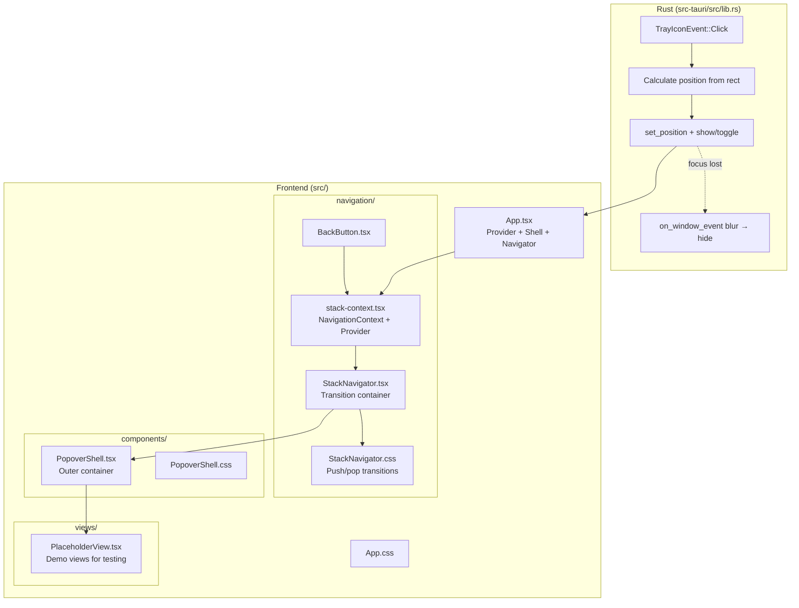

# PLAN.md -- M5.1: Popover Shell + Stack Navigation

> **Status**: Completed at 2026-03-05T14:53:00+07:00
> **Branch**: feat/popover-shell-stack-navigation

## 1. Context

### A. Problem Statement

M5.1 requires building the popover shell (outermost UI container) and stack navigation system that all M5 views (Disconnected, Connected, Provisioning, Error, etc.) will live inside. The frontend is currently a placeholder `App.tsx` with no components or navigation. The Rust tray handler shows the window on left-click but does not position it relative to the tray icon.

### B. Current State

- **Frontend**: `src/App.tsx` renders a centered `<h1>Oh My VPN</h1>`. `src/components/` is empty (`.gitkeep` only). `src/tokens.css` is fully integrated with design tokens (colors, spacing, shadows, motion, reduced motion, dark mode).
- **Backend tray**: `src-tauri/src/lib.rs` has a `TrayIconBuilder` with left-click handler that calls `show()` + `set_focus()` on the main window. No positioning logic. Right-click shows a context menu with "Quit".
- **Tauri window config**: `tauri.conf.json` defines `main` window as 320x480, `visible: false`, `skipTaskbar: true`, `resizable: false`, `decorations: false`.
- **Dependencies**: React 19.2.4, TypeScript 5.8.3, Vite 7, `@tauri-apps/api` v2.

### C. Constraints

- No external routing or animation library -- use React Context + CSS transitions only.
- Must follow Liquid Glass design system (tokens.css values).
- Reduced motion: all animations → `fadeIn 200ms linear` when `prefers-reduced-motion: reduce`.
- 320px fixed width popover, content-driven height.

### D. Input Sources

- Milestone document: `docs/milestone/2026-03-04-1726-milestone.md` -- M5.1 definition
- UX Design: `docs/ux-design/2026-03-03-1619-ux-design.md` -- §4 (core flow user journey)
- UI Design: `docs/ui-design/2026-03-04-0123-ui-design.md` -- §3 (layout system), §4.G (popover navigation)

### E. Verified Facts

| # | What was tested | Result | Decision |
| --- | --- | --- | --- |
| 1 | Tauri v2 `TrayIconEvent::Click` struct fields | Contains `rect: Rect` with tray icon position + size | Use `rect` to calculate window position under tray icon |
| 2 | `WebviewWindow::set_position()` availability | Exists, accepts `Position` type | Use for positioning window on each tray click |
| 3 | React 19.2.4 installed | Confirmed via `bun pm ls` | Modern hooks (useContext, useCallback, useRef) available |
| 4 | `tokens.css` motion tokens | `--duration-slow: 650ms`, `--easing-spring`, `--easing-smooth` defined, reduced motion media query sets spring → ease, durations capped at 200ms | CSS transitions use token variables directly |
| 5 | `src/components/` state | Empty (`.gitkeep` only) | No existing patterns to conflict with |
| 6 | `tauri.conf.json` window config | 320x480, no decorations, hidden by default | Matches popover spec (320px fixed width) |

### F. Unverified Assumptions

| # | Assumption | Why not verified | Risk | Fallback |
| --- | --- | --- | --- | --- |
| 1 | CSS `translateX()` + spring easing renders smoothly in Tauri WebView | Requires runtime visual test | Low -- WebKit-based, CSS transitions well-supported | Use `opacity` fade fallback |

## 2. Architecture

### A. Diagram



### B. Decisions

| Decision | Alternative considered | Rationale |
| --- | --- | --- |
| Custom stack nav (Context + CSS) | react-router, framer-motion | Composition over inheritance (Principle 4) -- zero dependencies, popover does not need a router |
| CSS transitions (`translateX`) | JS-based animation | Explicit over implicit (Principle 1) -- reuses tokens.css easing/duration values directly |
| Rust-side window positioning | Frontend JS positioning | Fail fast (Principle 5) -- window position is OS-level, Rust controls it directly via Tauri API |
| Plain `.css` files | styled-components, Tailwind | Consistency with existing `tokens.css` pattern, no additional dependencies |

### C. Boundaries

| Module | Responsibility |
| --- | --- |
| `lib.rs` (Rust) | Tray click → position window under tray icon, toggle show/hide, blur → hide |
| `navigation/` | Stack state management (push/pop), transition rendering, back button |
| `components/` | PopoverShell layout (padding, max-height, overflow, entry animation) |
| `views/` | Placeholder views for navigation testing (replaced by M5.2+ views later) |
| `App.tsx` | Composition root: NavigationProvider → PopoverShell → StackNavigator |

### D. Transition Spec

| Transition | CSS property | Duration + Easing |
| --- | --- | --- |
| Stack push (incoming) | `translateX(100%)` → `translateX(0)` | `var(--duration-slow) var(--easing-spring)` |
| Stack push (outgoing) | `translateX(0)` → `translateX(-30%)` | `var(--duration-slow) var(--easing-spring)` |
| Stack pop (incoming) | `translateX(-30%)` → `translateX(0)` | `var(--duration-slow) var(--easing-spring)` |
| Stack pop (outgoing) | `translateX(0)` → `translateX(100%)` | `var(--duration-slow) var(--easing-spring)` |
| Popover entry | `opacity 0 + translateY(-8px)` → `opacity 1 + translateY(0)` | `var(--duration-normal) var(--easing-smooth)` |
| Reduced motion | All above → `opacity` only | `200ms linear` |

## 3. Steps

### Step 1: Tray Popover Positioning (Rust)

- [x] **Status**: completed at 2026-03-05T14:38:00+07:00
- **Scope**: `src-tauri/src/lib.rs`
- **Dependencies**: none
- **Description**: Modify the tray icon left-click handler to calculate window position from `TrayIconEvent::Click { rect, .. }` and position the window centered horizontally under the tray icon. Add toggle behavior (click again to hide). Add `on_window_event` handler to hide window on focus loss (blur/focus-changed).
- **Acceptance Criteria**:
  - Left-click positions window centered under tray icon (`x = rect.x + rect.width/2 - window_width/2`, `y = rect.y + rect.height`)
  - Repeated left-click toggles window visibility (show/hide)
  - Window hides when it loses focus (click outside)
  - Window config remains: 320px width, no decorations, skip taskbar

### Step 2: Stack Navigation System (Frontend)

- [x] **Status**: completed at 2026-03-05T14:46:00+07:00
- **Scope**: `src/navigation/stack-context.tsx`, `src/navigation/StackNavigator.tsx`, `src/navigation/StackNavigator.css`, `src/navigation/BackButton.tsx`
- **Dependencies**: none
- **Description**: Implement the stack navigation system. `NavigationContext` provides `push(id, title, component)`, `pop()`, `canGoBack`, `currentView`. `StackNavigator` renders the stack with CSS `translateX` transitions for push/pop. `BackButton` renders a back chevron that calls `pop()`. All transitions use design tokens. Reduced motion support via CSS media query already in tokens.css.
- **Acceptance Criteria**:
  - `push(id, title, component)` adds to stack, triggers slide-in from right (650ms spring)
  - `pop()` removes from stack, triggers slide-out to right (650ms spring)
  - `canGoBack` returns `true` when stack depth > 1
  - Only the top-of-stack view is interactive (previous views are inert)
  - Reduced motion: transitions become `fadeIn 200ms`
  - No external animation library used

### Step 3: PopoverShell + App Integration

- [x] **Status**: completed at 2026-03-05T14:53:00+07:00
- **Scope**: `src/components/PopoverShell.tsx`, `src/components/PopoverShell.css`, `src/views/PlaceholderView.tsx`, `src/App.tsx`, `src/App.css`
- **Dependencies**: Step 2
- **Description**: Build PopoverShell (320px fixed width, 24px internal padding, 16px section gap, max-height constraint, overflow scroll). Create PlaceholderView with buttons to test push/pop navigation. Rewrite App.tsx to compose NavigationProvider + PopoverShell + StackNavigator. Add Esc key handler to hide window via `@tauri-apps/api`. Add `fadeSlideIn` popover entry animation.
- **Acceptance Criteria**:
  - PopoverShell: 320px width, 24px padding (`--space-6`), 16px gap (`--space-4`)
  - PopoverShell: max-height respects screen bounds, overflow-y auto
  - PlaceholderView: "Home" view with push button, "Detail" view with content
  - Esc key hides the window (calls `getCurrentWindow().hide()`)
  - Popover entry: `fadeSlideIn 400ms var(--easing-smooth)` on mount
  - Dark/Light mode works automatically via tokens.css
  - Stack navigation push/pop visually functional with placeholder views

## 4. Execution Strategy

| Step | Chain | Complexity | Rationale |
| --- | --- | --- | --- |
| 1 | scout → worker | Simple | Single Rust file modification, needs tray API context from codebase |
| 2 | scout → worker | Medium | 4 new files, clear spec but transition logic requires careful CSS |
| 3 | scout → worker | Medium | 5 files (3 new + 2 modified), integrates Step 2 output |

**Execution order:**

```plain
Step 1 → Step 2 → Step 3 (all sequential)
```

Step 1 and Step 2 have no mutual dependencies but are executed sequentially per the no-parallel rule. Step 3 depends on Step 2 (navigation system must exist before integration).

**Risk flags:** None -- all APIs verified, all files are new or have clear modification points.

---
