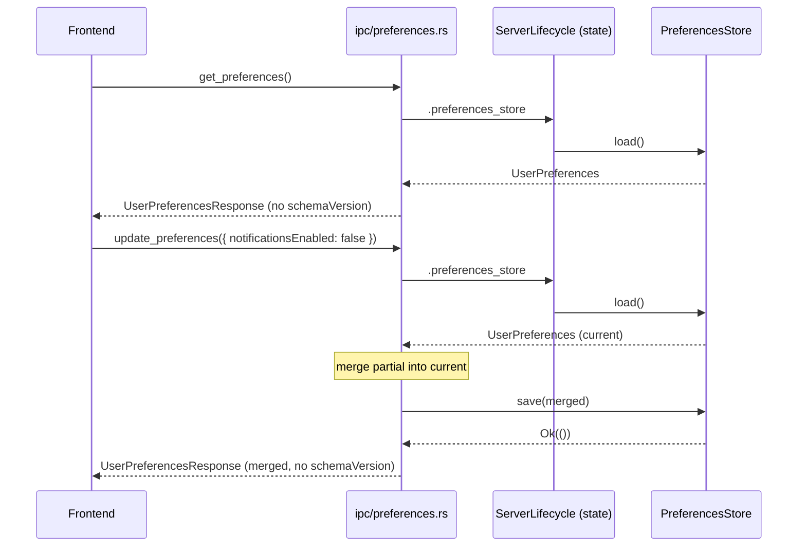

> **Status**: Completed at 2026-03-05T23:48:00+07:00
> **Branch**: feat/preferences-ipc
> **Steps completed**: 2/2

# PLAN -- M6.2: Preferences IPC Commands

## 1. Context

### A. Problem Statement

The `get_preferences` and `update_preferences` IPC commands are scaffolded as stubs returning `NOT_IMPLEMENTED`. They need to be wired to the existing `PreferencesStore` module so the frontend can read and write user preferences.

### B. Current State

- **PreferencesStore**: fully implemented in `src-tauri/src/preferences_store.rs` with `load()`, `save()`, schema migration, atomic writes, and tests
- **IPC stubs**: `src-tauri/src/ipc/preferences.rs` has both commands returning `NOT_IMPLEMENTED` error
- **State access**: `PreferencesStore` lives inside `ServerLifecycle` (same pattern as `SessionTracker`)
- **Capabilities**: `allow-get-preferences` and `allow-update-preferences` already registered in `src-tauri/capabilities/default.json`
- **Error conversion**: `From<PreferencesError> for AppError` already implemented in `error.rs`
- **IPC registration**: both commands already in `generate_handler!` macro in `lib.rs`

### C. Constraints

- `schemaVersion` is internal to the backend -- must not appear in frontend responses (API Design §4.E)
- `update_preferences` accepts partial updates -- all fields optional
- Atomic writes (write tmp + rename) already handled by `PreferencesStore::save()`

### D. Verified Facts

| # | What was tested | Result | Decision |
| --- | --- | --- | --- |
| 1 | `PreferencesStore` location in codebase | Owned by `ServerLifecycle` as `pub preferences_store` field | Access via `ServerLifecycle` Tauri state (same as `session.rs` pattern) |
| 2 | Capabilities whitelist | Both commands already in `default.json` | No capabilities update needed |
| 3 | IPC handler registration | Both commands already in `generate_handler!` in `lib.rs` | No `lib.rs` update needed |
| 4 | `From<PreferencesError> for AppError` | Already implemented in `error.rs` | No error conversion needed |
| 5 | `UserPreferences` struct | Has `schema_version` field, serde `rename_all = "camelCase"` | Need a response type without `schema_version` for frontend |

### E. Unverified Assumptions

| # | Assumption | Why not verified | Risk | Fallback |
| --- | --- | --- | --- | --- |
| -- | -- | -- | -- | -- |

---

## 2. Architecture

### A. Diagram

### B. Decisions

| Decision | Alternatives considered | Rationale | Principle |
| --- | --- | --- | --- |
| Access `PreferencesStore` via `ServerLifecycle` state | Register `PreferencesStore` as separate Tauri managed state | Follows existing `session.rs` pattern; avoids duplicate state registration | Composition over Inheritance (§3.B.4) |
| Create `UserPreferencesResponse` without `schemaVersion` | Strip field via serde `#[serde(skip)]` on `UserPreferences` | Dedicated response type is explicit; `skip` would affect all serialization contexts | Explicit over Implicit (§3.B.1) |
| Create `PartialUserPreferences` with all `Option` fields | Accept `serde_json::Value` and manually merge | Typed struct catches invalid field names at deserialization; compile-time safety | Fail Fast (§3.B.5) |
| Merge logic as method on `UserPreferences` | Merge in IPC handler | Keeps business logic in domain module, not IPC boundary | Single Responsibility (§3.B.3) |

### C. Boundaries

| File | Responsibility |
| --- | --- |
| `src-tauri/src/preferences_store.rs` | `PartialUserPreferences` struct, `UserPreferencesResponse` struct, `merge()` method, `to_response()` method |
| `src-tauri/src/ipc/preferences.rs` | IPC command implementations -- delegates to `PreferencesStore` via `ServerLifecycle` state |

### D. Trade-offs

| Option | Pros | Cons | Verdict |
| --- | --- | --- | --- |
| Typed `PartialUserPreferences` | Compile-time field validation, IDE completion | One more struct to maintain | **Selected** -- safety outweighs maintenance cost |
| `serde_json::Value` merge | No extra type | Runtime errors on typos, no type safety | Rejected -- violates Fail Fast |

---

## 3. Steps

### Step 1: Add PartialUserPreferences, UserPreferencesResponse, and merge logic

- [x] **Status**: completed at 2026-03-05T23:43:00+07:00
- **Scope**: `src-tauri/src/preferences_store.rs`
- **Dependencies**: none
- **Description**: Add `PartialUserPreferences` (all fields `Option`), `UserPreferencesResponse` (excludes `schema_version`), `merge()` method on `UserPreferences`, `to_response()` conversion method, and unit tests for merge behavior.
- **Acceptance Criteria**:
  - `PartialUserPreferences` struct with `Deserialize`, all fields `Option`
  - `UserPreferencesResponse` struct with `Serialize`, no `schema_version`
  - `UserPreferences::merge(&mut self, partial: PartialUserPreferences)` applies non-None fields
  - `UserPreferences::to_response(&self) -> UserPreferencesResponse` strips `schema_version`
  - Unit test: merge with partial fields only updates specified fields
  - Unit test: merge with empty partial changes nothing
  - Unit test: `to_response()` excludes `schema_version`

### Step 2: Implement IPC commands

- [x] **Status**: completed at 2026-03-05T23:48:00+07:00
- **Scope**: `src-tauri/src/ipc/preferences.rs`
- **Dependencies**: Step 1
- **Description**: Replace stubs with real implementations. `get_preferences` loads from `PreferencesStore` and returns `UserPreferencesResponse`. `update_preferences` loads, merges partial, saves, and returns `UserPreferencesResponse`.
- **Acceptance Criteria**:
  - `get_preferences` accepts `ServerLifecycle` state, calls `load()`, returns `UserPreferencesResponse`
  - `update_preferences` accepts `ServerLifecycle` state + `PartialUserPreferences`, loads → merges → saves → returns `UserPreferencesResponse`
  - Both commands use `?` operator with existing `From<PreferencesError> for AppError`
  - `cargo check` passes with no errors
  - `cargo test` passes (existing + new tests)

---

## 4. Execution Strategy

| Step | Chain | Rationale |
| --- | --- | --- |
| 1 | scout → worker | Domain logic addition in single file, needs codebase context for pattern consistency |
| 2 | scout → worker | IPC implementation in single file, needs to reference Step 1 types and existing IPC patterns |

**Execution order**: Step 1 → Step 2 (sequential -- Step 2 depends on Step 1 types)

**Estimated complexity**:

| Step | Tier | Notes |
| --- | --- | --- |
| 1 | Simple | New structs + merge method following existing patterns |
| 2 | Simple | Replace stubs with delegation, follows `session.rs` pattern |

**Risk flags**:

- None -- all dependencies verified, patterns established

---
