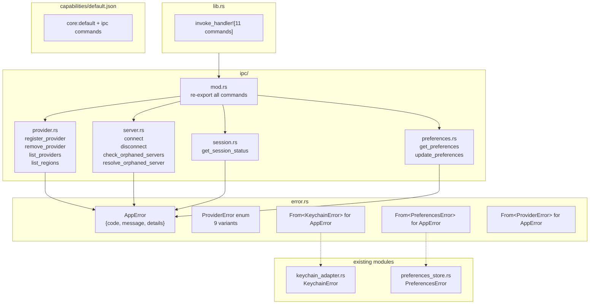

> **Status**: Completed at 2026-03-04T21:28:00+07:00
> **Branch**: feature/m1.4-ipc-scaffold

# Tauri IPC Scaffold + AppError

## 1. Context

### A. Problem Statement

M1.4는 Tauri IPC 커맨드 스캐폴드와 통합 에러 타입 시스템을 구축한다. 현재 `error.rs`와 `ipc/mod.rs`는 doc comment만 있는 빈 파일이고, `lib.rs`에 `invoke_handler`가 없어 프론트엔드-백엔드 통신이 불가능하다. 이 모듈은 후속 마일스톤(M2, M3, M4, M5, M6)이 IPC 커맨드를 구현할 때 사용하는 기반 구조를 제공한다.

### B. Current State

```
src-tauri/src/
├── error.rs              ← empty (doc comment only)
├── ipc/mod.rs            ← empty (doc comment only)
├── lib.rs                ← module declarations + tray setup, no invoke_handler
├── keychain_adapter.rs   ← KeychainError defined (Display impl, no Serialize)
├── preferences_store.rs  ← PreferencesError defined (Display impl, no Serialize)
├── types.rs              ← Provider enum (Serialize/Deserialize)
├── provider_manager.rs   ← placeholder
├── server_lifecycle.rs   ← placeholder
├── session_tracker.rs    ← placeholder
└── vpn_manager.rs        ← placeholder
```

- Tauri 2.10.3, capabilities: `default.json` with `core:default` + `opener:default`
- No `invoke_handler` registered in `lib.rs`

### C. Constraints

- Tauri v2 IPC commands require error types to implement `Serialize` (`InvokeError: From<T: Serialize>`)
- All 11 IPC commands from API Design §3 must be scaffolded as stubs
- Existing `KeychainError` and `PreferencesError` must not be modified (only `From` conversions added in `error.rs`)
- Must compile with zero warnings on `#[allow(unused)]` modules

### D. Input Sources

- API Design §6: AppError format, error code taxonomy, error code catalog, protocol-specific error mapping
- API Design §3: IPC endpoint summary (11 commands across 4 domains)
- Architecture containers.md §3.A: Tauri IPC module description

### E. Verified Facts

| What was tested | Result | Decision |
| --- | --- | --- |
| `AppError` with `#[derive(Serialize)]` as `Result<T, E>` return in `#[tauri::command]` | `cargo check` passed -- Tauri v2 `InvokeError` has `impl<T: Serialize> From<T>` so custom error types need only `Serialize` | Use `#[derive(Debug, Serialize)]` on `AppError`, no need for `std::error::Error` |
| Current project compilation | `cargo check` passes on tauri 2.10.3 | Baseline is clean |
| Existing error types | `KeychainError` and `PreferencesError` exist with `Display` but no `Serialize` | Add `From<KeychainError> for AppError` and `From<PreferencesError> for AppError` in `error.rs` -- do not touch original types |
| Capabilities structure | `src-tauri/capabilities/default.json` exists with `core:default`, `opener:default` | Add IPC command permissions to this file |

### F. Unverified Assumptions

None -- all technical assumptions verified via compilation spike and source inspection.

---

## 2. Architecture

### A. Diagram



### B. Decisions

| Decision | Choice | Rationale |
| --- | --- | --- |
| Domain errors stay in domain modules | `KeychainError` in `keychain_adapter.rs`, `PreferencesError` in `preferences_store.rs` | Single Responsibility -- domain errors belong to their domain module |
| `ProviderError` defined in `error.rs` | Temporary location until M2 implements `provider_manager` | `provider_manager.rs` is a placeholder -- centralizing in `error.rs` keeps the error catalog in one file. Move to `provider_manager` in M2 |
| IPC submodules split by domain | 4 files: `provider.rs`, `server.rs`, `session.rs`, `preferences.rs` | Maps 1:1 to API Design §3 interface groups (IPC-PM, IPC-SL, IPC-SS, IPC-PS) |
| Single `default.json` capability | All IPC commands in one file | Single-window app with no permission differentiation needed |
| Stub handlers return `NOT_IMPLEMENTED` | `Err(AppError { code: "NOT_IMPLEMENTED", ... })` | Compiles, communicates intent, provides meaningful error to frontend during development |

### C. Boundaries

| File | Responsibility |
| --- | --- |
| `error.rs` | `AppError` struct, `ProviderError` enum, all `From<DomainError>` conversions |
| `ipc/mod.rs` | Re-export all `#[tauri::command]` functions from submodules |
| `ipc/provider.rs` | 4 provider management command stubs |
| `ipc/server.rs` | 4 server lifecycle command stubs (connect, disconnect, orphan detection) |
| `ipc/session.rs` | 1 session status command stub |
| `ipc/preferences.rs` | 2 preferences command stubs |
| `lib.rs` | Register all 11 commands in `invoke_handler` |
| `capabilities/default.json` | Add IPC command permissions |

---

## 3. Steps

### Step 1: AppError + Domain Error Conversions

- [x] **Status**: completed at 2026-03-04T21:18:00+07:00
- **Scope**: `src-tauri/src/error.rs`
- **Dependencies**: none
- **Description**: Define `AppError` struct with `Serialize`, `ProviderError` enum with 9 variants matching API Design §6.D (including `Other(anyhow::Error)` catch-all), and `From<T> for AppError` implementations for `KeychainError`, `PreferencesError`, and `ProviderError`. Cover all 19 error codes from API Design §6.C catalog.
- **Acceptance Criteria**:
  - `AppError` struct with `code: String`, `message: String`, `details: Option<serde_json::Value>` and `#[derive(Debug, Serialize)]`
  - `ProviderError` enum (9 variants): `AuthInvalidKey(String)`, `AuthInsufficientPermissions(String)`, `RateLimited { retry_after_seconds: u64 }`, `ServerError(String)`, `Timeout`, `NotFound(String)`, `ProvisioningFailed(String)`, `DestructionFailed(String)`, `Other(anyhow::Error)`
  - `From<KeychainError> for AppError`: `AccessDenied` → `KEYCHAIN_ACCESS_DENIED`, `WriteFailed` → `KEYCHAIN_WRITE_FAILED`, `NotFound` → `NOT_FOUND_PROVIDER`, `SearchFailed` → `INTERNAL_UNEXPECTED`
  - `From<PreferencesError> for AppError`: all variants → `INTERNAL_UNEXPECTED` with descriptive message
  - `From<ProviderError> for AppError`: all 8 variants → matching error codes from §6.C
  - `cargo check` passes

### Step 2: IPC Command Stubs

- [x] **Status**: completed at 2026-03-04T21:23:00+07:00
- **Scope**: `src-tauri/src/ipc/mod.rs`, `src-tauri/src/ipc/provider.rs`, `src-tauri/src/ipc/server.rs`, `src-tauri/src/ipc/session.rs`, `src-tauri/src/ipc/preferences.rs`
- **Dependencies**: Step 1
- **Description**: Create 4 IPC submodules with 11 `#[tauri::command]` stub functions. Each returns `Result<T, AppError>` where T matches API Design §4 return types. All stubs return `Err(AppError { code: "NOT_IMPLEMENTED", ... })`. `mod.rs` re-exports all commands.
- **Acceptance Criteria**:
  - `provider.rs`: `register_provider(provider: Provider, api_key: String, account_label: String) -> Result<serde_json::Value, AppError>`, `remove_provider(provider: Provider) -> Result<(), AppError>`, `list_providers() -> Result<Vec<serde_json::Value>, AppError>`, `list_regions(provider: Provider) -> Result<Vec<serde_json::Value>, AppError>`
  - `server.rs`: `connect(provider: Provider, region: String) -> Result<serde_json::Value, AppError>`, `disconnect() -> Result<(), AppError>`, `check_orphaned_servers() -> Result<Vec<serde_json::Value>, AppError>`, `resolve_orphaned_server(server_id: String, action: String) -> Result<Option<serde_json::Value>, AppError>` (note: API Design uses `OrphanAction` enum for `action` but type is not yet defined -- use `String` stub, define `OrphanAction` in `types.rs` during this step)
  - `session.rs`: `get_session_status() -> Result<Option<serde_json::Value>, AppError>`
  - `preferences.rs`: `get_preferences() -> Result<serde_json::Value, AppError>`, `update_preferences(preferences: serde_json::Value) -> Result<serde_json::Value, AppError>`
  - `mod.rs` declares submodules and re-exports all 11 command functions
  - `cargo check` passes

### Step 3: lib.rs + Capabilities Integration

- [x] **Status**: completed at 2026-03-04T21:28:00+07:00
- **Scope**: `src-tauri/src/lib.rs`, `src-tauri/capabilities/default.json`
- **Dependencies**: Step 2
- **Description**: Register all 11 IPC commands in `tauri::generate_handler![]` within `lib.rs`. Update `default.json` capabilities to permit the IPC commands. Verify full project compiles and existing tests pass.
- **Acceptance Criteria**:
  - `lib.rs`: `.invoke_handler(tauri::generate_handler![...])` with all 11 commands
  - `default.json`: permissions array includes IPC command access
  - `cargo check` passes with zero errors
  - `cargo test` passes (existing keychain_adapter and preferences_store tests)

---

## 4. Execution Strategy

| Step | Chain | Complexity | Rationale |
| --- | --- | --- | --- |
| 1 | scout → worker | Simple | Single file, pattern from API Design §6, needs context for error code mapping |
| 2 | scout → worker | Simple | 4 new files + mod.rs but repetitive pattern, needs Step 1 context |
| 3 | Direct | Trivial | 2 existing files, registration only |

**Execution order:**

```
Step 1 → Step 2 → Step 3 (sequential)
```

**Parallel opportunities:** None -- each step depends on the previous.

**Risk flags:** None -- all patterns verified via compilation spike.
