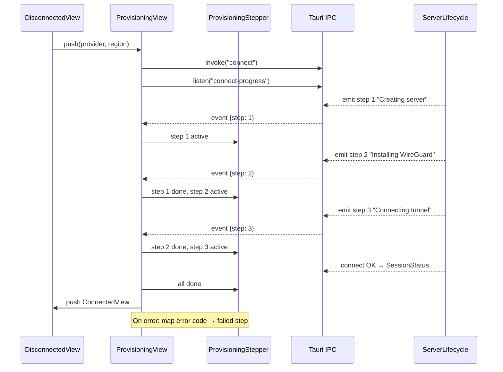

> **Status**: Completed at 2026-03-05T19:39:00+07:00
> **Branch**: feat/provisioning-stepper

# Provisioning Stepper (M5.4)

## 1. Context

### A. Problem Statement

The connect flow currently has a placeholder `ConnectingView` that shows "Connecting..." with no progress feedback. The UI spec requires a 3-step vertical stepper (Creating server → Installing WireGuard → Connecting tunnel) with 4 states per step (done/active/waiting/failed), plus an error glass card with retry on failure.

The backend `connect` IPC is a single async call that returns `SessionStatus` on success or `AppError` on failure -- no mid-flow progress events exist. Real-time stepper updates require backend event emission.

### B. Current State

- `DisconnectedView.tsx` -- calls `invoke("connect")`, pushes placeholder `ConnectingView` **after** success (wrong order for stepper)
- `connect.rs` -- 11-step connect flow, no `emit` calls, no `AppHandle` parameter
- `server.rs` (IPC) -- `connect` command does not pass `AppHandle` to lifecycle
- `ipc.ts` -- no `ConnectProgress` type
- Existing patterns: Liquid Glass 4-layer sandwich, `GlassButton` component, `useNavigation` (push/pop), CSS variables from `tokens.css`

### C. Constraints

- Tauri 2 event API: `app.emit("event-name", payload)` on backend, `listen("event-name")` on frontend
- `AppHandle` available in IPC commands via `tauri::AppHandle` parameter
- Stepper must work with Liquid Glass design system and dark/light mode
- Reduced motion: animations → fadeIn 200ms

### D. Input Sources

- Milestone M5.4 in `docs/milestone/2026-03-04-1726-milestone.md`
- UX Design §4.D (provisioning stepper spec)
- UI Design §4.B (stepper wireframe), §4.C (provisioning state wireframe), §4.D (error state wireframe)

### E. Verified Facts

1. **Backend connect is single async IPC** -- confirmed by reading `connect.rs` and `server.rs`. No `emit` or `AppHandle` usage anywhere in `server_lifecycle/`
2. **Error codes map to stepper steps** -- confirmed from `error.rs`:
   - `PROVIDER_PROVISIONING_FAILED` → Step 1 (Creating server)
   - `TUNNEL_SETUP_FAILED` → Step 3 (Connecting tunnel)
   - Others (`KEYCHAIN_*`, `INTERNAL_*`) → Step 1
3. **AppError serializes as `{ code, message, details }`** -- confirmed from `error.rs` `#[derive(Serialize)]`
4. **Existing component patterns** -- Liquid Glass 4-layer sandwich verified in `GlassButton.tsx`, `SessionCard.tsx`, `liquid-glass.css`
5. **Navigation API** -- `useNavigation()` provides `push(id, title, component)` and `pop()`, confirmed from `stack-context.tsx`
6. **DisconnectedView placeholder** -- `ConnectingView` exists as local function, pushes after `invoke("connect")` succeeds (line ~109)

### F. Unverified Assumptions

1. **Tauri 2 `app.emit()` available inside `#[tauri::command]` via `app: tauri::AppHandle`** -- Risk: low. Tauri 2 docs confirm this pattern. Fallback: use `tauri::Window` instead
2. **`@tauri-apps/api/event` `listen()` works in webview** -- Risk: low. Standard Tauri 2 frontend API. Fallback: use `window.listen()` from `@tauri-apps/api/window`

## 2. Architecture

### A. Diagram

### B. Decisions

1. **`AppHandle` as parameter to `connect()`** -- not stored in `ServerLifecycle` struct. Only `connect` needs emit; struct change is unnecessary. (Principle: Single Responsibility)
2. **ProvisioningView owns connect lifecycle** -- separated from DisconnectedView. The view that shows progress must own the IPC call and event listener. (Principle: Single Responsibility)
3. **ProvisioningStepper is pure UI** -- receives `currentStep` and `failedStep` as props. No IPC knowledge. (Principle: Composition over Inheritance)
4. **Error code mapping in ProvisioningView** -- maps `AppError.code` to failed step number. Stepper only knows step numbers. (Principle: Dependency Inversion)

### C. Boundaries

| File | Responsibility |
| --- | --- |
| `connect.rs` | Emit `connect-progress` events at 3 points in the 11-step flow |
| `server.rs` | Pass `AppHandle` from IPC command to `ServerLifecycle::connect()` |
| `ipc.ts` | `ConnectProgress` type definition |
| `ProvisioningStepper.tsx` + `.css` | Pure UI: 3-step vertical stepper with 4 states, connector lines |
| `ProvisioningView.tsx` + `.css` | Orchestrator: invoke connect, listen to events, error handling, navigation |
| `DisconnectedView.tsx` | Push ProvisioningView on Connect click (remove inline connect logic) |

### D. Emit Points (connect.rs 11-step mapping)

| Stepper Step | Emit Location | connect.rs Steps Covered |
| --- | --- | --- |
| 1 "Creating server" | Before Step 3 (SSH key generation) | 1--7 (verify → provision) |
| 2 "Installing WireGuard" | After Step 7 (server created) | 8--9 (SSH cleanup) |
| 3 "Connecting tunnel" | Before Step 10 (tunnel up) | 10--11 (tunnel → session) |

### E. Error Code → Failed Step Mapping

| Error Code | Failed Step | Rationale |
| --- | --- | --- |
| `PROVIDER_PROVISIONING_FAILED` | 1 | Server creation failed |
| `TUNNEL_SETUP_FAILED` | 3 | WireGuard tunnel failed |
| All others | 1 | Pre-provisioning failure (Keychain, SSH, etc.) |

## 3. Steps

### Step 1: Backend emit -- connect.rs + IPC

- [x] **Status**: completed at 2026-03-05T19:30:00+07:00
- **Scope**: `src-tauri/src/server_lifecycle/connect.rs`, `src-tauri/src/ipc/server.rs`
- **Dependencies**: none
- **Description**: Add `AppHandle` parameter to `ServerLifecycle::connect()`. Insert 3 `app.emit("connect-progress", payload)` calls at the mapped locations. Update the `connect` IPC command in `server.rs` to extract `app: tauri::AppHandle` and pass it to `lifecycle.connect()`. Define a serializable `ConnectProgress` struct in `connect.rs` (or `types.rs`).
- **Acceptance Criteria**:
  - `ServerLifecycle::connect()` accepts `app: &tauri::AppHandle` parameter
  - `ConnectProgress { step: u8 }` struct defined with `#[derive(Clone, Serialize)]`
  - 3 emit calls at correct locations (before step 3, after step 7, before step 10)
  - `server.rs` IPC command passes `AppHandle` to connect
  - `cargo check` passes

### Step 2: Frontend types -- ConnectProgress

- [x] **Status**: completed at 2026-03-05T19:31:00+07:00
- **Scope**: `src/types/ipc.ts`
- **Dependencies**: none
- **Description**: Add `ConnectProgress` interface matching the Rust struct. Add `AppError` interface for typed error handling in ProvisioningView.
- **Acceptance Criteria**:
  - `ConnectProgress { step: number }` type exported
  - `AppError { code: string; message: string; details?: unknown }` type exported
  - Existing types unchanged

### Step 3: ProvisioningStepper component

- [x] **Status**: completed at 2026-03-05T19:34:00+07:00
- **Scope**: `src/components/ProvisioningStepper.tsx`, `src/components/ProvisioningStepper.css`
- **Dependencies**: none
- **Description**: Build a pure UI component that renders a 3-step vertical stepper. Props: `currentStep` (1-3, or 0 for all waiting), `failedStep` (null or step number), `errorMessage` (null or string). Each step shows a circle (with icon/number), title, and optional description. Connector lines between steps. Liquid Glass styling with warning tint on active, success tint on done, error tint on failed.
- **Acceptance Criteria**:
  - 3 steps rendered: "Creating server", "Installing WireGuard", "Connecting tunnel"
  - Step states: done (✓ green, description "Completed"), active (spinner amber, description "In progress..."), waiting (number gray, no description), failed (✕ red, error message inline)
  - Vertical layout with connector lines between step circles
  - Liquid Glass tinting per state
  - Dark mode support via CSS custom properties
  - Reduced motion: spinner uses `animation-duration: 1.5s`
  - Keyboard accessible (no interactive elements -- display only)

### Step 4: ProvisioningView + DisconnectedView update

- [x] **Status**: completed at 2026-03-05T19:38:00+07:00
- **Scope**: `src/views/ProvisioningView.tsx`, `src/views/ProvisioningView.css`, `src/views/DisconnectedView.tsx`, `src/views/DisconnectedView.css`
- **Dependencies**: Step 1, Step 2, Step 3
- **Description**: Create `ProvisioningView` that: (a) on mount, calls `invoke("connect")` and `listen("connect-progress")`, (b) updates `ProvisioningStepper` on each progress event, (c) on success pushes `ConnectedView`, (d) on failure maps error code to failed step and shows error card with Cancel/Retry buttons. Update `DisconnectedView` to push `ProvisioningView` with provider/region props instead of calling connect inline. Remove the placeholder `ConnectingView`.
- **Acceptance Criteria**:
  - ProvisioningView: status badge ("PROVISIONING..." with amber dot, changes to "PROVISIONING FAILED" with red dot on error)
  - ProvisioningView: region info line (e.g., "Frankfurt · Hetzner")
  - ProvisioningView: renders ProvisioningStepper with live state
  - ProvisioningView: listens to `connect-progress` events, updates currentStep
  - ProvisioningView: on connect success → push ConnectedView with SessionStatus
  - ProvisioningView: on connect failure → map error code to failedStep, show error message
  - ProvisioningView: Cancel button (pops back to DisconnectedView)
  - ProvisioningView: Retry button on failure (re-invokes connect)
  - ProvisioningView: cleans up event listener on unmount
  - DisconnectedView: Connect click pushes ProvisioningView (no inline invoke)
  - DisconnectedView: placeholder ConnectingView removed
  - DisconnectedView.css: placeholder CSS removed
  - Liquid Glass styling on error card
  - Dark mode support

### Step 5: Verify build and lint

- [x] **Status**: completed at 2026-03-05T19:39:00+07:00
- **Scope**: project-wide verification
- **Dependencies**: Step 4
- **Description**: Run `cargo check` for Rust backend and `bun run check` (or `npx tsc --noEmit`) for TypeScript frontend. Fix any compilation or type errors.
- **Acceptance Criteria**:
  - `cargo check` exits 0
  - TypeScript type check exits 0
  - No new warnings introduced

## 4. Execution Strategy

| Step | Chain | Complexity | Rationale |
| --- | --- | --- | --- |
| 1 | Direct | Simple | 2 files, parameter addition + 3 emit lines |
| 2 | Direct | Trivial | 2 type additions to existing file |
| 3 | Direct | Medium | New component + CSS, single concern, follows existing patterns |
| 4 | Direct | Medium | New view + existing view refactor, event wiring |
| 5 | Direct | Trivial | Build verification commands |

**Execution order**: 1 → 2 → 3 → 4 → 5 (sequential)

**All steps Direct** -- every step touches 1-3 files with clear scope. Subagent chain overhead exceeds the benefit for this granularity.

**Risk flags**:

- Step 1: `AppHandle` parameter pattern in Tauri 2 `#[tauri::command]` -- low risk, standard Tauri pattern
- Step 4: Event listener cleanup timing -- must unlisten before component unmount to prevent stale updates

---
