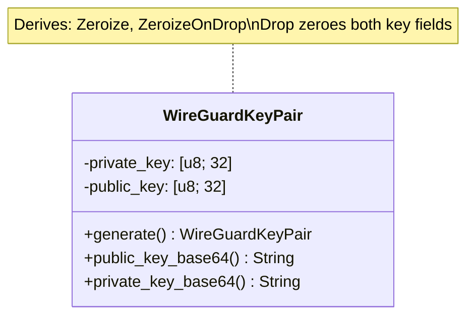

> **Status**: Completed at 2026-03-05T01:29+07:00
> **Branch**: feat/wireguard-key-generation

# PLAN -- M3.1: WireGuard Key Generation

## 1. Context

### A. Problem Statement

Implement Curve25519 key pair generation for WireGuard VPN sessions. Keys are ephemeral -- generated per session, zeroed from memory after tunnel teardown. This is the foundation for M3.2 (config file) and M3.3 (wg-quick tunnel).

### B. Current State

- `src-tauri/src/vpn_manager.rs` exists as an empty stub (doc comment only)
- `lib.rs` declares `mod vpn_manager` with `#[allow(unused)]`
- `x25519-dalek` 2.0.1 and `zeroize` 1.8.2 already added to `Cargo.toml`
- `error.rs` has `TUNNEL_SETUP_FAILED` and `TUNNEL_TEARDOWN_FAILED` error codes
- Data model defines `WireGuardKeyPair { private_key: [u8; 32], public_key: [u8; 32] }`

### C. Constraints

- Keys must implement `Zeroize` + `ZeroizeOnDrop` (NFR-SEC-2)
- Public key encoded to base64 for WireGuard INI config format
- `StaticSecret` required (not `EphemeralSecret`) because only `StaticSecret` implements `Zeroize`
- Private key bytes extracted via `StaticSecret::to_bytes()` for struct storage

### D. Input Sources

- `docs/data-model/2026-03-04-1712-data-model.md` -- §4.C (WireGuardKeyPair schema)
- `docs/milestone/2026-03-04-1726-milestone.md` -- M3.1 acceptance criteria

### E. Verified Facts

| # | Tested | Result |
| --- | --- | --- |
| 1 | `StaticSecret::random_from_rng(OsRng)` + `PublicKey::from(&secret)` | 32-byte key pair generated successfully |
| 2 | `secret.zeroize()` on `StaticSecret` | Zeroes internal state -- OK |
| 3 | `#[derive(Zeroize, ZeroizeOnDrop)]` on struct with `[u8; 32]` fields | Compiles and zeroes on drop |
| 4 | `STANDARD.encode(public.as_bytes())` | 44-char base64 string (WireGuard standard) |
| 5 | `[u8; 32].zeroize()` | All bytes set to 0 -- verified by assertion |
| 6 | Both crates added to Cargo.toml, `cargo check` passes | No compilation errors |

### F. Unverified Assumptions

None -- all technical elements verified via spike.

---

## 2. Architecture

### A. Diagram

### B. Decisions

| Decision | Choice | Alternative Considered | Rationale |
| --- | --- | --- | --- |
| Key type | `StaticSecret` | `EphemeralSecret` | `EphemeralSecret` does not implement `Zeroize`; `StaticSecret` with `static_secrets` feature does (Principle 1: Explicit over Implicit) |
| Struct design | Store raw `[u8; 32]` | Store `StaticSecret` directly | Raw bytes allow `Zeroize`/`ZeroizeOnDrop` derive on the struct; `StaticSecret` is consumed during construction (Principle 3: Single Responsibility) |
| Module layout | `vpn_manager/mod.rs` + `keys.rs` | Single `vpn_manager.rs` | Directory structure accommodates M3.2 (`config.rs`) and M3.3 (`tunnel.rs`) (Principle 4: Composition) |

### C. Boundaries

- `vpn_manager/keys.rs` -- key generation only, no config or tunnel logic
- `vpn_manager/mod.rs` -- re-exports `keys` module, future `config` and `tunnel` modules

---

## 3. Steps

### Step 1: Restructure vpn_manager Module

- [x] **Status**: completed at 2026-03-05T01:23+07:00
- **Scope**: `src-tauri/src/vpn_manager.rs` → `src-tauri/src/vpn_manager/mod.rs`
- **Dependencies**: none
- **Description**: Convert the single-file stub into a directory module. Move doc comment to `mod.rs`, add `pub mod keys;` declaration.
- **Acceptance Criteria**:
  - `src-tauri/src/vpn_manager/mod.rs` exists with module doc comment and `pub mod keys;`
  - `src-tauri/src/vpn_manager.rs` removed (moved to directory structure)
  - `cargo check` passes

### Step 2: Implement WireGuardKeyPair

- [x] **Status**: completed at 2026-03-05T01:29+07:00
- **Scope**: `src-tauri/src/vpn_manager/keys.rs`
- **Dependencies**: Step 1
- **Description**: Implement the `WireGuardKeyPair` struct with `Zeroize`/`ZeroizeOnDrop` derive, `generate()` constructor, `public_key_base64()` and `private_key_base64()` methods, and unit tests.
- **Acceptance Criteria**:
  - `WireGuardKeyPair` struct with `private_key: [u8; 32]`, `public_key: [u8; 32]`
  - `#[derive(Zeroize, ZeroizeOnDrop)]` on the struct
  - `generate()` uses `StaticSecret::random_from_rng(OsRng)` + `PublicKey::from(&secret)`
  - `public_key_base64()` returns 44-char base64 string
  - `private_key_base64()` returns 44-char base64 string
  - Unit test: generate → verify key lengths (32 bytes each)
  - Unit test: generate → verify base64 output is 44 chars
  - Unit test: generate two pairs → verify public keys differ (randomness check)
  - Unit test: verify `[u8; 32]` zeroize works (proxy for ZeroizeOnDrop)
  - `cargo test` passes
  - `cargo clippy` clean (no warnings on new code)

---

## 4. Execution Strategy

| Step | Chain | Rationale |
| --- | --- | --- |
| 1 | Direct | Trivial file restructure -- single mv + edit |
| 2 | scout → worker | Simple implementation but needs to verify existing patterns in codebase |

**Execution order**: Sequential (Step 1 → Step 2)

**Estimated complexity**:

| Step | Tier | Tokens |
| --- | --- | --- |
| 1 | Trivial | < 5K |
| 2 | Simple | 10--20K |

**Risk flags**: None -- all APIs verified, scope is contained to one new file.
