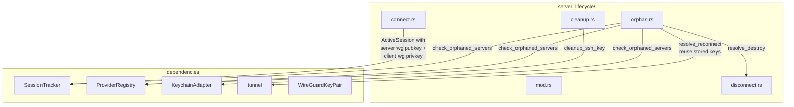

> **Status**: Completed at 2026-03-05T14:12:00+07:00
> **Branch**: feat/auto-cleanup-orphan-detection

# PLAN.md -- M4.4: Auto-Cleanup + Orphan Detection

## 1. Context

### A. Problem Statement

When the app crashes, is force-quit, or loses network during server destruction, cloud instances are left running without a corresponding app session -- "orphaned servers." These incur ongoing cost and are a security risk (open WireGuard port). M4.4 implements two capabilities:

1. **Auto-cleanup on connect failure** -- already partially handled by `ConnectCleanup` guard in `connect.rs` (Drop-based). M4.4 adds a standalone cleanup function for post-crash SSH key cleanup and reusable server resource teardown.
2. **Orphan detection on app launch** -- read persisted `active-session.json`, query provider API to verify server existence, and surface orphaned servers to the caller. User can destroy or reconnect.

### B. Current State

- `SessionTracker` persists `ActiveSession` to `active-session.json` with fields: `server_id`, `provider`, `region`, `server_ip`, `created_at`, `hourly_cost`, `ssh_key_id`.
- `ServerLifecycle::disconnect()` has `destroy_and_cleanup()` -- destroy server with retry + exponential backoff + verification via `get_server()`. This is reusable for orphan destroy.
- `ConnectCleanup` in `connect.rs` handles Drop-based auto-cleanup during connect. Standalone cleanup for orphan resolution needs a different approach (async, not Drop).
- `OrphanAction` enum (`Destroy`/`Reconnect`) already exists in `types.rs`.
- `OrphanedServer` struct does NOT exist yet -- needs to be added to `types.rs`.
- `LifecycleError` in `mod.rs` lacks orphan-specific variants.

### C. Constraints

- Detection must be async -- must not block app launch (NFR-PERF-3: menu bar ready < 3s).
- 100% detection rate for persisted sessions (NFR-REL-1).
- Reconnect path: reuse original WireGuard keys stored in session, tunnel up to existing server (skip provisioning). New keys would fail because server's `wg0.conf` hardcodes the original client public key as peer.
- IPC commands are out of scope (M4.5).

### D. Verified Facts

1. **`destroy_and_cleanup` is reusable** -- method on `ServerLifecycle`, accepts `&ActiveSession`, `&dyn CloudProvider`, `&str` (api_key). Can be called from orphan destroy path without modification.
2. **`ActiveSession.ssh_key_id` is `Option<String>`** -- populated during connect flow between SSH key registration and deletion. If app crashes after SSH key registration but before deletion, this field holds the provider-side SSH key ID.
3. **`tunnel::tunnel_up` signature** -- takes `&WireGuardKeyPair`, `server_ip`, `server_public_key`, `interface_address`, `dns`. Reconnect path needs both the server's WG public key and the original client WG key pair.
4. **Reconnect requires original keys** -- The server's `wg0.conf` (written by cloud-init) hardcodes the original client public key as `[Peer] PublicKey`. Generating new WG keys would cause handshake failure because the server doesn't know the new client. Solution: store `server_wireguard_public_key` AND `client_wireguard_private_key` in `ActiveSession`, reuse the same keys on reconnect. This is acceptable because: (a) keys are per-session and deleted on destroy, (b) the session file is already in the app data directory, (c) NFR-SEC-2 "ephemeral per session" is maintained -- keys exist only during session lifetime.

### E. Unverified Assumptions

1. **Cloud-init WireGuard config is stable across server restarts** -- if the provider reboots the orphaned server, cloud-init may not re-run, but `/etc/wireguard/wg0.conf` persists on disk. The WireGuard systemd service (`wg-quick@wg0`) is enabled, so it auto-starts on reboot. Risk: low. Fallback: reconnect fails, user destroys instead.

## 2. Architecture

### A. Diagram

### B. Decisions

1. **Store WG keys in `ActiveSession`** -- add `server_wireguard_public_key: Option<String>` and `client_wireguard_private_key: Option<String>`. Stored at connect time (Step 11), cleared on disconnect. Enables reconnect with original keys -- server's `wg0.conf` already has the matching client public key as peer. Minimal schema change, no migration needed (fields are `Option` with `#[serde(default)]`).
2. **Reuse `destroy_and_cleanup`** for orphan destroy -- no code duplication. The method already handles retry + exponential backoff + verification + session deletion (Principle: Composition over Inheritance).
3. **`cleanup.rs` as thin utility** -- provides `cleanup_ssh_key` for post-crash SSH key cleanup that orphan detection discovers. The server cleanup reuses disconnect's `destroy_and_cleanup`.
4. **`orphan.rs` methods on `ServerLifecycle`** -- consistent with `connect` and `disconnect` being `impl ServerLifecycle` methods.

### C. Boundaries

| File | Responsibility |
| --- | --- |
| `cleanup.rs` | Standalone SSH key cleanup (for keys left by crashed connect) |
| `orphan.rs` | `check_orphaned_servers` + `resolve_orphaned_server` logic |
| `mod.rs` | New error variants, module declarations |
| `types.rs` | `OrphanedServer` struct |
| `error.rs` | Error conversion for new `LifecycleError` variants |
| `connect.rs` | Store `server_wireguard_public_key` + `client_wireguard_private_key` in `ActiveSession` |
| `session_tracker.rs` | Add `server_wireguard_public_key` + `client_wireguard_private_key` fields to `ActiveSession` |

## 3. Steps

### Step 1: Foundation Types and Error Handling

- [x] **Status**: completed at 2026-03-05T14:02:00+07:00
- **Scope**: `src-tauri/src/types.rs`, `src-tauri/src/server_lifecycle/mod.rs`, `src-tauri/src/error.rs`, `src-tauri/src/session_tracker.rs`, `src-tauri/src/server_lifecycle/connect.rs`
- **Dependencies**: none
- **Description**: Add `OrphanedServer` struct to types.rs. Add `server_wireguard_public_key: Option<String>` to `ActiveSession` in session_tracker.rs. Update connect.rs to store the server WG public key in the session. Add orphan-specific `LifecycleError` variants to mod.rs. Add corresponding `From<LifecycleError> for AppError` branches in error.rs.
- **Acceptance Criteria**:
  - `OrphanedServer` struct with fields: `server_id`, `provider`, `region`, `created_at`, `estimated_cost` (matching API design §4.C)
  - `ActiveSession` has `server_wireguard_public_key: Option<String>` and `client_wireguard_private_key: Option<String>` fields (both `#[serde(default)]`)
  - `connect()` stores server WG public key and client WG private key in session
  - `LifecycleError::OrphanDetectionFailed(String)` variant added
  - `LifecycleError::OrphanReconnectFailed(String)` variant added
  - Error conversions map to appropriate AppError codes
  - `cargo check` passes

### Step 2: Cleanup Utility and Orphan Detection Logic

- [x] **Status**: completed at 2026-03-05T14:08:00+07:00
- **Scope**: `src-tauri/src/server_lifecycle/cleanup.rs`, `src-tauri/src/server_lifecycle/orphan.rs`, `src-tauri/src/server_lifecycle/mod.rs`, `src-tauri/src/server_lifecycle/disconnect.rs`, `src-tauri/src/vpn_manager/keys.rs`
- **Dependencies**: Step 1
- **Description**: Create `cleanup.rs` with `cleanup_ssh_key` function. Create `orphan.rs` with `check_orphaned_servers` and `resolve_orphaned_server` methods on `ServerLifecycle`. Add `pub mod cleanup; pub mod orphan;` to mod.rs. Made `destroy_and_cleanup` `pub(crate)` for reuse from orphan.rs. Added `WireGuardKeyPair::from_private_key_base64` for reconnect key reconstruction.
- **Acceptance Criteria**:
  - `cleanup_ssh_key(provider, api_key, ssh_key_id)` -- deletes SSH key from provider (best-effort, logs error)
  - `ServerLifecycle::check_orphaned_servers(registry)` -- reads session file, queries provider API, returns `Vec<OrphanedServer>` or empty vec. Clears stale state if server already gone
  - `ServerLifecycle::resolve_orphaned_server(server_id, action, registry)` -- dispatches to destroy or reconnect path
  - Destroy path: tunnel down (best-effort) → destroy server with verification → delete session → cleanup SSH key if present
  - Reconnect path: verify server exists → reconstruct original WireGuard key pair from stored keys → tunnel up → update session timestamp
  - `cargo check` passes

### Step 3: Unit Tests and Verification

- [x] **Status**: completed at 2026-03-05T14:12:00+07:00
- **Scope**: `src-tauri/src/server_lifecycle/orphan.rs` (test module), `src-tauri/src/server_lifecycle/cleanup.rs` (test module), `src-tauri/src/vpn_manager/keys.rs` (test module)
- **Dependencies**: Step 2
- **Description**: Add comprehensive unit tests using mock providers. Verify all paths: no orphans, stale state cleanup, orphan found, destroy success, destroy failure, reconnect success. Added WireGuardKeyPair::from_private_key_base64 round-trip tests.
- **Acceptance Criteria**:
  - Test: no session file → returns empty vec
  - Test: session exists but server gone → clears stale state, returns empty vec
  - Test: session exists and server alive → returns `OrphanedServer` with correct fields
  - Test: resolve destroy → calls `destroy_and_cleanup`, deletes session
  - Test: resolve destroy with SSH key → also cleans up SSH key
  - Test: resolve reconnect → reconstructs original WG keys from session, calls tunnel_up equivalent, returns `SessionStatus`
  - `cargo test` passes (unit tests, no integration)
  - `cargo clippy` clean

## 4. Execution Strategy

| Step | Chain | Rationale |
| --- | --- | --- |
| 1 | Direct | Type additions across 5 files -- Operator has full context from planning, no scouting needed |
| 2 | Direct | Core logic in 2 new files + 1 mod.rs line -- builds directly on Step 1 context |
| 3 | Direct | Tests follow established MockProvider pattern from connect.rs/disconnect.rs |

**Single-file constraint note**: `mod.rs` is touched by all 3 steps (Step 1: error variants, Step 2: pub mod lines). Resolution: **Sequential Direct** -- each step adds distinct, non-overlapping content.

**Execution order**: Step 1 → Step 2 → Step 3 (strictly sequential)

**Estimated complexity**:

| Step | Tier | Rationale |
| --- | --- | --- |
| 1 | Simple | Struct/enum additions, field additions, pattern-matching branches |
| 2 | Medium | Two new files with async logic, reuses existing patterns |
| 3 | Medium | Multiple test cases with mock providers, follows existing test patterns |

**Risk flags**:

- Step 1: `ActiveSession` field additions (`server_wireguard_public_key`, `client_wireguard_private_key`) change serialization -- existing session files without these fields must still parse (serde `Option` with `#[serde(default)]` handles this). Client WG private key is stored on disk -- acceptable because session file is in app data directory and deleted on destroy
- Step 2: Reconnect path depends on server's WireGuard config and systemd service surviving after crash/reboot. If server was terminated by provider or WG config was lost, reconnect will fail (acceptable -- user falls back to destroy)

---
