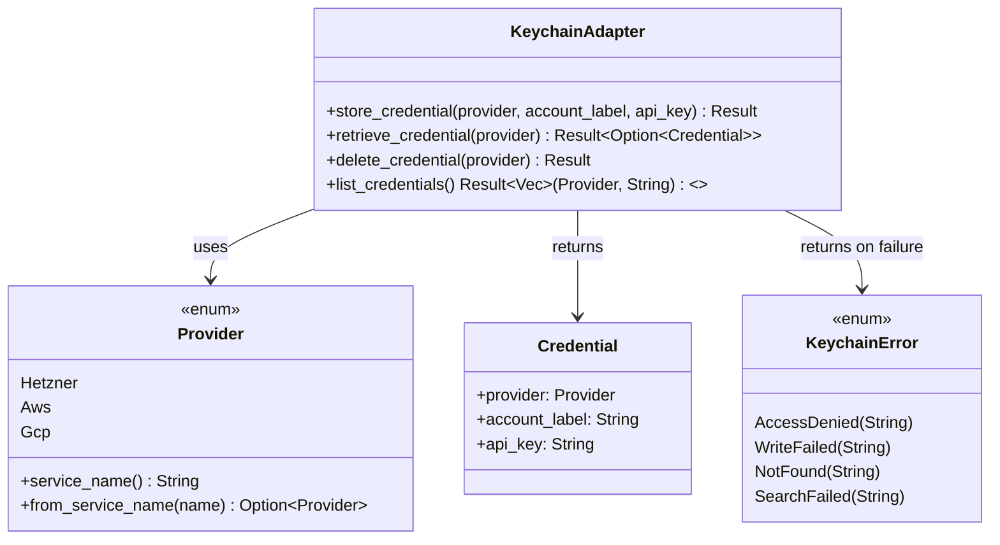

# PLAN -- M1.2 Keychain Adapter

## 1. Context

### A. Problem Statement

Implement the Keychain Adapter module -- the single point of credential access for Oh My VPN. All cloud provider API keys must be stored exclusively in macOS Keychain via Security Framework (NFR-SEC-1). Zero plaintext keys on disk.

### B. Current State

- `src-tauri/src/keychain_adapter.rs` exists as an empty stub (doc comment only)
- `src-tauri/src/error.rs` exists as an empty stub (doc comment only)
- `src-tauri/src/lib.rs` declares `mod keychain_adapter` with `#[allow(unused)]`
- No shared `Provider` enum exists yet -- needed by multiple modules (Keychain Adapter, Provider Manager, Session Tracker)
- Cargo.toml has only: `tauri`, `tauri-plugin-opener`, `serde`, `serde_json`

### C. Constraints

- macOS 13+ only (Security Framework availability is not a concern)
- Service name pattern: `oh-my-vpn.{provider}` (per API design §8.A)
- Provider set is fixed: `hetzner`, `aws`, `gcp`
- Module is internal only -- not IPC-exposed. Called by Provider Manager (M2)
- M1.4 (AppError + IPC scaffold) runs in parallel -- avoid conflicts in `error.rs`

### D. Verified Facts

1. **`security-framework` 3.7.0 works for CRUD**:
   - `set_generic_password(service, account, password)` -- store OK
   - `get_generic_password(service, account)` -- retrieve OK
   - `delete_generic_password(service, account)` -- delete OK
   - Verified: round-trip store → retrieve → delete → verify-deleted all pass

2. **`list_credentials` via search API works**:
   - `ItemSearchOptions::new().class(generic_password).load_attributes(true).limit(1000).search()` returns `Vec<SearchResult>`
   - Filter by `"svce"` key in `CFDictionary` starting with `"oh-my-vpn."`
   - Extract `"acct"` key for account label
   - Requires `core-foundation` crate for `CFString`/`TCFType` manipulation
   - Tested: successfully found 2 test entries among 127 total keychain items

3. **Dependencies needed**: `security-framework = "3.7.0"`, `core-foundation = "0.10.1"`

### E. Unverified Assumptions

1. **`set_generic_password` overwrites existing entries**: Believed true (macOS Keychain upsert behavior) -- risk: low. If not, delete-then-store as fallback.

## 2. Architecture

### A. Diagram

### B. Decisions

1. **Provider enum in a shared `types.rs` module**: Provider is needed across Keychain Adapter, Provider Manager, Session Tracker, and IPC. Placing it in `types.rs` avoids circular dependencies. (Principle: Single Responsibility)
2. **KeychainError stays in `keychain_adapter.rs`**: Domain-specific error kept with the module. M1.4 will add `From<KeychainError> for AppError` in `error.rs`. (Principle: Dependency Inversion -- error.rs depends on modules, not the reverse)
3. **`service_name()` method on Provider**: Encapsulates the `oh-my-vpn.{provider}` naming convention in one place. Reverse lookup via `from_service_name()` for the list operation. (Principle: Explicit over Implicit)
4. **No account name needed for `retrieve_credential`**: The API design shows retrieve takes only `provider`. Since each provider has exactly one credential, we use the search API to find the entry by service name alone, avoiding the need to know the account label upfront.

### C. Trade-offs

- **Full keychain scan for `list_credentials`**: Scans all generic passwords (tested: 127 items) and filters. Acceptable because: called infrequently (app launch, provider management UI), fixed 3-provider set, no performance-sensitive path.
- **`retrieve_credential` also uses search API** (not `get_generic_password`): Because `get_generic_password` requires both service AND account, but the API design only passes `provider`. The search API with service name filter avoids needing to know the account label. Cost: slightly more code, but correct API surface.

## 3. Steps

### Step 1: Add dependencies to Cargo.toml

- [ ] **Status**: pending
- **Scope**: `src-tauri/Cargo.toml`
- **Dependencies**: none
- **Description**: Add `security-framework` and `core-foundation` crate dependencies.
- **Acceptance Criteria**:
  - `security-framework = "3.7.0"` in `[dependencies]`
  - `core-foundation = "0.10.1"` in `[dependencies]`
  - `cargo check` passes

### Step 2: Create shared Provider enum

- [ ] **Status**: pending
- **Scope**: `src-tauri/src/types.rs`, `src-tauri/src/lib.rs`
- **Dependencies**: Step 1
- **Description**: Define the `Provider` enum with `Hetzner`, `Aws`, `Gcp` variants. Include `service_name()` and `from_service_name()` methods. Add Serde derives for future IPC use. Register `mod types` in `lib.rs`.
- **Acceptance Criteria**:
  - `Provider` enum with 3 variants
  - `service_name()` returns `"oh-my-vpn.hetzner"` etc.
  - `from_service_name("oh-my-vpn.aws")` returns `Some(Provider::Aws)`
  - `Display` trait implemented for human-readable output
  - Serde `Serialize`/`Deserialize` with lowercase string representation

### Step 3: Implement KeychainAdapter + KeychainError

- [ ] **Status**: pending
- **Scope**: `src-tauri/src/keychain_adapter.rs`
- **Dependencies**: Step 2
- **Description**: Implement the 4 methods defined in API design §4.G (MOD-KA). KeychainError enum for error cases. `Credential` struct for retrieve results.
- **Acceptance Criteria**:
  - `store_credential(provider, account_label, api_key)` writes to macOS Keychain with service `oh-my-vpn.{provider}`
  - `retrieve_credential(provider)` searches by service name, returns `Option<Credential>`
  - `delete_credential(provider)` removes the Keychain entry
  - `list_credentials()` returns all `(Provider, String)` pairs with `oh-my-vpn.*` service names
  - `KeychainError` enum with `AccessDenied`, `WriteFailed`, `NotFound`, `SearchFailed` variants
  - All Security Framework errors mapped to appropriate `KeychainError` variants

### Step 4: Write unit tests

- [ ] **Status**: pending
- **Scope**: `src-tauri/src/keychain_adapter.rs` (inline `#[cfg(test)]` module)
- **Dependencies**: Step 3
- **Description**: Unit tests for the full CRUD round-trip. Tests use a unique service prefix (`oh-my-vpn.test-*`) to avoid colliding with real entries. Tests clean up after themselves.
- **Acceptance Criteria**:
  - Test: store → retrieve → verify content matches → delete → verify gone
  - Test: retrieve non-existent returns `None`
  - Test: delete non-existent returns appropriate error
  - Test: list returns stored entries, filtered to oh-my-vpn prefix
  - Test: store overwrites existing entry (upsert behavior)
  - All tests pass with `cargo test -p oh-my-vpn`
  - Zero plaintext credentials remain after test cleanup

### Step 5: Build and lint verification

- [ ] **Status**: pending
- **Scope**: full `src-tauri/` crate
- **Dependencies**: Step 4
- **Description**: Verify the complete crate compiles and passes clippy. Remove `#[allow(unused)]` from `keychain_adapter` in `lib.rs` (the module is now populated).
- **Acceptance Criteria**:
  - `cargo build` succeeds
  - `cargo clippy` passes with no warnings for keychain_adapter module
  - `cargo test` all tests pass
  - `#[allow(unused)]` removed from `mod keychain_adapter` in lib.rs

## 4. Execution Strategy

| Step | Chain | Rationale |
| --- | --- | --- |
| 1 | Direct | Single line addition to Cargo.toml |
| 2 | scout → worker | New file, needs to verify no existing types.rs conflicts |
| 3 | scout → worker | Core implementation, well-defined API contract |
| 4 | scout → worker | Tests reference the implementation from Step 3 |
| 5 | Direct | Verification commands only |

**Execution order**: Sequential (1 → 2 → 3 → 4 → 5). Each step builds on the previous.

**Estimated complexity**: Medium (2--3 files, clear scope, verified API).

**Risk flags**: None -- all technical assumptions verified via spike.
