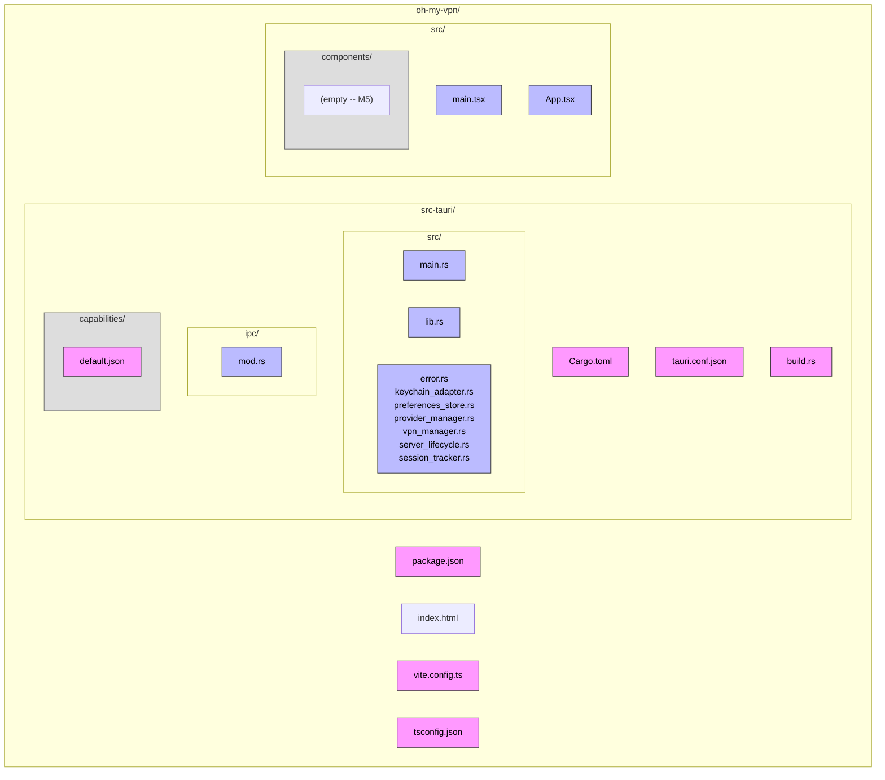

# PLAN -- M1.1: Tauri Project Initialization

## 1. Context

### A. Problem Statement

Oh My VPN has comprehensive architecture documentation but zero source code. M1.1 initializes the Tauri v2 project with React-TS frontend and Rust backend, establishing the skeleton that all subsequent milestones (M1.2--M6.4) build upon. The project must be configured as a **menu bar (tray) app** -- not a standard windowed application.

### B. Current State

- Project root contains only `docs/`, `AGENTS.md`, `.gitignore`, `.github/`
- No `package.json`, `Cargo.toml`, `src/`, or `src-tauri/` exist
- Design tokens CSS exists at `docs/ui-design/tokens.css` (integrated in M1.5, not this module)

### C. Constraints

- macOS 13+ (Ventura or later) -- deployment target per `docs/architecture/deployment.md`
- Tauri v2 (not v1) -- `tauri-cli 2.10.0` already installed
- Bun as package manager -- project convention
- App identifier: `com.saemanas.oh-my-vpn`

### D. Input Sources

- `docs/architecture/containers.md` -- §1-2 (container diagram, module layout)
- `docs/architecture/deployment.md` -- §2.A (macOS machine node)
- `docs/adr/0007-tauri-updater-with-github-releases.md` (Tauri config)
- Milestone document: M1.1 acceptance criteria

### E. Verified Facts

| # | What Was Tested | Result | Decision |
| --- | --- | --- | --- |
| V1 | `cargo tauri --version` | `tauri-cli 2.10.0` | Use existing tauri-cli, no install needed |
| V2 | `bun --version` | `1.3.5` | Use bun as package manager |
| V3 | `rustc --version` | `1.93.1` | Compatible with Tauri v2 |
| V4 | `sw_vers` | macOS 26.3 | Development machine exceeds macOS 13+ target |
| V5 | `cargo search tauri` | `tauri = "2.10.3"` latest | Use latest Tauri v2 crate |
| V6 | `bun x create-tauri-app` spike in `/tmp/tauri-spike` | Successfully generates react-ts + bun project with Tauri v2 | Use `create-tauri-app` with `-m bun -t react-ts` as starting point |
| V7 | Spike template structure analysis | Template uses `src-tauri/src/lib.rs` + `main.rs` pattern, `src-tauri/capabilities/default.json`, Vite on port 1420 | Customize template output -- do not start from scratch |
| V8 | Tauri v2 tray config via Context7 | `TrayIconBuilder` in Rust `setup()`, `menuOnLeftClick: false` for popover behavior, window `visible: false` for tray-only app | Configure window as hidden + tray icon in `setup()` |
| V9 | Declarative + programmatic tray icon duplication | `tauri.conf.json` `trayIcon` section AND `TrayIconBuilder` in `setup()` both create tray icons -- results in 2 icons in menu bar | Remove declarative `trayIcon` from config; use only programmatic `TrayIconBuilder` (needs event handlers) |

### F. Unverified Assumptions

| # | Assumption | Why Not Verified | Risk | Fallback |
| --- | --- | --- | --- | --- |
| U1 | `create-tauri-app` output in existing non-empty directory (has `docs/`, `AGENTS.md`) works with `--force` flag | Spike ran in clean `/tmp` directory | Low -- `-f` flag exists for this purpose | Run in `/tmp` then copy files, or use `cargo tauri init` separately |
| U2 | Tauri v2 window `visible: false` + tray icon works as menu bar app pattern on macOS | Not tested with actual build, only confirmed via docs | Low -- well-documented pattern in Tauri v2 docs | Fall back to standard window initially, convert to tray in M5.6 |

---

## 2. Architecture

### A. Diagram



### B. Decisions

| Decision | Rationale | Principle |
| --- | --- | --- |
| Use `create-tauri-app` template then customize | Verified template works (V6); faster than manual setup, ensures correct Tauri v2 boilerplate | Fail Fast -- start from known-good state |
| Scaffold empty Rust module files for future modules | M1.2--M1.4 need these paths; empty `mod` declarations prevent import errors during incremental development | Explicit over Implicit |
| Window `visible: false` + tray icon | Menu bar app per UX design -- no dock icon, no standard window | Single Responsibility -- UI is popover, not window |
| Keep Vite defaults (port 1420, react plugin) | Template defaults are correct for this project; no reason to change | Reversibility -- easy to adjust later |

### C. Boundaries

| Boundary | Responsibility | Created in M1.1 |
| --- | --- | --- |
| `src-tauri/src/` | Rust backend modules | `main.rs`, `lib.rs` (skeleton only) |
| `src-tauri/src/ipc/` | IPC command handlers | `mod.rs` (empty -- M1.4) |
| `src-tauri/capabilities/` | Tauri v2 permission definitions | `default.json` with `core:default` |
| `src/` | TypeScript frontend | `main.tsx`, `App.tsx` (minimal placeholder) |
| `src/components/` | React components | Empty directory (populated in M5) |

### D. Trade-offs

| Considered | Chosen | Why |
| --- | --- | --- |
| `cargo tauri init` in existing project | `create-tauri-app` with `--force` | `create-tauri-app` generates both frontend and backend scaffolding in one command; `cargo tauri init` only generates `src-tauri/` and requires manual frontend setup |
| Pre-create all module files with stub implementations | Empty `mod` declarations only | Stubs would be throwaway code; empty mods mark boundaries without wasted effort |
| Standard windowed app, convert to tray later | Tray-only from day one | Avoids rework; the app is architecturally a menu bar app, not a window app |

---

## 3. Steps

### Step 1: Scaffold Tauri Project

- [x] **Status**: done
- **Scope**: project root -- all generated files from `create-tauri-app`
- **Dependencies**: none
- **Description**: Run `bun x create-tauri-app` with react-ts template in the project directory. Use `--force` flag since directory is non-empty. After scaffold, verify `.gitignore` was not destructively overwritten (preserve project-specific entries). Run `bun install` immediately to lock dependencies.
- **Acceptance Criteria**:
  - `package.json` exists with `@tauri-apps/api`, `react`, `react-dom` dependencies
  - `src-tauri/Cargo.toml` exists with `tauri` v2 dependency
  - `src-tauri/src/main.rs` and `src-tauri/src/lib.rs` exist
  - `vite.config.ts`, `tsconfig.json`, `index.html` exist
  - `bun install` succeeds
  - `.gitignore` retains project-specific entries (PLAN.md, .pi/, etc.)

### Step 2: Configure App Identity and Menu Bar

- [x] **Status**: done
- **Scope**: `src-tauri/tauri.conf.json`
- **Dependencies**: Step 1
- **Description**: Update `tauri.conf.json`:
  - `productName`: `Oh My VPN`
  - `identifier`: `com.saemanas.oh-my-vpn`
  - `version`: `0.1.0`
  - Window: `visible: false`, `skipTaskbar: true`, `width: 320`, `height: 480`
  - Tray icon: `iconPath: icons/icon.png`, `id: main`, `menuOnLeftClick: false`
  - Bundle targets: macOS only for MVP
  - Security: keep `csp: null` for development (tighten in later milestone)
- **Acceptance Criteria**:
  - `productName` is `Oh My VPN`
  - `identifier` is `com.saemanas.oh-my-vpn`
  - Window configured with `visible: false`
  - Tray icon section present with `menuOnLeftClick: false`
  - Bundle targets restricted to macOS

### Step 3: Set Up Rust Backend Module Structure

- [x] **Status**: done
- **Scope**: `src-tauri/src/lib.rs`, `src-tauri/src/error.rs`, `src-tauri/src/keychain_adapter.rs`, `src-tauri/src/preferences_store.rs`, `src-tauri/src/provider_manager.rs`, `src-tauri/src/vpn_manager.rs`, `src-tauri/src/server_lifecycle.rs`, `src-tauri/src/session_tracker.rs`, `src-tauri/src/ipc/mod.rs`
- **Dependencies**: Step 1
- **Description**: Create module files matching `containers.md` §3 backend module layout. Each file contains a doc comment describing its responsibility (from containers.md). Add `mod` declarations in `lib.rs`. Set up `TrayIconBuilder` in `tauri::Builder::default().setup()` with:
  - Tray icon from bundled icon
  - Left-click: show/focus main window (popover placeholder)
  - Right-click: placeholder context menu with "Quit" item
  - On "Quit" menu click: `std::process::exit(0)`
- **Acceptance Criteria**:
  - All 8 module files exist under `src-tauri/src/`
  - `src-tauri/src/ipc/mod.rs` exists
  - `lib.rs` has `mod` declarations (with `#[allow(unused)]` or cfg-gated)
  - `lib.rs` includes tray icon setup in `setup()` hook
  - `cargo check` passes in `src-tauri/`

### Step 4: Set Up Frontend Structure and Clean Boilerplate

- [x] **Status**: done
- **Scope**: `src/App.tsx`, `src/main.tsx`, `src/App.css`, `src/assets/`, `public/`, `index.html`
- **Dependencies**: Step 1
- **Description**: Remove template boilerplate (demo CSS, logos, greet function). Create minimal `App.tsx` rendering "Oh My VPN" placeholder text. Create `src/components/` directory with `.gitkeep`. Update `index.html` title to `Oh My VPN`. Remove `src/App.css`, `src/assets/react.svg`, `public/vite.svg`, `public/tauri.svg`.
- **Acceptance Criteria**:
  - `App.tsx` renders minimal placeholder (app name only)
  - Template demo files removed
  - `src/components/.gitkeep` exists
  - `index.html` title is `Oh My VPN`
  - No template-specific code remains (greet function, logos, demo styles)

### Step 5: Verify Build and Launch

- [x] **Status**: done
- **Scope**: full project
- **Dependencies**: Steps 2, 3, 4
- **Description**: Run `cargo check` in `src-tauri/` to verify Rust compilation. Run `cargo tauri dev` to verify the app launches on macOS -- tray icon should appear in menu bar. Verify: no main window visible, tray icon present, right-click shows "Quit" menu. Capture evidence of successful build.
- **Acceptance Criteria**:
  - `cargo check` in `src-tauri/` passes
  - `cargo tauri dev` launches successfully
  - Tray icon visible in macOS menu bar
  - No main window appears on launch (hidden by design)
  - Right-click context menu shows "Quit" option
  - Directory structure matches containers.md module layout

---

## 4. Execution Strategy

| Step | Chain | Complexity | Rationale |
| --- | --- | --- | --- |
| 1 | Direct | Trivial | Single command execution + dependency install |
| 2 | Direct | Trivial | Single file edit with known config values |
| 3 | scout → worker | Simple | Multiple files, needs containers.md reference and Tauri v2 tray API |
| 4 | Direct | Trivial | Delete boilerplate, write minimal placeholder |
| 5 | Direct | Trivial | Run commands and verify output |

### A. Execution Order

```plain
Step 1 → Step 2 ─┐
            Step 3 ─┤ (parallel after Step 1)
            Step 4 ─┘
                  → Step 5 (after all above)
```

Steps 2, 3, 4 are parallelizable after Step 1. Step 5 is the final verification gate.

### B. Risk Flags

| Step | Risk | Mitigation |
| --- | --- | --- |
| 1 | `--force` in non-empty directory may overwrite `.gitignore` | Back up `.gitignore` before scaffold; restore project-specific entries if overwritten |
| 3 | Tray icon setup requires correct Tauri v2 API usage | Verified via Context7 docs (V8); if tray fails at runtime, fall back to visible window for now |
