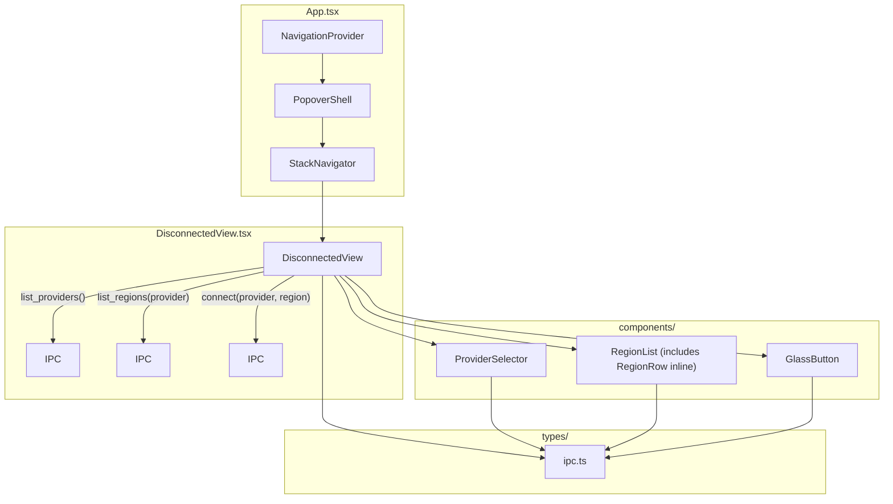

> **Status**: Completed at 2026-03-05T18:16:00+07:00
> **Branch**: feat/menu-bar-disconnected-view

# PLAN: M5.2 -- Disconnected View

## 1. Context

### A. Problem Statement

Build the Disconnected View for the Menu Bar UI -- the primary screen users see when no VPN connection is active. It includes a provider selector (when multiple providers are registered), a region list sorted by hourly cost, and a connect button. This wires the frontend to the backend IPC commands (`list_providers`, `list_regions`, `connect`) implemented in M2.5 and M4.5.

### B. Current State

- **M5.1 complete**: `PopoverShell`, `StackNavigator`, `NavigationProvider`, `BackButton` exist in `src/`
- **Backend IPC ready**: `list_providers`, `list_regions`, `connect` commands implemented in `src-tauri/src/ipc/provider.rs` and `server.rs`
- **Placeholder view**: `src/views/PlaceholderView.tsx` (HomeView) is the current initial view -- needs replacement
- **Liquid Glass CSS**: 4-layer sandwich pattern in `src/styles/liquid-glass.css` with `.glass-btn` shape
- **Design tokens**: `src/tokens.css` with all semantic colors, spacing, typography, and motion tokens

### C. Constraints

- `get_preferences` IPC is a NOT_IMPLEMENTED stub (M6.2 scope) -- last-used region pre-selection must gracefully degrade
- M5.4 (Provisioning Stepper) not yet built -- connect button triggers IPC but navigation target is placeholder
- Popover width fixed at 320px (PopoverShell constraint)
- Must support dark/light mode via `prefers-color-scheme`
- Must support `prefers-reduced-motion`

### D. Verified Facts

| # | Fact | Evidence |
| --- | --- | --- |
| 1 | Tauri IPC invoke: `invoke<T>(cmd, args?)` from `@tauri-apps/api/core` | `node_modules/@tauri-apps/api/core.d.ts` |
| 2 | `RegionInfo`, `ProviderInfo`, `ServerInfo` serialize as **camelCase** JSON (`rename_all = "camelCase"` added) | `src-tauri/src/types.rs` -- serde rename attribute added during scanning |
| 3 | `SessionStatus` serializes as **camelCase** JSON (`#[serde(rename_all = "camelCase")]`) | `src-tauri/src/session_tracker.rs` |
| 4 | `list_regions` returns regions already sorted by `hourly_cost` ascending | `src-tauri/src/ipc/provider.rs` line ~160 |
| 5 | `list_providers` returns empty array when no providers registered (triggers onboarding) | `src-tauri/src/ipc/provider.rs` |
| 6 | Navigation API: `push(id, title, component)` and `pop()` from `useNavigation()` hook | `src/navigation/stack-context.tsx` |

### E. Unverified Assumptions

| # | Assumption | Risk | Fallback |
| --- | --- | --- | --- |
| 1 | Flag emoji rendering works in Tauri webview (WebKit) from country code extraction | Low -- WebKit supports regional indicator symbols | Show country code text instead of emoji |

---

## 2. Architecture

### A. Diagram



### B. Decisions

1. **View vs Component separation** -- `DisconnectedView` in `src/views/` (matches existing PlaceholderView pattern), reusable components in `src/components/`. Principle: Single Responsibility.
2. **GlassButton extraction** -- Extract Liquid Glass button markup into a reusable component with variant support (success/error/neutral/warning/info). Principle: Composition over Inheritance. Reused by M5.3, M5.5.
3. **TypeScript IPC types** -- Mirror backend Rust types in `src/types/ipc.ts` with camelCase JSON field names (all structs now use `rename_all = "camelCase"`). Principle: Explicit over Implicit.
4. **Graceful degradation for preferences** -- Call `get_preferences` wrapped in try/catch. On failure (NOT_IMPLEMENTED), skip last-used region pre-selection. When M6.2 implements it, feature activates automatically. Principle: Reversibility.
5. **Connect navigation placeholder** -- Connect button invokes `connect` IPC. On success, push a temporary "Connecting..." view. M5.4 (Provisioning Stepper) will replace it. Principle: Reversibility.

### C. Component Structure

```plain
src/
├── types/
│   └── ipc.ts                    # IPC type definitions
├── components/
│   ├── GlassButton.tsx           # Reusable Liquid Glass button (variants)
│   ├── ProviderSelector.tsx      # Provider dropdown (>1 provider)
│   ├── RegionList.tsx            # Scrollable region list + RegionRow
│   └── PopoverShell.tsx          # (existing)
├── views/
│   ├── DisconnectedView.tsx      # Container: state, IPC, composition
│   └── PlaceholderView.tsx       # (existing -- HomeView replaced)
└── App.tsx                       # Wire DisconnectedView as initial view
```

### D. Data Flow

1. **Mount**: `DisconnectedView` calls `list_providers()` → if 1 provider, auto-select; if >1, show `ProviderSelector`
2. **Provider selected**: calls `list_regions(provider)` → populates `RegionList` (shows skeleton during load)
3. **Region selected**: stores in local state; last-used region pre-selected if preferences available
4. **Connect clicked**: calls `connect(provider, region)` → shows loading state on button → on success, pushes placeholder connected view

### E. Key Specs from UI Design

- **Region row**: flag emoji + region name + instance type (caption, secondary) + hourly cost (SF Mono, right-aligned)
- **Region list**: scrollable, skeleton rows (3 shimmer rows) during loading
- **Connect button**: success variant (`--color-success-tint`), Liquid Glass 4-layer
- **Provider selector**: visible only when multiple providers registered
- **GlassButton states**: default, hover (scale 1.02), active (scale 0.97), disabled (opacity 0.4), loading (spinner + warning tint)
- **Focus indicator**: `box-shadow: 0 0 0 3px rgba(59, 130, 246, 0.4)` on `:focus-visible`

---

## 3. Steps

### Step 1: IPC Types + GlassButton

- [x] **Status**: completed at 2026-03-05T17:58:00+07:00
- **Scope**: `src/types/ipc.ts`, `src/components/GlassButton.tsx`, `src/components/GlassButton.css`
- **Dependencies**: none
- **Description**: Create TypeScript type definitions mirroring backend Rust types (Provider, ProviderInfo, RegionInfo, SessionStatus, etc.) with exact JSON field names. Create a reusable GlassButton component with Liquid Glass 4-layer sandwich, variant support (success/error/neutral/warning/info), states (default/hover/active/disabled/loading), and focus-visible indicator.
- **Acceptance Criteria**:
  - `src/types/ipc.ts` exports: `Provider`, `ProviderStatus`, `ProviderInfo`, `RegionInfo`, `SessionStatus`, `OrphanedServer`, `OrphanAction`
  - Field names match actual JSON serialization (camelCase for all: RegionInfo, ProviderInfo, SessionStatus, OrphanedServer)
  - `GlassButton` renders Liquid Glass 4-layer structure with configurable `variant`, `disabled`, `loading`, `onClick`, `children` props
  - Button hover scales 1.02 with padding expand, active scales 0.97
  - Loading state shows spinner with warning tint
  - Disabled state shows opacity 0.4
  - `:focus-visible` shows glow ring (`0 0 0 3px rgba(59, 130, 246, 0.4)`)
  - Dark mode support via existing CSS token variables
  - Reduced motion: transitions become 200ms linear

### Step 2: ProviderSelector + RegionList

- [x] **Status**: completed at 2026-03-05T18:05:00+07:00
- **Scope**: `src/components/ProviderSelector.tsx`, `src/components/ProviderSelector.css`, `src/components/RegionList.tsx`, `src/components/RegionList.css`
- **Dependencies**: Step 1
- **Description**: Create ProviderSelector (renders only when >1 provider, shows provider name + account label, triggers onSelect callback) and RegionList (scrollable list of RegionRow items with flag emoji, region name, hourly cost right-aligned in SF Mono; skeleton loading state with 3 shimmer rows; selected state for last-used region; triggers onSelect callback).
- **Acceptance Criteria**:
  - `ProviderSelector` props: `providers: ProviderInfo[]`, `selectedProvider: Provider`, `onSelect: (provider: Provider) => void`
  - `ProviderSelector` renders nothing when `providers.length <= 1`
  - Each provider option shows provider name (capitalized) and account label
  - `RegionList` props: `regions: RegionInfo[]`, `selectedRegion: string | null`, `onSelect: (region: string) => void`, `isLoading: boolean`
  - When `isLoading`, shows 3 skeleton rows with CSS shimmer animation
  - Each region row: flag emoji (derived from displayName country code) + region display name + instance type (caption size, secondary color) + `$X.XXX/hr` in SF Mono right-aligned
  - Selected region row has glass tint highlight
  - Hover state on region rows with glass tint
  - Scrollable with hidden scrollbar (matches PopoverShell pattern)
  - Keyboard accessible: Tab navigates rows, Enter/Space selects
  - Dark mode and reduced motion support

### Step 3: DisconnectedView + App Wiring

- [x] **Status**: completed at 2026-03-05T18:15:00+07:00
- **Scope**: `src/views/DisconnectedView.tsx`, `src/views/DisconnectedView.css`, `src/App.tsx` (update)
- **Dependencies**: Step 1, Step 2
- **Description**: Create the DisconnectedView container that manages state (providers, regions, selected provider/region, loading states, errors), calls IPC commands (`list_providers`, `list_regions`, `connect`, `get_preferences`), composes ProviderSelector + RegionList + GlassButton, and handles connect flow. Update App.tsx to use DisconnectedView as the initial view, replacing HomeView. Attempt `get_preferences` for last-used region with graceful fallback.
- **Acceptance Criteria**:
  - On mount: calls `list_providers()` → auto-selects if single provider → calls `list_regions(provider)`
  - Provider change triggers fresh `list_regions()` call with loading state
  - Connect button (success variant) enabled only when a region is selected
  - Connect button click: shows loading state → calls `connect(provider, region)` → on success pushes placeholder view → on error shows inline error message
  - Attempts `get_preferences` on mount for `last_provider`/`last_region` pre-selection; catches error silently if not implemented
  - Error state: shows error message with retry option when `list_providers` or `list_regions` fails
  - `App.tsx` renders `DisconnectedView` as initial NavigationProvider view (replaces HomeView)
  - PlaceholderView.tsx cleaned up (remove HomeView, keep DetailView if needed or remove entirely)

---

## 4. Execution Strategy

| Step | Chain | Rationale |
| --- | --- | --- |
| 1 | scout → worker | Foundation files (types + button), 2-3 files, clear spec from UI design |
| 2 | scout → worker | Presentational components, 2-4 files, depends on Step 1 types |
| 3 | scout → worker → reviewer | Container with IPC integration + App wiring, highest complexity, reviewer validates IPC correctness and state management |

**Execution order**: Step 1 → Step 2 → Step 3 (strictly sequential)

**Complexity estimates**:

| Step | Tier | Estimated Tokens |
| --- | --- | --- |
| 1 | Simple | ~15K |
| 2 | Medium | ~25K |
| 3 | Medium | ~30K |

**Risk flags**:

- Step 3: `connect` IPC success handler needs a navigation target. M5.4 (Provisioning Stepper) is not built. Plan: push a minimal placeholder "Connecting..." view. Record for M5.4 to replace.
- Step 3: `get_preferences` returns NOT_IMPLEMENTED error. Plan: wrap in try/catch, default to no pre-selection.

---
