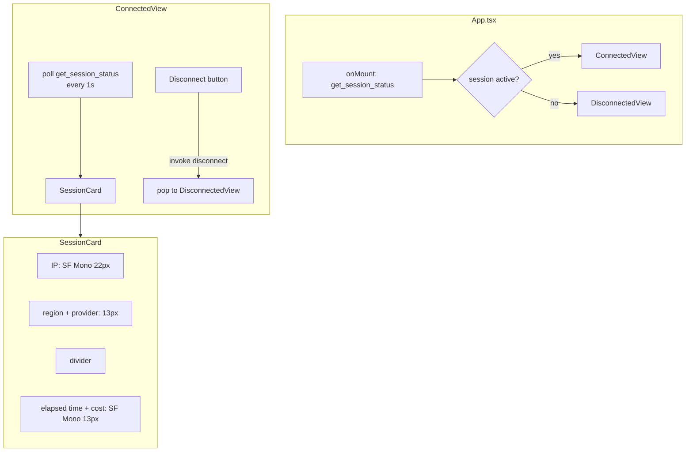

> **Status**: Completed at 2026-03-05T19:05:00+07:00
> **Branch**: feat/connected-view

# PLAN.md -- M5.3: Connected View + Session Card

## 1. Context

### A. Problem Statement

After a VPN connection is established, the user needs a view showing session status (IP, region, elapsed time, cost) and a disconnect button. Currently, `App.tsx` always starts with `DisconnectedView` and the connect flow pushes a placeholder `ConnectingView`. No connected state UI exists.

### B. Current State

- **Navigation**: Stack-based (`NavigationProvider` + `StackNavigator`), push/pop with spring easing slide
- **Existing pattern**: `DisconnectedView` demonstrates the full pattern -- IPC calls via `invoke`, error handling, Liquid Glass 4-layer sandwich, CSS with design tokens
- **IPC types**: `SessionStatus` defined in `src/types/ipc.ts` -- currently has `region` (code only), missing `regionDisplayName` for UI display
- **Backend structs**: `ActiveSession` and `SessionStatus` in `src-tauri/src/session_tracker.rs` -- both lack `region_display_name` field
- **Backend IPC**: `get_session_status` returns `Option<SessionStatus>`, `disconnect` returns `()`
- **Components**: `GlassButton` (reusable), `RegionList` (reference for glass card pattern)

### C. Constraints

- Popover width fixed at 320px (set by `.popover .liquidGlass-text` in `liquid-glass.css`)
- M5.5 (Destruction Confirm Dialog) not yet implemented -- disconnect button calls IPC directly for now
- M5.4 (Provisioning Stepper) not yet implemented -- connect success path remains placeholder
- Polling `get_session_status` must stop when view unmounts to prevent memory leaks

### D. Verified Facts

1. **SessionStatus gap** -- `SessionStatus` (both Rust and TS) has `region: String` (code like `"fsn1"`) but no `regionDisplayName`. UI wireframe requires `"Frankfurt · Hetzner"` with flag emoji. Must add `region_display_name` to `ActiveSession` + `SessionStatus` in backend, and `regionDisplayName` to TS type
2. **GlassButton** -- supports `variant="error"` for destructive actions (disconnect)
3. **Navigation context** -- `push()` and `pop()` available via `useNavigation()` hook
4. **Design tokens** -- `--font-family-mono`, `--color-success-tint`, `--font-size-caption` all defined in `tokens.css`
5. **Liquid Glass pattern** -- 4-layer sandwich (`wrapper/effect/tint/shine/text`) established in `RegionList.tsx` and `GlassButton.tsx`
6. **Connect flow has displayName** -- `connect` IPC receives `provider` + `region` code, and internally calls `list_regions` which returns `RegionInfo.displayName`. The display name is available at session creation time

### E. Unverified Assumptions

1. **`get_session_status` backend** -- assumed functional and returns live-calculated `elapsedSeconds` / `accumulatedCost`. Risk: low (M4.5 completed). Fallback: client-side calculation from `hourlyCost` and local timer.

---

## 2. Architecture

### A. Diagram

### B. Decisions

1. **App-level session check**: `App.tsx` checks `get_session_status` on mount to determine initial view. This handles app restart with active session (orphan scenario). **Principle**: Fail Fast -- detect state at boundary.
2. **1-second polling**: `setInterval` in `useEffect` with cleanup. Matches UX spec "live-calculated elapsed time". **Principle**: Explicit over Implicit -- side effect declared in effect.
3. **SessionCard as pure component**: Receives `SessionStatus` props, no internal state or IPC. **Principle**: Single Responsibility -- display only.
4. **Disconnect without confirm**: M5.5 not implemented. Direct `invoke("disconnect")` call. M5.5 will wrap this with a confirm dialog later. **Principle**: Reversibility -- easy to insert dialog layer.

### C. Boundaries

| File | Responsibility |
| --- | --- |
| `src/components/SessionCard.tsx` | Pure display: IP, region, time, cost |
| `src/views/ConnectedView.tsx` | IPC polling, disconnect handler, layout |
| `src/views/ConnectedView.css` | Styling for both ConnectedView and SessionCard |
| `src/App.tsx` | Session check on mount, conditional initial view |

---

## 3. Steps

### Step 1: Add `regionDisplayName` to Backend + Frontend Types

- [x] **Status**: completed at 2026-03-05T18:55:00+07:00
- **Scope**: `src-tauri/src/session_tracker.rs`, `src-tauri/src/server_lifecycle/connect.rs`, `src/types/ipc.ts`
- **Dependencies**: none
- **Description**: Add `region_display_name: String` field to `ActiveSession` and `SessionStatus` structs in the backend. Update the connect flow to pass `RegionInfo.display_name` when creating the session. Add `regionDisplayName: string` to the frontend `SessionStatus` interface. Existing `active-session.json` files without the field will use `region` code as fallback via `#[serde(default)]`.
- **Acceptance Criteria**:
  - `ActiveSession` struct has `region_display_name: String` field
  - `SessionStatus` struct has `region_display_name: String` field
  - `SessionTracker::get_status()` maps `region_display_name` from `ActiveSession` to `SessionStatus`
  - Connect flow passes `RegionInfo.display_name` to `SessionTracker::create_session()`
  - `#[serde(default)]` on `region_display_name` for backward compatibility with existing session files
  - `src/types/ipc.ts` `SessionStatus` interface includes `regionDisplayName: string`
  - `cargo check` passes

### Step 2: SessionCard Component

- [x] **Status**: completed at 2026-03-05T18:58:00+07:00
- **Scope**: `src/components/SessionCard.tsx`
- **Dependencies**: Step 1
- **Description**: Create a pure presentational component that renders the session info card. Receives `SessionStatus` as props. Uses Liquid Glass inner card with success tint. IP in SF Mono 22px semibold, region with flag emoji + provider name in 13px, divider, metrics row with elapsed time and cost in SF Mono 13px.
- **Acceptance Criteria**:
  - Renders IP address in `SF Mono 22px semibold`
  - Shows flag emoji + region displayName + provider (e.g., "🇩🇪 Frankfurt · Hetzner")
  - Divider separates identity from metrics
  - Elapsed time formatted as `HH:MM:SS` with timer icon
  - Cost formatted as `$X.XXX` with dollar icon
  - Metrics row uses `space-between` layout
  - Liquid Glass 4-layer sandwich with success tint (opacity 0.10)

### Step 3: ConnectedView + CSS

- [x] **Status**: completed at 2026-03-05T19:02:00+07:00
- **Scope**: `src/views/ConnectedView.tsx`, `src/views/ConnectedView.css`
- **Dependencies**: Step 2
- **Description**: Create the connected state view with status badge, SessionCard, and disconnect button. Polls `get_session_status` every 1 second via `setInterval`. Disconnect button calls `invoke("disconnect")` and navigates back to disconnected state. Includes loading and error states. CSS covers both ConnectedView layout and SessionCard glass styling.
- **Acceptance Criteria**:
  - "CONNECTED" status badge with green dot at top
  - SessionCard rendered with live session data
  - Polls `get_session_status` every 1 second, updates SessionCard
  - Polling stops on unmount (cleanup in `useEffect`)
  - Disconnect button uses `GlassButton variant="error"`
  - Disconnect loading state (button shows spinner)
  - Disconnect error shown inline with retry
  - On disconnect success: navigate back (pop or replace with DisconnectedView)
  - CSS uses design tokens (`--font-family-mono`, `--color-success`, `--space-*`)
  - Dark mode support via `prefers-color-scheme`

### Step 4: App.tsx Session Check

- [x] **Status**: completed at 2026-03-05T19:05:00+07:00
- **Scope**: `src/App.tsx`
- **Dependencies**: Step 3
- **Description**: Add session check on app mount. Call `get_session_status` -- if active session exists, set initial view to `ConnectedView` instead of `DisconnectedView`. Handle loading state while checking.
- **Acceptance Criteria**:
  - On mount: calls `get_session_status` before rendering initial view
  - Active session → `ConnectedView` as initial view with session data passed
  - No session → `DisconnectedView` as initial view (current behavior)
  - Loading state while checking (brief, no flash)
  - Error fallback: default to `DisconnectedView`

---

## 4. Execution Strategy

| Step | Chain | Rationale |
| --- | --- | --- |
| 1 | Direct | Backend struct field addition + TS type update, 3 files, mechanical changes |
| 2 | Direct | Pure presentational component, single file, clear spec from wireframe |
| 3 | Direct | Follows established DisconnectedView pattern closely, 2 files (view + CSS) |
| 4 | Direct | Small edit to existing file, ~20 lines added |

**Execution order**: Step 1 → Step 2 → Step 3 → Step 4 (sequential, dependency chain)

**Estimated complexity**: All Simple tier. Total ~4 new files + 3 edits, ~350 lines.

**Risk flags**: None. All patterns established, all types defined, all IPC commands exist.

---
