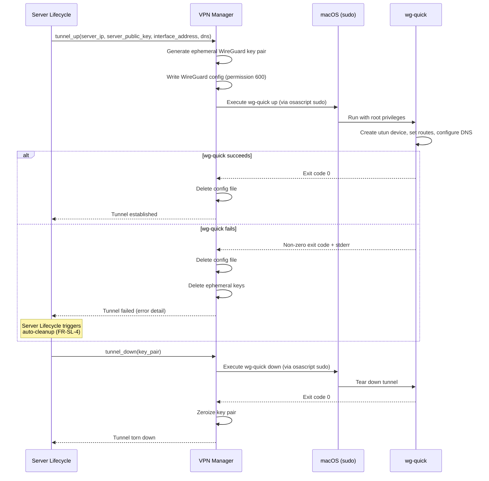

# ADR-0001: Use wireguard-go with wg-quick for VPN Tunnel Management

## Status

Accepted

## Datetime

2026-03-03T07:25:00+07:00

## Context

Oh My VPN needs to create and tear down WireGuard tunnels on macOS. The implementation choice determines the dependency model, privilege requirements, and development effort for the VPN Manager module.

This resolves PRD Open Question OQ-1: "WireGuard tunnel control via userspace implementation (boringtun) or system WireGuard client dependency?"

## Decision Drivers

- MVP development speed -- solo developer, minimize implementation effort
- No Apple Developer Program dependency -- avoid $99/year cost and entitlement review process
- Proven stability -- production-tested WireGuard tunnel management on macOS
- Tauri compatibility -- must integrate with Rust backend via subprocess control

## Considered Options

1. **boringtun (Rust userspace)** -- Cloudflare's Rust WireGuard implementation, embedded directly in the Tauri backend
2. **wireguard-go + wg-quick (system client)** -- Official WireGuard CLI tools bundled with the app
3. **WireGuard macOS App tunnel extension** -- Delegate tunnel management to the official WireGuard macOS app

## Decision Outcome

Chosen option: "wireguard-go + wg-quick", because it provides a proven, stable tunnel management solution without requiring Network Extension entitlements or extensive low-level implementation work.

### Consequences

- **Good**: TUN device creation, routing, and DNS configuration are handled automatically by `wg-quick`
- **Good**: No Network Extension required -- `wg-quick` creates utun devices via sudo, bypassing the need for Apple Developer Program entitlement
- **Good**: Battle-tested in production across thousands of macOS installations
- **Good**: Bundling `wireguard-go` and `wg-quick` inside the .app eliminates user-side installation
- **Bad**: Requires sudo (root) privilege escalation for `wg-quick up/down` -- user sees a password prompt
- **Bad**: CLI wrapping means error handling relies on parsing stdout/stderr text
- **Bad**: External process management adds complexity compared to in-process library calls
- **Neutral**: Future migration to boringtun remains possible if Network Extension becomes necessary (e.g., App Store distribution)

## Diagram

This diagram covers VPN tunnel management only -- the phase **after** Server Lifecycle has completed server provisioning and cloud-init. For the full connect flow, see [containers.md](../architecture/containers.md) (Server Lifecycle orchestrates Provider Manager then VPN Manager).

The VPN Manager orchestrates `wg-quick` as a subprocess, called by Server Lifecycle. Privilege escalation is handled via `osascript` (macOS authorization dialog). The WireGuard config file exists only momentarily between write and tunnel establishment, then is deleted (NFR-SEC-6). On failure, Server Lifecycle handles auto-cleanup per the error handling strategy in [cross-cutting-concepts.md](../architecture/cross-cutting-concepts.md).

## Links

- Related: [ADR-0003](0003-no-network-extension-for-mvp.md), PRD OQ-1, OQ-3
- Principles: Fail Fast, Reversibility

---
