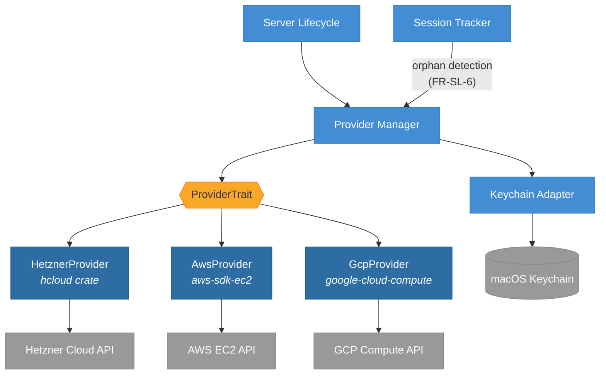

# ADR-0002: Use Rust SDK for Cloud Provider Integration

## Status

Accepted

## Datetime

2026-03-03T07:28:00+07:00

## Context

Oh My VPN's Provider Manager must interact with Hetzner, AWS, and GCP APIs to provision and destroy ephemeral VPN servers. The integration pattern determines dependency model, error handling reliability, and development effort.

This resolves PRD Open Question OQ-2: "Direct HTTP API calls or CLI tool (hcloud, aws, gcloud) wrapping?"

## Decision Drivers

- Type safety -- cloud API errors must be caught at compile time, not runtime string parsing
- No external binary dependency -- users should not install CLI tools separately
- ADR-0001 already uses CLI wrapping for wg-quick -- adding more subprocess dependencies increases fragility
- Sustainable maintenance -- SDK updates track API changes automatically

## Considered Options

1. **Direct HTTP API calls** -- Use `reqwest` to call each provider's REST API directly
2. **CLI tool wrapping** -- Execute `hcloud`, `aws`, `gcloud` as subprocesses
3. **Rust SDK** -- Use each provider's official or community Rust SDK

## Decision Outcome

Chosen option: "Rust SDK", because it provides type-safe integration without external binary dependencies, and balances development speed with long-term maintainability.

### Consequences

- **Good**: Compile-time type checking for API requests and responses -- no stdout/stderr parsing
- **Good**: Authentication, pagination, and retry logic handled by SDK
- **Good**: Zero external binary dependency -- everything compiles into the Tauri app binary
- **Good**: Each provider's SDK can be added incrementally (Hetzner first, per Risk R-7)
- **Bad**: AWS SDK (`aws-sdk-ec2`) is large and increases compile time
- **Bad**: Three different SDKs to learn and maintain
- **Bad**: SDK version updates may introduce breaking changes
- **Neutral**: The Provider Manager trait abstraction (from containers.md) isolates SDK-specific code behind a common interface, limiting blast radius of any single SDK change

## Diagram

Each cloud provider implements a common `ProviderTrait`. The SDK crate is encapsulated within its provider module -- no SDK types leak into the rest of the application. Provider Manager retrieves API keys from the Keychain Adapter before making SDK calls. Both Server Lifecycle (provisioning/destruction) and Session Tracker (orphaned server detection) depend on Provider Manager, matching the module dependency structure in [containers.md](../architecture/containers.md). This enables sequential development (Hetzner first) and independent replacement (Risk R-5).

## Links

- Related: [ADR-0001](0001-use-wireguard-go-with-wg-quick.md), [ADR-0006](0006-all-providers-in-mvp.md), PRD OQ-2, Risk R-5, Risk R-7
- Principles: Dependency Inversion, Single Responsibility
