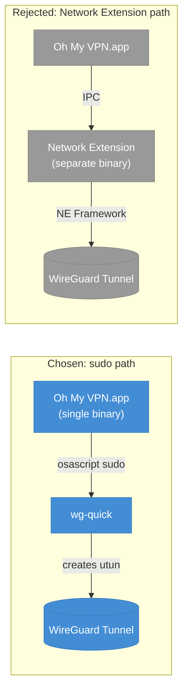

# ADR-0003: No Network Extension Required for MVP

## Status

Accepted

## Datetime

2026-03-03T07:30:00+07:00

## Context

macOS provides two paths to create VPN tunnels (TUN/utun devices): the Network Extension framework (requires Apple Developer Program entitlement) or direct utun creation with root privileges (sudo). ADR-0001 chose `wg-quick` for tunnel management, which uses the sudo path. This ADR formalizes the Network Extension decision.

This resolves PRD Open Question OQ-3: "Is macOS Network Extension entitlement required? Is it feasible without App Store distribution?"

## Decision Drivers

- ADR-0001 chose wg-quick, which creates utun devices via sudo -- Network Extension is not needed
- Apple Developer Program costs $99/year -- unnecessary overhead for an open-source project
- Network Extension entitlement requires Apple review -- adds gating to release cycle
- MVP distribution is direct download (PRD v1.0), not App Store

## Considered Options

1. **No Network Extension** -- Rely on wg-quick's sudo-based utun creation
2. **Network Extension** -- Implement a packet tunnel provider using Apple's NetworkExtension framework

## Decision Outcome

Chosen option: "No Network Extension", because ADR-0001's wg-quick approach already provides tunnel management without it, and it avoids Apple Developer Program cost and entitlement review overhead.

### Consequences

- **Good**: No Apple Developer Program enrollment required ($99/year saved)
- **Good**: No entitlement review process -- release on our own schedule
- **Good**: Simpler architecture -- no separate Network Extension binary to build and sign
- **Bad**: App Store distribution is not possible (sudo usage violates App Store guidelines)
- **Bad**: Users see a macOS password prompt on each connect/disconnect
- **Bad**: If Apple restricts sudo-based utun creation in a future macOS version, migration to Network Extension becomes mandatory
- **Neutral**: v2.0 `brew install` distribution (PRD) is compatible with this approach

## Diagram

The sudo path (blue) keeps the app as a single binary -- no separate Network Extension process to build, sign, or maintain. The rejected Network Extension path (gray) would require a separate binary communicating via IPC, plus Apple Developer Program enrollment for the entitlement.

## Links

- Related: [ADR-0001](0001-use-wireguard-go-with-wg-quick.md), PRD OQ-3
- Principles: Reversibility, Fail Fast

---
