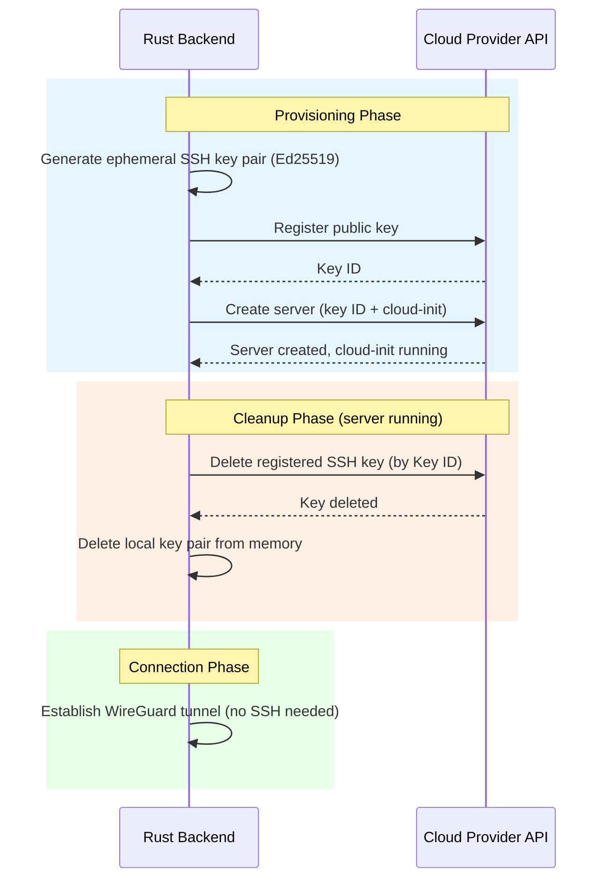

# ADR-0004: Ephemeral SSH Keys Per Session

## Status

Accepted

## Datetime

2026-03-03T07:32:00+07:00

## Context

Cloud providers require or strongly recommend an SSH key when creating a server instance. Oh My VPN provisions servers via cloud-init (ADR-0002), so SSH access is only needed during the initial provisioning phase -- never afterwards. The SSH key strategy must align with the product's ephemeral-by-design philosophy.

This resolves PRD Open Question OQ-7: "Is SSH key required for provisioning? If so, what is the ephemeral key generation/deletion strategy?"

## Decision Drivers

- Consistency with ephemeral design -- WireGuard keys are already per-session (NFR-SEC-2), SSH keys should follow the same pattern
- Zero persistent credentials -- no SSH key should outlive its session
- SSH is not used after cloud-init completes -- the key has no ongoing purpose
- Firewall blocks SSH port anyway (NFR-SEC-5) -- only WireGuard UDP is open

## Considered Options

1. **Ephemeral SSH key per session** -- Generate key pair before provisioning, register with provider, delete both local and remote key after server is running
2. **No SSH key** -- Provision without SSH key where possible
3. **Persistent SSH key per provider** -- Register one key per provider, reuse across sessions

## Decision Outcome

Chosen option: "Ephemeral SSH key per session", because it maintains the zero-persistence security model and aligns with the product's ephemeral design philosophy.

### Consequences

- **Good**: Zero SSH key persistence -- key exists only during provisioning window
- **Good**: Consistent with WireGuard ephemeral key pattern (NFR-SEC-2)
- **Good**: Even if the server's firewall misconfiguration exposes SSH, the key is already deleted
- **Good**: Each session is cryptographically independent
- **Bad**: Additional API calls per session -- generate key, register with provider, delete from provider after provisioning
- **Bad**: Provisioning time increases slightly (key generation + registration)
- **Neutral**: Key generation is fast (~10ms for Ed25519) -- negligible impact on the 120-second provisioning budget (NFR-PERF-1)

## Diagram

The SSH key exists only during the provisioning phase. Once the server is running and cloud-init has configured WireGuard, the SSH key is deleted from both the cloud provider and local memory. The subsequent WireGuard connection uses its own ephemeral key pair (ADR-0001).

## Links

- Related: [ADR-0001](0001-use-wireguard-go-with-wg-quick.md), [ADR-0002](0002-use-rust-sdk-for-cloud-providers.md), PRD OQ-7, NFR-SEC-2
- Principles: Single Responsibility, Fail Fast
