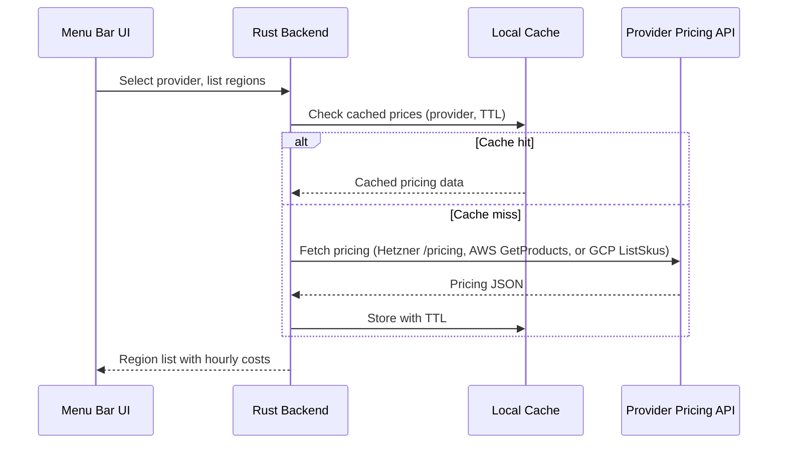

# ADR-0005: Use Provider Pricing API for Real-Time Cost Data

## Status

Accepted

## Datetime

2026-03-03T07:35:00+07:00

## Context

The PRD requires displaying hourly cost per region before server creation (FR-RC-2). Cloud providers offer varying levels of pricing API support:

- **Hetzner**: Simple `/pricing` endpoint returning structured JSON
- **AWS**: Pricing API exists but returns bulk JSON catalogs requiring complex filtering
- **GCP**: Cloud Billing Catalog API with similar complexity to AWS

The question (OQ-4) is whether to fetch pricing data from provider APIs at runtime or bundle static price tables in the application.

## Decision Drivers

- Users need accurate, up-to-date pricing to make informed decisions (FR-RC-2, US-CST-1)
- Cloud providers occasionally adjust pricing -- static data goes stale
- All three providers must be supported in MVP (see [ADR-0006](0006-all-providers-in-mvp.md))
- Solo developer must manage complexity across three different API formats

## Considered Options

1. **All providers via Pricing API** -- real-time API calls for all three
2. **Hybrid** -- Hetzner via API, AWS/GCP via bundled static price tables
3. **All static** -- bundled price tables for all three, updated with app releases

## Decision Outcome

Chosen option: "All providers via Pricing API", because pricing accuracy is a core value proposition for cost-sensitive users, and stale prices erode trust. The added complexity of parsing AWS and GCP pricing APIs is a one-time implementation cost that eliminates ongoing maintenance of static price tables.

### Consequences

- **Good**: Users always see current prices -- zero staleness risk
- **Good**: No need to update bundled price tables on every provider price change
- **Bad**: AWS and GCP pricing API parsing is significantly more complex than Hetzner
- **Bad**: Additional API calls add latency to region list loading (NFR-PERF-4: ≤ 5s target)
- **Neutral**: Pricing responses can be cached locally with a short TTL (e.g., 1 hour) to balance freshness and performance

## Diagram

The user selects a provider, and the Rust Backend fetches pricing from that provider's API. Responses are cached locally with a short TTL to balance freshness and performance (NFR-PERF-4: ≤ 5s). Each provider has a different pricing API format -- Hetzner returns simple JSON, while AWS and GCP require complex catalog filtering and parsing.

## Links

- Related: [ADR-0006](0006-all-providers-in-mvp.md), PRD OQ-4
- Principles: Explicit over Implicit (prices shown are actual prices, not approximations)
