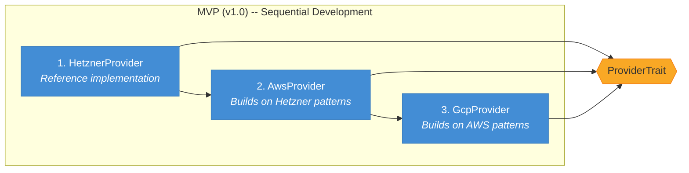

# ADR-0006: Support All Three Providers in MVP

## Status

Accepted

## Datetime

2026-03-03T07:35:00+07:00

## Context

The PRD lists Hetzner, AWS, and GCP as target cloud providers (FR-PM-1, NFR-INT-1). Risk R-7 identifies solo development burden as a concern and suggests building Hetzner first, then adding AWS and GCP sequentially. The question (OQ-5) is whether MVP ships with all three providers or phases them across releases.

## Decision Drivers

- Multi-provider support is a core differentiator -- users want provider choice from day one
- The provider trait abstraction ([ADR-0002](0002-use-rust-sdk-for-cloud-providers.md)) standardizes the implementation pattern across providers
- Each provider covers different regions and price points -- limiting to one reduces the value proposition
- Solo developer must balance scope against delivery timeline

## Considered Options

1. **All three in MVP** -- Hetzner, AWS, and GCP ship together in v1.0
2. **Hetzner only in MVP** -- AWS and GCP added in v1.1
3. **Hetzner + AWS in MVP** -- GCP added in v1.1

## Decision Outcome

Chosen option: "All three in MVP", because provider choice is a core value proposition. The Rust trait abstraction from [ADR-0002](0002-use-rust-sdk-for-cloud-providers.md) ensures each provider implementation follows the same pattern, making the incremental effort per provider manageable. Development proceeds sequentially (Hetzner first as reference implementation, then AWS, then GCP) but all ship together in v1.0.

### Consequences

- **Good**: Full provider choice available from launch -- maximizes user value
- **Good**: Multi-provider resilience from day one (if one provider has an outage, users switch to another)
- **Bad**: MVP development timeline increases compared to single-provider launch
- **Bad**: Three sets of cloud-init scripts, pricing API parsers, and provider-specific edge cases to handle
- **Neutral**: Sequential development order (Hetzner -> AWS -> GCP) reduces risk -- each provider builds on lessons from the previous one

## Diagram

All three providers ship together in v1.0, but development proceeds sequentially -- Hetzner serves as the reference implementation that establishes the trait interface, then AWS and GCP follow the same pattern ([ADR-0002](0002-use-rust-sdk-for-cloud-providers.md)). Each provider implements `ProviderTrait`, ensuring consistent behavior across providers while isolating SDK-specific code.

## Links

- Related: [ADR-0002](0002-use-rust-sdk-for-cloud-providers.md), [ADR-0005](0005-use-provider-pricing-api.md), PRD OQ-5
- Principles: Composition over Inheritance (trait-based provider abstraction)
