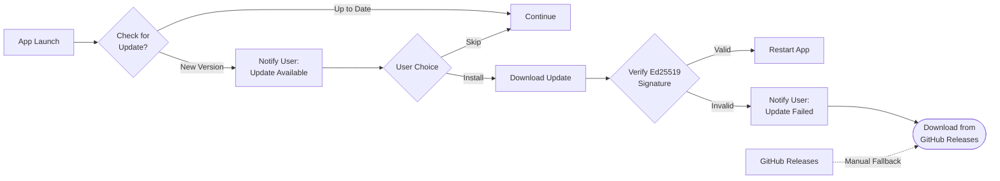

# ADR-0007: Tauri Updater with GitHub Releases Fallback

## Status

Accepted

## Datetime

2026-03-03T07:35:00+07:00

## Context

Oh My VPN needs an update distribution mechanism (OQ-6). As a Tauri desktop app distributed outside the App Store, updates must be delivered directly to users. Options range from fully manual downloads to built-in auto-update systems.

## Decision Drivers

- Users should be notified of updates without manually checking a website
- Security patches must reach users quickly
- The app is distributed via direct download (v1.0), not the App Store
- Tauri provides a built-in updater plugin with signature verification
- GitHub Releases is a natural distribution channel for an open-source project

## Considered Options

1. **Tauri built-in updater** -- auto-check on launch, one-click install
2. **Manual download only** -- GitHub Releases page, user checks manually
3. **Tauri updater + GitHub Releases** -- auto-update as primary, manual download as fallback

## Decision Outcome

Chosen option: "Tauri updater + GitHub Releases", because it provides the best user experience (automatic update notification) while maintaining a fallback for users who prefer manual control or encounter updater issues.

### Consequences

- **Good**: Users receive update notifications automatically on app launch
- **Good**: Signature verification ensures update integrity (Tauri updater signs with Ed25519)
- **Good**: GitHub Releases serves as fallback and transparency channel (users can inspect release notes and binaries)
- **Bad**: Requires Ed25519 key pair management for update signing
- **Bad**: CI pipeline must build, sign, and publish to both Tauri update endpoint and GitHub Releases
- **Neutral**: `brew install` distribution deferred to v2.0 as stated in PRD

## Diagram

The Tauri updater checks a JSON endpoint (hosted on GitHub Releases) on each app launch. If a new version is available, the user is prompted to install. The update binary is verified against an Ed25519 signature before installation -- if verification fails, the user is notified and can fall back to manual download from the GitHub Releases page. Users who prefer manual updates can always use GitHub Releases directly.

## Links

- Related: [deployment.md](../architecture/deployment.md), PRD OQ-6
- Principles: Reversibility (users can choose manual over auto-update)
