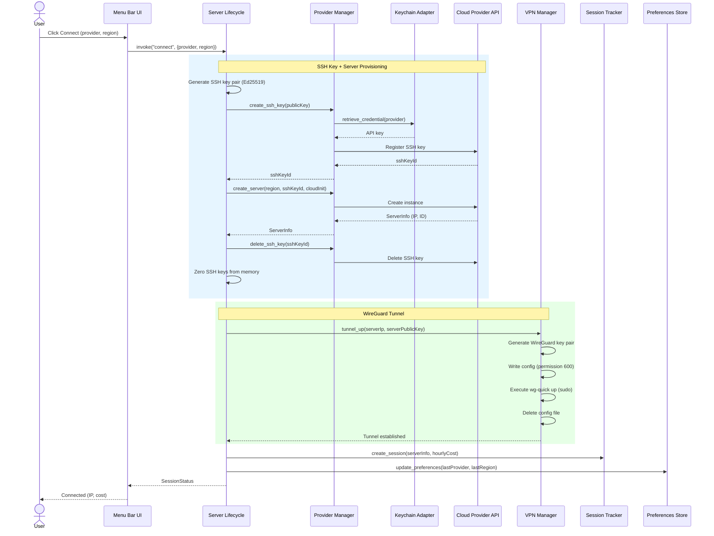
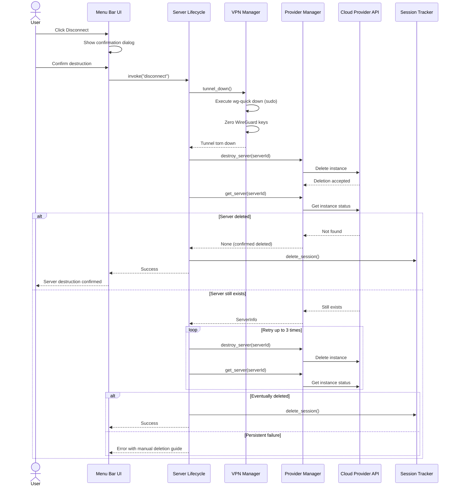
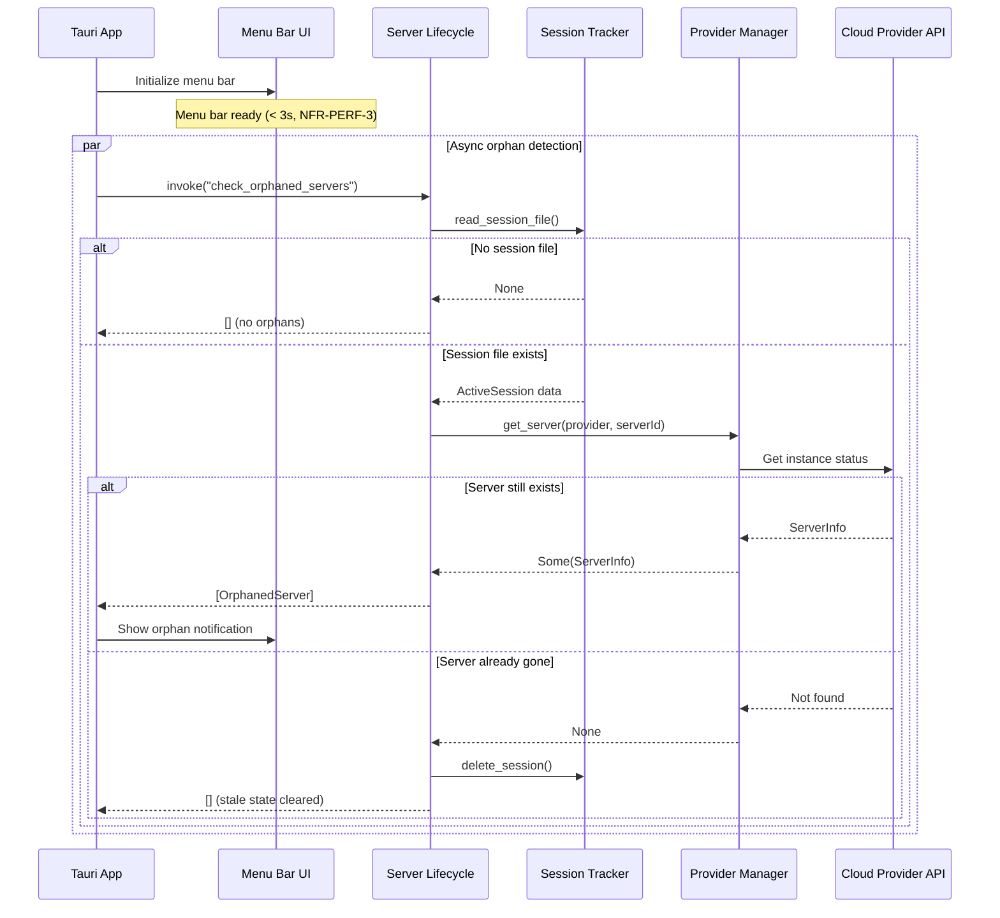
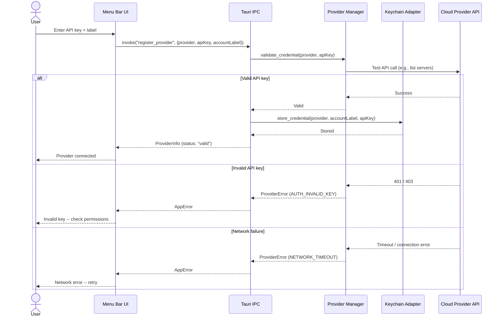

# API Design -- Oh My VPN

## 1. Overview

Oh My VPN has **6 interface boundaries** with **19 endpoints/commands** across **2 protocols**:

- **Tauri IPC** (JSON over IPC): 11 commands -- the sole communication channel between Menu Bar UI and Rust Backend
- **Rust Trait** (internal): 8 methods -- the `CloudProvider` trait abstraction over Hetzner, AWS, and GCP SDKs

Additional internal module APIs (Keychain Adapter, Preferences Store) are defined as Rust module interfaces but are not IPC-exposed -- they are called only by other backend modules.

**Key design decisions:**

- All frontend-to-backend communication goes through whitelisted Tauri IPC commands (NFR-SEC-7)
- IPC commands map 1:1 to user-facing actions -- no generic CRUD endpoints
- The `CloudProvider` trait is the only abstraction layer between provider-specific SDKs and the rest of the backend
- Error handling uses a unified `AppError` type across all IPC commands

---

## 2. Interface Catalog

| Interface | Boundary | Protocol | Direction | Source Requirements |
| --- | --- | --- | --- | --- |
| IPC-PM | Menu Bar UI → Provider Manager | Tauri IPC (JSON) | Request/Response | FR-PM-1/2/3/4/5 |
| IPC-SL | Menu Bar UI → Server Lifecycle | Tauri IPC (JSON) | Request/Response | FR-SL-1/3/5/6/7, FR-VC-2/3 |
| IPC-SS | Menu Bar UI → Session Tracker | Tauri IPC (JSON) | Request/Response | FR-SS-1/2/3 |
| IPC-PS | Menu Bar UI → Preferences Store | Tauri IPC (JSON) | Request/Response | UX §4.E, FR-MN-2 |
| TRAIT-CP | Provider Manager ↔ Cloud Provider SDK | Rust Trait (internal) | Request/Response | FR-PM-2, FR-RC-1/2, FR-SL-1/3, ADR-0002 |
| MOD-KA | Provider Manager → Keychain Adapter | Rust Module API (internal) | Request/Response | FR-PM-1/3/4, NFR-SEC-1 |

---

## 3. Endpoint Definitions

### A. IPC-PM: Menu Bar UI → Provider Manager

| Endpoint | Method | Description | Source FR |
| --- | --- | --- | --- |
| `register_provider` | IPC Command | Validate and store a provider API key | FR-PM-1, FR-PM-2, FR-PM-3 |
| `remove_provider` | IPC Command | Remove a registered provider and its Keychain entry | FR-PM-4 |
| `list_providers` | IPC Command | List all registered providers with validation status | FR-PM-5 |
| `list_regions` | IPC Command | List available regions with pricing for a provider | FR-RC-1, FR-RC-2 |

### B. IPC-SL: Menu Bar UI → Server Lifecycle

| Endpoint | Method | Description | Source FR |
| --- | --- | --- | --- |
| `connect` | IPC Command | Provision server + establish WireGuard tunnel | FR-SL-1, FR-VC-2 |
| `disconnect` | IPC Command | Tear down tunnel + destroy server + verify deletion | FR-SL-3, FR-VC-3 |
| `check_orphaned_servers` | IPC Command | Detect orphaned servers across all registered providers | FR-SL-6 |
| `resolve_orphaned_server` | IPC Command | Destroy or reconnect to an orphaned server | FR-SL-7 |

### C. IPC-SS: Menu Bar UI → Session Tracker

| Endpoint | Method | Description | Source FR |
| --- | --- | --- | --- |
| `get_session_status` | IPC Command | Get current session info (IP, elapsed time, cost) | FR-SS-1, FR-SS-2, FR-SS-3 |

### D. IPC-PS: Menu Bar UI → Preferences Store

| Endpoint | Method | Description | Source FR |
| --- | --- | --- | --- |
| `get_preferences` | IPC Command | Load user preferences | UX §4.E |
| `update_preferences` | IPC Command | Save user preferences | FR-MN-2 |

---

## 4. Request/Response Schemas

### A. Shared Types

These types are used across multiple IPC commands:

```typescript
type Provider = "hetzner" | "aws" | "gcp";

type ProviderStatus = "valid" | "invalid" | "unchecked";

type ProviderInfo = {
  provider: Provider;
  status: ProviderStatus;
  accountLabel: string;  // human-readable identifier from Keychain account field
};

type RegionInfo = {
  region: string;        // cloud region code (e.g., "fsn1", "us-east-1")
  displayName: string;   // human-readable name (e.g., "Falkenstein, DE")
  instanceType: string;  // cheapest instance type name
  hourlyCost: number;    // USD per hour
};

type SessionStatus = {
  provider: Provider;
  region: string;
  serverIp: string;      // public IP of VPN server
  elapsedSeconds: number;
  hourlyCost: number;
  accumulatedCost: number; // elapsedSeconds / 3600 * hourlyCost
};

type OrphanedServer = {
  serverId: string;
  provider: Provider;
  region: string;
  createdAt: string;     // ISO 8601 datetime
  estimatedCost: number; // accumulated cost since createdAt
};

type OrphanAction = "destroy" | "reconnect";
```

### B. IPC-PM Commands

#### `register_provider`

**Description**: Validate an API key against the provider's API, then store it in macOS Keychain.

**Rust signature**:

```rust
#[tauri::command]
async fn register_provider(
    provider: Provider,
    api_key: String,
    account_label: String,
) -> Result<ProviderInfo, AppError>
```

**TypeScript invoke type**:

```typescript
type RegisterProviderArgs = {
  provider: Provider;
  apiKey: string;
  accountLabel: string;  // user-defined label (e.g., email or key name)
};

type RegisterProviderResult = ProviderInfo;

// Usage: invoke("register_provider", args): Promise<RegisterProviderResult>
```

**Validation rules**:

- `provider` must be one of `"hetzner"`, `"aws"`, `"gcp"`
- `apiKey` must be non-empty string
- `accountLabel` must be non-empty string
- API key is validated against the provider's API before storage (FR-PM-2)

**Side effects**:

1. Calls `CloudProvider::validate_credential()` to test the key
2. On success, stores key in macOS Keychain via Keychain Adapter
3. Invalidates PricingCache for this provider

---

#### `remove_provider`

**Description**: Remove a registered provider and delete its Keychain entry.

**Rust signature**:

```rust
#[tauri::command]
async fn remove_provider(provider: Provider) -> Result<(), AppError>
```

**TypeScript invoke type**:

```typescript
type RemoveProviderArgs = {
  provider: Provider;
};

// Usage: invoke("remove_provider", args): Promise<void>
```

**Validation rules**:

- `provider` must be registered (has Keychain entry)
- Cannot remove a provider while a VPN session using that provider is active

**Side effects**:

1. Deletes Keychain entry via Keychain Adapter
2. Invalidates PricingCache for this provider

---

#### `list_providers`

**Description**: List all registered providers with their validation status.

**Rust signature**:

```rust
#[tauri::command]
async fn list_providers() -> Result<Vec<ProviderInfo>, AppError>
```

**TypeScript invoke type**:

```typescript
// Usage: invoke("list_providers"): Promise<ProviderInfo[]>
```

**Behavior**:

- Returns all providers that have a Keychain entry
- Does NOT re-validate keys on each call (returns cached status)
- Empty array if no providers registered (triggers onboarding)

---

#### `list_regions`

**Description**: List available regions with pricing for a specific provider.

**Rust signature**:

```rust
#[tauri::command]
async fn list_regions(provider: Provider) -> Result<Vec<RegionInfo>, AppError>
```

**TypeScript invoke type**:

```typescript
type ListRegionsArgs = {
  provider: Provider;
};

// Usage: invoke("list_regions", args): Promise<RegionInfo[]>
```

**Validation rules**:

- `provider` must be registered

**Behavior**:

- Returns regions sorted by `hourlyCost` ascending (FR-RC-3)
- Uses PricingCache with ~1h TTL (ADR-0005)
- On cache miss, fetches from provider API via `CloudProvider::list_regions()`
- On API failure with stale cache, returns stale data (marked via `AppError` warning -- not an error)

---

### C. IPC-SL Commands

#### `connect`

**Description**: Full connect flow -- provision server, configure WireGuard, establish tunnel.

**Rust signature**:

```rust
#[tauri::command]
async fn connect(
    provider: Provider,
    region: String,
) -> Result<SessionStatus, AppError>
```

**TypeScript invoke type**:

```typescript
type ConnectArgs = {
  provider: Provider;
  region: string;  // region code from list_regions
};

// Usage: invoke("connect", args): Promise<SessionStatus>
```

**Validation rules**:

- `provider` must be registered
- `region` must be valid for the given provider
- No active session (cannot connect while already connected)

**Side effects (orchestrated by Server Lifecycle)**:

1. Generate ephemeral SSH key pair (ADR-0004)
2. Register SSH public key with provider
3. Create server with cloud-init (WireGuard + firewall)
4. Wait for server to be ready
5. Delete SSH key from provider and memory
6. Generate ephemeral WireGuard key pair
7. Write WireGuard config (permission 600)
8. Execute `wg-quick up` via sudo (ADR-0001)
9. Delete WireGuard config file
10. Create ActiveSession file
11. Update UserPreferences (lastProvider, lastRegion)

**On failure**: Auto-cleanup runs (FR-SL-4) -- destroy server, delete SSH key, delete WireGuard keys

---

#### `disconnect`

**Description**: Full disconnect flow -- tear down tunnel, destroy server, verify deletion.

**Rust signature**:

```rust
#[tauri::command]
async fn disconnect() -> Result<(), AppError>
```

**TypeScript invoke type**:

```typescript
// Usage: invoke("disconnect"): Promise<void>
```

**Validation rules**:

- Must have an active session

**Side effects (orchestrated by Server Lifecycle)**:

1. Execute `wg-quick down` via sudo
2. Delete WireGuard keys from memory
3. Destroy server via provider API
4. Verify server deletion via provider API (cross-cutting §8.B)
5. Delete ActiveSession file
6. On persistent failure after 3 retries: return error with manual deletion guide

---

#### `check_orphaned_servers`

**Description**: Check for orphaned servers across all registered providers. Called on app launch.

**Rust signature**:

```rust
#[tauri::command]
async fn check_orphaned_servers() -> Result<Vec<OrphanedServer>, AppError>
```

**TypeScript invoke type**:

```typescript
// Usage: invoke("check_orphaned_servers"): Promise<OrphanedServer[]>
```

**Behavior**:

- Reads ActiveSession file for persisted server state
- If state exists, queries the provider API to verify server still exists
- Returns empty array if no orphans detected
- Runs asynchronously after menu bar is ready (NFR-PERF-3)

---

#### `resolve_orphaned_server`

**Description**: Take action on an orphaned server -- destroy or reconnect.

**Rust signature**:

```rust
#[tauri::command]
async fn resolve_orphaned_server(
    server_id: String,
    action: OrphanAction,
) -> Result<Option<SessionStatus>, AppError>
```

**TypeScript invoke type**:

```typescript
type ResolveOrphanedServerArgs = {
  serverId: string;
  action: OrphanAction;
};

// Returns SessionStatus if action is "reconnect", null if "destroy"
// Usage: invoke("resolve_orphaned_server", args): Promise<SessionStatus | null>
```

**Behavior**:

- `"destroy"`: Destroy server + verify deletion + clear ActiveSession file
- `"reconnect"`: Re-establish WireGuard tunnel to existing server (generate new WireGuard keys, but skip provisioning)

---

### D. IPC-SS Commands

#### `get_session_status`

**Description**: Get the current active session information.

**Rust signature**:

```rust
#[tauri::command]
async fn get_session_status() -> Result<Option<SessionStatus>, AppError>
```

**TypeScript invoke type**:

```typescript
// Returns null if no active session
// Usage: invoke("get_session_status"): Promise<SessionStatus | null>
```

**Behavior**:

- Returns current session info with live-calculated `elapsedSeconds` and `accumulatedCost`
- Returns `null` if no active session
- Frontend polls this command periodically to update the session panel

---

### E. IPC-PS Commands

#### `get_preferences`

**Description**: Load user preferences.

**Rust signature**:

```rust
#[tauri::command]
async fn get_preferences() -> Result<UserPreferences, AppError>
```

**TypeScript invoke type**:

```typescript
type UserPreferences = {
  lastProvider: Provider | null;
  lastRegion: string | null;
  notificationsEnabled: boolean;
  keyboardShortcut: string | null;
};

// Usage: invoke("get_preferences"): Promise<UserPreferences>
```

**Behavior**:

- Returns defaults if preferences file does not exist (first launch)
- `schemaVersion` is internal to the backend -- not exposed to frontend

---

#### `update_preferences`

**Description**: Save user preferences. Accepts partial updates.

**Rust signature**:

```rust
#[tauri::command]
async fn update_preferences(
    preferences: PartialUserPreferences,
) -> Result<UserPreferences, AppError>
```

**TypeScript invoke type**:

```typescript
type PartialUserPreferences = {
  lastProvider?: Provider | null;
  lastRegion?: string | null;
  notificationsEnabled?: boolean;
  keyboardShortcut?: string | null;
};

// Returns the full preferences after merge
// Usage: invoke("update_preferences", { preferences }): Promise<UserPreferences>
```

**Behavior**:

- Merges partial update with existing preferences
- Writes to preferences file atomically (write tmp + rename)
- Returns the complete preferences after merge

---

### F. TRAIT-CP: CloudProvider Trait

The `CloudProvider` trait is the internal Rust abstraction implemented by each provider (ADR-0002). It is not IPC-exposed.

```rust
#[async_trait]
pub trait CloudProvider: Send + Sync {
    /// Validate that the API credential has sufficient permissions.
    /// Returns Ok(()) on success, Err with specific permission error on failure.
    async fn validate_credential(&self, api_key: &str) -> Result<(), ProviderError>;

    /// List available regions with pricing information.
    /// Returns regions sorted by hourly cost ascending.
    async fn list_regions(&self, api_key: &str) -> Result<Vec<RegionInfo>, ProviderError>;

    /// Register an ephemeral SSH public key with the provider.
    /// Returns the provider-side key ID for later deletion.
    async fn create_ssh_key(
        &self,
        api_key: &str,
        public_key: &str,
        label: &str,
    ) -> Result<String, ProviderError>;

    /// Delete a previously registered SSH key by its provider-side ID.
    async fn delete_ssh_key(
        &self,
        api_key: &str,
        key_id: &str,
    ) -> Result<(), ProviderError>;

    /// Provision a new server with the given cloud-init script and SSH key.
    /// Returns server info (ID, public IP) once the server is running.
    async fn create_server(
        &self,
        api_key: &str,
        region: &str,
        ssh_key_id: &str,
        cloud_init: &str,
    ) -> Result<ServerInfo, ProviderError>;

    /// Destroy a server by its provider-side ID.
    async fn destroy_server(
        &self,
        api_key: &str,
        server_id: &str,
    ) -> Result<(), ProviderError>;

    /// Check if a server still exists. Used for orphan detection and deletion verification.
    async fn get_server(
        &self,
        api_key: &str,
        server_id: &str,
    ) -> Result<Option<ServerInfo>, ProviderError>;
}

pub struct ServerInfo {
    pub server_id: String,
    pub public_ip: String,
    pub status: ServerStatus,
}

pub enum ServerStatus {
    Provisioning,
    Running,
    Deleting,
}
```

---

### G. MOD-KA: Keychain Adapter

Internal Rust module API -- not IPC-exposed. Single point of credential access (NFR-SEC-1).

```rust
pub struct KeychainAdapter;

impl KeychainAdapter {
    /// Store a provider API key in macOS Keychain.
    /// Service: "oh-my-vpn.{provider}", Account: account_label
    pub fn store_credential(
        provider: &Provider,
        account_label: &str,
        api_key: &str,
    ) -> Result<(), KeychainError>;

    /// Retrieve a provider API key from macOS Keychain.
    /// Returns None if no entry exists for this provider.
    pub fn retrieve_credential(
        provider: &Provider,
    ) -> Result<Option<Credential>, KeychainError>;

    /// Delete a provider's Keychain entry.
    pub fn delete_credential(
        provider: &Provider,
    ) -> Result<(), KeychainError>;

    /// List all registered provider credentials.
    /// Returns (provider, account_label) pairs -- never the API key itself.
    pub fn list_credentials() -> Result<Vec<(Provider, String)>, KeychainError>;
}

pub struct Credential {
    pub provider: Provider,
    pub account_label: String,
    pub api_key: String,
}
```

---

## 5. Sequence Diagrams

### A. Connect Flow (Full Provisioning)

The core user journey spanning Server Lifecycle, Provider Manager, VPN Manager, and Session Tracker.



### B. Disconnect Flow (Destruction with Verification)



### C. Orphaned Server Detection (App Launch)



### D. Provider Registration (Onboarding)



---

## 6. Error Format

### A. Error response structure

All IPC commands use a unified `AppError` type. In Tauri, command errors are serialized to JSON and delivered to the frontend.

```rust
#[derive(Debug, Serialize)]
pub struct AppError {
    pub code: String,
    pub message: String,
    pub details: Option<serde_json::Value>,
}
```

```typescript
type AppError = {
  code: string;       // machine-readable error code
  message: string;    // human-readable description
  details?: unknown;  // additional context
};
```

### B. Error code taxonomy

| Category | Code Pattern | Description |
| --- | --- | --- |
| Validation | `VALIDATION_{detail}` | Input validation failure |
| Authentication | `AUTH_{detail}` | Provider credential failure |
| Not Found | `NOT_FOUND_{detail}` | Resource does not exist |
| Conflict | `CONFLICT_{detail}` | State conflict (e.g., already connected) |
| Provider | `PROVIDER_{detail}` | Cloud provider API error |
| Tunnel | `TUNNEL_{detail}` | WireGuard tunnel error |
| Keychain | `KEYCHAIN_{detail}` | macOS Keychain access error |
| Internal | `INTERNAL_{detail}` | Unexpected internal failure |

### C. Error code catalog

| Code | When | User-Facing Message |
| --- | --- | --- |
| `VALIDATION_INVALID_PROVIDER` | Provider not in `hetzner`, `aws`, `gcp` | "Invalid provider" |
| `VALIDATION_EMPTY_API_KEY` | Empty API key string | "API key is required" |
| `VALIDATION_EMPTY_ACCOUNT_LABEL` | Empty account label string | "Account label is required" |
| `VALIDATION_INVALID_REGION` | Region not found for provider | "Invalid region for this provider" |
| `AUTH_INVALID_KEY` | Provider API rejects the key | "Invalid API key -- check your key and permissions" |
| `AUTH_INSUFFICIENT_PERMISSIONS` | Key valid but missing permissions | "API key lacks required permissions. See setup guide." |
| `NOT_FOUND_PROVIDER` | Provider not registered | "Provider not registered" |
| `NOT_FOUND_SESSION` | No active session | "No active VPN session" |
| `CONFLICT_SESSION_ACTIVE` | Connect while already connected | "Already connected. Disconnect first." |
| `CONFLICT_PROVIDER_IN_USE` | Remove provider with active session | "Cannot remove provider while session is active" |
| `PROVIDER_RATE_LIMITED` | Cloud API 429 | "Cloud API rate limited -- retrying" |
| `PROVIDER_SERVER_ERROR` | Cloud API 5xx | "Cloud provider error -- retrying" |
| `PROVIDER_TIMEOUT` | Cloud API timeout | "Cloud provider timeout -- retrying" |
| `PROVIDER_PROVISIONING_FAILED` | Server failed to reach running state | "Server provisioning failed. Resources cleaned up." |
| `PROVIDER_DESTRUCTION_FAILED` | Server destruction failed after retries | "Server destruction failed. Manual deletion required." |
| `TUNNEL_SETUP_FAILED` | wg-quick up failed | "VPN tunnel setup failed" |
| `TUNNEL_TEARDOWN_FAILED` | wg-quick down failed | "VPN tunnel teardown failed" |
| `KEYCHAIN_ACCESS_DENIED` | macOS denied Keychain access | "Keychain access denied -- check app permissions" |
| `KEYCHAIN_WRITE_FAILED` | Failed to write Keychain entry | "Failed to store credential" |
| `INTERNAL_UNEXPECTED` | Catch-all for unhandled errors | "An unexpected error occurred" |

### D. Protocol-specific error mapping

| Protocol | Error Mechanism |
| --- | --- |
| Tauri IPC | `Result<T, AppError>` -- error is serialized to JSON and caught by frontend `invoke()` `.catch()` |
| Rust Trait (internal) | `Result<T, ProviderError>` -- converted to `AppError` at the IPC boundary |
| Keychain Adapter | `Result<T, KeychainError>` -- converted to `AppError` at the IPC boundary |

```rust
/// Internal provider error -- not exposed to frontend directly.
#[derive(Debug)]
pub enum ProviderError {
    AuthInvalidKey(String),
    AuthInsufficientPermissions(String),
    RateLimited { retry_after_seconds: u64 },
    ServerError(String),
    Timeout,
    NotFound(String),
    ProvisioningFailed(String),
    DestructionFailed(String),
    Other(anyhow::Error),
}

/// Conversion at IPC boundary.
impl From<ProviderError> for AppError {
    fn from(error: ProviderError) -> Self {
        match error {
            ProviderError::AuthInvalidKey(message) => AppError {
                code: "AUTH_INVALID_KEY".into(),
                message,
                details: None,
            },
            // ... other mappings
        }
    }
}
```

---

## 7. Authentication and Authorization

### A. Auth mechanism

| Interface | Auth Type | Credential Location | Description |
| --- | --- | --- | --- |
| IPC-PM, IPC-SL, IPC-SS, IPC-PS | None (local IPC) | N/A | Tauri IPC is process-local -- no network auth needed. Security enforced by command whitelist (NFR-SEC-7) |
| TRAIT-CP (CloudProvider) | API Key | macOS Keychain (via Keychain Adapter) | Each provider call retrieves the API key from Keychain immediately before use. Key is not cached in memory beyond the API call |
| MOD-KA (Keychain Adapter) | macOS Security Framework | OS-managed | Keychain access is gated by macOS app identity + user password prompt on first access |

### B. Permission model

Oh My VPN is a single-user desktop application with no role-based access control. All IPC commands are available to the frontend without restriction. Security boundary enforcement is structural:

- **IPC command whitelist** (NFR-SEC-7): Only explicitly declared `#[tauri::command]` functions are callable from the frontend. The whitelist is verified by fitness function S-3.
- **Tauri v2 capabilities**: Scoped permissions defined in `src-tauri/capabilities/` restrict which IPC commands are accessible to each webview window.
- **macOS Keychain**: OS-level access control -- user must authorize the app on first Keychain access.

---

## 8. Versioning Strategy

### A. Version policy per protocol

| Protocol | Strategy | Current Version | Migration Path |
| --- | --- | --- | --- |
| Tauri IPC | Backward-compatible evolution | -- | Add optional fields to args/results. Never remove fields. If breaking change needed, add new command + deprecate old |
| Rust Trait (CloudProvider) | Compile-time checked | -- | Add methods with default implementations. Breaking trait changes require updating all 3 providers simultaneously |
| Keychain entries | Service name convention | v1 (`oh-my-vpn.{provider}`) | If naming changes, app scans for old entries and migrates on first launch (data model §6.B) |

### B. IPC evolution rules

1. **Adding a new command**: Add `#[tauri::command]`, register in handler, add to capabilities
2. **Adding optional fields to existing command**: Add as `Option<T>` in Rust args with `#[serde(default)]`
3. **Removing a command**: Mark as deprecated (return warning), remove in next minor version
4. **Changing response shape**: Add new fields as optional first, then make required in next version

### C. Deprecation process

1. Mark command as deprecated in documentation
2. Add `#[deprecated]` attribute in Rust + log warning on invocation
3. Announce timeline for removal in release notes
4. Remove after one minor version cycle

---

## 9. Rate Limiting and Quotas

Oh My VPN does not implement its own rate limiting (single-user desktop app). Rate limits come from cloud provider APIs:

| Provider | Rate Limit | Handling Strategy |
| --- | --- | --- |
| Hetzner Cloud API | 3600 req/hour per API token | Backoff with `Retry-After` header |
| AWS EC2 API | Varies by endpoint | SDK handles throttling with exponential backoff |
| GCP Compute API | Varies by endpoint | SDK handles throttling with exponential backoff |

Rate limit errors surface as `PROVIDER_RATE_LIMITED` with the estimated retry time in `details`. The frontend displays "Cloud API rate limited -- retrying in {seconds}s" without blocking the UI.
