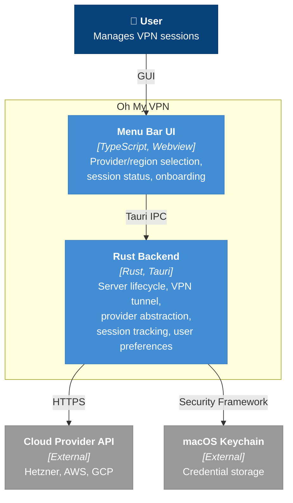
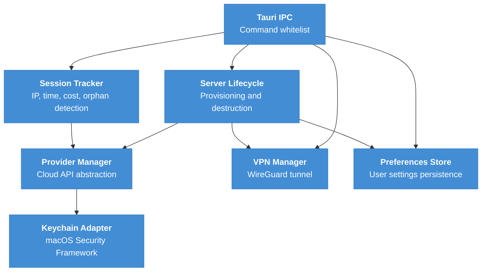

# Building Blocks (Container View)

Oh My VPN is a Tauri desktop application with a TypeScript frontend and Rust backend. This document decomposes the system into its two major containers and describes the internal modules within the backend.

---

## 1. Container Diagram

---

## 2. Container Descriptions

### A. Menu Bar UI

| Attribute | Value |
| --- | --- |
| Technology | TypeScript, HTML/CSS, Tauri Webview |
| Responsibility | Left-click popover (core flow: region selection, connect/disconnect, session status, onboarding), right-click context menu (provider management, system permissions, settings, about, quit), stack-based navigation within popover (iOS-style push/pop with spring transition), menu bar icon with status (disconnected/connecting/connected) |
| PRD Coverage | FR-MN-1, FR-MN-3, FR-OB-1/2/3, FR-RC-1/2/3/4, FR-SS-1/2/3 |

The Menu Bar UI uses a dual interaction model defined in UX Design §2.B:

- **Left-click**: Opens a popover containing the core flow -- provider/region selection, connect/disconnect, provisioning stepper, and session status panel. Navigation within the popover uses an iOS-style stack (push/pop with spring horizontal slide). This keeps all daily tasks in a single, lightweight surface with no separate windows.
- **Right-click**: Opens a context menu for management tasks -- add/remove providers, check system permissions, configure settings (notifications, keyboard shortcuts), view app info, and quit. If the user quits while connected, a destruction confirmation dialog is presented before exit (see [cross-cutting-concepts.md §9](cross-cutting-concepts.md#9-app-quit-while-connected)).

### B. Rust Backend

| Attribute | Value |
| --- | --- |
| Technology | Rust (Tauri framework) |
| Responsibility | All backend logic -- server lifecycle, VPN tunnel management, provider abstraction, session tracking, credential access. Exposed to the frontend via whitelisted Tauri IPC commands (NFR-SEC-7) |
| PRD Coverage | All FR-PM, FR-SL, FR-VC, FR-SS, and all NFR requirements |

---

## 3. Backend Internal Modules

The Rust Backend is a single process with the following internal modules. These are not separately deployable -- they are Rust modules within the same binary.

### A. Tauri IPC

Tauri command whitelist. Routes frontend requests to the appropriate backend module. Only explicitly allowed commands pass through (NFR-SEC-7).

### B. Provider Manager

Unified interface over Hetzner, AWS, and GCP APIs. Each cloud provider implements a common Rust trait, enabling independent replacement (Risk R-5) and sequential development (Risk R-7: Hetzner first, then AWS, GCP). Handles API key validation (FR-PM-2), region listing with pricing (FR-RC-1/2).

### C. Server Lifecycle

Orchestrates server provisioning (cloud-init with WireGuard + firewall), destruction on disconnect, auto-cleanup on failure, orphaned server detection on app launch. The disconnect-to-destruction flow (tunnel teardown + server deletion via provider API) must complete within 30 seconds (NFR-PERF-2).

### D. VPN Manager

Generates ephemeral WireGuard key pairs, establishes/tears down VPN tunnel via `wg-quick` subprocess ([ADR-0001](../adr/0001-use-wireguard-go-with-wg-quick.md)), configures DNS routing to prevent leaks, handles IPv6 leak prevention. Keys are deleted after session (NFR-SEC-2).

### E. Session Tracker

Maintains current session state -- connected server IP, elapsed time, running cost calculation. Persists minimal state for orphaned server detection across app restarts (NFR-REL-1).

### F. Keychain Adapter

Encapsulates all macOS Keychain interactions via Security Framework. Single point of credential access -- zero plaintext keys on disk (NFR-SEC-1).

### G. Preferences Store

Persists user preferences that survive across sessions: last-used provider and region (expert shortcut -- UX Design §4.E), notification settings, and keyboard shortcut bindings. Stored in the Tauri app data directory as a JSON file. Unlike Session Tracker (which persists only orphan detection state), Preferences Store holds long-lived user settings. Server Lifecycle reads the last-used region to pre-select it on popover open, reducing the connect flow to 2 steps for returning users.

---

## 4. Communication Patterns

| From | To | Pattern | Protocol |
| --- | --- | --- | --- |
| Menu Bar UI | Rust Backend | Request/Response | Tauri IPC (JSON) |
| Rust Backend | Cloud Provider API | Request/Response | HTTPS REST (with retry and backoff) |
| Rust Backend | macOS Keychain | Request/Response | macOS Security Framework |
| Rust Backend | Preferences File | Read/Write | Filesystem (Tauri app data directory) |

---

## 5. Key Design Decisions

- **Single binary, no microservices**: All backend modules run in one Tauri process. Simplifies distribution, eliminates IPC latency between modules, and matches the single-user desktop app model
- **Server Lifecycle as orchestrator**: Server Lifecycle coordinates both Provider Manager (cloud API) and VPN Manager (tunnel), keeping the connect/disconnect flow in one place rather than spreading it across IPC handlers
- **Session Tracker queries providers directly**: Orphaned server detection on app launch requires querying all registered providers' server lists (FR-SL-6), so Session Tracker depends on Provider Manager rather than going through Server Lifecycle
- **Preferences Store is separate from Session Tracker**: Session Tracker persists minimal state for orphan detection (server ID, provider, region, timestamp) and clears it on successful disconnection. Preferences Store holds long-lived user settings (last-used region, notification preferences, keyboard shortcuts) that persist indefinitely. Mixing these concerns would couple session lifecycle with user preference management

---
