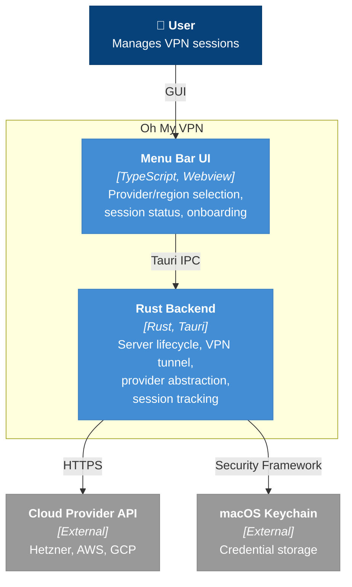
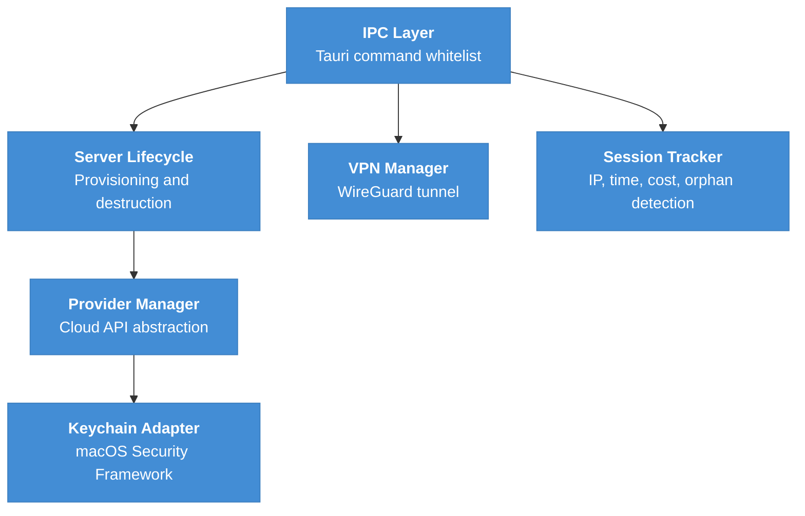

# Building Blocks (Container View)

Oh My VPN is a Tauri desktop application with a TypeScript frontend and Rust backend. This document decomposes the system into its two major containers and describes the internal modules within the backend.

---

## 1. Container Diagram

---

## 2. Container Descriptions

### A. Menu Bar UI

| Attribute | Value |
| --- | --- |
| Technology | TypeScript, HTML/CSS, Tauri Webview |
| Responsibility | Render menu bar icon with status (disconnected/connecting/connected), onboarding flow, provider/region selection, session panel (IP, elapsed time, cost) |
| PRD Coverage | FR-MN-1, FR-MN-3, FR-OB-1/2/3, FR-RC-1/2/3/4, FR-SS-1/2/3 |

### B. Rust Backend

| Attribute | Value |
| --- | --- |
| Technology | Rust (Tauri framework) |
| Responsibility | All backend logic -- server lifecycle, VPN tunnel management, provider abstraction, session tracking, credential access. Exposed to the frontend via whitelisted Tauri IPC commands (NFR-SEC-7) |
| PRD Coverage | All FR-PM, FR-SL, FR-VC, FR-SS, and all NFR requirements |

---

## 3. Backend Internal Modules

The Rust Backend is a single process with the following internal modules. These are not separately deployable -- they are Rust modules within the same binary.

### A. IPC Layer

Tauri command whitelist. Routes frontend requests to the appropriate backend module. Only explicitly allowed commands pass through (NFR-SEC-7).

### B. Provider Manager

Unified interface over Hetzner, AWS, and GCP APIs. Each cloud provider implements a common Rust trait, enabling independent replacement (Risk R-5) and sequential development (Risk R-7: Hetzner first, then AWS, GCP). Handles API key validation (FR-PM-2), region listing with pricing (FR-RC-1/2).

### C. Server Lifecycle

Orchestrates server provisioning (cloud-init with WireGuard + firewall), destruction on disconnect, auto-cleanup on failure, orphaned server detection on app launch.

### D. VPN Manager

Generates ephemeral WireGuard key pairs, establishes/tears down VPN tunnel via `wg-quick` subprocess ([ADR-0001](../adr/0001-use-wireguard-go-with-wg-quick.md)), configures DNS routing to prevent leaks, handles IPv6 leak prevention. Keys are deleted after session (NFR-SEC-2).

### E. Session Tracker

Maintains current session state -- connected server IP, elapsed time, running cost calculation. Persists minimal state for orphaned server detection across app restarts (NFR-REL-1).

### F. Keychain Adapter

Encapsulates all macOS Keychain interactions via Security Framework. Single point of credential access -- zero plaintext keys on disk (NFR-SEC-1).

---

## 4. Communication Patterns

| From | To | Pattern | Protocol |
| --- | --- | --- | --- |
| Menu Bar UI | Rust Backend | Request/Response | Tauri IPC (JSON) |
| Rust Backend | Cloud Provider API | Request/Response | HTTPS REST (with retry and backoff) |
| Rust Backend | macOS Keychain | Request/Response | macOS Security Framework |

---

## 5. Key Design Decisions

- **Provider abstraction via trait**: Each cloud provider implements a common Rust trait, enabling independent replacement (Risk R-5) and sequential development (Risk R-7: Hetzner first, then AWS, GCP)
- **Tauri IPC whitelist**: Only explicitly allowed commands pass through the IPC bridge, minimizing attack surface (NFR-SEC-7)
- **Ephemeral credentials**: WireGuard keys are generated per session and deleted after teardown -- never persisted (NFR-SEC-2)
- **Keychain as single credential store**: Zero plaintext keys on disk (NFR-SEC-1)
