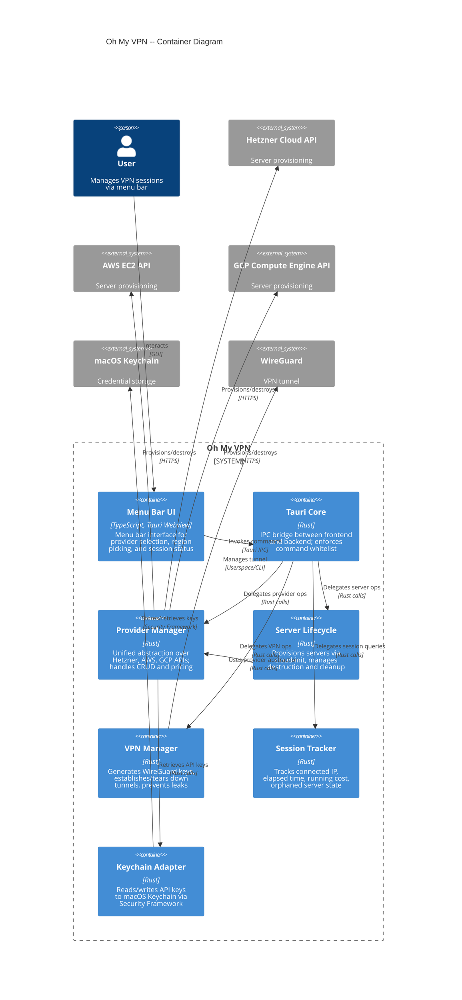

# Building Blocks (Container View)

Oh My VPN is a Tauri desktop application with a TypeScript frontend and Rust backend. This document decomposes the system into its major containers -- the applications, services, and data stores that make up Oh My VPN.

---

## 1. Container Diagram

---

## 2. Container Descriptions

### A. Menu Bar UI

| Attribute | Value |
| --- | --- |
| Technology | TypeScript, HTML/CSS, Tauri Webview |
| Responsibility | Render menu bar icon with status (disconnected/connecting/connected), onboarding flow, provider/region selection, session panel (IP, elapsed time, cost) |
| PRD Coverage | FR-MN-1, FR-MN-3, FR-OB-1/2/3, FR-RC-1/2/3/4, FR-SS-1/2/3 |

### B. Tauri Core

| Attribute | Value |
| --- | --- |
| Technology | Rust (Tauri framework) |
| Responsibility | IPC bridge between frontend and backend. Whitelists allowed commands per NFR-SEC-7. Routes frontend requests to the appropriate backend container |
| PRD Coverage | NFR-SEC-7 |

### C. Provider Manager

| Attribute | Value |
| --- | --- |
| Technology | Rust |
| Responsibility | Unified interface over Hetzner, AWS, and GCP APIs. Handles API key validation (FR-PM-2), region listing with pricing (FR-RC-1/2), and delegates credential storage to Keychain Adapter |
| PRD Coverage | FR-PM-1/2/3/4/5, FR-RC-1/2, NFR-INT-1/2/3 |
| Design Note | Provider-specific implementations behind a common trait (Dependency Inversion -- SYSTEM.md Principle 2) |

### D. Server Lifecycle

| Attribute | Value |
| --- | --- |
| Technology | Rust |
| Responsibility | Orchestrates server provisioning (cloud-init with WireGuard + firewall), destruction on disconnect, auto-cleanup on failure, orphaned server detection on app launch |
| PRD Coverage | FR-SL-1/2/3/4/5/6/7, NFR-PERF-1/2, NFR-REL-1/2/3 |

### E. VPN Manager

| Attribute | Value |
| --- | --- |
| Technology | Rust |
| Responsibility | Generates ephemeral WireGuard key pairs, establishes/tears down VPN tunnel, configures DNS routing to prevent leaks, handles IPv6 leak prevention, deletes keys after session |
| PRD Coverage | FR-VC-1/2/3/4/5/6, NFR-SEC-2/3/4/5/6 |
| Open Decision | OQ-1 -- boringtun (userspace) vs system WireGuard client |

### F. Session Tracker

| Attribute | Value |
| --- | --- |
| Technology | Rust |
| Responsibility | Maintains current session state -- connected server IP, elapsed time, running cost calculation. Persists minimal state for orphaned server detection across app restarts |
| PRD Coverage | FR-SS-1/2/3, NFR-REL-4 |

### G. Keychain Adapter

| Attribute | Value |
| --- | --- |
| Technology | Rust (macOS Security Framework bindings) |
| Responsibility | Encapsulates all macOS Keychain interactions. Stores and retrieves API keys with encryption. Single point of credential access |
| PRD Coverage | FR-PM-3, NFR-SEC-1 |

---

## 3. Communication Patterns

| From | To | Pattern | Protocol | Notes |
| --- | --- | --- | --- | --- |
| Menu Bar UI | Tauri Core | Request/Response | Tauri IPC (JSON) | Whitelisted commands only |
| Tauri Core | Backend containers | Direct function call | Rust | In-process, no network |
| Provider Manager | Cloud APIs | Request/Response | HTTPS REST | With retry and backoff (NFR-INT-3) |
| Provider Manager | Keychain Adapter | Direct function call | Rust | Credential retrieval before API calls |
| VPN Manager | WireGuard | Process control | Userspace/CLI | Tunnel lifecycle management |
| Keychain Adapter | macOS Keychain | Request/Response | Security Framework | OS-level encrypted storage |

---

## 4. Key Design Decisions

- **Provider abstraction via trait**: Each cloud provider implements a common Rust trait, enabling independent replacement (Risk R-5) and sequential development (Risk R-7: Hetzner first, then AWS, GCP)
- **Tauri IPC whitelist**: Only explicitly allowed commands pass through the IPC bridge, minimizing attack surface (NFR-SEC-7)
- **Ephemeral credentials**: WireGuard keys are generated per session and deleted after teardown -- never persisted (NFR-SEC-2)
- **Keychain as single credential store**: Zero plaintext keys on disk (NFR-SEC-1)
