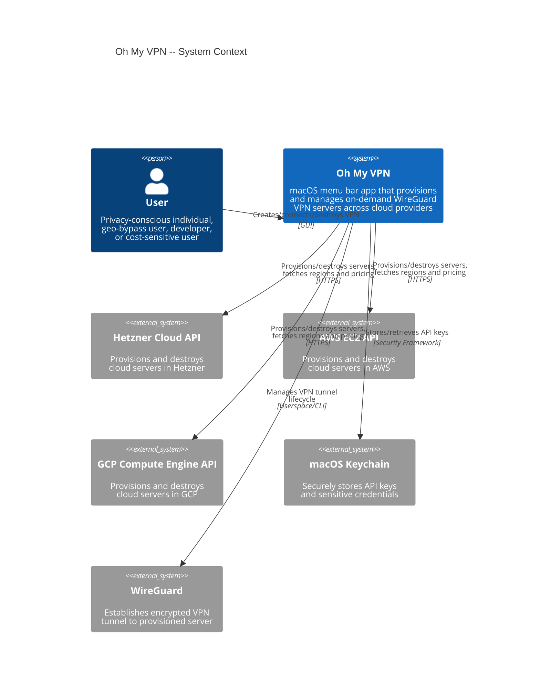

# Context and Scope

Oh My VPN is a macOS menu bar application that automates on-demand VPN server provisioning. Users create, connect to, and destroy their own WireGuard VPN servers across multiple cloud providers in one click.

This document defines the system boundary -- what Oh My VPN is, who interacts with it, and what external systems it depends on.

---

## 1. System Context

---

## 2. External Actors

| Actor | Type | Interaction | Protocol |
| --- | --- | --- | --- |
| User | Person | Manages VPN sessions via menu bar UI | GUI (Tauri webview) |
| Hetzner Cloud API | External System | Server CRUD, region/pricing queries | HTTPS REST |
| AWS EC2 API | External System | Server CRUD, region/pricing queries | HTTPS REST |
| GCP Compute Engine API | External System | Server CRUD, region/pricing queries | HTTPS REST |
| macOS Keychain | External System | Credential storage and retrieval | macOS Security Framework |
| WireGuard | External System | VPN tunnel establishment and teardown | Userspace (boringtun) or system CLI |

---

## 3. Key Boundaries

### A. Inside the System

- Tauri application (TypeScript frontend + Rust backend)
- Provider abstraction layer (unified interface for Hetzner, AWS, GCP)
- WireGuard key generation and tunnel management
- Session state tracking (connected IP, elapsed time, cost)
- Orphaned server detection and recovery

### B. Outside the System

- Cloud provider account management (sign-up, billing, IAM)
- WireGuard protocol implementation (leveraged, not built)
- macOS Keychain encryption (delegated to OS)
- Network Extension entitlement (open question OQ-3 from PRD)

---

## 4. Open Decisions

These items from the PRD affect the system boundary and require ADRs:

| PRD Ref | Question | Impact |
| --- | --- | --- |
| OQ-1 | WireGuard via boringtun (userspace) or system client? | Determines WireGuard dependency type |
| OQ-2 | Direct HTTP API calls or CLI tool wrapping (hcloud, aws, gcloud)? | Determines cloud provider integration pattern |
| OQ-3 | Is macOS Network Extension entitlement required? | May add Apple Developer Program as external dependency |
| OQ-7 | Ephemeral SSH key strategy for provisioning? | Affects key management boundary |
