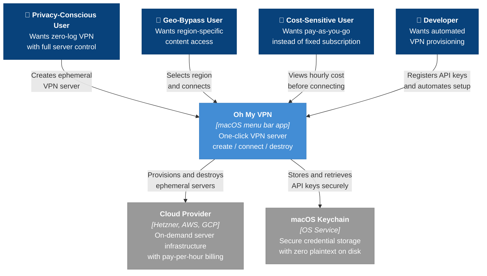

# Context and Scope

Oh My VPN is a macOS menu bar application that replaces fixed-cost VPN subscriptions ($5--12/month) with pay-as-you-go cloud instances ($0.17--$4.63/month). Users create, connect to, and destroy their own WireGuard VPN servers across multiple cloud providers in one click -- gaining full server control, zero-log guarantees, and dramatic cost savings.

This document defines the system boundary from a **business perspective** -- who uses Oh My VPN, what value they get, and what external systems are involved. For technical internals, see [containers.md](containers.md).

---

## 1. System Context

WireGuard is not an external system -- it is a protocol integrated inside the application via `wireguard-go` and `wg-quick` bundled in the app ([ADR-0001](../adr/0001-use-wireguard-go-with-wg-quick.md)). The individual cloud providers (Hetzner, AWS, GCP) are abstracted as a single external system at the context level; their differences are visible at the container level in [containers.md](containers.md).

---

## 2. Stakeholders and Value

| Stakeholder | Core Need | Value Delivered |
| --- | --- | --- |
| Privacy-Conscious User | Zero-log VPN with full server ownership | Ephemeral servers destroyed after each session -- no persistent logs anywhere |
| Geo-Bypass User | Region-specific content access | Pick any region across 3 cloud providers, server ready within 2 minutes |
| Cost-Sensitive User | Pay-as-you-go pricing | $0.17--$4.63/month vs $5--12/month fixed subscription |
| Developer | Automated VPN provisioning | One-click replaces manual CLI work across multiple cloud providers |

---

## 3. External Systems

| System | Role | Why External |
| --- | --- | --- |
| Cloud Provider (Hetzner, AWS, GCP) | On-demand server infrastructure with per-hour billing | Account management, billing, and IAM are outside Oh My VPN's control |
| macOS Keychain | OS-level encrypted credential storage | Encryption and access control delegated to macOS Security Framework |

---

## 4. Key Boundaries

### A. Inside the System

- Tauri application (TypeScript frontend + Rust backend)
- Provider abstraction layer (unified interface for Hetzner, AWS, GCP)
- WireGuard integration (key generation, tunnel management via wg-quick -- [ADR-0001](../adr/0001-use-wireguard-go-with-wg-quick.md))
- Session state tracking (connected IP, elapsed time, cost)
- Orphaned server detection and recovery

### B. Outside the System

- Cloud provider account management (sign-up, billing, IAM)
- macOS Keychain encryption (delegated to OS)
- Network Extension entitlement (not required for MVP -- [ADR-0003](../adr/0003-no-network-extension-for-mvp.md))

---

## 5. Resolved Decisions

All architectural open questions from the PRD have been resolved via ADRs:

| PRD Ref | Decision | ADR |
| --- | --- | --- |
| OQ-1 | Use wireguard-go + wg-quick (bundled) | [ADR-0001](../adr/0001-use-wireguard-go-with-wg-quick.md) |
| OQ-2 | Use Rust SDK per provider | [ADR-0002](../adr/0002-use-rust-sdk-for-cloud-providers.md) |
| OQ-3 | No Network Extension for MVP | [ADR-0003](../adr/0003-no-network-extension-for-mvp.md) |
| OQ-4 | Use provider Pricing API for real-time cost data | [ADR-0005](../adr/0005-use-provider-pricing-api.md) |
| OQ-5 | Support all three providers in MVP | [ADR-0006](../adr/0006-all-providers-in-mvp.md) |
| OQ-6 | Tauri updater with GitHub Releases fallback | [ADR-0007](../adr/0007-tauri-updater-with-github-releases.md) |
| OQ-7 | Ephemeral SSH keys per session | [ADR-0004](../adr/0004-ephemeral-ssh-keys-per-session.md) |
