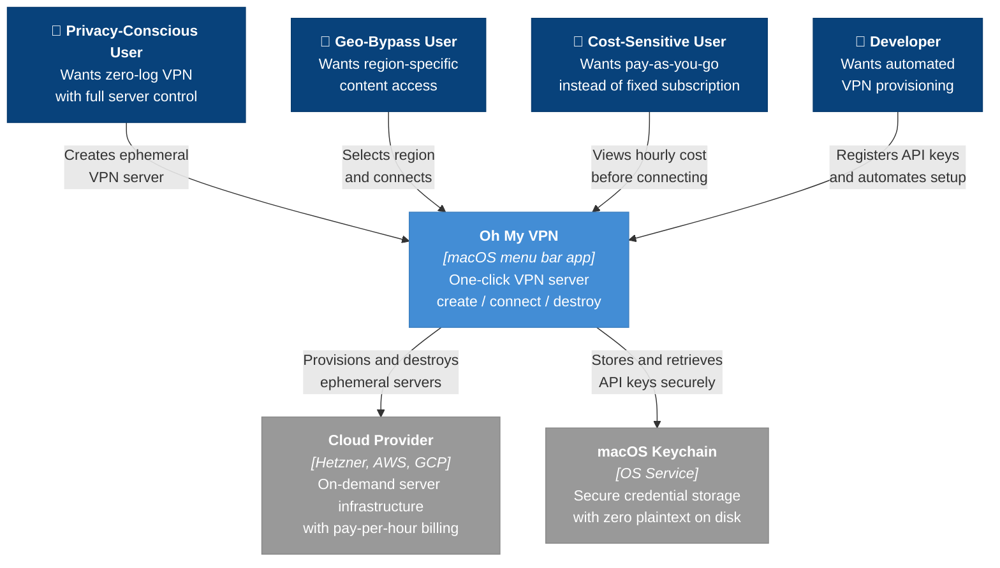

# Context and Scope

Oh My VPN is a macOS menu bar application that replaces fixed-cost VPN subscriptions ($5--12/month) with pay-as-you-go cloud instances ($0.17--$4.63/month). Users create, connect to, and destroy their own WireGuard VPN servers across multiple cloud providers in one click -- gaining full server control, zero-log guarantees, and dramatic cost savings.

This document defines the system boundary from a **business perspective** -- who uses Oh My VPN, what value they get, and what external systems are involved. For technical internals, see [containers.md](containers.md).

---

## 1. System Context

WireGuard is not an external system -- it is a protocol and library (boringtun) bundled inside the application. The individual cloud providers (Hetzner, AWS, GCP) are abstracted as a single external system at the context level; their differences are visible at the container level in [containers.md](containers.md).

---

## 2. Stakeholders and Value

| Stakeholder | Core Need | Value Delivered |
| --- | --- | --- |
| Privacy-Conscious User | Zero-log VPN with full server ownership | Ephemeral servers destroyed after each session -- no persistent logs anywhere |
| Geo-Bypass User | Region-specific content access | Pick any region across 3 cloud providers, server ready within 2 minutes |
| Cost-Sensitive User | Pay-as-you-go pricing | $0.17--$4.63/month vs $5--12/month fixed subscription |
| Developer | Automated VPN provisioning | One-click replaces manual CLI work across multiple cloud providers |

---

## 3. External Systems

| System | Role | Why External |
| --- | --- | --- |
| Cloud Provider (Hetzner, AWS, GCP) | On-demand server infrastructure with per-hour billing | Account management, billing, and IAM are outside Oh My VPN's control |
| macOS Keychain | OS-level encrypted credential storage | Encryption and access control delegated to macOS Security Framework |

---

## 3. Key Boundaries

### A. Inside the System

- Tauri application (TypeScript frontend + Rust backend)
- Provider abstraction layer (unified interface for Hetzner, AWS, GCP)
- WireGuard integration (key generation, tunnel management via boringtun)
- Session state tracking (connected IP, elapsed time, cost)
- Orphaned server detection and recovery

### B. Outside the System

- Cloud provider account management (sign-up, billing, IAM)
- macOS Keychain encryption (delegated to OS)
- Network Extension entitlement (open question OQ-3 from PRD)

---

## 4. Open Decisions

These items from the PRD affect the system boundary and require ADRs:

| PRD Ref | Question | Impact |
| --- | --- | --- |
| OQ-1 | WireGuard via boringtun (userspace) or system client? | Determines WireGuard dependency type |
| OQ-2 | Direct HTTP API calls or CLI tool wrapping (hcloud, aws, gcloud)? | Determines cloud provider integration pattern |
| OQ-3 | Is macOS Network Extension entitlement required? | May add Apple Developer Program as external dependency |
| OQ-7 | Ephemeral SSH key strategy for provisioning? | Affects key management boundary |
