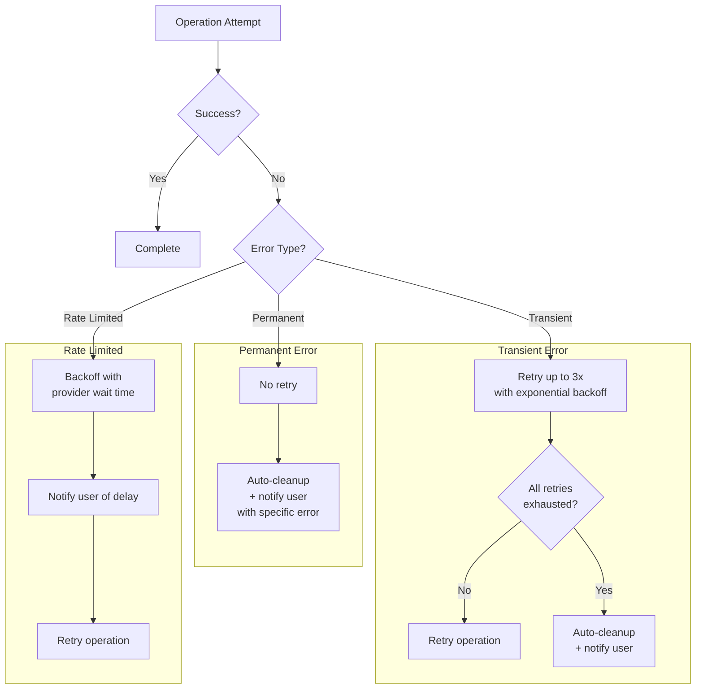
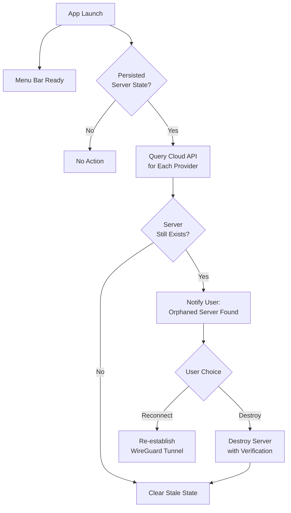
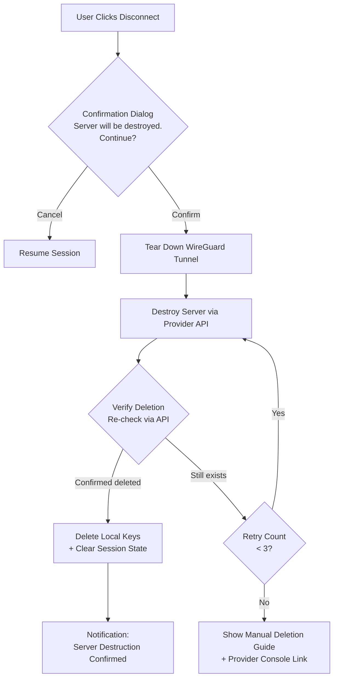

# Cross-Cutting Concepts

Patterns and strategies that span multiple containers in Oh My VPN. These are not localized to a single module -- they affect the system as a whole.

---

## 1. Credential Security

All sensitive credentials (cloud provider API keys) flow through a single path: the Keychain Adapter. No other container reads or writes credentials directly.

### A. Rules

- API keys are **never** stored in files, environment variables, or application memory beyond the immediate operation (NFR-SEC-1)
- WireGuard keys are **ephemeral** -- generated per session, held in memory during the session, deleted on teardown (NFR-SEC-2). SSH keys follow the same ephemeral pattern ([ADR-0004](../adr/0004-ephemeral-ssh-keys-per-session.md))
- WireGuard config files have permission `600` and are deleted immediately after tunnel establishment (NFR-SEC-6)

---

## 2. Error Handling and Retry

Oh My VPN follows a **fail-fast with graceful recovery** pattern. Errors are detected early, surfaced clearly, and recovered automatically where possible.

### A. Transient Errors

Network timeouts, cloud API 5xx responses, WireGuard handshake failures.

- Retry up to 3 times with exponential backoff (NFR-REL-3)
- Auto-cleanup partial resources on final failure (FR-SL-4)

### B. Permanent Errors

Invalid API key, insufficient permissions, unsupported region.

- No retry -- fail fast with specific error message (NFR-INT-2)
- Guide user to resolution (e.g., "Check API key permissions")

### C. Rate Limiting

Cloud API 429 responses.

- Backoff with provider-specific wait time (NFR-INT-3)
- Notify user that the operation is delayed, not failed

---

## 3. Orphaned Server Recovery

An orphaned server is a cloud instance that exists without an active app session -- caused by app crash, force-quit, or network loss during destruction. This is a critical cost and security risk.

### A. Detection Strategy

On every app launch, the Session Tracker checks for persisted server state (server ID, provider, region). If state exists, the Provider Manager queries the cloud API to verify the server still exists. This ensures 100% detection rate (NFR-REL-1). Detection runs **asynchronously** after the menu bar is ready -- the app must reach the ready state within 3 seconds (NFR-PERF-3), so orphan detection must not block startup. The updated diagram above reflects this: `App Launch` forks into both `Menu Bar Ready` (immediate) and the detection check (async).

### B. State Persistence

Minimal state is persisted to detect orphans:

| Field | Purpose |
| --- | --- |
| `serverId` | Cloud instance identifier |
| `provider` | Which cloud provider (Hetzner/AWS/GCP) |
| `region` | Server region |
| `createdAt` | Provisioning timestamp |
| `hourlyCost` | For cost estimation |
| `sshKeyId` | Provider-side SSH key ID for cleanup on crash during provisioning ([ADR-0004](../adr/0004-ephemeral-ssh-keys-per-session.md)) |

This state is cleared on successful disconnection and server destruction.

---

## 4. DNS and IPv6 Leak Prevention

During an active VPN session, all network traffic must route through the WireGuard tunnel. Leaks expose the user's real IP address, defeating the core privacy value.

### A. DNS Leak Prevention

- All DNS queries route through the VPN tunnel (FR-VC-5, NFR-SEC-3)
- The WireGuard config sets `DNS` to the VPN server's resolver
- System DNS settings are restored on disconnection

### B. IPv6 Leak Prevention

- IPv6 traffic is disabled or tunneled during active session (FR-VC-6, NFR-SEC-4)
- Implementation: disable IPv6 at the network interface level or route all IPv6 through the tunnel

---

## 5. macOS Notifications

Status changes are communicated via macOS native notifications (FR-MN-2). This is a cross-cutting concern because multiple containers trigger notifications:

| Event | Source Container | Notification |
| --- | --- | --- |
| Server provisioned | Server Lifecycle | "VPN server ready" |
| VPN connected | VPN Manager | "VPN connected -- {region}" |
| VPN disconnected | Server Lifecycle | "Server destruction confirmed" |
| Orphaned server found | Session Tracker | "Active server detected from previous session" |
| Provisioning failed | Server Lifecycle | "Server creation failed -- {reason}" |
| API rate limited | Provider Manager | "Cloud API rate limited -- retrying" |

---

## 6. Cloud-Init Strategy

Server provisioning uses cloud-init to automate WireGuard installation and configuration ([ADR-0001](../adr/0001-use-wireguard-go-with-wg-quick.md)). This is a cross-cutting concern because it involves the Server Lifecycle, VPN Manager, and Provider Manager.

### A. cloud-init Script Responsibilities

1. Install WireGuard package
2. Configure WireGuard interface with server private key and client public key
3. Configure firewall rules (allow WireGuard UDP port only)
4. Enable IP forwarding
5. Start WireGuard service

### B. Provider Variation

Each cloud provider may require slightly different cloud-init scripts (Risk R-1):

| Provider | Variation |
| --- | --- |
| Hetzner | Standard cloud-init, Ubuntu/Debian base image |
| AWS | User-data script, Amazon Linux or Ubuntu AMI, Security Groups for firewall |
| GCP | Startup script metadata, firewall rules via Compute Engine API |

Provider-specific scripts are maintained independently and tested per provider (Risk R-1 mitigation).

---

## 7. Update Integrity

App updates are distributed via Tauri's built-in updater with GitHub Releases as a manual fallback ([ADR-0007](../adr/0007-tauri-updater-with-github-releases.md)). Update integrity is a cross-cutting security concern -- a compromised update binary could undermine all other security properties (credential storage, ephemeral keys, tunnel isolation).

### A. Signature Verification

Every update binary is signed with an Ed25519 key pair. The Tauri updater verifies the signature before applying the update:

| Component | Location | Purpose |
| --- | --- | --- |
| Signing private key | CI environment secret (never on disk) | Signs update binaries during release build |
| Verification public key | Embedded in app binary (`tauri.conf.json`) | Verifies downloaded update before installation |

### B. Failure Handling

| Failure | Behavior |
| --- | --- |
| Signature verification fails | Update rejected, user notified, manual download fallback offered |
| Download interrupted | Retry up to 3 times, then notify user to download from GitHub Releases |
| Update endpoint unreachable | Silent skip, app continues with current version |

---

## 8. Disconnect Flow with Confirmation and Verification

Disconnecting is a destructive action -- it tears down the tunnel and permanently destroys the cloud server. The UX Design (§6.C) requires an explicit confirmation dialog and post-destruction verification to align with the "Privacy by Destruction" principle.

### A. Confirmation Dialog

Before any teardown begins, the user sees a modal dialog: "Server will be destroyed. Continue?" with Cancel (neutral) and Destroy (destructive) buttons. This prevents accidental disconnection and communicates that destruction is permanent (UI Design §4.F).

### B. Deletion Verification

After the Provider Manager reports successful server destruction, Server Lifecycle re-queries via Provider Manager to verify the server no longer exists. Only after this verification does the app show "Server destruction confirmed" and clear all session state. This two-step verification (destroy + verify) ensures the "zero trace" guarantee is real, not assumed.

### C. Persistent Failure Fallback

If destruction fails after 3 retries (§2.A), or verification shows the server still exists after 3 retry cycles, the app displays a warning with the provider's console URL and a manual deletion guide. The session state is preserved so the user can attempt destruction again later.

---

## 9. App Quit While Connected

When the user quits the app (right-click context menu > Quit, or Cmd+Q) while a VPN session is active, the app must not silently exit. The flow is:

1. Quit action intercepted by the Tauri app lifecycle handler
2. Destruction confirmation dialog is presented (same as §8.A)
3. If the user confirms, the full disconnect-and-destroy flow (§8) runs to completion before the app exits
4. If the user cancels, the quit is aborted and the session continues

This prevents orphaned servers caused by intentional quit. Unintentional termination (force-quit, crash, system shutdown) is handled by the orphaned server recovery flow (§3).

---

## 10. System Permissions

Oh My VPN requires sudo privileges for `wg-quick` tunnel creation ([ADR-0001](../adr/0001-use-wireguard-go-with-wg-quick.md), [ADR-0003](../adr/0003-no-network-extension-for-mvp.md)). The right-click context menu provides a "System Permissions" entry (UX Design §7.C) that:

1. Shows the current permission status (whether the app has been granted sudo access previously)
2. Navigates users to the relevant macOS System Settings pane if permissions need attention

This is informational only -- the app does not programmatically request or manage macOS permissions beyond the `osascript` sudo dialog that appears during each tunnel creation. The sudo dialog is a macOS system prompt, not an app-controlled flow.

---
