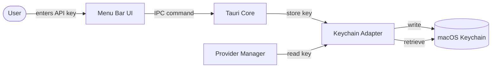
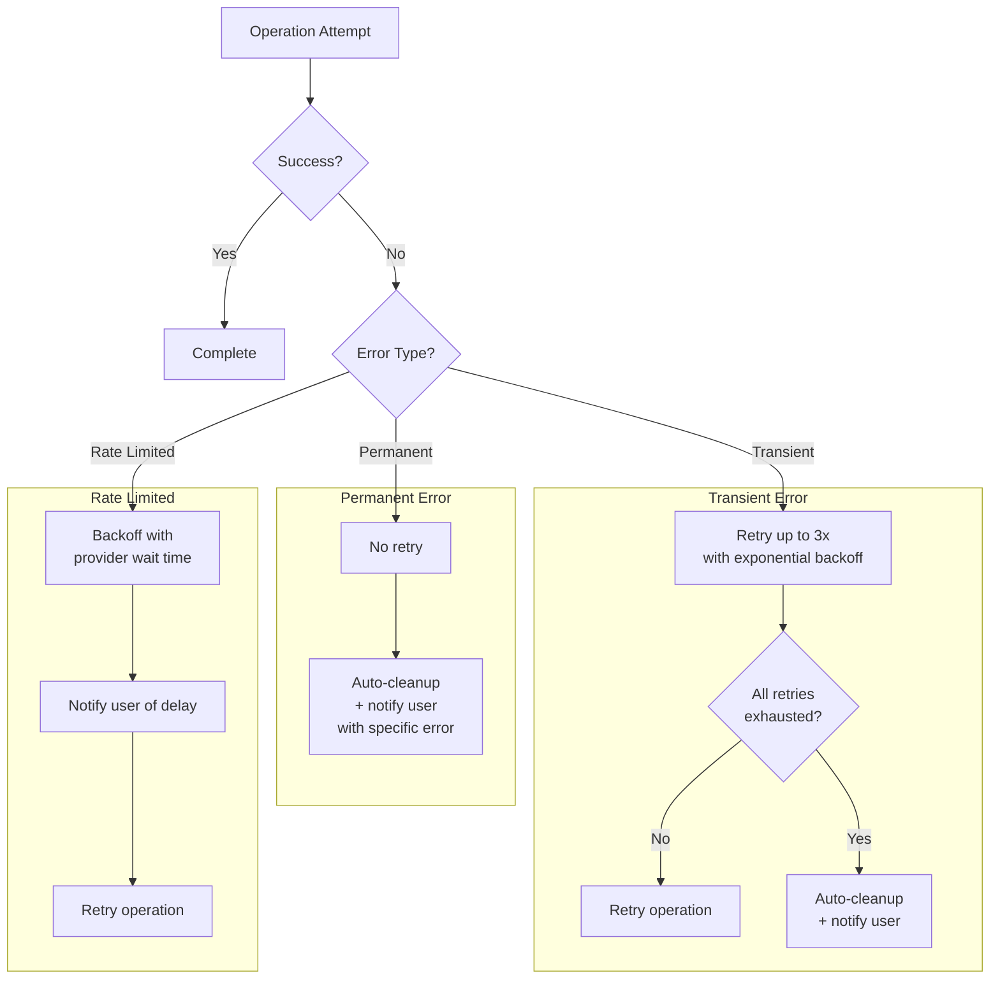
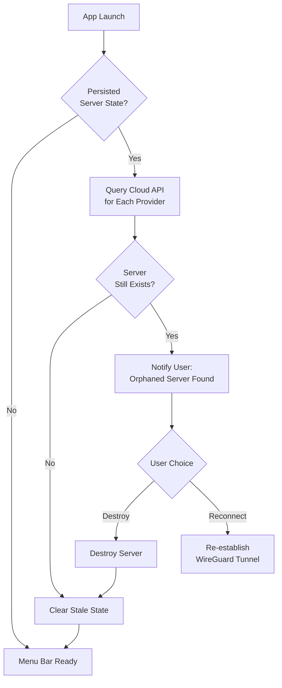

# Cross-Cutting Concepts

Patterns and strategies that span multiple containers in Oh My VPN. These are not localized to a single module -- they affect the system as a whole.

---

## 1. Credential Security

All sensitive credentials (cloud provider API keys) flow through a single path: the Keychain Adapter. No other container reads or writes credentials directly.

### A. Rules

- API keys are **never** stored in files, environment variables, or application memory beyond the immediate operation (NFR-SEC-1)
- WireGuard keys are **ephemeral** -- generated per session, held in memory during the session, deleted on teardown (NFR-SEC-2)
- WireGuard config files have permission `600` and are deleted immediately after tunnel establishment (NFR-SEC-6)

---

## 2. Error Handling and Retry

Oh My VPN follows a **fail-fast with graceful recovery** pattern. Errors are detected early, surfaced clearly, and recovered automatically where possible.

### A. Transient Errors

Network timeouts, cloud API 5xx responses, WireGuard handshake failures.

- Retry up to 3 times with exponential backoff (NFR-REL-3)
- Auto-cleanup partial resources on final failure (FR-SL-4)

### B. Permanent Errors

Invalid API key, insufficient permissions, unsupported region.

- No retry -- fail fast with specific error message (NFR-INT-2)
- Guide user to resolution (e.g., "Check API key permissions")

### C. Rate Limiting

Cloud API 429 responses.

- Backoff with provider-specific wait time (NFR-INT-3)
- Notify user that the operation is delayed, not failed

---

## 3. Orphaned Server Recovery

An orphaned server is a cloud instance that exists without an active app session -- caused by app crash, force-quit, or network loss during destruction. This is a critical cost and security risk.

### A. Detection Strategy

On every app launch, the Session Tracker checks for persisted server state (server ID, provider, region). If state exists, the Provider Manager queries the cloud API to verify the server still exists. This ensures 100% detection rate (NFR-REL-1).

### B. State Persistence

Minimal state is persisted to detect orphans:

| Field | Purpose |
| --- | --- |
| `serverId` | Cloud instance identifier |
| `provider` | Which cloud provider (Hetzner/AWS/GCP) |
| `region` | Server region |
| `createdAt` | Provisioning timestamp |
| `hourlyCost` | For cost estimation |

This state is cleared on successful disconnection and server destruction.

---

## 4. DNS and IPv6 Leak Prevention

During an active VPN session, all network traffic must route through the WireGuard tunnel. Leaks expose the user's real IP address, defeating the core privacy value.

### A. DNS Leak Prevention

- All DNS queries route through the VPN tunnel (FR-VC-5, NFR-SEC-3)
- The WireGuard config sets `DNS` to the VPN server's resolver
- System DNS settings are restored on disconnection

### B. IPv6 Leak Prevention

- IPv6 traffic is disabled or tunneled during active session (FR-VC-6, NFR-SEC-4)
- Implementation: disable IPv6 at the network interface level or route all IPv6 through the tunnel

---

## 5. macOS Notifications

Status changes are communicated via macOS native notifications (FR-MN-2). This is a cross-cutting concern because multiple containers trigger notifications:

| Event | Source Container | Notification |
| --- | --- | --- |
| Server provisioned | Server Lifecycle | "VPN server ready" |
| VPN connected | VPN Manager | "VPN connected -- {region}" |
| VPN disconnected | VPN Manager | "Disconnected, server destroyed" |
| Orphaned server found | Session Tracker | "Active server detected from previous session" |
| Provisioning failed | Server Lifecycle | "Server creation failed -- {reason}" |
| API rate limited | Provider Manager | "Cloud API rate limited -- retrying" |

---

## 6. Cloud-Init Strategy

Server provisioning uses cloud-init to automate WireGuard installation and configuration. This is a cross-cutting concern because it involves the Server Lifecycle, VPN Manager, and Provider Manager.

### A. cloud-init Script Responsibilities

1. Install WireGuard package
2. Configure WireGuard interface with server private key and client public key
3. Configure firewall rules (allow WireGuard UDP port only)
4. Enable IP forwarding
5. Start WireGuard service

### B. Provider Variation

Each cloud provider may require slightly different cloud-init scripts (Risk R-1):

| Provider | Variation |
| --- | --- |
| Hetzner | Standard cloud-init, Ubuntu/Debian base image |
| AWS | User-data script, Amazon Linux or Ubuntu AMI, Security Groups for firewall |
| GCP | Startup script metadata, firewall rules via Compute Engine API |

Provider-specific scripts are maintained independently and tested per provider (Risk R-1 mitigation).
