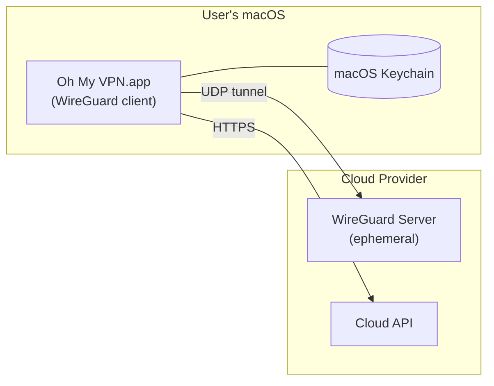

# Deployment View

Oh My VPN operates across two environments: the user's macOS machine (where the Tauri app runs) and ephemeral cloud servers (where WireGuard runs). This document maps containers to infrastructure nodes.

---

## 1. Deployment Diagram

```mermaid
C4Deployment
    title Oh My VPN -- Deployment Diagram

    Deployment_Node(macOs, "User's macOS Machine", "macOS 13+") {
        Deployment_Node(tauriApp, "Oh My VPN.app", "Tauri Bundle") {
            Container(menuBarUi, "Menu Bar UI", "TypeScript, Webview", "User interface")
            Container(tauriCore, "Tauri Core", "Rust", "IPC bridge")
            Container(providerManager, "Provider Manager", "Rust", "Cloud API abstraction")
            Container(serverLifecycle, "Server Lifecycle", "Rust", "Provisioning orchestration")
            Container(vpnManager, "VPN Manager", "Rust", "WireGuard tunnel management")
            Container(sessionTracker, "Session Tracker", "Rust", "Session state tracking")
            Container(keychainAdapter, "Keychain Adapter", "Rust", "Credential access")
        }
        Deployment_Node(osServices, "macOS Services") {
            Container(keychain, "Keychain", "Security Framework", "Encrypted credential storage")
        }
    }

    Deployment_Node(cloud, "Cloud Provider", "Hetzner / AWS / GCP") {
        Deployment_Node(ephemeralServer, "Ephemeral VPN Server", "Cheapest instance type") {
            Container(wireguardServer, "WireGuard", "cloud-init configured", "VPN endpoint with<br/>firewall rules")
        }
    }

    Rel(vpnManager, wireguardServer, "WireGuard tunnel", "UDP")
    Rel(providerManager, cloud, "Provisions/destroys", "HTTPS")
    Rel(keychainAdapter, keychain, "Reads/writes keys", "Security Framework")
```

---

## 2. Infrastructure Nodes

### A. User's macOS Machine

| Attribute | Value |
| --- | --- |
| OS | macOS 13+ (Ventura or later) |
| Runtime | Tauri app bundle (.app) |
| Distribution | Direct download (v1.0), `brew install` (v2.0) |
| Update mechanism | Tauri built-in updater (OQ-6) or manual download |
| Privileges | Standard user; may require admin for WireGuard tunnel (OQ-3) |

The entire Tauri application runs as a single process on the user's machine. All Rust containers are in-process modules -- not separate services.

### B. Ephemeral VPN Server

| Attribute | Value |
| --- | --- |
| Providers | Hetzner Cloud, AWS EC2, GCP Compute Engine |
| Lifecycle | Created on "Connect", destroyed on "Disconnect" |
| Configuration | cloud-init script installs WireGuard, configures firewall |
| Instance type | Cheapest available (e.g., Hetzner CX22, AWS t3.nano, GCP e2-micro) |
| Firewall rules | WireGuard UDP port only (NFR-SEC-5) |
| Persistence | None -- ephemeral by design. No data survives destruction |

### C. Network Topology



---

## 3. Deployment Characteristics

### A. No Server-Side Infrastructure

Oh My VPN has **no backend server** of its own. The app communicates directly with cloud provider APIs. This means:

- Zero ongoing infrastructure cost for the developer
- No single point of failure beyond the cloud providers themselves
- Users own their entire data path

### B. Ephemeral by Design

Cloud servers exist only during active VPN sessions. On disconnect, the server is destroyed and all data is deleted. This is a core security property (NFR-SEC-2, US-PRI-2).

### C. Multi-Provider Resilience

Supporting three cloud providers (Hetzner, AWS, GCP) means:

- If one provider has an outage, users can switch to another
- Regional coverage is maximized across providers
- Cost competition benefits the user

### D. Environment Summary

| Environment | Purpose | Lifetime |
| --- | --- | --- |
| User's macOS | App runtime, credential storage, VPN client | Permanent (app installed) |
| Cloud VPN server | WireGuard endpoint | Ephemeral (minutes to hours) |
| Cloud provider API | Server management | Always available (external) |
