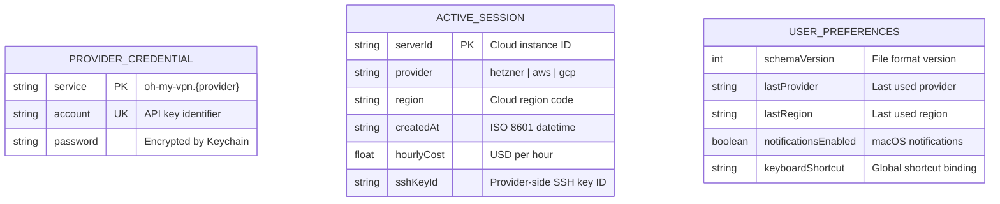
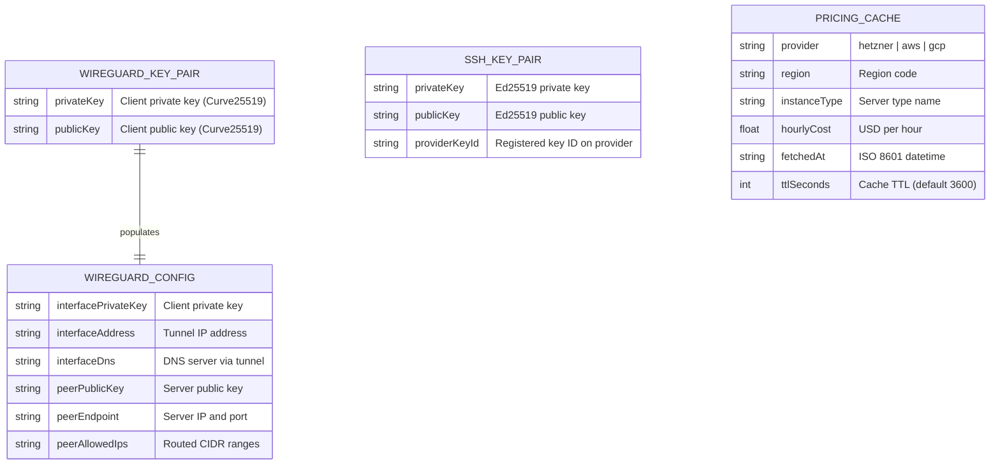
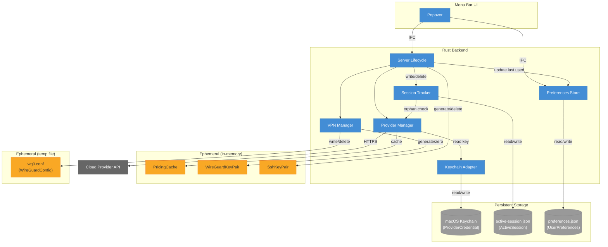

# Data Model -- Oh My VPN

## 1. Overview

Oh My VPN has **7 data entities** across **3 storage types** -- with no relational database. The data landscape reflects the product's "Privacy by Destruction" philosophy: 4 of 7 entities are ephemeral, existing only in memory or as temporary files measured in seconds.

- **Total entities**: 7
- **Storage types**: Key-value store (macOS Keychain), file-based state (JSON), in-memory state
- **Key design decision**: No database -- all persistent state uses either macOS Keychain (credentials) or JSON files in the Tauri app data directory (session state, preferences). This eliminates migration tooling, keeps the single-binary deployment model, and aligns with the ephemeral-first design

## 2. Entity Catalog

| Entity | Module | Storage Type | Lifecycle | Source Requirements |
| --- | --- | --- | --- | --- |
| ProviderCredential | Keychain Adapter | Key-value store (macOS Keychain) | Long-lived | FR-PM-1, FR-PM-3, NFR-SEC-1 |
| ActiveSession | Session Tracker | File-based state (JSON) | Session-scoped | FR-SL-6, FR-SL-7, NFR-REL-1, NFR-REL-4 |
| UserPreferences | Preferences Store | File-based state (JSON) | Long-lived | UX §4.E, FR-MN-2 |
| PricingCache | Provider Manager | In-memory state | Ephemeral (TTL ~1h) | FR-RC-2, ADR-0005 |
| WireGuardKeyPair | VPN Manager | In-memory state | Ephemeral (session) | FR-VC-1, FR-VC-4, NFR-SEC-2 |
| WireGuardConfig | VPN Manager | File-based state (temp file) | Ephemeral (seconds) | NFR-SEC-6, ADR-0001 |
| SshKeyPair | Server Lifecycle | In-memory state | Ephemeral (provisioning) | ADR-0004, NFR-SEC-2 |

**Lifecycle values**: ephemeral (seconds to hours, never persisted across app restart), session-scoped (persisted only during active VPN session, cleared on successful disconnect), long-lived (persists across app restarts indefinitely)

## 3. ER Diagrams

### A. Persistent State (file-based + Keychain)



ProviderCredential, ActiveSession, and UserPreferences have no foreign key relationships -- they are independent entities managed by separate modules. ProviderCredential is keyed by macOS Keychain's service/account pair. ActiveSession is a singleton file (only one VPN session at a time). UserPreferences is a singleton JSON file.

### B. Ephemeral State (in-memory)



Ephemeral entities exist only in memory (or as a temporary file for WireGuardConfig). They are never persisted to disk across app restarts. WireGuardKeyPair populates the Interface section of WireGuardConfig.

## 4. Schema Definitions

> **Naming convention**: Field names in this document use camelCase as the language-neutral canonical form. Implementations map to the target language's convention -- Rust uses `snake_case` (e.g., `privateKey` → `private_key`), TypeScript keeps `camelCase` as-is.

### A. Key-value store schemas

#### ProviderCredential

**Storage**: macOS Keychain (Security Framework)

| Field | Type | Required | Description |
| --- | --- | --- | --- |
| `service` | `String` | Yes | Keychain service name: `oh-my-vpn.{provider}` (e.g., `oh-my-vpn.hetzner`) |
| `account` | `String` | Yes | Human-readable identifier for the key (e.g., provider account email or key label) |
| `password` | `String` | Yes | The actual API key/token value, encrypted at rest by Keychain |

**Key pattern**: `service:oh-my-vpn.{provider}` + `account:{identifier}`

One entry per registered provider. Maximum 3 entries (Hetzner, AWS, GCP). The Keychain Adapter encapsulates all Security Framework calls -- no other module accesses Keychain directly.

**Constraints**:

- `service` must match pattern `oh-my-vpn.(hetzner|aws|gcp)`
- `password` is validated against the provider API before storage (FR-PM-2)
- Deleting a provider removes the Keychain entry entirely (FR-PM-4)

### B. File-based state schemas

#### ActiveSession

**Storage**: File-based state (`{tauri_app_data}/active-session.json`)

| Field | Type | Required | Description |
| --- | --- | --- | --- |
| `serverId` | `String` | Yes | Cloud instance identifier (provider-specific format) |
| `provider` | `String` | Yes | Provider enum: `hetzner`, `aws`, `gcp` |
| `region` | `String` | Yes | Cloud region code (e.g., `fsn1`, `us-east-1`, `us-central1`) |
| `serverIp` | `String` | Yes | Public IP address of the VPN server |
| `createdAt` | `String` | Yes | ISO 8601 datetime of server provisioning |
| `hourlyCost` | `f64` | Yes | USD hourly cost at time of provisioning |
| `sshKeyId` | `String` | No | Provider-side SSH key ID (for cleanup if crash during provisioning) |

**File location**: `{tauri_app_data}/active-session.json`

This file exists only during an active VPN session. It is created when server provisioning begins and deleted when disconnection and server destruction complete successfully. On app launch, the Session Tracker checks for this file to detect orphaned servers (NFR-REL-1).

**Constraints**:

- File is a singleton -- only one active session at a time
- File must be deleted on successful disconnect (clear session state)
- File persists across app crashes to enable orphan detection
- `provider` must be one of: `hetzner`, `aws`, `gcp`

#### UserPreferences

**Storage**: File-based state (`{tauri_app_data}/preferences.json`)

| Field | Type | Required | Description |
| --- | --- | --- | --- |
| `schemaVersion` | `u32` | Yes | File format version for migration (starts at `1`) |
| `lastProvider` | `String` | No | Last used provider for expert shortcut pre-selection |
| `lastRegion` | `String` | No | Last used region for expert shortcut pre-selection |
| `notificationsEnabled` | `bool` | Yes | Whether macOS notifications are active (default: `true`) |
| `keyboardShortcut` | `String` | No | Global keyboard shortcut binding (e.g., `Cmd+Shift+V`) |

**File location**: `{tauri_app_data}/preferences.json`

Created on first app launch with defaults. Updated whenever the user changes settings or completes a VPN session (last-used provider/region). The Preferences Store reads this on startup and writes changes immediately.

**Constraints**:

- `schemaVersion` must be present and ≥ 1
- Missing optional fields use defaults: `lastProvider` = `null`, `lastRegion` = `null`, `keyboardShortcut` = `null`
- `notificationsEnabled` defaults to `true` on first creation

### C. In-memory state schemas

#### PricingCache

**Storage**: In-memory (Provider Manager internal `HashMap`)

| Field | Type | Required | Description |
| --- | --- | --- | --- |
| `provider` | `String` | Yes | Provider identifier |
| `entries` | `Vec<RegionPricing>` | Yes | List of region pricing entries |
| `fetchedAt` | `DateTime` | Yes | Timestamp of last API fetch |
| `ttlSeconds` | `u64` | Yes | Cache validity duration (default: 3600) |

**RegionPricing entry**:

| Field | Type | Required | Description |
| --- | --- | --- | --- |
| `region` | `String` | Yes | Region code |
| `displayName` | `String` | Yes | Human-readable region name (e.g., "Falkenstein, DE") |
| `instanceType` | `String` | Yes | Cheapest instance type name |
| `hourlyCost` | `f64` | Yes | USD per hour |

**Key pattern**: `HashMap<Provider, PricingCache>` -- one cache entry per provider.

On cache miss or TTL expiry, Provider Manager fetches fresh data via the provider SDK (ADR-0005). On API failure with existing stale cache, the stale data is served with a warning.

#### WireGuardKeyPair

**Storage**: In-memory (VPN Manager, stack variable)

| Field | Type | Required | Description |
| --- | --- | --- | --- |
| `privateKey` | `[u8; 32]` | Yes | Curve25519 private key |
| `publicKey` | `[u8; 32]` | Yes | Curve25519 public key |

Generated fresh per session (FR-VC-1). The public key is sent to the cloud server via cloud-init. Both keys are zeroed and dropped after tunnel teardown (FR-VC-4, NFR-SEC-2).

#### WireGuardConfig

**Storage**: Temporary file (`/tmp/oh-my-vpn-wg0.conf`, permission `600`)

| Field | Type | Required | Description |
| --- | --- | --- | --- |
| `[Interface].PrivateKey` | `String` | Yes | Client private key (base64) |
| `[Interface].Address` | `String` | Yes | Tunnel IP (e.g., `10.0.0.2/24`) |
| `[Interface].DNS` | `String` | Yes | DNS server for leak prevention |
| `[Peer].PublicKey` | `String` | Yes | Server public key (base64) |
| `[Peer].Endpoint` | `String` | Yes | Server IP:port (e.g., `1.2.3.4:51820`) |
| `[Peer].AllowedIPs` | `String` | Yes | Routed ranges (e.g., `0.0.0.0/0, ::/0`) |

This file uses standard WireGuard INI format. It is written immediately before `wg-quick up`, has file permission `600` (NFR-SEC-6), and is deleted immediately after tunnel establishment -- regardless of success or failure (ADR-0001).

#### SshKeyPair

**Storage**: In-memory (Server Lifecycle, stack variable)

| Field | Type | Required | Description |
| --- | --- | --- | --- |
| `privateKey` | `Vec<u8>` | Yes | Ed25519 private key (not used after registration) |
| `publicKey` | `String` | Yes | Ed25519 public key (registered with provider) |
| `providerKeyId` | `String` | Yes | ID returned by provider after key registration |

Generated before server provisioning (ADR-0004). The public key is registered with the cloud provider, and `providerKeyId` is stored to enable cleanup. Both the local key pair and the provider-side key are deleted after cloud-init completes (or on provisioning failure). The private key is never written to disk.

## 5. Access Patterns

### A. ProviderCredential

| Operation | Module | Method | Frequency | Read/Write |
| --- | --- | --- | --- | --- |
| Store API key | Keychain Adapter | `SecItemAdd` (Security Framework) | Rare (onboarding) | Write |
| Retrieve API key | Keychain Adapter | `SecItemCopyMatching` | Per cloud API call | Read |
| Delete API key | Keychain Adapter | `SecItemDelete` | Rare (provider removal) | Write |
| Validate API key | Provider Manager | Retrieve + test API call | On registration | Read |

**Read/Write ratio**: Read-heavy (retrieved on every cloud API call, written only during onboarding/removal)

### B. ActiveSession

| Operation | Module | Method | Frequency | Read/Write |
| --- | --- | --- | --- | --- |
| Create session file | Session Tracker | `serde_json::to_writer` + `fs::write` | Per connect | Write |
| Read session file | Session Tracker | `fs::read` + `serde_json::from_str` | Per app launch (orphan check) | Read |
| Delete session file | Session Tracker | `fs::remove_file` | Per disconnect | Write |
| Update SSH key ID | Session Tracker | Read-modify-write | During provisioning | Write |

**Read/Write ratio**: Balanced (written on connect, read on launch, deleted on disconnect)

### C. UserPreferences

| Operation | Module | Method | Frequency | Read/Write |
| --- | --- | --- | --- | --- |
| Load preferences | Preferences Store | `fs::read` + `serde_json::from_str` | Per app launch | Read |
| Save preferences | Preferences Store | `serde_json::to_writer_pretty` + `fs::write` | Per setting change or session end | Write |
| Read last provider/region | Server Lifecycle | Via Preferences Store API | Per popover open | Read |

**Read/Write ratio**: Read-heavy (loaded on startup, read per popover, written occasionally on setting change or session end)

### D. PricingCache

| Operation | Module | Method | Frequency | Read/Write |
| --- | --- | --- | --- | --- |
| Check cache | Provider Manager | `HashMap::get` + TTL check | Per region list request | Read |
| Update cache | Provider Manager | `HashMap::insert` | On cache miss or TTL expiry | Write |
| Invalidate cache | Provider Manager | `HashMap::remove` | On provider removal | Write |

**Read/Write ratio**: Read-heavy (checked per region list request, updated at most once per hour per provider)

### E. WireGuardKeyPair

| Operation | Module | Method | Frequency | Read/Write |
| --- | --- | --- | --- | --- |
| Generate key pair | VPN Manager | `x25519_dalek` or equivalent | Per connect | Write |
| Read public key | VPN Manager | Field access | Once (for cloud-init) | Read |
| Read private key | VPN Manager | Field access | Once (for config file) | Read |
| Zero and drop | VPN Manager | `zeroize` + `drop` | Per disconnect | Write |

**Read/Write ratio**: Balanced (generated once, read twice, zeroed once per session)

### F. WireGuardConfig

| Operation | Module | Method | Frequency | Read/Write |
| --- | --- | --- | --- | --- |
| Write config file | VPN Manager | `fs::write` with mode `0o600` | Per connect | Write |
| Read by wg-quick | OS (wg-quick subprocess) | File read | Per connect | Read |
| Delete config file | VPN Manager | `fs::remove_file` | Immediately after wg-quick | Write |

**Read/Write ratio**: Balanced (write-once, read-once, delete-once -- total lifetime is seconds)

### G. SshKeyPair

| Operation | Module | Method | Frequency | Read/Write |
| --- | --- | --- | --- | --- |
| Generate key pair | Server Lifecycle | `ssh-key` crate or `ed25519_dalek` | Per connect | Write |
| Register public key | Server Lifecycle | Via Provider Manager SDK | Per connect | Read |
| Delete provider key | Server Lifecycle | Via Provider Manager SDK | After cloud-init or on failure | Write |
| Zero and drop | Server Lifecycle | `zeroize` + `drop` | After cleanup | Write |

**Read/Write ratio**: Balanced (generated, registered, deleted -- all once per session)

## 6. Migration Strategy

### A. File-based state migrations

Oh My VPN uses no relational database. Both persistent files (ActiveSession, UserPreferences) use JSON with a forward-compatible strategy.

#### UserPreferences

- **Schema version**: `schemaVersion` field in the JSON root (integer, starts at `1`)
- **Backward compatibility**: The Preferences Store reader supports the current version and one previous version
- **Upgrade path**: On app launch, if `schemaVersion` < current, the reader applies migrations sequentially (v1 -> v2 -> v3) and writes the upgraded file back
- **Missing file**: Created with defaults on first launch
- **Corrupt file**: Backed up to `preferences.backup.json`, replaced with defaults, user notified

```plain
Migration Order:
  1. Read file
  2. Check schemaVersion
  3. If outdated: apply sequential upgrades
  4. If corrupt: backup + recreate with defaults
  5. Write upgraded file (atomic: write tmp + rename)
```

#### ActiveSession

- **Schema version**: Not versioned -- structure is simple and stable
- **Missing file**: No session active (normal state)
- **Corrupt file**: Treated as "possible orphan" -- query all providers to verify, then either clean up or recreate the file
- **Atomic write**: Write to temporary file, then rename (prevents partial writes on crash)

### B. Key-value store (macOS Keychain)

- **Key naming**: Service = `oh-my-vpn.{provider}`, Account = user-defined label
- **TTL policy**: None -- credentials persist until explicitly deleted by user
- **Cleanup**: On provider removal (FR-PM-4), the Keychain entry is deleted via `SecItemDelete`
- **Migration**: If the service name pattern changes in a future version, the app scans for old-pattern entries and migrates them on first launch

### C. In-memory state

No migration needed -- in-memory entities (PricingCache, WireGuardKeyPair, SshKeyPair) are recreated fresh on every app launch or session.

## 7. Data Flow Summary



---
