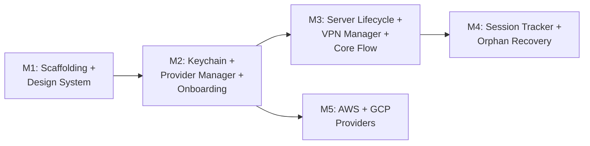

# Milestone Plan: Oh My VPN MVP (v1.0)

## 1. Summary Table

| # | Milestone | Status | Dependencies | Requirements |
| --- | --- | --- | --- | --- |
| M1 | Project Scaffolding + Design System | pending | -- | FR-MN-1, NFR-SEC-7 |
| M2 | Keychain Adapter + Provider Manager + Onboarding UI | pending | M1 | FR-PM-1, FR-PM-2, FR-PM-3, FR-RC-1, FR-RC-2, FR-RC-4, FR-OB-1, NFR-SEC-1 |
| M3 | Server Lifecycle + VPN Manager + Core Flow UI | pending | M2 | FR-SL-1, FR-SL-2, FR-SL-3, FR-SL-4, FR-VC-1, FR-VC-2, FR-VC-3, FR-VC-4, FR-VC-5, FR-SS-1, FR-SS-2, NFR-PERF-1, NFR-PERF-2, NFR-SEC-2, NFR-SEC-3, NFR-SEC-5, NFR-SEC-6 |
| M4 | Session Tracker + Orphan Recovery | pending | M3 | FR-SL-6, FR-SL-7, NFR-REL-1, NFR-REL-2, NFR-REL-4 |
| M5 | AWS + GCP Provider Implementations | pending | M2 | NFR-INT-1 |

---

## 2. Milestone Details

### M1: Project Scaffolding + Design System

**Status:** `pending`
**Started:** --
**Completed:** --
**Dependencies:** --

#### A. Description

Initialize the Tauri project (Rust backend + TypeScript frontend), set up the build pipeline, establish the design token system (Liquid Glass CSS), and create the menu bar shell with left-click popover and right-click context menu. This milestone produces a runnable app skeleton that all subsequent milestones build upon.

#### B. Modules

| Module | Responsibility |
| --- | --- |
| Tauri IPC | Command whitelist skeleton -- no functional commands yet, but the security boundary is established |
| Menu Bar UI | Empty popover shell (left-click), context menu stub (right-click), menu bar icon (disconnected state only) |

#### C. Requirements Covered

| ID | Description | Priority |
| --- | --- | --- |
| FR-MN-1 | Menu bar icon reflecting VPN status (disconnected state initial) | Must |
| NFR-SEC-7 | Tauri IPC whitelist -- only required commands pass through | Must |

#### D. Acceptance Criteria

- [ ] `bun run tauri dev` launches a macOS menu bar app with a tray icon
- [ ] Left-click opens an empty popover; right-click opens a context menu with Quit
- [ ] Tauri IPC allowlist in `tauri.conf.json` is configured (empty command set)
- [ ] Design tokens (`tokens.css`) are loaded and applied to the popover
- [ ] CI runs `cargo check` and `bun run build` without errors

#### E. Notes

Design tokens are derived from [ui-design](../ui-design/2026-03-04-0123-ui-design.md) §2 and [tokens.css](../ui-design/tokens.css). The menu bar icon shows only the disconnected state at this stage -- connecting and connected states are added in M3.

---

### M2: Keychain Adapter + Provider Manager + Onboarding UI

**Status:** `pending`
**Started:** --
**Completed:** --
**Dependencies:** M1

#### A. Description

Implement the Keychain Adapter for secure credential storage, the Provider Manager with the CloudProvider trait and Hetzner as the first implementation (per Risk R-7: "Hetzner first"), and the onboarding UI flow for API key registration and region listing. After this milestone, a user can register a Hetzner API key, see available regions with pricing, and select a region.

#### B. Modules

| Module | Responsibility |
| --- | --- |
| Keychain Adapter | Read/write API keys via macOS Security Framework -- zero plaintext on disk |
| Provider Manager | CloudProvider trait definition + Hetzner implementation (API key validation, region listing, pricing) |
| Tauri IPC | Add IPC commands for key registration, validation, region listing |
| Menu Bar UI | Onboarding flow (welcome, provider selection, API key input, validation feedback), region list view |

#### C. Requirements Covered

| ID | Description | Priority |
| --- | --- | --- |
| FR-PM-1 | Register API keys for Hetzner, AWS, GCP (Hetzner implemented, trait ready for AWS/GCP) | Must |
| FR-PM-2 | Validate API keys against provider API | Must |
| FR-PM-3 | Store API keys in macOS Keychain with encryption | Must |
| FR-RC-1 | Display available regions for each registered provider | Must |
| FR-RC-2 | Display hourly cost per region from provider APIs | Must |
| FR-RC-4 | Select provider and region before server creation | Must |
| FR-OB-1 | First-run onboarding flow guiding provider selection and API key input | Must |
| NFR-SEC-1 | API keys stored exclusively in macOS Keychain -- zero plaintext on disk | Must |

#### D. Acceptance Criteria

- [ ] Keychain Adapter stores and retrieves API keys via macOS Security Framework
- [ ] CloudProvider trait is defined with methods: `validateKey`, `listRegions`, `getRegionPricing`
- [ ] Hetzner implements CloudProvider trait with real API calls
- [ ] Onboarding flow: welcome → provider selection → API key input → validation → Keychain storage
- [ ] Invalid API key shows specific error (insufficient permissions vs invalid key vs network failure)
- [ ] Region list displays with flag emoji, region name, and hourly cost (SF Mono)
- [ ] No API key is stored in any file, environment variable, or log

#### E. Notes

The CloudProvider trait must be designed with AWS and GCP in mind (M5), but only Hetzner is implemented here. Region pricing uses the Hetzner API ([ADR-0005](../adr/0005-use-provider-pricing-api.md)). SSH key generation follows the ephemeral pattern ([ADR-0004](../adr/0004-ephemeral-ssh-keys-per-session.md)) but is exercised in M3.

---

### M3: Server Lifecycle + VPN Manager + Core Flow UI

**Status:** `pending`
**Started:** --
**Completed:** --
**Dependencies:** M2

#### A. Description

Implement the core value: one-click VPN server create/connect/destroy. This includes the Server Lifecycle orchestrator (provisioning via cloud-init, destruction with verification, auto-cleanup on failure), the VPN Manager (WireGuard key generation, wg-quick tunnel, DNS leak prevention), the Preferences Store (last-used region), and the frontend views for the connect/disconnect flow (provisioning stepper, session card, destruction confirmation dialog).

#### B. Modules

| Module | Responsibility |
| --- | --- |
| Server Lifecycle | Orchestrate provisioning (cloud-init + firewall), destruction (with API verification), auto-cleanup on failure |
| VPN Manager | Generate ephemeral WireGuard key pairs, establish/tear down tunnel via wg-quick, DNS routing, config file security |
| Preferences Store | Persist last-used provider/region for expert shortcut (2-step connect) |
| Tauri IPC | Add IPC commands for connect, disconnect, session status |
| Menu Bar UI | Provisioning stepper (3-step), session card (IP, time, cost), disconnect confirmation dialog, menu bar icon states (connecting, connected) |

#### C. Requirements Covered

| ID | Description | Priority |
| --- | --- | --- |
| FR-SL-1 | Provision server with WireGuard via cloud-init | Must |
| FR-SL-2 | Configure firewall (WireGuard UDP only) | Must |
| FR-SL-3 | Destroy server on disconnect | Must |
| FR-SL-4 | Auto-cleanup on provisioning failure | Must |
| FR-VC-1 | Generate WireGuard key pairs locally per session | Must |
| FR-VC-2 | Establish WireGuard tunnel | Must |
| FR-VC-3 | Tear down tunnel on disconnect | Must |
| FR-VC-4 | Delete local WireGuard keys after teardown | Must |
| FR-VC-5 | Route DNS through VPN tunnel | Must |
| FR-SS-1 | Display connected server IP | Must |
| FR-SS-2 | Display elapsed connection time | Must |
| NFR-PERF-1 | Provisioning to connection ≤ 120 seconds | Must |
| NFR-PERF-2 | Disconnect to destruction ≤ 30 seconds | Must |
| NFR-SEC-2 | Ephemeral WireGuard keys -- generated per session, deleted on teardown | Must |
| NFR-SEC-3 | Zero DNS leak -- DNS queries routed through VPN tunnel | Must |
| NFR-SEC-5 | Firewall allows WireGuard UDP port only | Must |
| NFR-SEC-6 | WireGuard config file permission 600, deleted after use | Must |

#### D. Acceptance Criteria

- [ ] Click "Connect" provisions a Hetzner server with WireGuard via cloud-init
- [ ] Provisioning stepper shows 3 steps with real-time progress (creating server → installing WireGuard → connecting tunnel)
- [ ] WireGuard tunnel is established via wg-quick with ephemeral keys
- [ ] Session card displays connected IP (SF Mono), elapsed time, and region info
- [ ] DNS queries route through VPN tunnel (verifiable via leak test)
- [ ] WireGuard config file has permission 600 and is deleted after tunnel establishment
- [ ] Disconnect triggers confirmation dialog, then tears down tunnel, destroys server, and verifies deletion via API
- [ ] Failed provisioning triggers auto-cleanup (server destroyed) with error message and retry option
- [ ] Provisioning to connection completes within 120 seconds
- [ ] Disconnect to destruction confirmation completes within 30 seconds
- [ ] Menu bar icon reflects status: disconnected, connecting (animated), connected
- [ ] Last-used region is pre-selected on next popover open

#### E. Notes

This is the largest milestone -- it delivers the entire core value proposition. The disconnect flow follows [cross-cutting-concepts.md §8](../architecture/cross-cutting-concepts.md) (confirmation dialog + deletion verification). WireGuard integration uses wireguard-go + wg-quick ([ADR-0001](../adr/0001-use-wireguard-go-with-wg-quick.md)). Sudo is required for wg-quick ([ADR-0003](../adr/0003-no-network-extension-for-mvp.md)).

---

### M4: Session Tracker + Orphan Recovery

**Status:** `pending`
**Started:** --
**Completed:** --
**Dependencies:** M3

#### A. Description

Implement the Session Tracker for persisting minimal session state across app restarts, and the orphaned server detection and recovery flow. After this milestone, the app detects orphaned servers from previous sessions (crash, force-quit) on launch and prompts the user to destroy or reconnect.

#### B. Modules

| Module | Responsibility |
| --- | --- |
| Session Tracker | Persist session state (server ID, provider, region, timestamp, hourly cost), clear on successful disconnection, detect orphans on launch |
| Tauri IPC | Add IPC commands for orphan detection status and user choice (destroy/reconnect) |
| Menu Bar UI | Orphan recovery notification and prompt (server info display, destroy/reconnect choice) |

#### C. Requirements Covered

| ID | Description | Priority |
| --- | --- | --- |
| FR-SL-6 | Detect orphaned servers from previous sessions on app launch | Must |
| FR-SL-7 | Prompt user to destroy or reconnect to detected orphaned server | Must |
| NFR-REL-1 | Orphaned server detection rate 100% across all registered providers | Must |
| NFR-REL-2 | Auto-cleanup -- zero orphaned servers from failed provisioning | Must |
| NFR-REL-4 | Tunnel state reconciled on crash recovery -- no zombie tunnels | Must |

#### D. Acceptance Criteria

- [ ] Session state (server ID, provider, region, created timestamp, hourly cost) is persisted on successful provisioning
- [ ] Session state is cleared on successful disconnection and server destruction
- [ ] On app launch, Session Tracker checks for persisted state and queries Provider Manager to verify server existence
- [ ] If orphaned server found, macOS notification is sent and popover shows server info with destroy/reconnect options
- [ ] Orphan detection runs asynchronously -- does not block app startup (menu bar ready within 3 seconds)
- [ ] If app crashed during active tunnel, zombie WireGuard interfaces are cleaned up on relaunch
- [ ] NFR-REL-2 is verified: failed provisioning (from M3) clears session state so no false orphan detection occurs

#### E. Notes

Orphan detection flow follows [cross-cutting-concepts.md §3](../architecture/cross-cutting-concepts.md). Session Tracker queries Provider Manager directly (not through Server Lifecycle) for orphan detection, as documented in [containers.md §5](../architecture/containers.md). NFR-REL-2 (auto-cleanup zero orphans from failure) is verified here but the cleanup mechanism itself is implemented in M3 (FR-SL-4).

---

### M5: AWS + GCP Provider Implementations

**Status:** `pending`
**Started:** --
**Completed:** --
**Dependencies:** M2

#### A. Description

Implement the CloudProvider trait for AWS EC2 and GCP Compute Engine, including provider-specific cloud-init scripts, firewall configuration (AWS Security Groups, GCP firewall rules), and pricing API integration. After this milestone, all three providers are fully functional for the MVP.

#### B. Modules

| Module | Responsibility |
| --- | --- |
| Provider Manager | AWS EC2 CloudProvider implementation (API key validation, region listing, pricing, server provisioning/destruction) |
| Provider Manager | GCP Compute Engine CloudProvider implementation (API key validation, region listing, pricing, server provisioning/destruction) |
| Server Lifecycle | Provider-specific cloud-init scripts for AWS and GCP |

#### C. Requirements Covered

| ID | Description | Priority |
| --- | --- | --- |
| NFR-INT-1 | All 3 providers functional (Hetzner + AWS + GCP) | Must |

#### D. Acceptance Criteria

- [ ] AWS EC2 implements CloudProvider trait: validateKey, listRegions, getRegionPricing, provisionServer, destroyServer
- [ ] GCP Compute Engine implements CloudProvider trait: validateKey, listRegions, getRegionPricing, provisionServer, destroyServer
- [ ] AWS cloud-init script installs WireGuard, configures Security Groups (WireGuard UDP only)
- [ ] GCP startup script installs WireGuard, configures firewall rules (WireGuard UDP only)
- [ ] AWS and GCP pricing is fetched from provider APIs ([ADR-0005](../adr/0005-use-provider-pricing-api.md))
- [ ] Full connect/disconnect cycle works end-to-end for AWS and GCP (reusing M3 infrastructure)
- [ ] Orphan detection (M4) works across all 3 providers

#### E. Notes

M5 can be started as soon as M2 completes -- it does not depend on M3 or M4. However, end-to-end testing of the full connect/disconnect cycle requires M3, and orphan detection testing requires M4. Provider-specific cloud-init variations are documented in [cross-cutting-concepts.md §6.B](../architecture/cross-cutting-concepts.md). Each provider uses its Rust SDK ([ADR-0002](../adr/0002-use-rust-sdk-for-cloud-providers.md)).

---

## 3. Dependency Graph

M5 runs in parallel with M3/M4 -- it only depends on M2 (CloudProvider trait definition).

---

## 4. Coverage Summary

### A. Must Functional Requirements (21/21)

| Milestone | Count | IDs |
| --- | --- | --- |
| M1 | 1 | FR-MN-1 |
| M2 | 7 | FR-PM-1, FR-PM-2, FR-PM-3, FR-RC-1, FR-RC-2, FR-RC-4, FR-OB-1 |
| M3 | 11 | FR-SL-1, FR-SL-2, FR-SL-3, FR-SL-4, FR-VC-1, FR-VC-2, FR-VC-3, FR-VC-4, FR-VC-5, FR-SS-1, FR-SS-2 |
| M4 | 2 | FR-SL-6, FR-SL-7 |
| M5 | 0 | -- |

### B. Must Non-Functional Requirements (12/12)

| Milestone | Count | IDs |
| --- | --- | --- |
| M1 | 1 | NFR-SEC-7 |
| M2 | 1 | NFR-SEC-1 |
| M3 | 7 | NFR-PERF-1, NFR-PERF-2, NFR-SEC-2, NFR-SEC-3, NFR-SEC-5, NFR-SEC-6 |
| M4 | 3 | NFR-REL-1, NFR-REL-2, NFR-REL-4 |
| M5 | 1 | NFR-INT-1 |

### C. PRD Count Note

PRD §7.A states "Must FR: 20 | Must NFR: 11 | Total: 31" but the actual count from §6 is Must FR: 21, Must NFR: 12, Total: 33. This milestone document uses the §6 listing as the source of truth and covers all 33 Must requirements.

---
