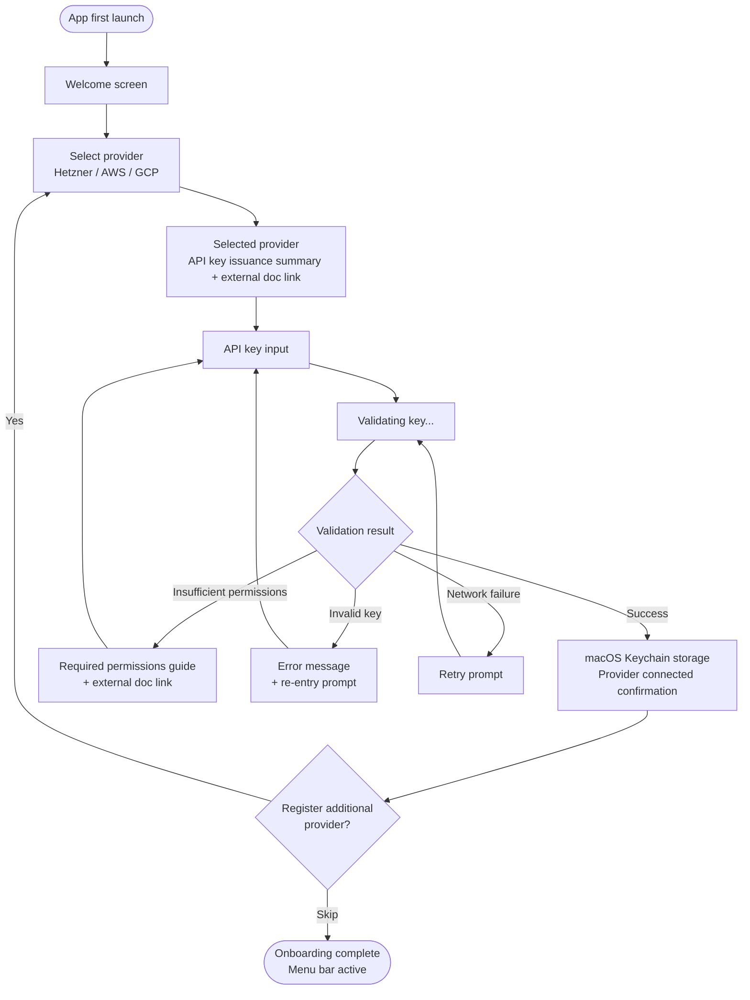
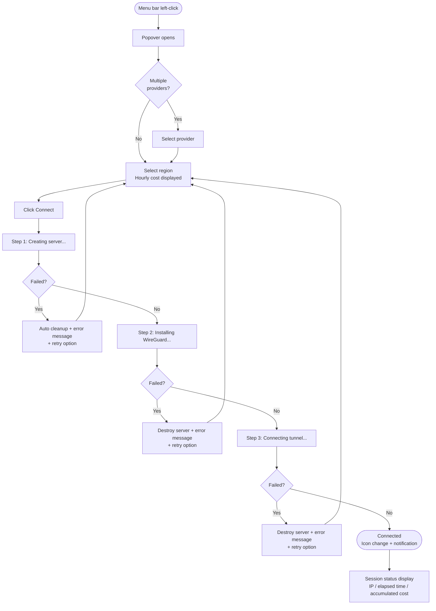
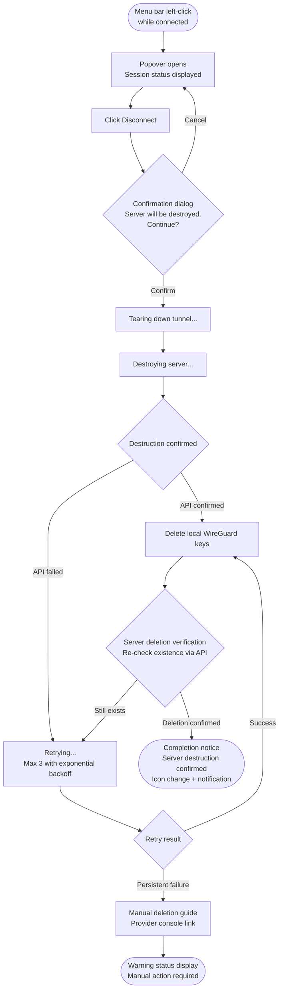
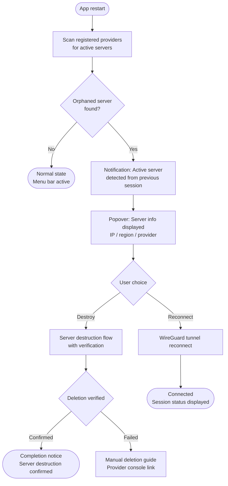

# UX Design: Oh My VPN

## 1. Executive Summary

Oh My VPN is an open-source macOS menu bar application that automates on-demand VPN server provisioning across Hetzner, AWS, and GCP. This UX design specification defines the experience strategy, interaction model, visual foundation, user journey flows, component patterns, and accessibility guidelines for the product.

**Target users**: Privacy-conscious individuals, geo-restriction bypass users, cost-sensitive users, and developers/power users.

**Key design challenges**:

- Abstracting complex cloud provisioning into a one-click menu bar experience
- Communicating real-time cost and connection status without overwhelming the user
- Making server destruction feel reassuring rather than alarming
- Serving both non-technical users (onboarding) and power users (efficiency)

**Key design opportunities**:

- Liquid Glass design language aligns naturally with macOS Tahoe
- Menu bar popover keeps the app lightweight and unobtrusive
- "Privacy by Destruction" is a novel concept that can become a brand differentiator
- Real-time cost visibility builds trust and control

---

## 2. Experience Strategy

### A. Core User Action

**"Connect button click -- VPN connection established."** The user opens the menu bar popover with a left-click and connects to their own VPN server with a single click.

### B. Platform Strategy

- **macOS menu bar only** (Tauri -- TypeScript frontend + Rust backend)
- **Left-click**: Popover -- main UI for session status, connect/disconnect, region selection
- **Right-click**: Context menu -- provider management, settings, system permissions, app quit
- **No separate windows** -- everything resolves within the menu bar popover
- **v2**: QR code mobile pairing (official WireGuard app, no custom mobile app)

### C. Emotional Goals

| Touchpoint | Emotion | Implementation Direction |
| --- | --- | --- |
| First launch (onboarding) | **Simplicity** | Minimal steps, hide complexity |
| Connecting (provisioning) | **Control** | Real-time step-by-step progress |
| Connected | **Reassurance** | Connected IP visible, "my server" emphasis |
| Session active | **Lightness** | Quiet presence in menu bar, no interruption |
| Disconnect and destroy | **Reassurance** | Server deletion verified, "zero trace" emphasis |
| Error state | **Control** | Clear explanation of what went wrong and how to fix it |

### D. Experience Principles

| # | Principle | Meaning |
| --- | --- | --- |
| 1 | **Simple over Powerful** | Prioritize simplicity even if it means hiding features. Complete core flow in a single popover |
| 2 | **Transparent Cost, Zero Surprise** | Display cost at every moment charges occur. No hidden billing |
| 3 | **Privacy by Destruction** | Session end = server destroyed = zero trace. Privacy is guaranteed by deletion |
| 4 | **Quiet When Idle** | While connected, exist only as a menu bar icon. Never interrupt the user |

### E. Workflow Fit

**"Click when needed, forget when done"** pattern:

- Always resident in menu bar but with minimal presence
- Left-click for instant popover -- connect/disconnect
- Right-click for occasional management tasks
- After disconnect, server destruction is automatic -- no post-processing for the user

---

## 3. Design Inspiration and System

### A. Inspiring Product Analysis -- AlDente

| Element | AlDente Characteristic | Oh My VPN Application |
| --- | --- | --- |
| **Layout** | Core functions concentrated in a single view from menu bar | Same -- session status + connect/disconnect in left-click popover |
| **Information density** | Moderate whitespace, only key metrics displayed | Connected IP, elapsed time, cost -- 3 metrics focus |
| **Tone** | Clean and practical, macOS native feel | Harmony with macOS design language |
| **Interaction** | Intuitive controls like sliders and toggles | Connect/Disconnect toggle-centric |
| **Complexity management** | Advanced settings separated into distinct views | Right-click menu -- settings in separate space |

### B. Transferable UX Patterns

- **Popover = main UI**: Complete core flow in a single popover without separate windows
- **Status at a glance**: Immediately grasp current state (connected/disconnected) at popover top
- **macOS native integration**: System notifications, auto dark/light mode, menu bar icon
- **Layer separation**: Daily tasks (popover) vs management tasks (right-click menu/settings)

### C. Anti-Patterns

| Avoid | Reason |
| --- | --- |
| Complex dashboards | Excessive information is inappropriate for a menu bar app |
| Deep navigation | Page transitions inside a popover cause confusion |
| Excessive visual effects | Utility apps should feel like tools |
| Dark/hacker tone | Harms accessibility and trust |

### D. Design System Choice

**Existing system + theme** approach adopted.

| Decision | Rationale |
| --- | --- |
| Base system to be selected in ui-design phase | After architecture (Tauri + TS frontend) is confirmed, evaluate suitable systems |
| Custom theme matching macOS native tone | Natural harmony with OS, like AlDente |
| Productivity-appropriate for solo development | No building components from scratch |
| **Liquid Glass** as visual direction | macOS Tahoe design language, CSS tokens ready, Tauri WebKit WebView supports `backdrop-filter` natively |

> **Note**: Specific design system selection (shadcn/ui, Radix, etc.) and component specs are handled in the future `ui-design` skill. This document confirms the direction: "existing system + macOS native Liquid Glass theme."

---

## 4. Defining Experience

### A. Core Interaction Design

**Control + monitoring hybrid model**:

- **Popover top**: Control area -- provider/region selection, Connect/Disconnect toggle
- **Popover bottom**: Status area -- connected IP, elapsed time, accumulated cost
- **When disconnected**: Control area only (region selection + Connect)
- **When connected**: Control area (Disconnect) + status area together

### B. User Mental Model

Users perceive Oh My VPN as a **"VPN remote control"**:

- Menu bar icon = the remote's presence
- Left-click = open the remote
- Region = channel selection
- Connect/Disconnect = power on/off
- Server destruction is automatic -- users never need to think about "servers"

### C. Success Criteria

| Moment | Success Criteria |
| --- | --- |
| First use (within 5 minutes) | API key registration -- first VPN connection complete |
| Repeat use | Left-click -- region selection -- Connect: 3 steps or fewer |
| Expert use | Last-used region remembered -- left-click -- Connect: 2 steps |

### D. Novel vs Established Patterns

| Area | Approach | Reason |
| --- | --- | --- |
| Menu bar popover | **Established** | Familiar pattern for macOS users (AlDente, etc.) |
| Left-click/right-click separation | **Established** | macOS menu bar app convention |
| Automatic server destruction | **Novel** | "Destruction = privacy" concept is unique to this app |
| Real-time cost display | **Novel** | Exposing cloud costs directly to end users is rare |

### E. Experience Mechanics -- Core Rhythm

**Prerequisite**: Provider API key already registered.

```plain
Left-click -> (Provider selection) -> Region selection -> Connect -> (Use) -> Disconnect
```

- If only one provider registered, skip provider selection step
- Last-used region selected by default -- experts can Connect immediately
- On Disconnect, server destruction is automatic -- no separate confirmation beyond the initial dialog

---

## 5. Visual Foundation

### A. Color System

**Brand emotion: "Freedom"**

| Role | Direction | Rationale |
| --- | --- | --- |
| **Primary** | Sky/blue family | Freedom, open space, trust |
| **Semantic -- Connected** | Green | Safety, connected |
| **Semantic -- Error** | Red | Warning, failure |
| **Semantic -- Warning** | Amber | Caution, provisioning in progress |
| **Neutral** | Liquid Glass token defaults | Translucent backgrounds, subtle borders |

> **Note**: Specific color values (hex, HSL) to be finalized in ui-design. This document defines direction and emotion only.

### B. Typography

| Item | Choice | Rationale |
| --- | --- | --- |
| Font family | **SF Pro** (system font) | macOS native integration, `-apple-system` in Tauri WebView |
| Weight usage | Regular (body), Medium (labels), Semibold (metrics/emphasis) | Hierarchy through weight |
| Monospace | **SF Mono** | IP addresses, cost figures display |

> Specific size scale defined in ui-design.

### C. Spacing and Layout

| Item | Choice | Rationale |
| --- | --- | --- |
| Density | AlDente level (moderate spacing) | Utility app -- generous but not wasteful |
| Base unit | 8px system | Compatible with Liquid Glass token radii (8, 12, 16, 24) |
| Popover width | 280--320px range | macOS menu bar popover convention |

> Specific spacing scale and grid defined in ui-design.

### D. Design Direction

**Liquid Glass + "Freedom"**

| Characteristic | Implementation |
| --- | --- |
| Translucent depth | `backdrop-filter: blur()` + Liquid Glass tokens |
| Lightness | High transparency, thin borders, subtle shadows |
| Open feeling | Sufficient whitespace, breathing room between elements |
| macOS unity | System font, system color response, native notifications |
| Minimal decoration | Liquid Glass principle "Minimal Chrome" -- blur and shape define boundaries |

### E. Mode Support

| Item | Choice |
| --- | --- |
| Supported modes | Dark + Light (both) |
| Switching method | `prefers-color-scheme` automatic |
| Token strategy | Liquid Glass tokens auto-apply per-mode values |
| High contrast fallback | `prefers-contrast: high` -- translucent to solid background |

---

## 6. User Journey Flows

### A. First-Run Onboarding Journey



**Key decisions**:

- Provider API key issuance guide delivered as **summary + external doc link**
- Onboarding completes with minimum 1 provider registered
- Validation failure shows specific error type guidance (insufficient permissions / invalid key / network)

### B. Connect Journey (Core Flow)



**Key decisions**:

- **3-step progress display**: Server creation -- WireGuard installation -- tunnel connection (control principle)
- Each step failure triggers auto cleanup with specific error + retry option
- Single provider skips selection step
- Last-used region selected by default (expert shortcut)

### C. Disconnect and Destroy Journey



**Key decisions**:

- **Confirmation dialog required**: "Server will be destroyed" explicitly stated
- **Deletion verification**: Re-check server existence via API after destruction, then show completion notice
- 3 retry failures show provider console link with manual deletion guide
- Completion shows "Server destruction confirmed" message for reassurance (Privacy by Destruction principle)

### D. Crash Recovery Journey



**Key decisions**:

- Auto-scan all registered providers for active servers on app restart
- Orphaned server found: offer **destroy or reconnect** choice
- Destruction follows the same verification flow as Disconnect Journey

### E. Journey Patterns (Common)

| Pattern | Application |
| --- | --- |
| **Step-by-step progress** | Provisioning, destruction, and other time-consuming operations |
| **Auto cleanup + retry** | Auto cleanup after all failure states, then retry option |
| **Deletion verification** | Always re-check server existence via API after destruction |
| **Last resort guide** | Provider console link + manual action guide when auto recovery fails |
| **Status notifications** | macOS native notifications for background state changes |

---

## 7. Component and Pattern Strategy

### A. Design System Coverage

**Base**: Liquid Glass tokens + existing system (to be selected in ui-design).

| Category | Existing System Expected | Custom Required |
| --- | --- | --- |
| Button | Yes | Connect/Disconnect state button |
| Dropdown | Yes | Provider selection |
| List | Yes | Region list (with cost column) |
| Dialog | Yes | Server destruction confirmation |
| Input | Yes | API key input |
| Badge/Status | Yes | Connection status display |
| Progress indicator | Partial | 3-step provisioning stepper |
| Session info panel | No | Custom required |
| Popover navigation | No | Stack-based view transition |

### B. Custom Component Specifications

#### a. Popover Navigation (Stack-Based View Transition)

| Item | Description |
| --- | --- |
| **Purpose** | Navigate to detail views when items with extensive info are clicked, with back support |
| **Pattern** | iOS-style navigation stack -- push/pop |
| **Transition** | Liquid Glass motion (spring easing) horizontal slide |
| **Back** | Back button at top-left |
| **View examples** | Region list -- region detail (cost, location, provider info) |

#### b. Provisioning Stepper (3-Step Progress Indicator)

| Item | Description |
| --- | --- |
| **Purpose** | Provide sense of control during provisioning |
| **Steps** | 1. Server creation -- 2. WireGuard installation -- 3. Tunnel connection |
| **States** | Waiting / In progress (animated) / Complete (check) / Failed (error) |
| **On failure** | Highlight failed step + error message + retry button |

#### c. Session Info Panel

| Item | Description |
| --- | --- |
| **Purpose** | Display key metrics during active connection |
| **Displayed info** | Connected IP (SF Mono), elapsed time, accumulated cost |
| **Font** | SF Mono for metrics -- readability + data feel |
| **Position** | Popover bottom (Phase 4 -- top for control, bottom for status) |

#### d. Destruction Confirm Dialog

| Item | Description |
| --- | --- |
| **Purpose** | Prevent accidental disconnect + communicate destruction outcome |
| **Content** | "Server will be destroyed. Continue?" |
| **Buttons** | Cancel (secondary) / Destroy (destructive primary) |
| **Post-destruction** | Progress display until verification complete -- "Server destruction confirmed" notice |

### C. Context Menu (Right-Click)

| Item | Action |
| --- | --- |
| Provider management | Opens within popover -- add/remove/status check |
| System permissions | macOS permission status check + navigate to system settings (VPN/network extension, etc.) |
| Settings | App settings (general, notifications, keyboard shortcuts, etc.) |
| About | Version info, license, GitHub link |
| Quit app | If connected, destruction confirm dialog first |

> **System permissions note**: macOS may require Network Extension permissions or other system permissions for VPN tunnel control (PRD OQ-3). The right-click menu provides current permission status check and navigation to system settings. Specific required permissions to be confirmed during architecture phase.

### D. UX Consistency Patterns

#### a. Button Hierarchy

| Level | Usage | Example |
| --- | --- | --- |
| **Primary** | Core action | Connect |
| **Destructive** | Destructive action | Disconnect (after confirmation), server destruction |
| **Secondary** | Supporting action | Cancel, skip |
| **Ghost** | Minimal emphasis | Back, link |

#### b. Form Patterns

| Item | Rule |
| --- | --- |
| Validation timing | On "Validate" button click (explicit) |
| During validation | Button loading state, input disabled |
| Error display | Inline error message below input |
| Success display | Check icon at input right + success message |

#### c. Feedback Patterns

| Type | Method |
| --- | --- |
| Success (connection/destruction complete) | Popover state change + macOS native notification |
| In progress | Stepper/loading within popover |
| Error | Inline error within popover + retry option |
| Background state change | macOS native notification only |

### E. Implementation Roadmap

| Phase | Components | Reason |
| --- | --- | --- |
| **MVP** | Popover shell, Connect/Disconnect button, region list, provisioning stepper, session info panel, destruction confirm dialog, menu bar icon | Core flow completion |
| **v1.1** | Provider dropdown, cost sorting, accumulated cost display, notification settings, dark/light mode | Experience enhancement |
| **v2.0** | QR code modal, advanced settings panel, session history | Extended features |

---

## 8. Responsive and Accessibility

### A. Responsive Strategy

**macOS menu bar popover only** -- display adaptation rather than traditional responsive web.

| Display | Adaptation |
| --- | --- |
| MacBook built-in (13"--16", Retina) | Default popover size, optimal experience |
| External monitor (non-Retina, various resolutions) | Limit popover max height to screen height |
| External monitor (4K/5K, scaling) | DPI scaling support, font/icon sharpness maintained |

**Popover size strategy**:

| Item | Value |
| --- | --- |
| Width | Fixed (280--320px range, finalized in ui-design) |
| Min height | Variable based on content |
| Max height | Screen height - menu bar height - margin |
| Content overflow | Scroll (region list, etc.) |

### B. WCAG AA Compliance

| Item | Standard | Implementation Direction |
| --- | --- | --- |
| **Text contrast** | 4.5:1+ (normal text), 3:1+ (large text) | Must verify text contrast over Liquid Glass backgrounds |
| **Focus indicator** | Visual focus ring on interactive elements | Display focus ring during keyboard navigation |
| **Screen reader** | Voice announcement of state changes | ARIA live regions for connection state change notifications |
| **No color-only info** | Information not conveyed by color alone | Status indicators use icon + text together |

### C. Liquid Glass + Accessibility

| Liquid Glass Feature | Accessibility Adaptation |
| --- | --- |
| Translucent background | `prefers-contrast: high` falls back to solid background |
| Blur animation | `prefers-reduced-motion` keeps blur, removes animation only |
| Subtle border | Enhanced borders in high contrast mode |

### D. Keyboard Navigation

| Item | Implementation |
| --- | --- |
| Open popover | Custom shortcut (option, default empty) |
| Connect/Disconnect | Custom shortcut (option, default empty) |
| Popover navigation | Tab/Shift+Tab between elements |
| Select/execute | Enter/Space |
| Close popover | Esc |
| Shortcut configuration | Right-click menu > Settings, user-defined |

### E. Testing Strategy

| Tool | Purpose | Timing |
| --- | --- | --- |
| Lighthouse / axe | Automated accessibility audit | During development |
| Manual keyboard testing | Tab order, focus trap, Esc behavior | After feature completion |
| VoiceOver (macOS) | Screen reader compatibility | Before release |
| Contrast checker | Text/background contrast ratio verification | During design |
